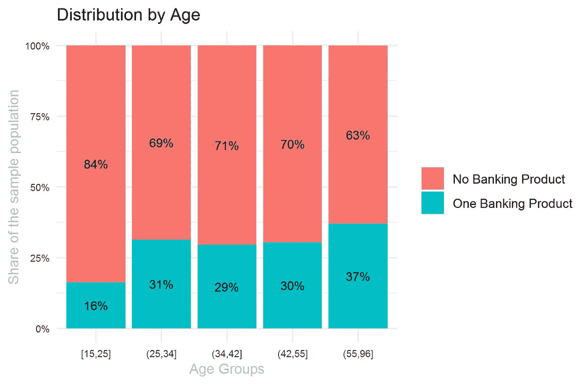
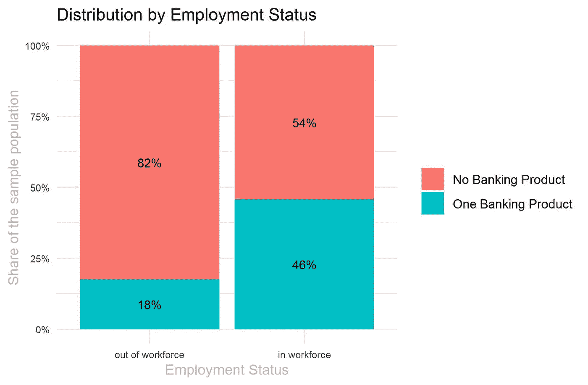
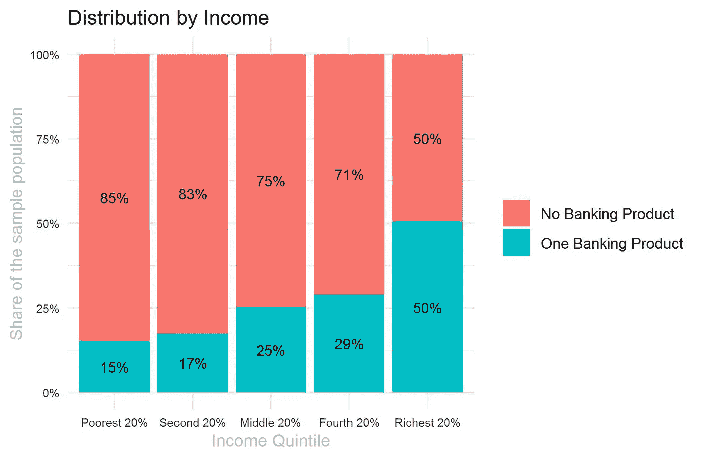
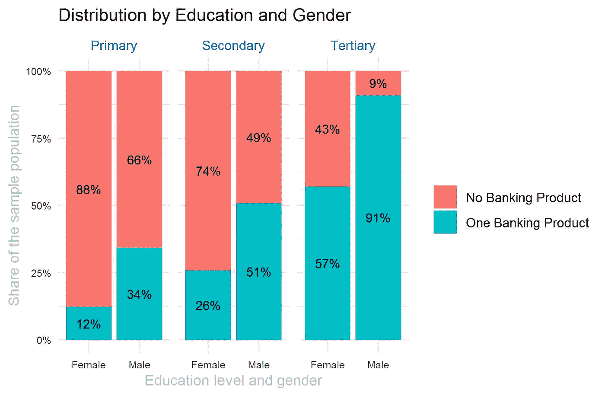
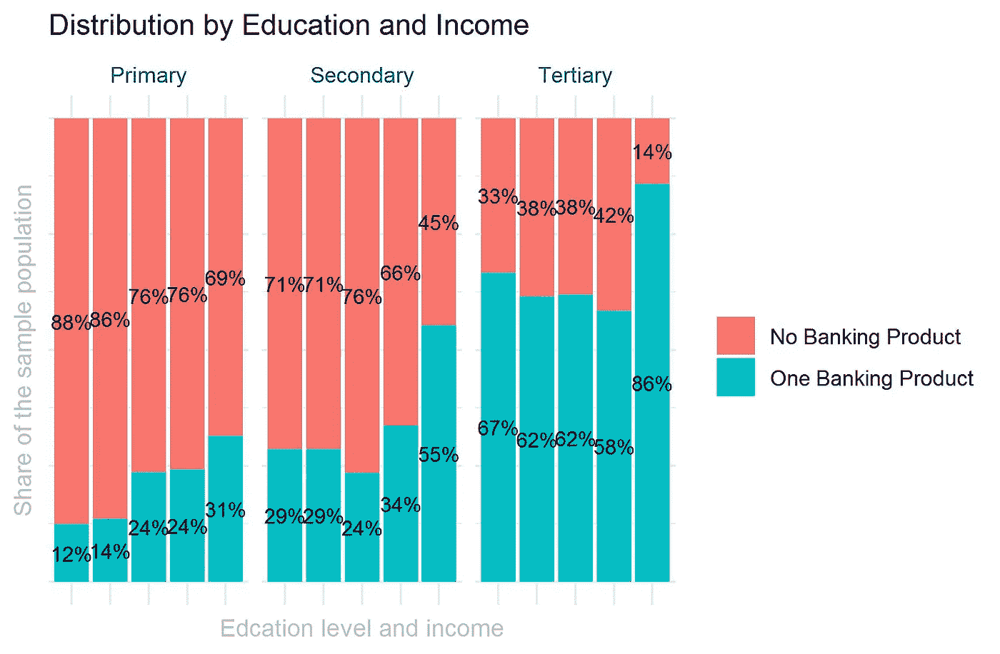
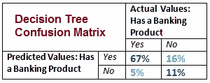
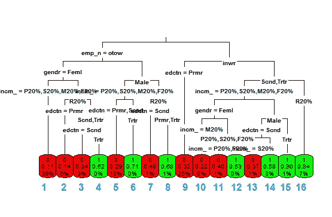

# 摩洛哥哪些人没有银行账户？

> 原文：<https://towardsdatascience.com/who-are-the-unbanked-in-morocco-insights-from-a-2017-world-bank-survey-using-supervised-learning-d0cecc57f037?source=collection_archive---------67----------------------->

## 使用监督学习的 2017 年世界银行调查的见解(第一部分)

最近，摩洛哥政府向因新冠肺炎而受到经济影响的公民每月发放津贴。大规模的操作是通过手机协调的:人们输入他们的信息和他们有资格获得的援助类型，然后他们收到一个 PIN 码，他们后来用它从 ATM 机取款。

我的祖父是这个项目的受益者，他从银行取回钱后兴奋地打电话给我。他以前从未使用过自动取款机，他惊讶于机器是如何在不需要与人互动的情况下将现金交给他的。

我很困惑:为什么我 80 岁的祖父——他对互联网、智能手机和 WhatsApp 的热情早已消退——突然对一台自动取款机感到兴奋？事实是，我从来没有想到我爷爷从来没有银行账户，借记卡，贷款，或者与银行机构有任何联系！

因此，我试图了解像我祖父一样从未购买过银行产品的数百万摩洛哥人是谁。我知道截至 2017 年，“银行”人口的官方统计数据徘徊在 56%左右(来源:[银行 al Maghrib](http://www.bkam.ma/Publications-statistiques-et-recherche/Publications-institutionnelles/Rapport-annuel-sur-la-supervision-bancaire/Rapport-annuel-sur-la-supervision-bancaire-exercice-2017) )，但我想了解无银行人口的微观经济特征:他们是谁？

幸运的是，世界银行在 2017 年进行了一项详细的[全球金融包容性调查，并向公众提供了数据(而且是免费的！).该调查对约 5100 名摩洛哥人进行了抽样调查，并就他们的人口统计数据和银行产品的使用情况提出了一系列问题。下面的分析是根据这些数据得出的。我确实对这些数据及其结论的质量有所怀疑，我将在这篇博文的后半部分提出。](https://microdata.worldbank.org/index.php/catalog/3285)

# 1.描述统计学

在摩洛哥调查的 **~5100 名抽样个人中，只有 28%的人报告在 2017 年拥有银行产品**。虽然官方统计的银行人口在那一年接近 56%,但这个样本——理应代表摩洛哥人口——显示的统计数据要低得多。我将在后面的段落中进一步阐述我对这项调查的怀疑。*现在，让我们接受现有的采样和数据收集方法。*

库存人口的比例在很大程度上取决于样本人口的人口特征。下面我展示了一组描述这些特征的图表。

第一个显著差异是在性别层面。如下图所示，**男性拥有银行产品的可能性是女性**的 2.5 倍以上。事实上，只有 17%的受访女性拥有银行产品，相比之下，男性的这一比例为 45%。

接下来，当我们将调查对象按相同的年龄组分组时(图中的每个年龄组包含相同的人数)，**我们看到不同年龄组之间只有轻微的差异**，15-25 岁的除外。这表明年龄以外的因素可能更重要。

那些在工作的人**拥有银行产品的可能性**是那些不在工作的人**的 2.5 倍**(无论是失业、退休还是在校)。

当我们观察受访者的经济状况时，我们得出结论，收入最高的 20%的人拥有银行产品的可能性是收入最低的 20%的人的 3.5 倍。同样，我觉得奇怪的是，在收入最高的五分之一人口中，只有 50%的人有银行账户，但我们暂时还是接受这个数据。

最后，最显著的差异是教育解释的差异:受过高等教育或以上教育的人拥有银行账户的可能性几乎是只受过初等教育的人的 4 倍。正如你可能已经猜到的，样本中包含了大量只受过小学教育的回答者。

当然，在现实生活中，像这样的人口统计特征并不存在于真空中。事实上，她们相互影响:收入最低的 20%的失业妇女与收入最高的 40%的失业妇女*是不同的。*下一组图表是对上述图表的扩展，旨在说明在解释摩洛哥银行产品的获取渠道时，某些特征集合是否比其他特征集合更引人注目。

下图告诉我们，摩洛哥性别之间的"**银行收入差距"随着教育水平的提高而变小**:从初等教育水平的约 3 倍到高等教育水平的约 1.5 倍。

有趣的是，下图显示，受教育程度高的人，即使是收入最低的五分之一人群也有银行产品，也就是说，收入最低的 20%人群中有 67%的人有银行产品。这表明，在决定获得银行产品的过程中，教育可能比收入水平更重要。

为了理解这些特征中的每一个在确定谁可能有银行账户时的相对重要性，我将在接下来的部分中探索机器学习技术。

*(随想:如果你正在勤奋地阅读这篇文章，现在是休息一下，听听这首* [*切布卡勒德歌曲*](https://www.youtube.com/watch?v=mC2GaJWKNTY) *)*

# 2.谁有可能在摩洛哥拥有银行账户？机器学习方法

我使用一个*逻辑回归模型*和一个*决策树模型*来理解上述每个特征的相对重要性。

## A.逻辑回归

逻辑回归是一种预测结果是否会发生的分类方法(例如，你会拥有一个银行产品吗？)给定一组预测因子(例如，人口统计学特征)。有关方法的更多详细信息，请阅读这篇关于数据科学的[文章](/introduction-to-logistic-regression-66248243c148)。

*a .数据准备和选择预测值*

监督学习的前提(逻辑回归只是其中的一种方法)是建立一个模型，该模型可以**学习尽可能准确地预测给定的结果**。

为了实现这一点，我们需要一个**训练数据集**(模型将使用它来学习)和一个**测试数据集**(模型将使用它来应用它刚刚学习的东西)。因此，我将我的数据随机分为两个样本:一个训练样本(约 5100 名受访者中的 75%)和一个测试样本(约 5100 名受访者中剩余的 25%)。

下一步是选择进入模型的一组预测值。第一部分中的描述性统计给了我一个可能建立一个好模型的预测因子的想法。经过一些调整和尝试不同的预测组合，我找到了以下预测:

> **预测**有 _ 银行 _ 产品**作为函数**性别+教育 _ 水平+ **性别**和**教育** +就业 _ 地位+收入 _ 五分位数+年龄的交互作用

*b .运行和评估模型*

我使用标准的 *glm()* 函数为 R 中的逻辑回归构建了我的模型，并使用它在我的测试数据集中**生成一个“预测的”列。**有很多方法可以评估一个模型是否好:

*(i)准确性——在我的测试数据集中,“预测的”列与“实际的”列相匹配的频率:在我的模型中为* ***78%。***

(ii) *混淆矩阵* —这是一个显示*预测结果*与*实际结果的细目表。对于我们来说，这是一个简单的方法来查看我们预测为真的*，而事实上它是假的*，以及我们预测为假的*，而事实上它是真的。**

你可以从这个混淆矩阵中看到，15%的时候，我的模型预测一个人拥有一个银行产品，而实际上他们没有。同样，在 7%的情况下，模型预测一个人没有银行产品，而实际上他们有。剩下的时间(78%)就是上面说的准确率。

更多关于[混淆矩阵的信息，请点击](https://www.dataschool.io/simple-guide-to-confusion-matrix-terminology/)。

那么我们如何解释这一切呢？！好吧，以上两种方法都表明这个模型并不完美，在测试数据中有 22%的时间没有预测到。这可能是因为这些数据缺失了影响一个人是否拥有银行产品的关键特征。这些特征可以是调查中没有包括的其他人口统计数据，例如该人是住在城市还是农村，他们的工作类型，他们是否有家属，他们的收入水平等。

*c .解释模型*

如果我们假设上述 78%的准确率“足够好”，我们现在可以看看模型的结果，以试图了解人口统计特征在影响一个人是否会拥有银行产品方面的相对重要性。

上面的图表告诉我们的是描述性统计直观地引导我们的东西:拥有银行产品的最重要的预测因素是某人是否受过高等教育，其次是他们是否属于收入最高的 20%的人，然后是他们是否在工作。

*如何更详细地解读这张图？图中的点是模型预测的概率估计值，横条是标准误差(表示每个估计值可能的最小和最大值)，星号代表估计值是否***(不是由于偶然)。过去帮助我解释回归估计的一个方法是考虑两个相同的人。在这个例子中，假设我们刚刚克隆了两个人。但是，其中一个有大专学历，另一个没有；所有其他特征都是一样的。上面的模型表明，受过高等教育的人比她的克隆人有 89%的概率拥有银行产品。* *回归解释中至关重要的是，在考察单个变量的影响时，保持所有其他特征不变。**

## *B.决策树模型*

*决策树是一种受监督的学习算法，它根据一组预测值将数据分类为一个结果(真或假)。决策树连续地将数据划分成二元子集(例如，男性或女性，是否有工作，年龄:45 岁以上或 45 岁以下)，直到不可能进一步划分。[这里有更多关于他们的内容](https://www.google.com/search?sxsrf=ALeKk01dhmMKk-sY4qJ5Abkvz1-1_COoBw%3A1590690686346&ei=fgPQXp_QFJeDjLsPjM-wyAQ&q=decision+tree+model&oq=decision+tree+model&gs_lcp=CgZwc3ktYWIQA1DOHljOHmDtH2gAcAB4AIABAIgBAJIBAJgBAKABAaoBB2d3cy13aXo&sclient=psy-ab&ved=0ahUKEwifh7rKmNfpAhWXAWMBHYwnDEkQ4dUDCAw&uact=5)。*

**a .选择预测值**

*与上面类似，我选择以下预测因素，并对它们运行决策树模型(为了简单起见，我删除了连续的年龄变量以及教育和性别之间的相互作用)。*

> ***预测** has_banking_product **为**性别+教育水平就业状况+收入五分位数的函数*

**b .运行和评估模型**

*我使用 R 中的 *rpart()* 函数构建了我的模型，并使用它在我的测试数据集中生成一个“预测的”列。让我们通过查看以下指标来评估该模型有多好:*

**(一)准确率:*亦作 ***78%。****

*(二)*混淆矩阵:**

**

*与逻辑回归模型相比，您可以看到每个时段的比例非常相似，这表明这两个模型在预测结果方面做了相似的工作*

**c .解释模型**

*决策树模型的可视化表示是..惊喜..一棵树！*

**

*那是一棵大树！树是不容易解释的，但是我们可以试着理解它。让我们看看端点(这里用红色和绿色表示，方便地称为*叶* ) —它们包含三个数字:*

*   *结果是 1(有银行产品)还是 0(没有银行产品)。结果 1 是绿色的，结果 0 是红色的。*
*   *上述结果发生的概率。例如，在最左边的第一片叶子中，这个数字是 0.11。*
*   *已被分类到该叶中的样本的百分比。同样，如果你看第一片叶子，这个数字是 39%(也就是说，在 5100 个回答者中，模型预测大约 1989 个属于第一片叶子)*

*为了确定哪组特征对某人是否拥有银行产品影响最大，让我们看看实现结果的概率最高的叶子。在上图中，让我们看看第 16 片叶子，它的概率是 0.84:*

*   *在第 16 页，让我们看看**如何通过查看树的轨迹*路径*从树顶到达叶子**。该树首先按**就业状况**(右侧为劳动力中的*，左侧为劳动力*之外的*)进行分割，然后按**教育水平**(右侧为*第三产业*，左侧为*第二产业*)进行分割，再次按**收入水平**(最富有的 20%在右侧，其余在左侧)进行分割。这告诉我们，你有 84%的机会有一个银行账户，你必须在工作，必须受过高等教育，你必须处于最富有的 20%的收入水平。**

*虽然很难仔细阅读每一片叶子来理解我们是如何到达它的，但是阅读决策树的一个更简单的方法是看最初的几次分裂。通常，这些可以被解释为最重要的预测因素。**在这种情况下，我们可以看到，就业状况、性别和教育程度是最强的预测因素。这也与回归模型的发现一致。***

*(随机想到:也许现在是听[这首我很喜欢的歌](https://www.youtube.com/watch?v=S3EVrcNQj0o)的好时机)*

# *3.结论和关于局限性的说明*

*这篇文章中概述的描述性和预测性方法都指出，在决定一个摩洛哥人是否会拥有一种银行产品时，某些人口统计学特征比其他特征更重要。也就是说，那些是**就业状况、收入水平和教育水平**(具体来说，拥有高等学位)。预测分析甚至表明**性别本身可能不会产生我们最初在观察性别结果分布时所想的巨大影响**。事实上，摩洛哥女性**比男性更不容易获得大学学位**，处于收入最高的五分之一人群中，或者在工作岗位上，这才是影响她们拥有银行产品能力的**。***

*上面介绍的模型，以及它们的结论，都有局限性，它们有一个**好，但不是很准确**(都在 78%左右)。我们将需要包括更多的变量或微调现有的变量，以达到更高的预测能力，这反过来可以帮助我们更好地解释事情。*

*最后，我想加入一个关于世界银行数据的说明，这是分析的基础。具体来说，我想验证数据集确实代表了总体。下面，我比较了数据集中的比例和宏观层面公布的比例(来源:[世界银行宏观数据](https://data.worldbank.org/indicator/SL.TLF.ACTI.ZS?locations=MA)):*

*   *女性在数据集中的比例( **59%** )与总人口中的比例( **50%** )*
*   *数据集中高等学位持有者的比例( **7%** )与总人口的比例( **35%** )*
*   *数据集中劳动力人口比例( **39%** )与总人口比例( **48%** )*

*如果我们认为数据集有些倾斜，没有反映摩洛哥人口的真实情况，那么结果很不幸地不能概括整个人口。这个抽样误差可以解释为什么数据集报告只有 28%的摩洛哥人拥有银行账户，而中央银行的官方统计数据显示 2017 年这一数字为 56%。我可能在我的分析中遗漏了一些东西，但是世界银行的官方报告也报告了我在这里报告的同样的数字。如果你是统计专家，并且正在阅读这篇文章，并且认为我在这里错过了一些重要的东西，请联系我:)*

# *4.最后的想法*

*既然我探究了是什么让一个摩洛哥人更有可能拥有一种银行产品，我现在明白了为什么我的祖父对自动取款机给他的刺激现金如此兴奋。*

*接下来，我希望更仔细地研究一下这个“没有银行账户”的人群，并试图更好地理解它:我们能否使用无监督学习技术(例如，聚类)根据人口统计之外的特征对人群进行分类？敬请关注我的下一篇帖子:)*

*像往常一样，如果你一直读到这里:Choukran，谢谢，谢谢，谢谢。如果你是摩洛哥人，让我知道这是否值得翻译。*

*PS。[在这里阅读第二部分。](https://medium.com/@kenza.bouhaj/part-two-who-are-the-unbanked-in-morocco-a8d1b509d31e?sk=0566889ae82d765a25cdac3d9d6034ef)*