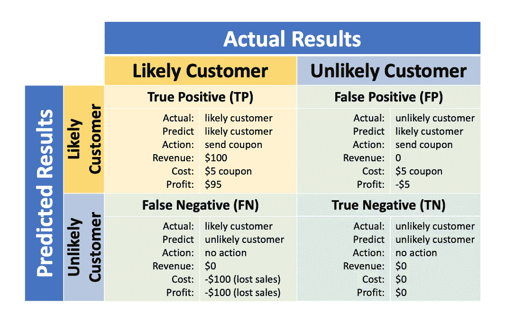

# 谁是潜在客户？

> 原文：<https://towardsdatascience.com/who-is-a-potential-customer-2d76af153f57?source=collection_archive---------26----------------------->

## 现实世界中的数据科学

## 基于机器学习和谷歌分析的在线购买意向预测


戴维·维克斯列尔在 [Unsplash](https://unsplash.com/s/photos/online-shopping?utm_source=unsplash&utm_medium=referral&utm_content=creditCopyText) 上的照片

每天在线购物网站都有大量的访问量。然而，只有一小部分访问变成了购买。

> 如果购物网站知道哪些客户群更有可能购买，会怎么样？

他们将能够推出对网站和客户都有利的目标促销活动。今天我们将利用机器学习的力量来探索这个问题。数据集来自奥莰·萨卡尔的[研究](https://link.springer.com/article/10.1007/s00521-018-3523-0)。我们将在这个项目的研究中使用不同的方法。如果你想复制这个项目，你可以在我的 [Github](https://github.com/guo-pei/who-is-a-potential-customer) 中找到所有的资源。

# 数据概述

该数据集由网站的 12，330 次在线购物访问组成。为避免任何趋势，数据在 1 年内。18 个特征用于描述每个会话，分为数字特征和分类特征。特征**“收入”**是我们二元分类问题的**标签**。我们的目标是使用以下所有其他 17 个特征来预测“收入”标签，也就是看一次访问会话是否会以交易结束。

以下是这些特性的描述，请参考本文。


数字特征


分类特征

值得注意的是 **Google Analytics** 指标用于数字特征:[跳出率](https://support.google.com/analytics/answer/1009409?hl=en)衡量客户是否离开一个页面而不再访问另一个页面；[退出率](https://support.google.com/analytics/answer/2525491?hl=en)告诉你一个页面多久是一个会话的最后一页；[页面价值](https://support.google.com/analytics/answer/2695658?hl=en)显示哪个页面对网站的收入贡献更大。

# 方法学

## 这个项目的工作流程是怎样的？


项目工作流程

我们将按照上面的工作流程来寻找客户购买意向预测的最佳模型。

## 我们如何做决定？

在这个项目中，我们需要在型号选择和功能选择上做出很多决定。决策是基于这些指标做出的:**准确度、召回率、精确度和 F1。**让我用我们的商业案例来解释一下。

在我们的数据集中，每个在线访问会话背后都有一个客户。如果我们预测“收入”为 1，这意味着发起会话的客户更有可能进行购买。然而，我们的预测并不总是正确的。下表显示了不同的场景。

*假设:1。每个订单的收入为 100 美元，每个发送的优惠券的成本为 5 美元。2.有优惠券的可能顾客会购买，而有优惠券的不可能顾客不会购买。*



可能和不可能顾客的混淆矩阵

从上表可以看出，我们希望更多的“真阳性(TP)”发生，并尽可能避免“假阴性(FN)”。我们如何将此应用于机器学习模型？分类指标:

**召回分数:TP/(TP+FN)**

*在所有可能的客户中，模型能正确识别出多少。高召回率要求高 TP 和低 FN。它可以识别很大一部分潜在客户，以减少销售损失。与此同时，更多不太可能的客户(FP)也将收到优惠券。当损失的销售成本大于息票成本时，这没有问题。*

**精度得分:TP/(TP+ FP)**

*在我们的模型预测的所有“可能”客户中，有多少是正确的，而不是误报的。高精度分数需要高 TP 和低 FP。它可以确保大部分预测的潜在客户是正确的。使用的优惠券越多，浪费的优惠券越少。然而，更多的其他潜在客户将被忽略，导致销售损失。*

**F1 得分:2 *召回率*准确率/(召回率+准确率)**

*一个兼顾查全率和查准率的值。*

**准确率得分:(TP+TN)/(TP +TN+FN+FP)**

*预测结果正确的百分比。这个标准只在类平衡时有效。我们不用它来处理不平衡的数据。*

> 由于上述原因，在这个项目中，我们将使用召回分数作为我们在选择型号时的主要衡量标准。当回忆分数相近时，我们也会考虑 F1 分数。

# 初始模型选择


维多利亚诺·伊斯基耶多在 [Unsplash](https://unsplash.com/s/photos/selection?utm_source=unsplash&utm_medium=referral&utm_content=creditCopyText) 上拍摄的照片

首先，让我们清理数据:

通常只有一小部分访问以交易结束，我们怀疑数据是不平衡的。经过下面的测试，我们发现交易转化率只有 18.3%。这意味着以后我们需要对建模数据进行平衡调整。


不平衡标签

分类数据需要转换成数字以便进一步分析。

数据集非常不平衡。所有模型都倾向于符合多数类，因此为了提高模型性能，我们需要首先平衡数据。我使用了 **SMOTE** 超尺寸技术，结果是两个类的样本数量相同。

使用 SMOTE 平衡数据

现在，我们可以使用准确性作为平衡数据集的衡量标准。我选择了 7 个分类器作为模型候选。我将数据集分成 80%的训练和 20%的测试。然后将训练集拟合到每个模型中，无需调整。这里我们得到了一个基线精度排名。我将选择前 4 个模型作为我的基线模型:随机森林、额外树、ADAboost 和逻辑回归。我们现在优先考虑回忆的准确性，因为我们需要无偏见的模型。然后在高精度模型中选择高召回模型。

特性工程和模型调整将在稍后对 4 个模型进行。代码详情请参考我的 [Github](https://github.com/guo-pei/who-is-a-potential-customer) 页面。


初始模型性能

# 第一轮特征选择


安东尼·马蒂诺在 [Unsplash](https://unsplash.com/s/photos/choose?utm_source=unsplash&utm_medium=referral&utm_content=creditCopyText) 上的照片

我的目标是减少特性的数量，同时增加度量值。随着特征的减少，数据收集的成本降低，计算时间和成本也降低。使用三种特征选择技术来给出综合决策:**信息值、** sklearn 的 **SelectFromModel()、**和**相关值**。

哪些特征在预测中比其他特征能给我们更多的信息？我们试试 sklearn 的 SelectFromModel()来筛选特征的重要性权重。这给了我们三个重要的特征。我们将保留它们，并继续探索其他两种特征选择方法。

```
'ProductRelated_Duration', 'ExitRates', 'PageValues'
```


功能选择前的热图

左侧的热图显示了所有功能之间的相关性。颜色越深，相关性越高。我们希望看到的是，这些特性与“收入”这个标签非常相关，但彼此之间并不相关。但是一些特征与另一个特征高度相关。这意味着只能保留其中一个相关特征。我们怎么知道该保留哪一个？信息值(IV)将帮助我们。

现在，我们将使用信息值对所有特征进行排序，并找出具有中等至强预测能力的特征。


信息价值及其预测能力

下面的函数将计算每个特征的信息值。

通过以上所有计算，现在我们得到了以下结果:


高度相关特征对的信息值


其他不相关特征的信息值

上表显示了为进一步建模而保留的 8 个特征:

> **管理持续时间，信息，产品相关持续时间，展示，特殊日，月，访问者类型，页面值**


特征选择的决策流程图

**我是如何做决定的？**

左边的流程图是我的思考过程。

1.  IV 低于 0.1 的特征被移除。
2.  对于其他的，如果一个特性被 sklearn 过滤器选中，我们就保留它。
3.  然后，如果剩余部分与保留的特征高度相关，则将其移除。
4.  最后一部分，如果一个特性与另一个不相关，我们保留它。如果是，则保留具有较高信息值的那个。

现在我们的功能更少了，让我们看看它们是否能帮助改进我们的模型:


具有 8 个特征的新数据框


第一轮特征选择后的模型性能

我们取得了巨大的成果！经过特征选择后，所有的查全率都有了很大的提高，其他指标看起来也不错。

# 第二轮特征选择

我们有 7 个分类特征。即使它们之前被转换为数值，分类特征的所有值都在一列中。如果我们让每个值都有自己的特征呢？让我们用**哑**这个分类特征变量吧！处理完数据后，现在我们有 29 个特征和 1 个标签。


虚拟变量后的特征

为什么我们在第一轮特征选择中不使用虚拟变量？因为把低信息价值的特征虚拟化，做太多新的特征是没有效果的。这将降低模型的性能。

现在，我们将在第一轮功能选择过程中使用相同的技术来选择新功能。详情请参考我的 [Github](https://github.com/guo-pei/who-is-a-potential-customer) 。


第二轮功能选择后的功能热图

**Administrative_Duration，Informational_bins_page_1_plus，ProductRelated_Duration，ExitRates，Month 11，VisitorType_bins_return，PageValues_bins_above_0**

现在上面的热图显示了新一轮特征选择后的 7 个特征+ 1 个标签。请注意，没有两个功能是相关的(这很好)，Pagevalues_bins_above_0 功能与收入非常相关

现在让我们来看看这些新功能在模型上的表现。


第一轮特征选择后的模型性能

我们可以看到，EXTRA trees 和 AdaBoost 提高了召回分数，而其他两个模型的性能不如以前。EXTRA trees 模型的召回率比 AdaBoost 低，但 F1 高。因此，我们将暂时保留这两个模型，以便进行下一步的模型调优。

# 模型调整


照片由[丹尼斯·莱昂](https://unsplash.com/@denisseleon?utm_source=unsplash&utm_medium=referral&utm_content=creditCopyText)在 [Unsplash](https://unsplash.com/s/photos/tune?utm_source=unsplash&utm_medium=referral&utm_content=creditCopyText) 上拍摄

现在我们已经缩小到两个模型:EXTRA trees 和 AdaBoost。通过调整他们的超参数，我们有可能进一步提高回忆分数。对于模型调优技术，我将首先使用 RandomizedSearchCV。它将通过我们定义的超参数列表随机运行模型。一旦我们通过 RandomizedSearch 获得了最佳性能，我们将使用 GridSearch 通过运行更窄的超参数列表来进一步改进模型。详情请查看我的 [Github](https://github.com/guo-pei/who-is-a-potential-customer) 。


模型调整结果

上图显示，这两个模型都通过使用随机搜索和网格搜索得到了改进。最后的回忆分数只有 0.002 的差异。然后我们看 F1 和准确度分数。 **EXTRA trees** 模型在这两个指标上都有更高的分数。结果就是我们的**最终型号**。

# 结论

在这个项目中，我们建立了一个二元分类机器学习模型来预测在线购物网站上客户的购买意向。经过几轮特征选择和模型选择后，我们确定我们的数据的最佳模型是 EXTRA trees，适合该模型的特征如下。


最终特征和营销建议

我们在这个项目中建立的额外树模型可以捕获 83%的潜在客户。这意味着，如果营销团队将优惠券发送给该模型预测的所有潜在客户，优惠券将覆盖市场上所有实际潜在客户的 83%。这个模型绝对可以帮助营销团队制定有效的营销策略！

感谢您花时间阅读本文。希望对你自己的项目有所启发。如果你喜欢我的文章，请为它鼓掌。随时欢迎您通过 Linkedin 与我联系！快乐学习！