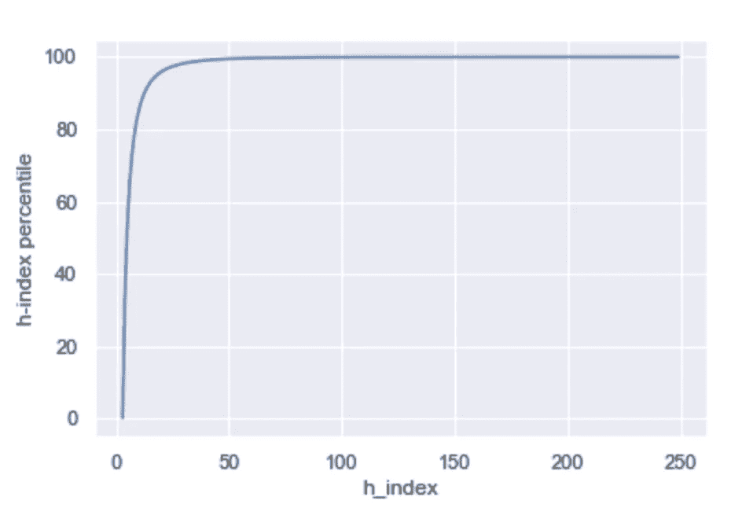
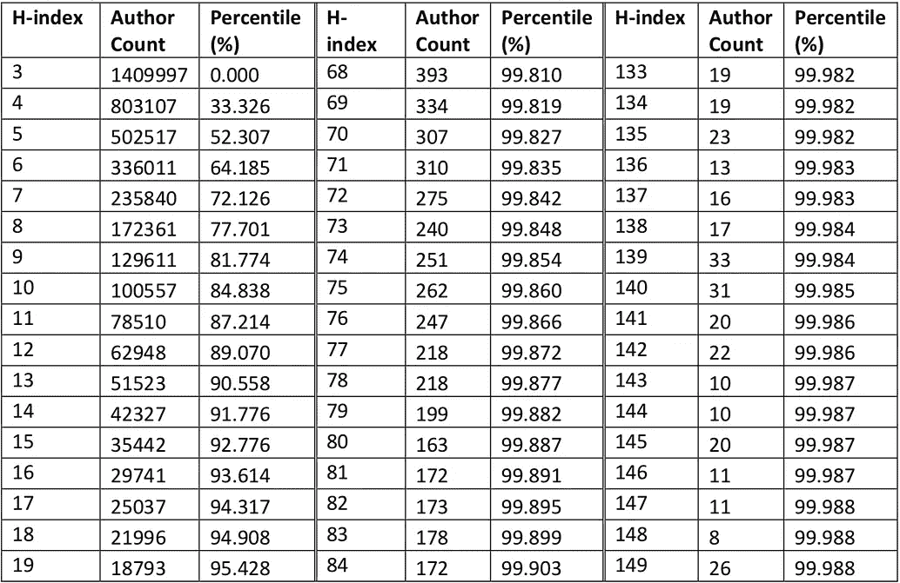
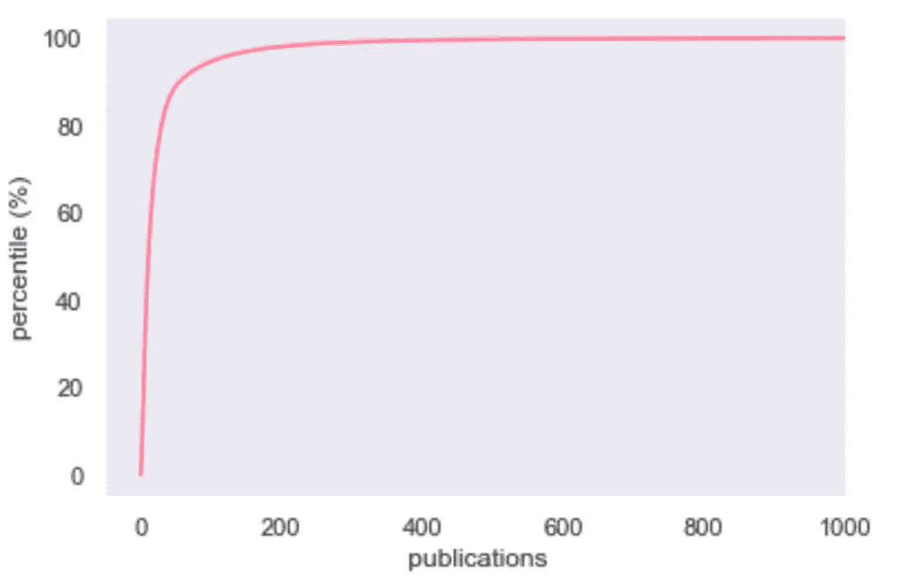
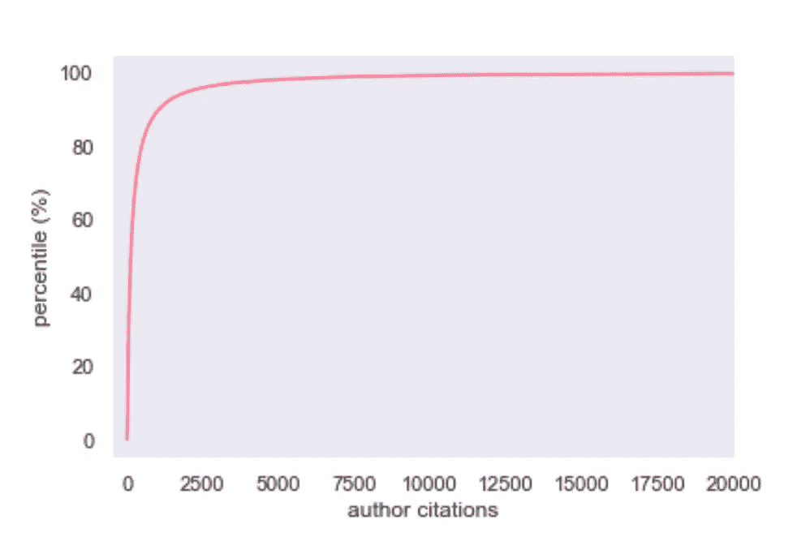
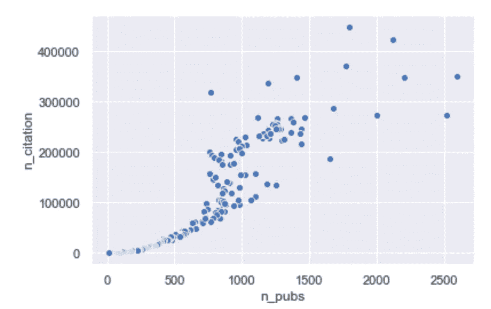
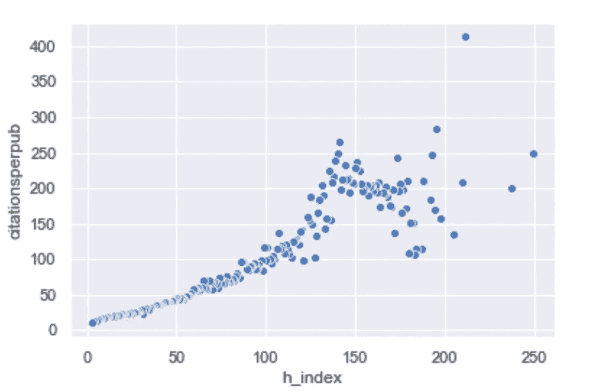
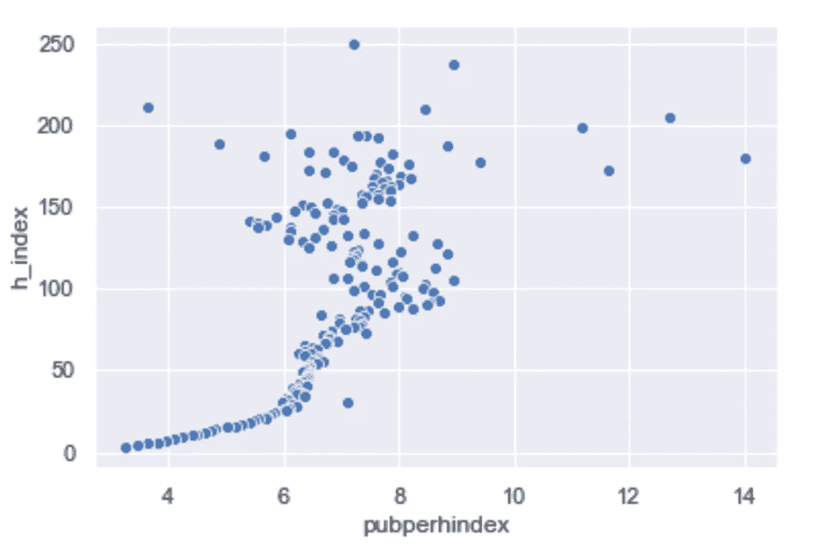
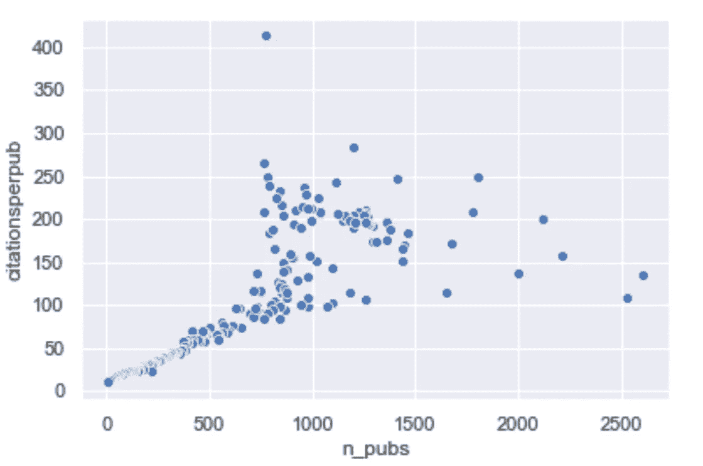
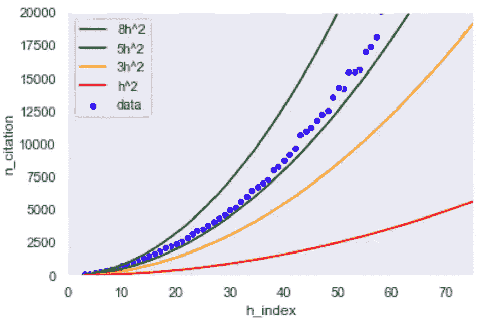
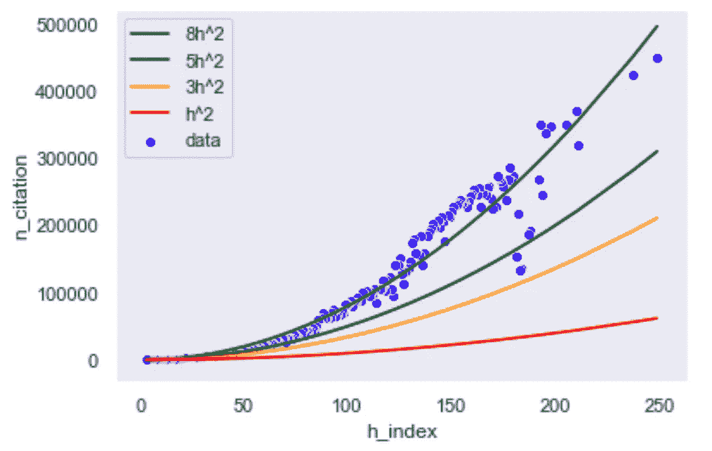

# 是什么让科学家成为专家？

> 原文：<https://towardsdatascience.com/who-is-an-expert-in-scientific-research-c435f106543d?source=collection_archive---------33----------------------->

## 来自超过 400 万作者分析的证据。

学术研究正以前所未有的速度发表。事实上，全球研究产出每十年翻一番。随着进行研究所必需的工具变得越来越普遍，数据变得越来越透明和容易获取，以及研究本身的传播速度越来越快，这一趋势肯定会继续下去。但随之而来的是低质量/掠夺性期刊和缺乏经验的作者出版的激增。所以，有必要退一步，理解我们是如何定义研究中的“专家”的。

为了进行探索性研究，我使用了[的数据](https://www.openacademic.ai/oag/)，包括作者的 [h 指数](https://beckerguides.wustl.edu/authors/hindex)，一个作者所有论文的总引用次数，以及 1 亿名>作者名下的科学论文数量(不考虑作者身份的顺序)。

## 谁是专家？所有作者中，有多少是「专家」？

图一；表 1

图 1 展示了 h 指数> 3 的 CDF，这是一个旨在衡量作者整体影响力的指标。表 1 包含 h 指数样本的精确百分位数。请注意，绝大多数(99.6%)作者的 h 指数小于 3，在本分析中没有考虑。为了得到一个 h 指数为 *n，*一个人必须发表≥ *n* 篇论文，每篇论文都有≥ *n* 次引用。较高的 h 指数表明作者更多产，他们的作品可能质量更高。因此，我们大概可以把他们归类为专家。

查看所有领域的汇总数据，我们可以看到绝大多数作者的 h 指数在 0 到 20 之间。第 50 百分位约为 4；第 80 百分位是~ 9；一个 h 指数为 50 的作者稳稳地站在第 99.5 百分位(所有这些都是在我排除了 h 指数平均高于社会科学和经济学的作者之后)。

虽然如果要给专家下一个宽泛的定义，最好是根据他们相对于本学科其他人的 h 指数来定义专家，但 h 指数大于 20(95.8 百分位)将是一个很好的起点。

这些作者的出版物和总引用量的分布情况如何？

## 图 2(左)；图 3(右)

图 2 和图 3 分别显示了作者的出版物和引文的百分位数。

我们在 CDF 的引文和出版物上看到类似的正偏态分布。大多数作者发表的科学论文不到 200 篇，所有论文的引用次数不到 2500 次。这有直观的意义；大多数科学家相对来说缺乏经验，而少数异常者却非常有成就。

请注意，对于图 4 到图 9，我对每个 h 指数的所有指标进行了平均。

**发表作品越多的人被引用的次数也越多吗？**

## 图 4

图 4 分散了引用的出版物数量。不出所料，这表明作者的总引用随着他们发表的更多而增加。但是，这显然不是线性比例关系；随着人们发表的论文越来越多，他们的新论文比旧论文积累了更多的引用(图 7 进一步证明了这一点)。请注意，很少有作者撰写了超过 1000 篇出版物，从而导致离群值。

**平均而言，专家的出版物更有影响力吗？**

## 这里，让我们用每篇文章的引用次数来代表影响。如果这个指标随着 h 指数上升，那么我们可以说专家的出版物更有影响力。

图 5 显示了作者的 h 指数和他们每篇论文的平均引用次数之间的关系。在我们达到大约 50 的 h 指数之前，作者的平均引用/出版物与他们的 h 指数密切相关；他们发表了 *n* 篇论文，引用了 *n* 篇论文，差不多产生了*n*的 h 指数

之后，这种线性关系消失，他们的论文就更有影响力了——对于 h-index ~> 50，专家的工作平均被引用率更高。

图 5

你可以想象有多种解释可以解释这种效果:初学者随着时间的推移会成为更好的研究人员，专家经常与同样熟练的研究人员合作。但是，如果许多专家的工作水平并不比不太知名的研究人员高，那该怎么办呢？在小的、专业的或新兴的研究领域，即使是最杰出的学者也可能很少有出版物和/或引文。如果我们想得出可信的结论，这突出了根据作者的研究领域对他们进行分类的重要性。

**“专家”需要发表和“业余爱好者”一样多的作品才能在他们的 h 指数中获得相同的增量收益吗？**

## 图 6 显示了出版物与 h 指数的比率和 h 指数之间的关系。你可以把它想成一个作者为了增加一个 h 指数而必须发表的论文数量。

似乎存在一个“临界点”(在 h 指数约为 25 之后)，在此之后，作者能够在每篇出版物中获得大量引用。很明显，与他们职业生涯的后期相比，作者最初需要做更多的工作来实现相同的 h 指数增量，尽管事实上需要更少的引用/论文来实现较低基础上的 h 指数增加。潜在地，这个转折点可以用来指定专业知识。

图 6

这可能是因为当他们开始时，他们产生的研究质量相对较低，与经验较少的合著者一起工作，他们的工作面临更多的审查，导致平均引用工作较少(图 5 也证明了这一点)。作者在后来的引用中经历了迅速增加的规模回报，可能是因为他们自己更有生产力，与更有经验的合著者一起工作，等等。这得到了图 7 的支持，从中我们可以推断出，随着人们发表更多的作品并获得更多的研究经验，他们的论文会得到更多的引用。

图 7

给定 h 指数，我们能预测总引用次数吗？

## 图 8 和图 9 显示了 h 指数和总引用量之间的关系。根据定义，我们知道 h 指数为 *n* 的作者发表了至少 *n* 篇论文，每篇论文被引用至少 *n* 次。因此，h-index *n* 的作者必须有大于等于 *n* 的累计引用数。

尽管如此，作者很少真正遵循这种模式；一个 h 指数为 100 的作者几乎肯定不会通过发表严格意义上的 100 篇论文，并且每篇论文都有 100 次引用而获得成功。图 8 反映了这一事实:作者积累的引用超过了足以增加其 h 指数的数量，随着 h 指数的上升，这一趋势会随着时间的推移而加剧。图 7 进一步证实了这一点，图 7 显示，拥有 h-index *n* 的作者几乎总是拥有超过 *n* 篇的出版物，其中许多当然获得了少于 *n* 篇的引用。

图 8(左)；图 9(右)

但是我们能根据作者的 h 指数估算出他们作品的总体影响吗？在他的[文章](https://www.ams.org/notices/201409/rnoti-p1040.pdf)“对 Hirsch 引文索引的批判:一个组合费米问题”中，Alexander Yong 提出了这样做的经验法则:总引文数= ~3.4h，其中 h 是 h 指数。我发现～5h 可能是 h 指数< 50(图 8)的一个更好的等式，而 8h2 可能是 h 指数大于 50(图 9)的一个更合适的估计值。

外卖食品

## 绝大多数作者几乎没有研究经验。在大约 1 亿篇论文中，只有 400 万篇的 h 指数大于 3(表明至少有 3 篇论文和 9 次总引用)。

*   定义专家在很大程度上取决于研究人员的领域，以及他们所在的 h 指数百分点。此外，使用经年龄调整的 h 指数可以揭示他们相对于其他同龄人的地位，而赫希的 h 指数告诉我们他们的绝对地位。
*   作者需要在职业生涯的早期发表更多的论文，但以较慢的速度提升他们的 h 指数。专家论文的平均影响力更大这一事实支持了这一观点。
*   * *我要感谢 Rob MacCoun 教授对我的工作给予的深思熟虑的反馈。*

**I would like to thank Prof. Rob MacCoun for his thoughtful feedback on my work.*