# 谁是英超最重要的球员？

> 原文：<https://towardsdatascience.com/who-is-the-premier-leagues-most-important-player-4f184f7b39e4?source=collection_archive---------18----------------------->

## [按目标](https://towardsdatascience.com/tagged/on-target)

## 以及图论如何证明这一点

照片— Pixabay

T 他的英超赛季已经完成了三分之二以上。利物浦几乎已经胜券在握(见我的[早先的博客](/how-to-moneyball-soccer-46b589429748)关于他们是如何获得如此优势的)，通常的嫌疑人都卷入了每年一度的保级大战。

在我的“ [On Target](https://towardsdatascience.com/tagged/on-target) ”博客系列中，我一直在记录我对“ [Moneyball](/how-to-moneyball-soccer-46b589429748) ”梦幻英超(FPL)的追求。到目前为止，我们已经了解了如何使用交互式网页抓取器从英超联赛网站获取数据，以及如何使用面向对象编程以用户友好的方式组织这些数据。

 [## 用 Splinter 提升你的网络抓取

### 通过自动化与网页的交互，从您的抓取中获得更好的数据

towardsdatascience.com](/elevate-your-webscraping-with-splinter-a926eee7f7d9)  [## 使用面向对象编程改善您的数据争论

### munging 和 OOP 令人惊讶的成功结合

towardsdatascience.com](/improve-your-data-wrangling-with-object-oriented-programming-914d3ebc83a9) 

所有这一切的最终目的将是建立一个模型来预测哪些球员最有可能在即将到来的比赛中得分。然而，在讨论神经网络的具体细节之前，有必要后退一步，思考一下我们已经创建的丰富数据集。到目前为止，我们有英超联赛中每一次射门的逐行数据——我们可以深入整个 EDA 世界！

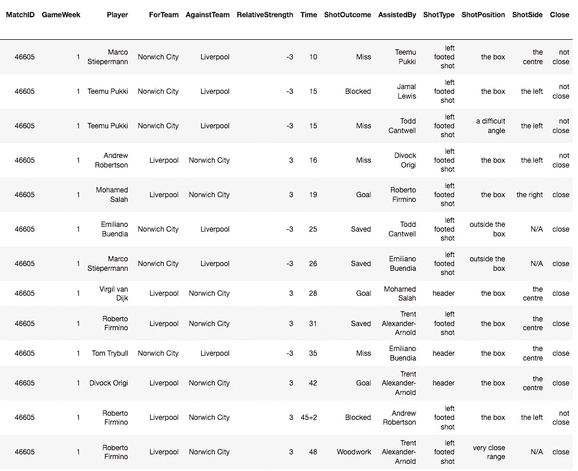

“射门”数据框的标题，显示英超联赛中每一次射门的细节

# 思考玩家的重要性

在 FPL，有一个概念被称为‘护身符理论’。由 FPL 社区“[谁得到了帮助](https://whogottheassist.com/talisman-theory/)”(WGTA)推广，它概括地说，每支球队都将有一名个人“护身符”球员，无论出于什么原因，他都会提升球队的表现。塔里斯曼球员为球队进球(或者至少为其他球员进球)，他们的球队在他们缺席的情况下通常会受到影响。

我们如何才能最好地识别这样的玩家？WGTA 通过研究玩家的幻想得分来解决这个问题。我的方法略有不同，因为我会考虑原始比赛数据，特别是射门和进球。

让我们从一些简单的事情开始——哪些球员参与了最多的射门，以及最多的进球。所谓“参与”，我们指的是射门的球员，或者是那些“协助”射门的球员，也就是说，把最后的传球给射门的球员。

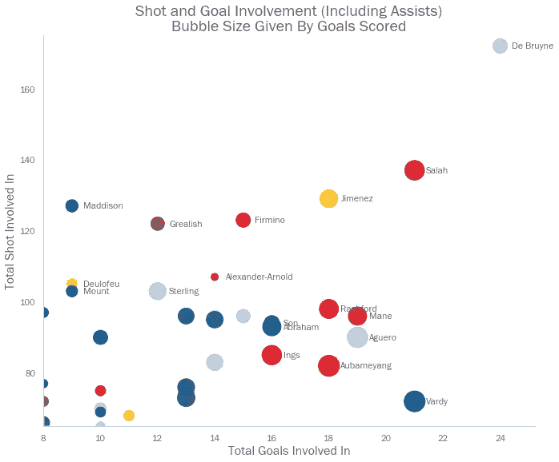

游戏周 27 时的数据正确

这表明曼城的凯文·德布劳内在射门*和*进球方面是最有帮助的球员。我们从他相对较小的气泡尺寸中看到，这主要是由于‘助攻’——德布鲁恩倾向于不进球，而是为其他球员提供进球。

当我们观察最佳进攻组合时，我们可以看到这种影响。这考虑了球员们在赛季迄今为止相互协助的射门次数——我们看到德布鲁因在联盟十大搭档中的三个中出现在*中。*

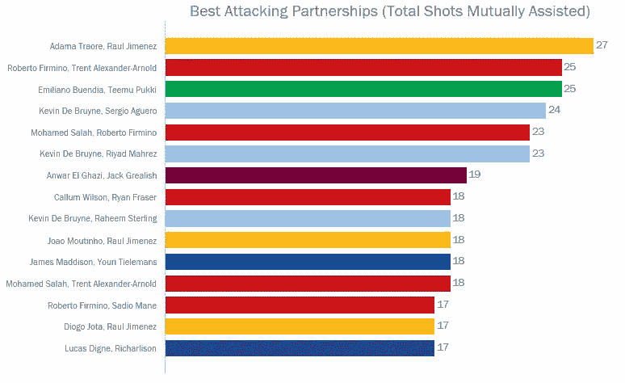

游戏周 27 时的数据正确

因此，我们可以得出结论，德布鲁恩是曼城的“护身符”球员。当然，这一发现很容易实现，因为曼城作为一个团队进了很多球(在撰写本文时，他们比联盟中的任何其他球队都进得多)。我们怎么能想到那些少产球队的护身符呢？

一个简单的方法是看一个球员参与的球队射门和进球的百分比。

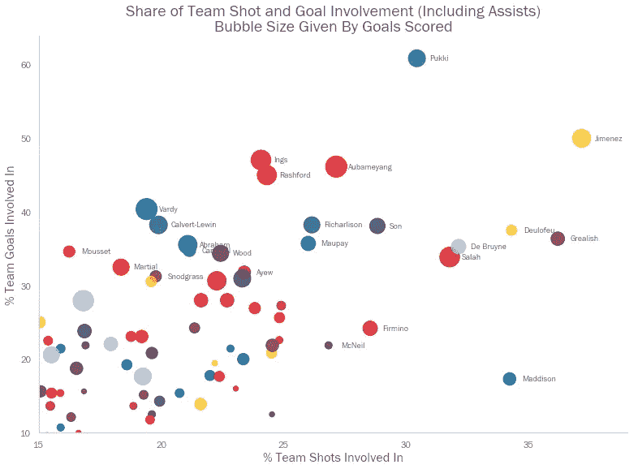

德·布鲁恩仍然在剧情的右上方(这是我们所期待的‘重要’球员的位置)。然而这一次，我们看到更小球队的球员更加突出；诺维奇的提姆·普基为球队贡献了超过 60%的进球，没有球员比狼队的劳尔·吉米内兹为球队贡献了更多的进球。

# 网后(工作)

射门和进球的比例是一个好的开始，尽管我们可以变得更加科学。让我们把每个团队想象成自己的‘社交网络’。那么我们可以把每个玩家想象成各自团队网络中的一个节点。然后，每对节点之间的“边”的权重可以由这两个球员相互协助投篮的次数来定义。

> 注意——我们可以使用 [NetworkX](https://networkx.github.io/documentation/stable/index.html) 来实现这一点，这是 Python 中一个很好的网络分析包。我不会对我的具体代码做太多的描述，因为它涉及到大量的数据准备，脱离上下文很难解释清楚。然而，实际使用 NetworkX 的部分相对简单。我推荐浏览他们的教程，其中讨论了图形的创建、编辑和可视化。

让我们以凯文·德布劳内的曼城队为例。

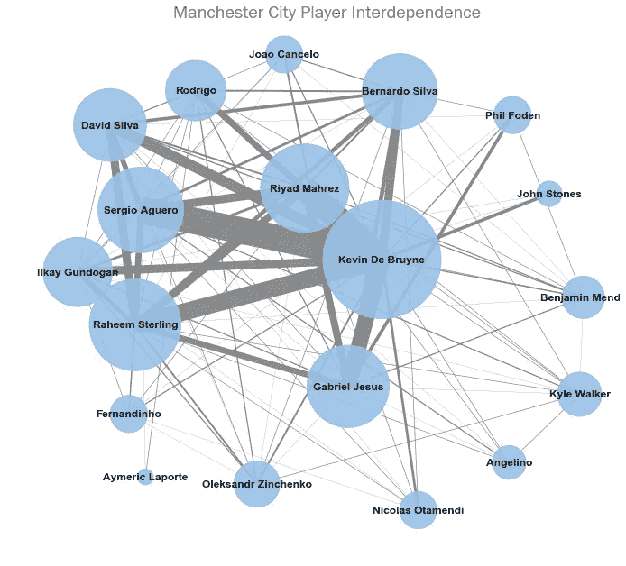

节点大小作为玩家参与的总镜头数给出，边宽作为两个连接的玩家相互协助的镜头数给出

不出所料，我们看到德·布鲁因在网络中人脉很广。我们注意到非常“沉重”的优势，将他与塞尔吉奥·阿奎罗、拉希姆·斯特林和里亚德·马赫雷斯等球员联系在一起。回想一下，这三名球员与德布鲁因的合作非常富有成效。

我们在“投篮命中率”分析中强调的另外两个球员呢？

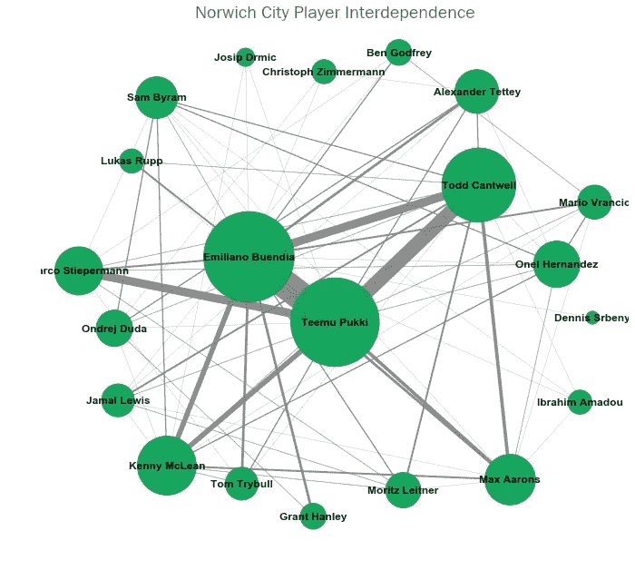

诺维奇城的网络与曼城的网络相比，联系要弱得多(我们会预料到这一点——本赛季到目前为止，曼城的射门次数比诺维奇多 70%)。我们也看到诺维奇更加依赖核心球员(即普基、布恩迪亚和坎特威尔)。

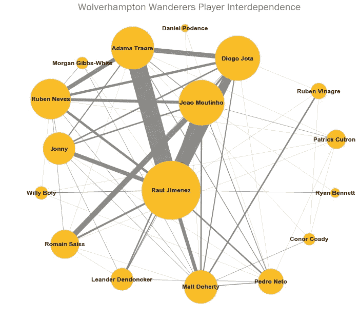

在某种程度上，狼队也是如此，尽管狼队的投篮次数略多于诺维奇队，他们更广泛的团队似乎联系更好，至少有五六名球员似乎相对频繁地协助对方投篮。

当然，仅仅目测一个观想并不特别严格。令人高兴的是，网络理论有几个度量标准，试图列举一个节点在网络中的“中心”程度。

我们应该确保我们使用的任何中心性指标都考虑到了边缘权重——多次协助队友的球员比只协助一次的球员对团队更重要。做到这一点的一个方法是“加权的[中间值](https://en.wikipedia.org/wiki/Centrality#Betweenness_centrality)”。

在给定的网络中，介数量化了一个节点作为两个其他节点之间最短路径上的桥的次数。换句话说，为了计算凯文·德布劳内的“中间性”,我们计算了曼城网络中每对球员之间最短的可能“旅程”。然后，我们计算通过德布鲁因节点的“旅程”的份额。

如上所述，介数度量可以说明边权重。特别是，我们可以说，两个互相帮助很多的球员之间的优势比其他优势更“短”。当然，给定节点对之间的最短路径更有可能使用这些短边，因此高目标参与度的玩家将出现在更多的这些最短路径上，并且具有更高的介数水平。

> *出于这些计算的目的，我们可以说两个玩家之间的边长是他们互相帮助的次数的倒数(即 1 除以 1)。然后使用 [Dijkstra 算法](https://www.youtube.com/watch?v=GazC3A4OQTE)计算每个节点对之间的“最短路径”。

所以如果我们计算联盟中每个球员的加权介数，我们会发现什么？

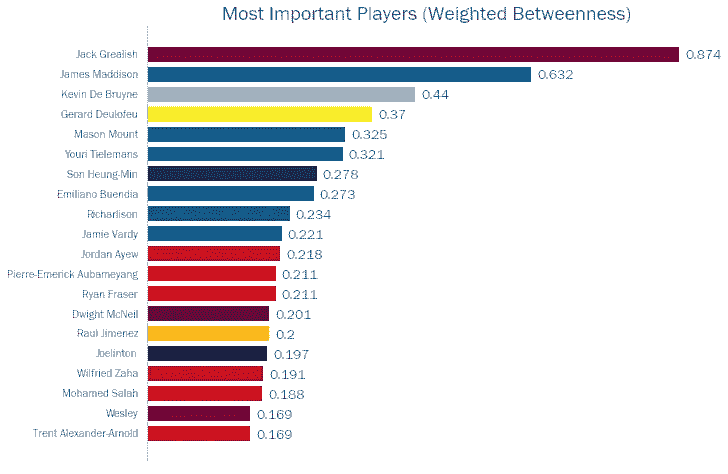

我们看到，到目前为止，他们队最重要的球员是维拉的杰克·格里利什。事实上，如果我们想象维拉的网络，我们会看到格里利什在中间，在其他任何一对球员之间都没有什么优势。

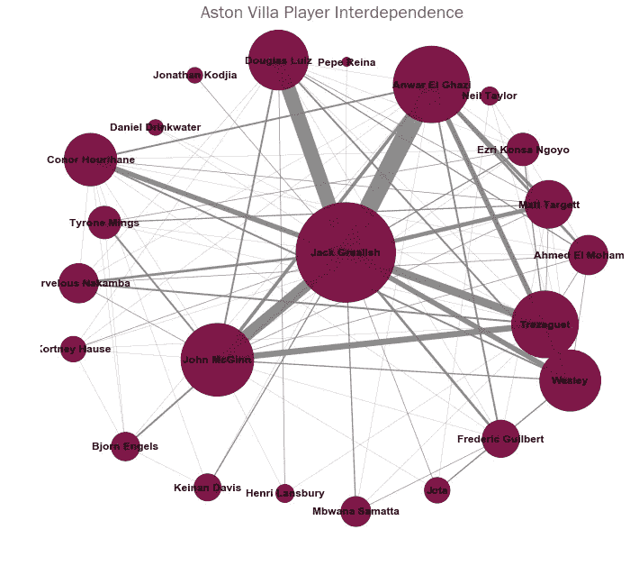

正如预期的那样，我们看到球员参与的球队投篮次数和他们在球队中的“中心地位”之间存在正相关。

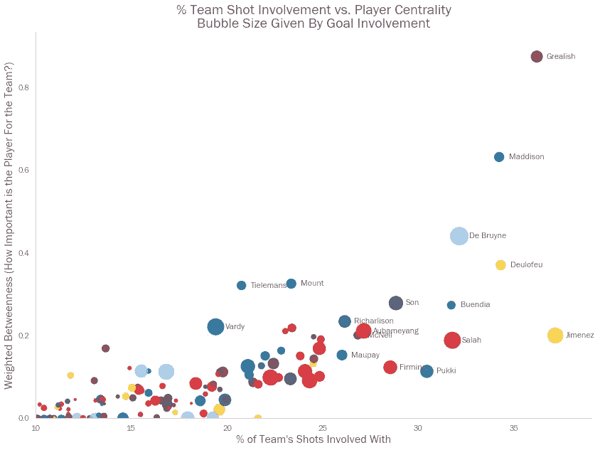

那么谁是每支球队的“护身符”球员呢？

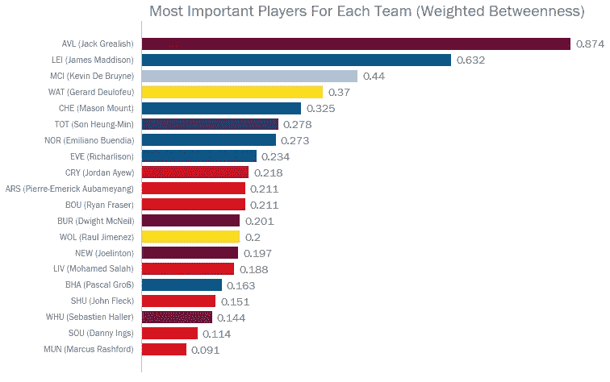

让我们看看那些“护身符”的介数相对较低的团队的网络。正如预期的那样，这些球队的投篮命中率相当平均，没有一个球员(或者甚至任何一个紧密的球员群体)占据主导地位。

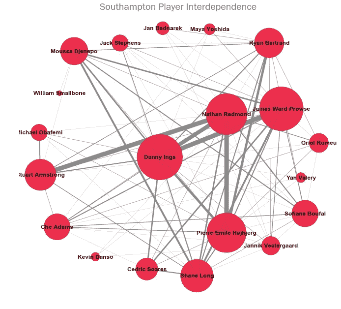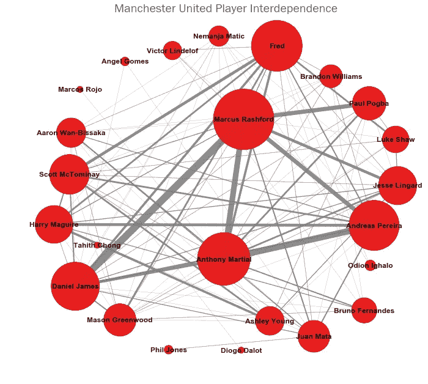

> 这是我的博客系列“目标”中的最新一篇文章，在这篇文章中，我将尝试构建一个“摇钱树”梦幻英超联赛的模型。我很乐意听到关于这个博客的任何评论，或者这篇文章涉及的任何概念。欢迎在下面留言，或者通过 [LinkedIn](https://www.linkedin.com/in/callum-ballard/) 联系我。