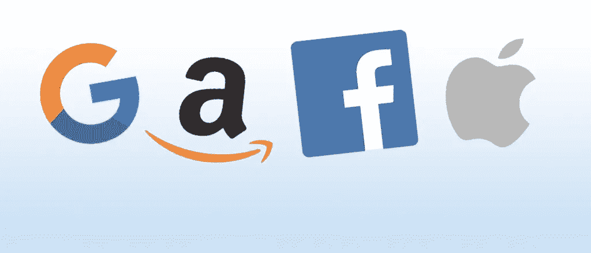
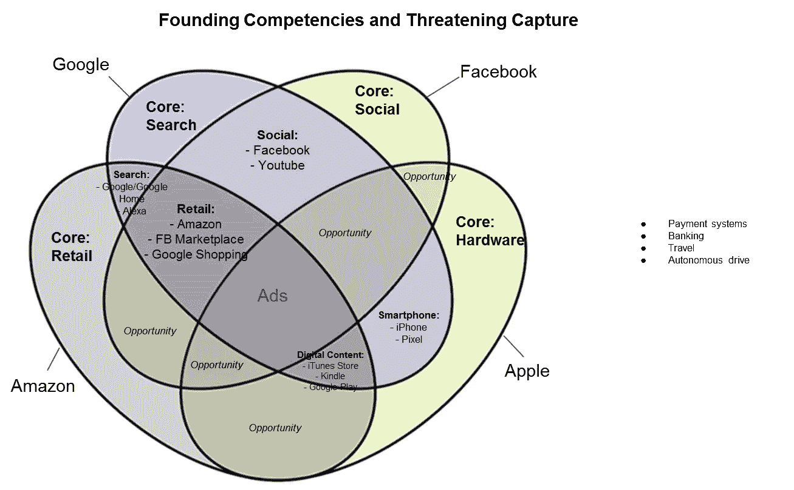
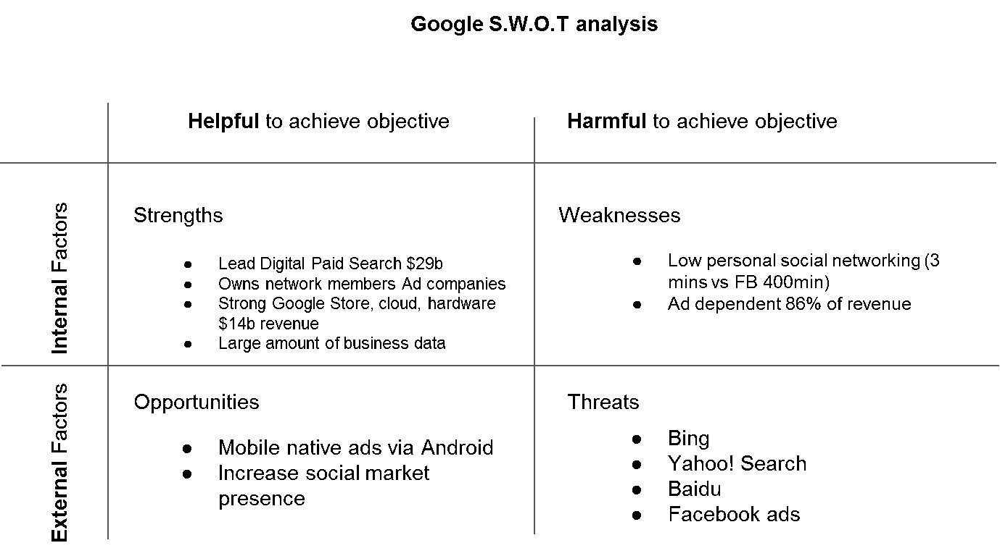
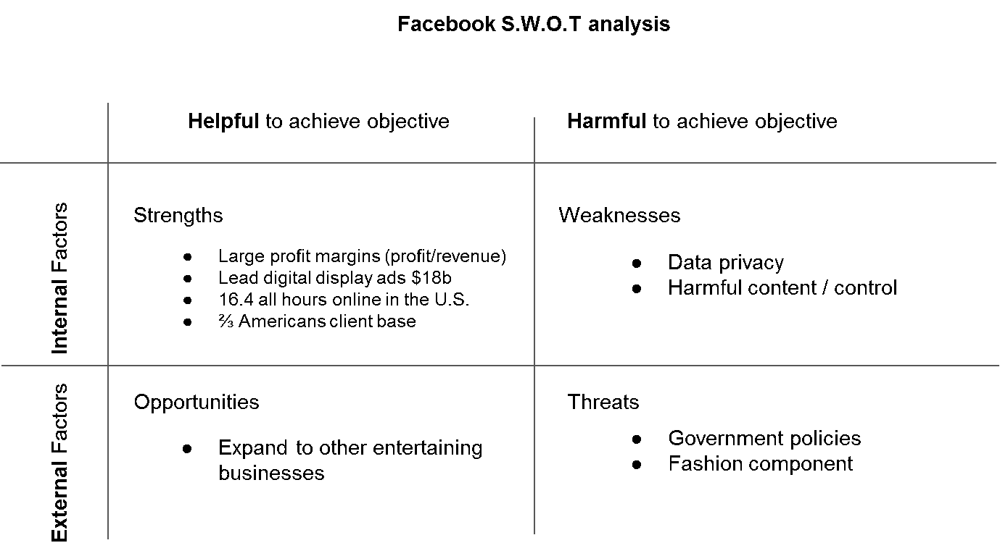
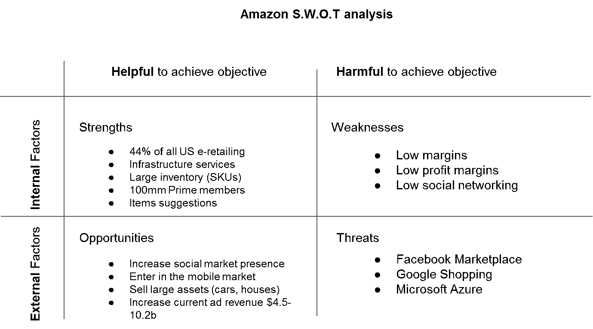
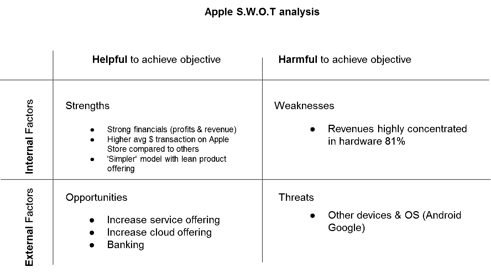

# 谁赢了:谷歌、亚马逊、脸书还是苹果？

> 原文：<https://towardsdatascience.com/who-is-winning-google-amazon-facebook-or-apple-45728660473?source=collection_archive---------10----------------------->

GAFA——谷歌、亚马逊、脸书或苹果。来源:宾夕法尼亚大学。

## GAFA 的能力比你想象的更相似。但是谁领先了呢？

你听说过 GAFA 这个术语吗？它指的是四大科技巨头谷歌、亚马逊、脸书和苹果，这些公司改变了媒体行业、互联网、商业模式和社会。它们通过将消费者从传统的实体企业中转移出来，甚至取代传统企业，获得了消费者支出中不断增长的份额。

一方面，谷歌和脸书引领着数字和显示市场，而亚马逊和苹果主导着在线零售。尽管表面上有所不同，但这四家公司在搜索、社交、零售和广告等方面都有相似的能力。

**图表 1** —四大公认的核心竞争力，以及彼此竞争对手如何通过提供类似的服务(即使是规模小得多的服务)来威胁他们的领导地位。重叠越多，越脆弱，竞争力越强。来源:作者，戴顿。

在服务提供的文氏图(见表 1)中，我们可以看到，尽管他们从非常不同的核心能力开始，他们发展了相关的多样化，现在相互重叠。**所有的共同点是广告。**这种竞争有助于塑造电子商务对消费者的便利性，但也产生了一些负面的外部效应，如市场集中、竞争减少、算法取代工作、隐私问题、出版商成为纯粹的内容提供商、零售商被要求支付基础设施服务费用，以及政府对这些公司实力的担忧。[【1】](#_ftn1)

我认为，四大处于不断的吞噬之中，试图吞噬对方，从他们的边界开始希望达到他们的核心竞争力。通过这样做，每家企业都在增加其多元化，传递一个强有力的信息，并降低其自身的风险敞口，但也在考虑最终的收购。

在这场竞赛中，**谷歌由于其搜索引擎和展示广告，比其他公司略胜一筹**。脸书以强劲的利润率位居第二，但它提供的是“时尚”的核心娱乐业务，更容易受到市场变化和新来者的影响。苹果和亚马逊在各自领域依然强劲，但面临越来越多的挑战。苹果应该专注于服务业，而亚马逊需要提高利润率。

## **GAFA 核心竞争力**

当这四家公司中的每一家成立时，它们都为特定的客户群提供非常特定的产品。谷歌提供了一种新的网络搜索方式，亚马逊在网上销售书籍，脸书点燃了社交媒体运动，而苹果，所有这些公司中历史最悠久的，销售个人电脑。随着这些公司的扩张，他们看到了相关和不相关多元化的机会。

相关多元化是一种明智的战略，它着眼于公司的资产、人员和服务，创造一种与其业务密切相关的新产品或服务，同时降低当前预算的额外成本。它利用现有的足迹为以前未开发的细分市场创造新的收入流。

另一方面，不相关多元化着眼于全新的市场，以抵御收购，重新关注公司，并降低整体风险。

随着这些公司接受越来越多的多样化，它们很快就相互交叉，尤其是在广告方面。这四家公司很快意识到，为了提供廉价或免费的服务，收入必须来自其他地方——广告。直到最近，苹果是最不关心广告销售的公司，因为它提供了被认为有价值的有形产品，而脸书和谷歌提供的是无形产品(社交和搜索)。同样，亚马逊销售实体产品，尽管它大幅降低了利润率以获得市场份额。例如，脸书尝试了几种不同的方法，直到最后发现广告是最终赚钱的途径。[【3】](#_ftn3)他们的解决方案都是广告，这可以补贴他们的免费服务、低利润，或者只是带来一些额外的现金。

## **服务产品的主要重叠部分**

GAFA 的四条腿文氏图(图表 1)揭示了竞争加剧的领域，其中至少有三家公司重叠。这些是第三方商品零售和数字内容。

除了苹果(苹果出售第三方品牌的配件，但数量可以忽略不计)，商品由所有人出售，其中只有亚马逊可以履行产品，而谷歌和脸书出售商品广告和点击费。但谷歌通过与梅西百货、美国柯尔百货公司、家得宝和其他可能削弱亚马逊竞争优势的公司合作，正在获得履行专业知识。[【4】](#_ftn4)基于搜索的商品是谷歌的相关多元化业务，是亚马逊的核心业务，可以说与脸书无关。

在数字内容领域，谷歌、苹果和亚马逊都有自己的“商店”，用户可以在其中购买应用、音乐和视频。在这场战斗中，苹果公司获胜，其商店每笔交易的花费几乎是其他公司的三倍。

## **S.W.O.T .分析和建议**

**图表 2 -** 谷歌的 SWOT 分析表明，谷歌非常强大，有可能在四家公司中处于领先地位。来源:作者，戴顿。

**图表 3—** 脸书的 SWOT 分析强调了庞大的客户群和在该平台上花费的时间。来源:作者，戴顿。

**图表 4—** 亚马逊的 SWOT 分析显示了该公司在网上零售领域的巨大份额，但利润率却很低。来源:作者，戴顿。

**图表 5—** 苹果的 SWOT 重申了服务市场的巨大机遇。来源:作者，戴顿。

在分析优势、劣势、机会和威胁(SWOT)时，我发现谷歌领先于对手，因为它在数字付费搜索领域遥遥领先，拥有互联网中的大部分广告管道系统，同时几乎没有面临竞争和威胁(见附表 2)。当然，它仍然保持警惕，以捍卫自己的地位，免受必应(Bing)等其他搜索引擎的攻击，但通过对在人们的浏览器上显示的业务收费，该公司处于有利地位。

由于花在网上的时间，脸书仍然非常强大——16.4 小时的美国在线时间(见附件 3)。有了这样的连接，它可以在更长的时间内保留更多的数字空间。因此，脸书能够向用户展示越来越多的广告。脸书的利润率令人印象深刻——它是唯一一家收入达到两位数(10 亿美元)的公司，但利润仍位居第三。也是他们中最年轻的，还有成长成熟的空间。

亚马逊和苹果是成熟的老牌公司，但随着创新改变了互联网，它们变得更加脆弱。亚马逊拥有强大的云基础设施服务，但其商品销售的补贴利润占据了大部分利润(见图表 4)。从财务上来说，苹果是最强大的，拥有最高的市场价值和利润，但如果它不多元化并进入服务市场，它可能已经达到一个顶峰并开始走下坡路(见图表 5)。苹果一直面临着推出更新更好的手机的压力，新版本中任何微小的计算错误都可能导致灾难性的结果。

## **其他竞争对手**

四大并不孤单。GAFA 还面临着有望成为互联网新时代的初创企业的竞争。随着对隐私问题的日益关注，广告业正面临着诸多挑战。

颠覆性创业的一个例子叫做[勇敢浏览器](https://brave.com/)。勇敢的免费和开源基于 Chromium 网络浏览器，该浏览器本身阻止广告和网站追踪器。用户可以个性化他们共享的数据，以及他们希望看到广告和获得报酬的频率。他们的引理是“你的注意力是有价值的”。

改变数字媒体系统，可以完全转移利润。

## **结论**

四大是战场上的巨人，发展相关和不相关的多元化以保持强大，能够击败竞争对手，不愿接受失败。一个明显的例子是，在 Google+失败后，谷歌试图创建一个新的社交媒体。[【5】](#_ftn5)他们还面临着小公司的竞争，并因其在数据隐私、竞争和市场势力方面的可疑行为而受到政府的审查。

在 SWOT 分析中，我发现竞争最激烈的领域是数字和商品销售，其次是普通广告——这是一个圣杯，可以通过收取相对较少的费用带来额外的收入。谷歌比其他公司处于更有利的位置，引领着数字付费搜索——可以说是最有效的广告类型，它可以显示用户当时正在寻找的精确结果。

戴顿、约翰和莉奥拉·科恩菲尔德。“亚马逊、苹果、脸书、谷歌 2018。”

丽贝卡·格林菲尔德。" 2012 年:脸书终于想赚点钱的一年."大西洋，大西洋媒体公司，2013 年 10 月 30 日，[https://www . the Atlantic . com/technology/archive/2012/12/2012-year-Facebook-finally-tryed-make-some-money/320493/](https://www.theatlantic.com/technology/archive/2012/12/2012-year-facebook-finally-tried-make-some-money/320493/)。

[【3】](#_ftnref3)the guardian。“脸书到底是怎么赚钱的？”不适用，[https://www . the guardian . com/technology/blog/2009/sep/16/Facebook-money](https://www.theguardian.com/technology/blog/2009/sep/16/facebook-money)

[【4】](#_ftnref4)托马斯·劳伦。“梅西百货与谷歌合作帮助运营其仓库”2019 年 8 月 14 日，[https://www . CNBC . com/2019/08/14/macys-teams-up-with-Google-to-help-run-its-warehouses . html](https://www.cnbc.com/2019/08/14/macys-teams-up-with-google-to-help-run-its-warehouses.html)

[【5】](#_ftnref5)波特，乔恩。“谷歌用鞋带再次尝试社交网络”，2019 年 7 月 12 日[https://www . the verge . com/2019/7/12/20691430/鞋带-Google-area-120-event-organizing-new-York-beta](https://www.theverge.com/2019/7/12/20691430/shoelace-google-area-120-event-organizing-new-york-beta)