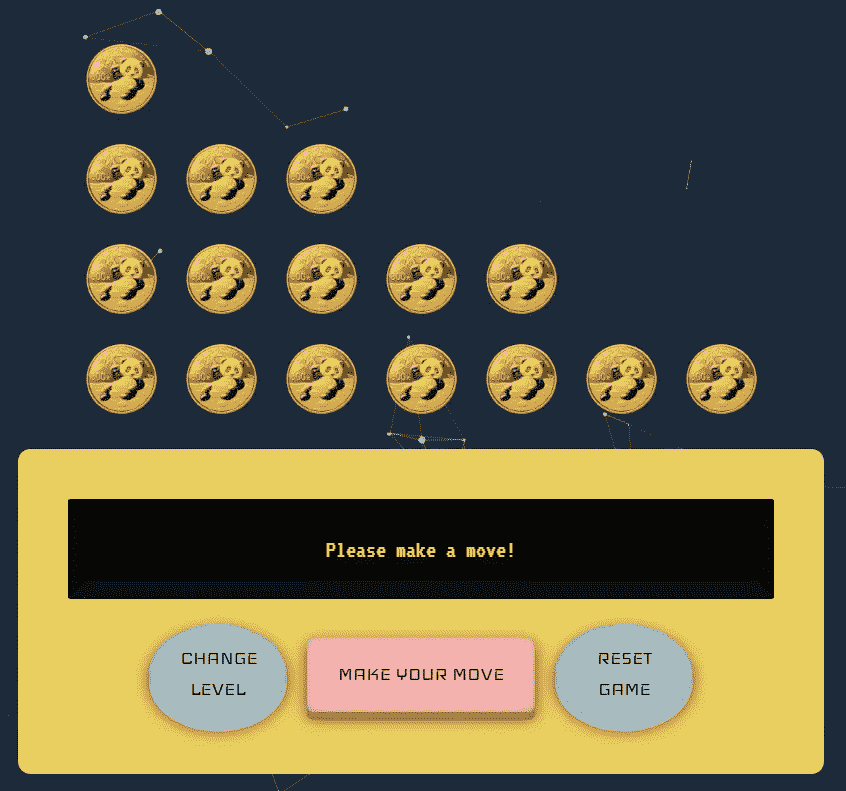
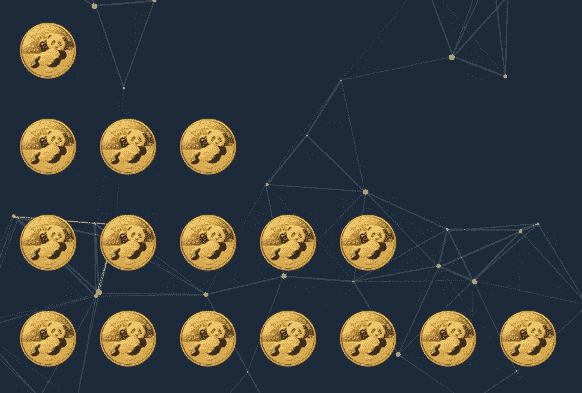

# 谁学得更快——你还是我的人工智能？

> 原文：<https://towardsdatascience.com/who-learns-faster-you-or-my-ai-681e442416b0?source=collection_archive---------49----------------------->

## 向我的 AI 挑战 Nim 游戏，并控制它在玩之前的练习次数。你能比人工智能学得更快吗？人工智能到底是如何学习的？这篇文章在没有任何数学公式的情况下，从高层次上解释了 Q 学习的概念。



[尼迈网络应用](https://nimai.herokuapp.com/)的用户界面(图片由作者提供)

你能在玩一个简单的“尼姆”游戏上打败我的 AI 吗？来吧，我挑战你点击[这里](http://www.jokuspokus.com/showcase/nimAI/)找到答案。最好的部分是:你可以决定在和你比赛之前人工智能要进行多少练习。

之后，回到这篇文章来学习人工智能是如何变得如此聪明的…

那么，你做得怎么样？我敢肯定，一旦你掌握了它的窍门，“简单”的模式对你来说并不是一个真正的挑战。然而，要击败更高级的水平，一个人必须穿得暖和(正如我们在德语中所说的)。

但是这些级别之间有什么区别呢？我是不是把更高级的代理编程得更聪明了？我有没有告诉他们玩完美的 Nim 游戏的数学公式？(Btw，这样的策略确实存在。你可以在这里阅读[。)](https://en.wikipedia.org/wiki/Nim)

答案是:不会！相反，我所做的是授权代理人自己去发现如何赢得 Nim 游戏。这就是 Q-learning 的神奇之处:你形式化一个问题，把它扔给你的代理，坐下来放松，而代理做大部分工作。让我在一个概念层面上向你解释——没有任何数学公式——幕后发生了什么。(注意:我到处都在谈论 Python 实现，但是你不需要理解这些来理解 Q-learning 的思想。)

# 人工智能需要知道什么

为了成为一个真正的 Nim 大师，代理需要被告知游戏的基本设置和规则:

## 最初的板子是什么样的？



来自 nimAI web 应用程序的初始板(图片由作者提供)

这是我的 nimAI 网络应用程序的初始板。理论上，你可以从任何其他数量的行和硬币开始，我们的学习算法应该能够处理所有这些选择。在 Python 中，上面的板子可以形式化为一个列表:

```
initial_board = [1, 3, 5, 7] 
```

就这么简单。

## 在给定的棋盘状态下，哪些操作是可用的？

考虑一下游戏快结束时的棋盘状态:


游戏快结束时的棋盘状态(图片由作者提供)

这里有三种不同的选择:从第一排拿一枚硬币，或者从第二排拿一枚硬币，或者从第二排拿两枚硬币。我们所要做的就是编写一个函数，它接受棋盘状态(例如[1，2，0，0])，并返回一些可能的动作。在 Python 中，这种表示可以是一组元组，其中每个元组由要移除的硬币的行和数量组成:

```
legal_actions = {(1, 1), (2, 1), (2, 2)}
```

## 一个动作如何改变当前状态？

如果我从第二排拿走一枚硬币(见上图)，棋盘会是什么样子？


移动(2，1)后的棋盘状态(图片由作者提供)

你可能会说，这是显而易见的。是的，但是我们需要形式化这样一个*状态转移函数*。记住代理人不像你这样自作聪明！

## 一场比赛什么时候赢或输？

我们需要提供一个函数，告诉代理谁是赢家(“人工智能”，“人类”，“还没有人”)，对于游戏的给定状态。更准确地说，我们需要考虑棋盘是否已经空了([0，0，0，0])，如果是这样，谁走了这步失败的棋。

太好了。现在，AI 知道游戏如何开始(*初始状态*)，它可以在每个可能的棋盘状态中选择哪些*动作*，这些动作如何改变棋盘(*状态转换函数*)，以及是否已经有赢家。

现在，有趣的部分开始了——真正的学习！

# 人工智能如何变得聪明

Q-learning 的想法其实很简单。我们懒得明确告诉代理如何掌握游戏(也许我们甚至懒得去发现)。相反，我们让人工智能和自己玩游戏*很多次。我们的希望是，它将遇到许多不同的情况，并通过反复试验发现，在棋盘的特定状态下，哪一个是最佳行动。*

*在代理被训练之后，一个人能挑战它到一个尼姆的游戏。*

*“拿着这个”，人类玩家会喊。*

*“ *Muahaha* ”，AI 会回答。“这种情况我以前见过很多次了！”利用它的经验，它会挑一个 boss 棋来消灭这个可怜的人类。然后，它会继续下去，奴役人类……哦，对不起，我不想吓到你。*

*现在你已经对 Q-learning 有了一个直觉，让我们进入一些更详细的内容。*

## *奖励和惩罚*

*Q-learning 是来自*强化学习*领域的一种技术(这又是机器学习的一个子领域)。强化学习受到行为心理学的启发——人类和许多其他动物通过奖励和惩罚来学习。(这是一个可怕的过度简化，但是，没人有时间做这个！)*

*触摸热炉子的孩子会受到自然的惩罚(疼痛),下次可能会更加小心。吸取教训。*

*同一个孩子后来可能会打扫厨房，并从她母亲那里得到奖励(巧克力饼干)。下周她很可能会高兴地再次打扫厨房。吸取教训。*

**

*在 [Unsplash](https://unsplash.com/s/photos/cookie?utm_source=unsplash&utm_medium=referral&utm_content=creditCopyText) 上由 [SJ 巴人](https://unsplash.com/@sjcbrn?utm_source=unsplash&utm_medium=referral&utm_content=creditCopyText)制作的巧克力饼干*

*Q-learning(以及一般的强化学习)就是基于这个原则。我们让代理尝试一些行动，如果一个行动产生了“好”的状态，我们就奖励她。如果这个行为导致一个“坏”的状态，我们惩罚她。请注意，我们显然不会用鞭子打代理人，也不会给她糖果。而是用数字来表示奖惩(越高越好)。电脑程序喜欢数字！*

*在 Nim 的例子中，我们用“-1”(我知道，这很残忍)来惩罚失败的棋步(即移走最后一个硬币)，用“1”来奖励对手失败棋步之前的棋步。*

## *预期回报*

*其他所有不会终止游戏的动作呢？我们不会直接惩罚或奖励他们。相反，我们使用 Q-learning 的核心思想:预期回报。*

*代理将一点一点地了解到，某些行动——尽管不会立即赢得(或输掉)游戏——将使她处于有利(或关键)的境地。这种知识会从游戏的最后阶段慢慢“传播”到更早的位置。或许，你也经历过，在一个新游戏的开始，想出一个策略真的很难，而到了最后，看哪个动作好或者不好就变得容易了。要考虑的可能性更少了。对于一个 AI 来说也是一样:首先，她的大部分动作都是完全随机的。她没有任何策略。但是接着，她学会了哪一步棋能立即赢得游戏，接下来她学会了哪一步棋能导致立即赢得游戏，然后她学会了哪一步棋能导致立即赢得游戏的棋，等等。*

*如果你让代理练习这个游戏很多很多次，她会知道在任何给定的棋盘状态下，任何给定的行动最终会给*带来什么样的回报。但是，如果你只让她玩几次，她没有机会体验游戏的很多另类课程。这就是为什么一些人工智能在简单模式下的移动(尤其是在游戏开始时)看起来相当随机，而更高级的智能体似乎立刻就有了计划…**

*一个计划？一个策略？嗯，我想我们应该小心这种想法。人工智能不会按照某个高明的计划移动，她也不会*推理*哪一步可能是最好的。她只是记得在过去某个特定的董事会状态下，什么是最有效的。这一点她比任何人都做得好。*

*我希望这篇文章给你一个关于 Q-learning 的良好直觉，并激发你深入这个话题的兴趣！*

*我想提及一些有趣的细节，并以问答部分的形式向您指出更严格的来源。*

# *问与答(Question and Answer)*

## *问:代理的知识是如何表示的？*

*答:在经典 Q-learning 中，你可以想象一个简单的表格，代表所有可能的状态和动作组合，并包含各自的 Q 值。在 Python 中，这样的 Q 表可以用状态-动作对作为关键字的字典来表示。例如，假设代理人在状态 s 中有两个法律行为 a1 和 a2。她可以查找`Q_table[(s, a1)]`和`Q_table[(s, a2)]`并简单地选择具有较高 Q 值的行为。*

*注意，Q-learning 还有更高级更高效的版本，比如[深度 Q-learning](https://leonardoaraujosantos.gitbooks.io/artificial-inteligence/content/deep_q_learning.html) 。这里，您可以使用[神经网络](https://www.youtube.com/watch?v=aircAruvnKk)来学习一个函数，该函数估计任何状态-动作对的 Q 值，而不是显式地将所有 Q 值存储在一个表中。*

## *问:Q 值究竟是如何计算的？*

*答:首先，所有可能的移动的 Q 值都是 0——除非它们立即终止游戏(见上文)。代理根本不知道如何区分好的和坏的移动。然后，在训练期间，Q 值基于先前的信念和新的经验被更新。这两个因素需要权衡，用一个学习率来建模。查看[这篇文章](/simple-reinforcement-learning-q-learning-fcddc4b6fe56)了解更多细节。*

## *问:那么开发和探索呢？*

*答:在很多 AI 问题中，你会遇到[一个根本性的困境](/intuition-exploration-vs-exploitation-c645a1d37c7a):假设你的资源(时间、计算能力等)有限。)，你应该*探索*尽可能多的替代方案，还是*利用*已经运行良好的方案？对于成功的 Q-learning，在探索和利用之间找到一个健康的平衡是至关重要的。这可以通过有时探索*而不是*具有最高可用 Q 值的动作来实现(而不是总是贪婪地挑选此刻看起来最好的动作)。*