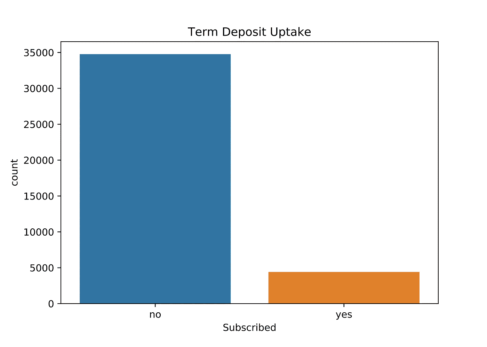
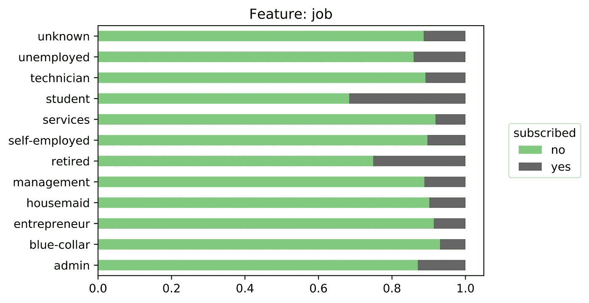
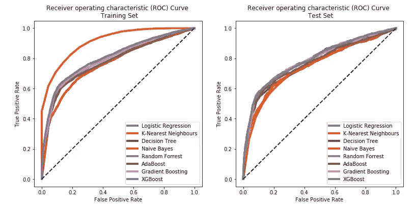

# 给谁打电话？分类项目

> 原文：<https://towardsdatascience.com/who-to-call-a-classification-project-with-a-twist-e2577482d176?source=collection_archive---------50----------------------->

## *添加业务场景，为建模赋予意义*

由[帕万·特里库塔姆](https://unsplash.com/@ptrikutam?utm_source=medium&utm_medium=referral)在 [Unsplash](https://unsplash.com?utm_source=medium&utm_medium=referral) 上拍摄的照片

> “我们将在周一开始电话营销活动，并有 500 个电话的预算。我们应该联系谁来实现收入最大化？”

在这种情况下，XYZ 银行通过收购一家较小的银行吸纳了 2000 名新客户，但由于资源和预算的限制，只能联系到其中的 500 名。利用来自 XYZ 银行现有客户群的数据和针对现有客户的活动结果，我的目标是确定 500 名客户中应该联系的客户，以实现收入最大化，并为未来的活动提供建议。

# **商业价值**

成功的订户转化为 XYZ 银行的收入。根据领域知识，我们估计订阅的价值为 100 美元。总的来说，我们知道这类营销活动的使用率很低，成功致电的比例约为 10–15%。因此，通过随机联系 500 名客户，我们预计收入在 5，000 美元到 7，500 美元之间。

但是，通过使用预测分析和仔细选择 500 个客户，我们证明了可以为 XYZ 银行创造更多收入。

**剧透:**通过使用 XGBoost 分类器，我们能够**将收入增加到 14，500 美元。**请继续阅读，找出答案。

照片由[米歇尔·亨德森](https://unsplash.com/@micheile?utm_source=medium&utm_medium=referral)在 [Unsplash](https://unsplash.com?utm_source=medium&utm_medium=referral) 上拍摄

我选择保持高层次的解释，但是一定要检查我的 [GitHub 库](https://github.com/nadinezab/bank-marketing)来查看我的 [Jupyter 笔记本](https://github.com/nadinezab/bank-marketing/blob/master/bank-marketing.ipynb)中的详细分析和代码。还有一个面向利益相关方的执行摘要[演示](https://github.com/nadinezab/bank-marketing/blob/master/presentation.pdf)。

# **获取数据**

本项目使用的数据是来自 [UCI 机器学习库](https://archive.ics.uci.edu/ml/datasets/Bank+Marketing)的著名银行营销数据集。我的第一步是做一个测试训练分割和分离 2000 个条目，它们将代表 2000 个新客户。

此后，我只剩下 39，000 多个数据点和 20 个预测特性，包括:

*   个人属性(年龄、工作、教育水平等。)
*   金融(住房贷款、个人贷款等。)
*   活动(以前的活动结果、联系方式等。)
*   经济指标(消费者信心指数、euribor3m 等。)

# 干净的数据

数据集基本上是干净的，所以这一步比预期的要快。分类数据中有一些用“未知”表示的缺失值。在第一个实例中，我选择用模式替换它们，然后通过使用来自`sklearn`的 K-最近邻估算器来改进我的工作。

# **浏览和可视化数据**

不出所料，存在明显的阶层失衡，只有 11%的客户订阅定期存款。为了对此进行调整，我使用了 SMOTE(合成少数过采样技术。)

目标阶层失衡

我还研究了各种特性的订阅率。下面显示了一个使用 job 属性的示例。

工作类别中的订阅率

学生或退休的客户更有可能选择定期存款。

# **定义评估指标**

在建模之前，考虑如何评估性能是很重要的。

当模型预测客户不会订阅(target = `no`)而事实上他们会订阅时，就会出现**假阴性**。这是非常有害的，因为 XYZ 银行将损失潜在收入。因此，我需要确保我们的模型预测的假阴性最小化。另一方面，当模型预测客户会订阅(target = `yes`)而实际上他们不会订阅时，就会出现**误报**。在这种情况下，我们浪费了一个电话的费用。在这种情况下，假阴性比假阳性更糟糕。

**准确性**是最直接的衡量标准，简单定义为观察总数中正确预测的数量。然而，考虑一个简单地预测每个客户“不”的无技能模型。基于不平衡的类别分布，该模型将实现 88%的准确度分数。因此，具有高精度的模型并不意味着有用或高性能的模型。此外，即使我们对类别不平衡进行了调整，准确性仍然将相同的权重分配给假阳性和假阴性，这不是我们想要的。

**Recall** 计算真实观察值(真阳性和假阴性)中准确预测值(真阳性)的数量。我的目标是高召回值，因为这样可以最小化假阴性。

最后，我定义了一个具体的**利润指标**，它考虑了预期收入和看涨期权的成本。如果你对此感兴趣，我再次邀请你在我的 [GitHub](https://github.com/nadinezab/bank-marketing) 上查看完整的项目。

# **造型**

我们训练了以下分类算法:逻辑回归、决策树、K-最近邻、朴素贝叶斯、支持向量分类、Adaboost、梯度推进和 XGBoost。在没有任何超参数调整的情况下，基于树的算法过度适应训练集。然后我们调整我们的模型，并使用`RandomizedSearchCV.`进行交叉验证

根据我们的利润指标，我们选择 XGBoost 作为我们表现最好的模型。我们使用穷举`GridSearchCV`进一步调优了 XGBoost 分类器，以找到最佳的超参数选择。

# **释义**

选择模型后，我将它与整个训练集相匹配，并在测试集上生成预测。为了回答我的具体问题，我查看了类别概率，并选择了与类别 1(订阅)关联的概率最高的前 500 个数据点。)这些细节已经交给了营销团队。

事实证明，在所选的 500 名客户中，有 145 名客户实际上认购了定期存款(实际目标值)，产生了 14，500 美元的收入。

我还研究了特征的重要性，看看哪些属性对预测有最大的影响。前 5 名如下:
1。雇员人数(代表经济状况的季度指标)2。消费者信心指数 3。客户是否有大学学历
4。客户的工作是否属于管理类别
5。客户是否离婚。

由 [Austin Distel](https://unsplash.com/@austindistel?utm_source=medium&utm_medium=referral) 在 [Unsplash](https://unsplash.com?utm_source=medium&utm_medium=referral) 上拍摄的照片

现在你知道了。我希望你觉得这篇文章很有趣。我鼓励你在数据科学项目中创建假设场景，因为这会带来更有趣的体验。它还能让你看到企业如何从你的预测模型中获益。