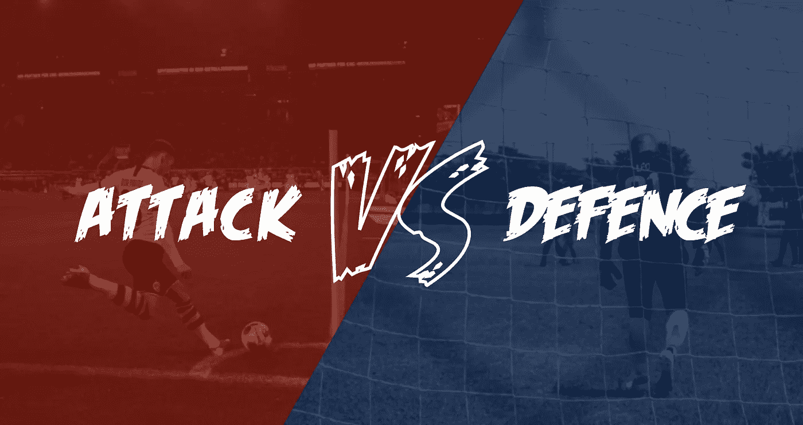
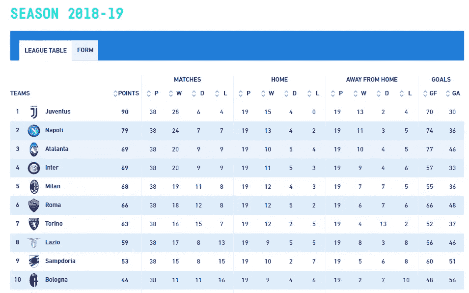
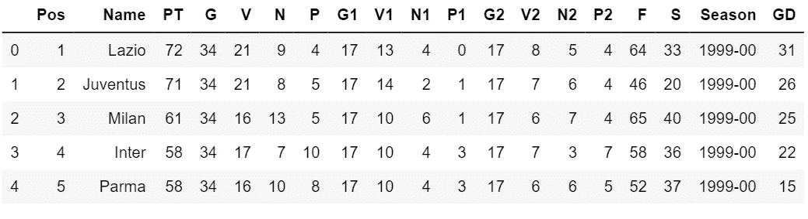
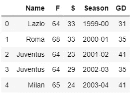
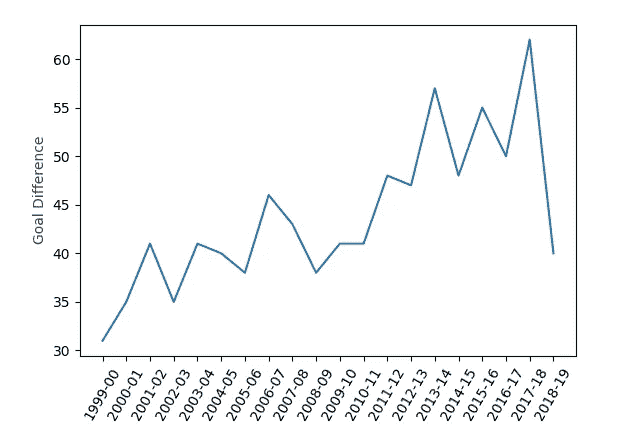
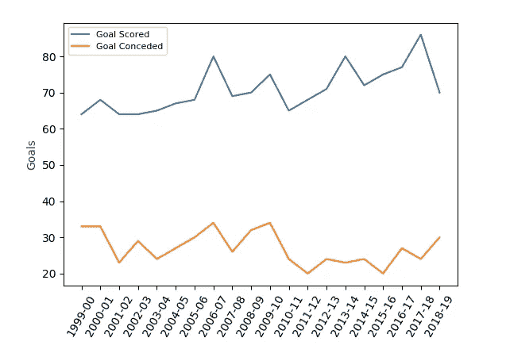
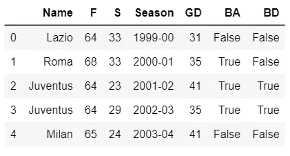
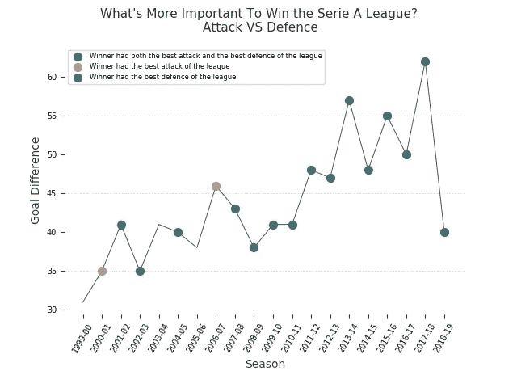

# 谁赢得了意甲联赛:进攻 Vs 防守

> 原文：<https://towardsdatascience.com/who-wins-the-serie-a-league-attack-vs-defence-a48128e71e22?source=collection_archive---------35----------------------->

## 赢得意甲联赛，进攻和防守哪个更重要？数据驱动的答案。

由[马文·朗斯多夫](https://unsplash.com/@marvin_ronsdorf?utm_source=unsplash&utm_medium=referral&utm_content=creditCopyText)(左)和[安东尼诺·维萨利](https://unsplash.com/@ninovisalli?utm_source=unsplash&utm_medium=referral&utm_content=creditCopyText)(右)在 [Unsplash](https://unsplash.com/s/photos/goalkeeper?utm_source=unsplash&utm_medium=referral&utm_content=creditCopyText) 上拍摄的照片

答几天前我结束了[应用绘图，在 Python](https://www.coursera.org/learn/python-plotting?specialization=data-science-python) 课程中绘制&数据表示，这是密歇根大学 Coursera 上[应用数据科学与 Python 专业](https://www.coursera.org/specializations/data-science-python)的第二个课程。

为了完成本课程，我们被要求分析一个特定的领域和国家。以下是描述:

> 这项作业要求你在网上找到至少两个相关的数据集，并想象这些数据集来回答一个关于**意大利**地区**的**运动和田径**的问题。**
> 
> 您必须陈述一个关于您认为感兴趣的领域类别和区域的问题。
> 
> 你必须创造一个视觉效果来解决你陈述的研究问题。除了解决问题，这个视觉应该遵循开罗的真实，功能，美丽和洞察力的原则。

让我们来看一下我完成作业的步骤。

# 这个问题

首先，有必要提出一个有趣的问题来回答。
想到*体育*和*意大利*这两个词，你会想到什么？

**足球**。

像大多数意大利人一样，我是一个足球迷。所以我决定一劳永逸地找到这项运动中最常被问到的一个问题的答案:

> 赢得意甲联赛，进攻和防守哪个更重要？

现在我们有了目标(对，目标！)，我们需要数据。

# 获取数据

我做了一些研究来寻找一个适合我的数据集，但是我没有立即找到我要找的东西。在没有进一步研究的情况下，我认为自己收集数据可能是一个很好的练习。

我需要什么？对我来说，有过去几年，比如说 20 年的联赛决赛，有进球和失球的统计数据就足够了。

所以我寻找冠军的历史档案，最后，我选择了 [legaseriea.it](http://www.legaseriea.it/it) 。他们有[每年意甲的决赛表](http://www.legaseriea.it/it/serie-a/classifica/2018-19)，它包含在一个 HTML *<表>* 中。

2018–19 意甲联赛积分榜，前 10 位。来自 [legaseriea.it](http://www.legaseriea.it/it)

在检查了网页源代码之后，我想到了这个脚本。

我不会详细解释这个刮刀的代码，但是如果你感兴趣，我在本文中做了一个类似的 web 刮刀的教程。

 [## 用 Python 实现简单的 Web 抓取

### 黑色星期五就要到了，一如既往，你会在等待的同时不断刷新你想要的商品页面…

levelup.gitconnected.com](https://levelup.gitconnected.com/simple-web-scraping-with-python-1692c11e3b1a) 

使用[美汤](https://www.crummy.com/software/BeautifulSoup/bs4/doc/)和[请求](https://github.com/psf/requests)，刮刀负责从网页中收集信息并将其写入 *csv* 文件中。

通过重复过去 20 个赛季的过程，我们得到了我们所需要的。我们的数据集诞生了。

# 探索性数据分析

现在，我们终于可以打开 Jupyter 笔记本，开始加载数据集了。用 20 个数据帧工作肯定不方便。最好的办法是把它们结合起来，一起工作。

首先，我们添加一个“*赛季*”列，以便于区分冠军的年份，我们以后会用到它。然后我们可以继续连接。

好了，现在我们的数据框架准备好了，我们可以停下来思考一下。

我们有每支球队的进球(F)和失球(S)数据。这可以让我们了解一支球队的攻防实力。足球中常用的一个在单一维度上表示这两个特征的统计量就是 ***净胜球*** ，即这两个因素的差值。我们把它作为一个新的专栏(GD)添加进来吧。

好的，要回答这个问题，我们必须把注意力集中在联赛中获胜的球队上。让我们创建一个名为*获胜者*的新数据框架，只包含过去 20 年中获胜的球队。

随着时间的推移，这些团队的*目标差异*发生了怎样的变化？

目标差异趋势

正如我们从图表中看到的，获胜球队的净胜球随着赛季的推移而增加。这可能是由于:

*   进球数量的增加
*   失球减少
*   以上两者

因此，这些因素中哪一个是决定性的？让我们看看进球和失球的趋势。

进球数(蓝色)和失球数(橙色)趋势

似乎进球数增加了，失球数减少了。有意思。这意味着各队在进攻和防守上都有所提高。

但是这两个因素哪个对最后的胜利更有决定性呢？我们还没有回答这个问题。为了找到答案，我们必须首先确定每年获胜的球队是否拥有联盟中最好的防守和/或最好的进攻。

通过按赛季对原始数据帧进行分组，我们可以创建一个新的数据帧，它具有两个布尔列 BA(最佳进攻)和 BD(最佳防守)。此时，我们只需将这个数据帧与*获胜者*合并，就可以得到最终的数据帧。

这个数据框架包含了我们正在寻找的答案。让我们通过创建最终视觉来直接找出答案。

# 形象化

这个想法是把两种情节叠加起来。

首先，一个简单的线图显示了每年获胜球队的净胜球数(如前所述)。然后，用散点图来表示球队是以联盟的*最佳防守*获胜，还是以联盟的*最佳进攻*获胜，或者两者兼而有之。

正如作业中所指定的，视觉应该遵循 Cairo 的真实、功能、美丽和深刻的原则。考虑到这一点，我做了一些调整，使视觉符合这些原则，这就是结果。

# 答案

图像清楚地给出了我们问题的答案。

> 拥有强大的防守似乎是最终胜利的关键。

从上图可以看出，在过去 20 年的**、**即 **75%** 的时间里，获胜的球队拥有联盟中最好的防守，包括:

*   8 次，只有最好的防守(蓝点)
*   7 次最佳进攻和最佳防守(绿点)

在过去的 20 年中，只有 5 次(1999-00，2000-01，2003-04，2005-06，2006-07)冠军没有联盟中最好的防守。此外，在过去连续 12 年的比赛中，获胜的球队总是拥有最好的防守。

虽然肯定不是唯一的，但良好的防守似乎是赢得冠军的关键因素。如果你想更深入，寻找其他有趣的模式，你可以在 Kaggle 上找到这个数据集。

# 资源

*   [Jupyter 笔记本](https://github.com/AngeloFaella/serie_A_analysis/blob/master/SerieA.ipynb)
*   Kaggle 上的[数据集](https://www.kaggle.com/angelofaella/serie-a-final-table-19992019)
*   web 抓取入门:[使用 python 进行简单的 web 抓取](https://levelup.gitconnected.com/simple-web-scraping-with-python-1692c11e3b1a)

*谢谢你走了这么远！作为一个初学者，收到反馈对我来说很重要，所以如果你有任何反馈，请在评论中告诉我。*

*安吉洛*