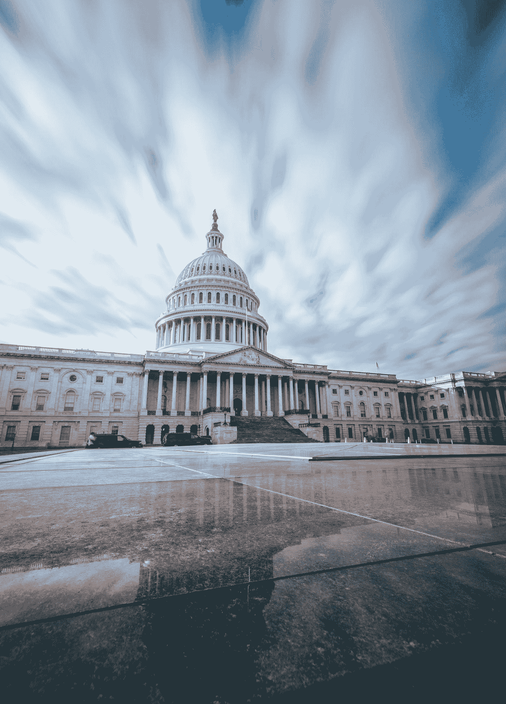

# 谁赢得了超级星期二的媒体报道。基于数据

> 原文：<https://towardsdatascience.com/who-won-super-tuesdays-media-coverage-based-on-data-157221b59fcc?source=collection_archive---------33----------------------->

## 我们分析了从 2020 年 3 月 1 日到 2020 年 3 月 7 日所有提到美国 2020 年候选人的在线媒体文章，以检查谁最受媒体关注

安迪·菲利西奥蒂在 [Unsplash](https://unsplash.com?utm_source=medium&utm_medium=referral) 上拍摄的照片

在 [Politwire](https://politwire.com/) ，我们监测并分析媒体对政治家的报道。我们帮助政治活动、企业和媒体公司了解政治家的媒体之路。

# 民主党超级星期二

2020 年 3 月 3 日，美国 14 个州举行初选。大约有三分之一的代表参与其中。你可能已经知道，乔·拜登比伯尼·桑德斯多获得了大约 100 张代表票，重新领先。

尽管乔·拜登最终胜出，但这是否让他在媒体报道中大幅领先？

在上图中，我们可以看到超级星期二这一周每一天每个候选人的文章数量。拜登和桑德斯很接近，即使在超级星期二的结果之后，乔·拜登的关注度也只是稍微高一点。

尽管唐纳德·特朗普主导了媒体报道，但他是美国现任总统，如果他不是第一个，那才奇怪。

## 没有媒体偏见？

乍一看，2020 年美国总统候选人的媒体份额似乎是公平分布的。

我们得到的主要假设是，最有可能的是**乔·拜登和伯尼·桑德斯总是一起出现**——这些文章中的大部分可能都是关于民主党候选人的，而唐纳德·川普有“他的新闻”。

> 独一无二的文章是只提到一个候选人，而没有提到另外两个人中的任何一个的文章。

唐纳德·特朗普一半的文章都没有提到民主党提名人。看看他的底线有多高。

媒体存在的独特性是最重要的跟踪指标之一。无论是对总统候选人还是对企业来说，在竞争对手不出现的地方拥有自己的媒体份额是至关重要的。

## 唐纳德·特朗普是媒体的宠儿吗？

也许不会，即使唐纳德·特朗普是媒体存在的领导者，这些提及可能没有那么有用。

分离数据的一种方法是调查阳性文章的比例。

> 正比率的计算方法是将带有肯定语气的文章数除以所有文章数。

根据所有文章，乔·拜登和伯尼·桑德斯的正比率都超过了唐纳德·川普。

此外，拜登和桑德斯是相关的，因为绝大多数文章是相同的。因此，我们应该对独特文章的语气更感兴趣。

分析独特文章的正比率，我们可能会注意到两个主要的见解:

1.  唐纳德·特朗普——每 10 篇独特的文章中，就有 1 篇文章的整体基调是积极的
2.  甚至在超级星期二之前，乔·拜登的成绩也比伯尼·桑德斯好

然而，**唐纳德·特朗普的 10%足以在绝对值上击败民主党候选人。**

# 获胜者是…

不是伯尼·桑德斯。不是那个星期。

尽管如此，乔·拜登在他的重要胜利(也许是最重要的一次)后并没有得到任何异常的关注。

唐纳德·特朗普不是失败者。不管是因为他的总统职位还是因为媒体“喜欢”他，事实是他的名字是最常被听到的。

# 关于作者

我们是[政治网](https://politwire.com/)，我们刚刚开始写关于 2020 年总统选举的报道。

我们有[仪表盘](https://election2020.politwire.com/)，你可以在那里看到过去七天的结果。它是实时更新的。

此外，我们在 twitter 上发布了最近 24 小时的更新:

订阅我们的[时事通讯](https://www.politwire.com/newsletter)，以防你想收到媒体报道数据分析的每周摘要。

最初发表于 [Politwire 博客](https://www.politwire.com/blog/We%20analyzed%20all%20online%20media%20articles%20from%20March%201,%202020%20to%20March%207,%202020%20that%20mention%20US%202020%20candidates%20to%20check%20who%20got%20the%20most%20of%20the%20attention%20from%c2%a0media)。