# 星巴克应该向谁发送产品？

> 原文：<https://towardsdatascience.com/whom-should-starbucks-send-offerings-to-a-predictive-analysis-on-customer-behaviour-ce82fc87a8a0?source=collection_archive---------48----------------------->

# 对客户行为的预测分析


@ [Unsplash](https://medium.com/u/bf780c58fb40?source=post_page-----ce82fc87a8a0--------------------------------)

# 商业理解

每隔几天，星巴克就会向手机应用程序的用户发出一次报价。优惠可以仅仅是饮料的广告，也可以是实际的优惠，如**折扣**、 **BOGO(买一送一)**，或者仅仅是包含产品信息的**信息性优惠**。某些用户可能在特定的几周内收不到任何优惠。通过这种方式，星巴克很可能可以增加顾客在收到报价后打开报价并最终完成交易的可能性。星巴克希望分析客户行为，了解哪种类型的客户会打开优惠并完成交易？

## 问题陈述

我们有兴趣回答以下两个问题:

1.应该向特定客户发送哪种报价才能让该客户购买更多？
2。接受报价的客户有什么共同特征吗？

# 问题解决方法

*   **数据探索**和**数据可视化**每个投资组合、配置文件和交易数据。
*   **预处理** *(清洗&转换)*数据和*特征工程*形成一个组合的主数据集
*   对清洗后的预处理数据应用**数据分析**
*   **缩放**数字特征。
*   使用**监督学习模型**了解哪些客户受到产品的影响。经过训练的分类模型会将客户分类为目标类别(如果客户会响应，则为 1；如果客户不会响应，则为 0)
*   **评估**模型使用准确度、f-beta 分数、训练时间。准确度和精确度是分类问题中的常见度量。评估将展示准确性(正确预测占预测总数的比率)。根据指标和培训时间选择最佳性能模型。
*   **模型调优**使用 GridSearchCV 寻找最佳超参数(以提高所选模型的性能)。
*   计算训练模型的最佳估计器给出的**特征重要性**。
*   在测试集上计算最佳模型的**性能。**

# 数据集描述

数据包含在三个文件中:

*   **portfolio.json** —包含要约 id 和关于每个要约的元数据(持续时间、类型等)。)
*   **profile.json** —每个客户的人口统计数据
*   **抄本. json** —“交易”、“收到的报价”、“查看的报价”和“完成的报价”的记录

以下是文件中每个变量的模式和解释:

**portfolio.json**

*   id(字符串)—优惠 id
*   offer_type (string) —优惠的类型，如 BOGO、折扣、信息
*   难度(int)——完成一项提议所需的最低花费
*   奖励(int) —奖励是为完成一项提议而给予的
*   duration(int)-要约开放的时间，以天为单位
*   频道(字符串列表)

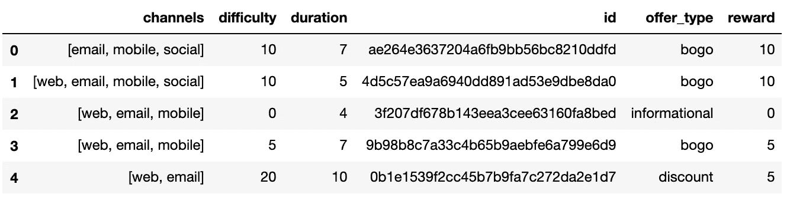

**profile.json**

*   年龄(整数)—客户的年龄
*   成为会员日期(int) —客户创建 app 帐户的日期
*   性别(str) —客户的性别(请注意，有些条目包含“O”代表其他，而不是 M 或 F)
*   id (str) —客户 id
*   收入(浮动)—客户的收入

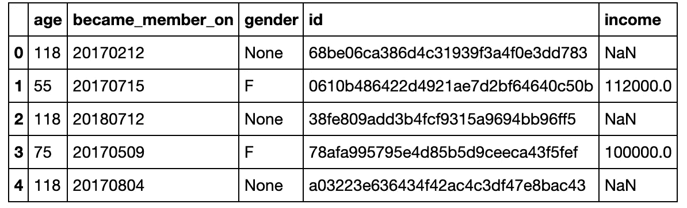

**转录本. json**

*   事件(str) —记录描述(即交易、收到的报价、查看的报价等。)
*   人员(字符串)—客户 id
*   time (int) —测试开始后的时间，以小时为单位。数据开始于时间 t=0
*   value —(字符串字典)—报价 id 或交易金额，具体取决于记录


星巴克希望**将优惠数据、客户数据和交易数据(运营数据)联系起来，以获得关于客户行为的见解**以及优惠作为商业价值的整体有效性。

# 数据探索

***投资组合数据描述***

## 年龄、收入和性别分布

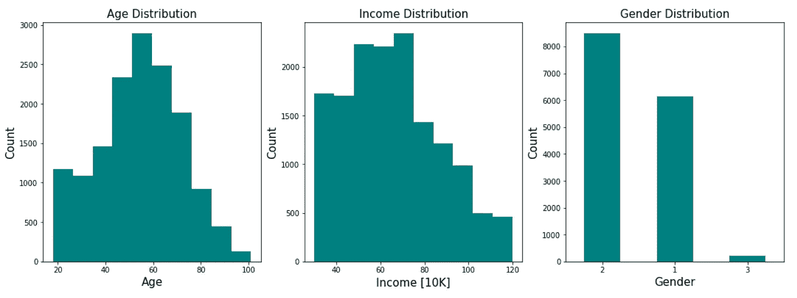

年龄分布图表明，客户的平均年龄为 60 岁，大多数客户属于 40 至 70 岁之间的年龄范围。顾客工资的平均值在 6 万英镑左右。性别分布表明更多的顾客是男性。

## 每年和每月加入星巴克的顾客人数

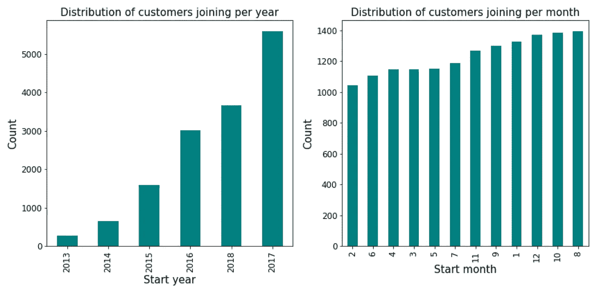

每年加入的客户分布表明，每年加入的客户数量随着时间的推移而增加。在寒冷季节后期，特别是在(八月、十月、十二月、一月)顾客会员增加，这可能与更多的顾客在寒冷天气喝更多的咖啡有关。

## 按成员年份分列的性别分布

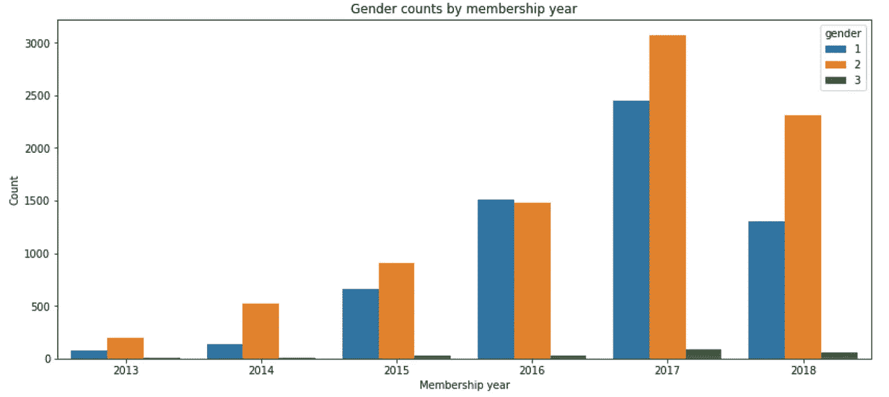

性别:1(女性)、2(男性)和 3(其他)

上面的图表显示，与前几年相比，更多的男性成为了星巴克的会员，而前几年的会员性别分布是平等的。

## 客户收入分配

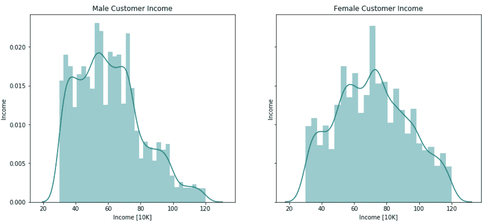

星巴克女性顾客的平均收入高于男性顾客。

***概要数据描述***

```
**#** *Plot distribution of ages in profile dataframe* profile[‘age’].value_counts().sort_index(ascending=**True**).plot.bar(figsize=(20,8), fontsize=12,color=’teal’); plt.xlabel(‘Age’, fontsize=18) plt.ylabel(‘Count’, fontsize=18) plt.title(‘Distribution of age counts’, fontsize=18) plt.show()
```

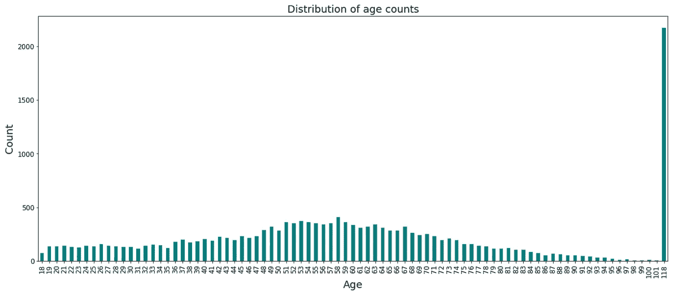

年龄为 118 岁的客户似乎是一个异常值，其中年龄为 118 岁的客户数量为 2175，这是不现实的，将从数据框架中删除。

```
*#Gender counts* 
profile.gender.value_counts()
```

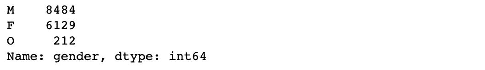

***成绩单数据描述***

```
*# Calculate the percentage of unique values in event feature* round((transcript[‘event’].value_counts()/transcript[‘event’].value_counts().sum())*100,2)
```

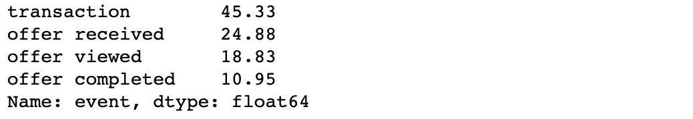

# 数据预处理

## 清理投资组合数据:

*   将 id 列名重命名为 offer_id。
*   缩放和标准化列难度和奖励
*   将时间功能从天转换为小时

```
**#** *renaming 'id' column to offer_id.* portfolio.rename(columns={'id':'offer_id'},inplace=**True**) *# Initialize a scaler, then apply it to the features* 
scaler = MinMaxScaler() *# default=(0, 1)* columns_to_scale = ['difficulty','reward'] portfolio[columns_to_scale] = scaler.fit_transform(portfolio[columns_to_scale]) *# Convert time feature from days to hours* portfolio['duration_hour'] = portfolio['duration']*24 *# Drop duration and channels* portfolio.drop(columns=['duration'],axis=1, inplace=**True**) portfolio
```


## 清理配置文件数据:

*   将 id 列名重命名为 customer_id。
*   将年龄值 118 编码为 NaN。
*   在成为成员列中创建可读的日期格式。
*   删除没有性别、收入、年龄数据的行
*   将性别值转换为数字 1、2 和 3。
*   将年龄和收入从 float 转换为 int
*   添加开始年份和开始月份列
*   添加一个新列“membership_days”，该列将显示自客户成为会员以来的天数
*   创建新列“member_type”

```
#rename id col name to customer_id.
profile.rename(columns={‘id’:’customer_id’},inplace=True)#encode age value 118 to NaN
profile[‘age’] = profile[‘age’].apply(lambda x: np.nan if x == 118 else x)#create readable date format for became_member_on column.
profile.became_member_on = profile[‘became_member_on’].astype(str).astype(‘datetime64[ns]’, format = “%Y%m%d”)# dropping rows with NaNs in ‘age’, ‘gender’ and ‘income’ columns
profile.dropna(inplace=True)#encode gendr column
profile[‘gender’] = profile[‘gender’].map({‘F’: 1, ‘M’: 2, ‘O’: 3})#add start_year column
profile[‘start_year’] = profile.became_member_on.dt.year
profile[“start_month”] = profile.became_member_on.dt.month# changing the datatype of ‘age’ and ‘income’ columns to ‘int’
profile[[‘age’,’income’]] = profile[[‘age’,’income’]].astype(int)# adding a new column ‘membership_days’ ,that will present the number of days since the customer become a member
profile[‘membership_days’] = datetime.now() — profile[‘became_member_on’]# removing the ‘days’ unit
profile[‘membership_days’] = profile[‘membership_days’].dt.days# creating a new column ‘member_type’ representing the type of the member: new, regular or loyal depending on the number of his ‘membership_days’
profile[‘member_type’] = pd.cut(profile[‘membership_days’], bins=[390, 1000, 1600, 2500],labels=[‘new’, ‘regular’, ‘loyal’])# Drop channels and offertype column
profile.drop(columns=[‘became_member_on’,’membership_days’ ],axis=1, inplace=True)# Re-arranging the columns to have ‘customer_id’ column the first column in dataset
profile = profile.reindex(columns=[‘customer_id’, ‘age’, ‘gender’, ‘income’, ‘start_year’, ‘start_month’, ‘member_type’])
```

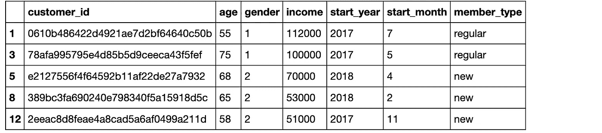

## 清理抄本数据:

迭代 value 列，用列表中的值更新 offer_id、amount、reward 列。

```
**def** cleaning_transcript(transcript):
    *'''*
 *data cleaning the transcript dataframe, return usable dataframe need contain offer events*

 *INPUT:*
 *transcript - the transcript dataframe to be cleaned*

 *OUTPUT:*
 *transcript - the cleaned offer dataframe*

 *'''*
    *#Change name of feature person to customer_id in transcript dataframe*
    transcript.rename(columns={'person': 'customer_id'}, inplace=**True**)

    transcript['offer_id'] = ''
    transcript['amount'] = 0
    transcript['reward'] = 0  
    *#Iterate over value column, check it and update offer_id, amount, reward columns*
    **for** idx, row **in** transcript.iterrows():
        **for** k **in** row['value']:
            **if** k == 'offer_id' **or** k == 'offer id': *# b/c 'offer_id' and 'offer id' are representing the same thing*
                transcript.at[idx, 'offer_id'] = row['value'][k]
            **if** k == 'amount':
                transcript.at[idx, 'amount'] = row['value'][k]
            **if** k == 'reward':
                transcript.at[idx, 'reward'] = row['value'][k]

    *# Drop event_transaction since they cause missing values in 'order id' column* 
    transcript = transcript[transcript['event'] != 'transaction']
    *# Drop value column*
    transcript.drop(columns=['value'], axis = 1, inplace = **True**)

    **return** transcript
```

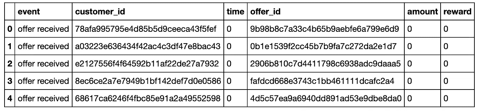

# 主数据集的数据探索

```
*# merge 'cleaning_transcript' dataset with 'profile' on 'offer_id'*
master_df = cleaning_transcript_df.merge(portfolio,how='left',on='offer_id')*# join 'master_df' dataset with 'portfolio' on 'customer_id'*
master_df = master_df.merge(profile,how='left',on='customer_id')
```

## 每个年龄组最受欢迎的优惠是 BOGO(买一送一)

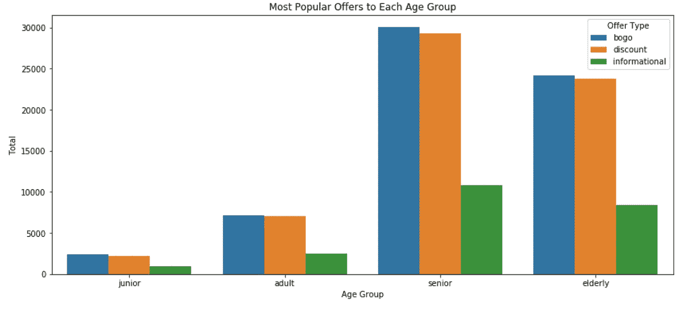

## 女性和男性顾客更喜欢 BOGO 和打折商品

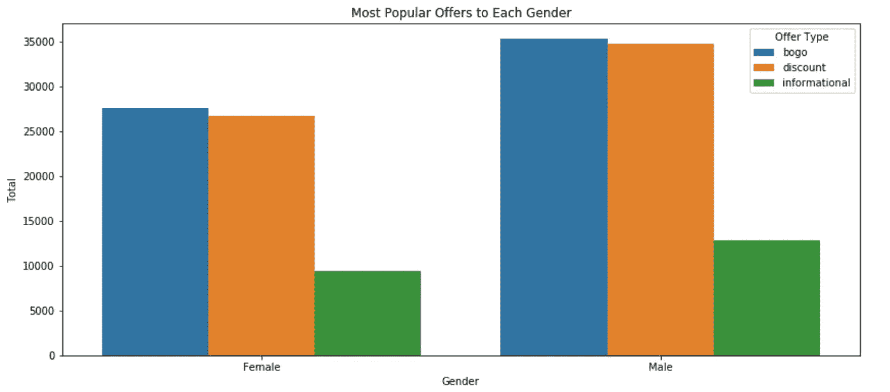

## 女性顾客比男性顾客更容易受到产品的影响

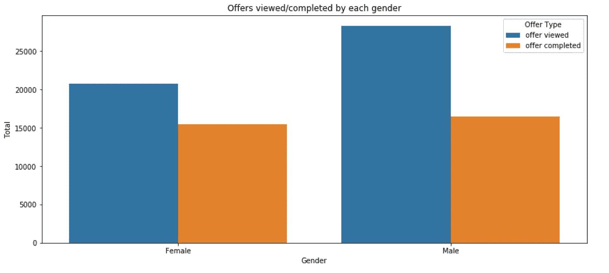

**女性**完成了约 **75%的**所查看的报价，而男性完成了 **58%的**所查看的报价。

## 常客(3-4 年会员)在会员类型中完成了更高范围的产品

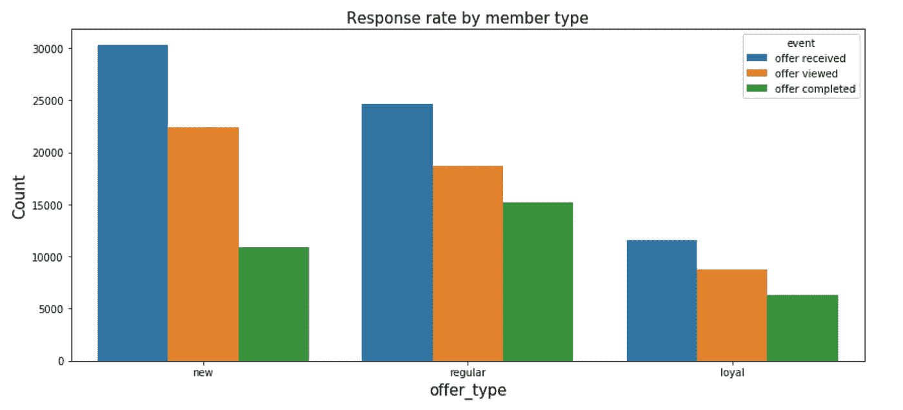

```
Number of offer completed by Female: 15477, 74.46% of total offers viewed.
Number of offer viewed by Female: 20786.
Number of offer completed by Males: 16461, 58.17% of total offers viewed.
Number of offer viewed by Males: 28297.
```

## 完成一个报价的平均时间是 17 天

```
# excluding all events of ‘offer received’, just focus on offer viewed or offer completed
copy_master_df = master_df[master_df[‘event’] != ‘offer received’]
copy_master_df = copy_master_df[copy_master_df[‘event’] != ‘transaction’]
avg_time_spent_offer = copy_master_df.groupby([‘gender’, ‘offer_id’])[‘time’].mean().reset_index()print(avg_time_spent_offer[avg_time_spent_offer[‘gender’] == 1][‘time’].values[0] / 24)
print(avg_time_spent_offer[avg_time_spent_offer[‘gender’] == 2][‘time’].values[0] / 24)16.9176908752
16.8785739814
```

# 将分类值转换为数值

```
# OneHotEncoding feature ‘offer type’
master_df = pd.get_dummies(master_df, columns = [‘offer_type’], prefix= ‘’, prefix_sep=’’)

# OneHotEncoding feature ‘event’
master_df = pd.get_dummies(master_df, columns = [‘event’], prefix= ‘’, prefix_sep=’’)

# Change column names
master_df.rename(columns = {‘offer received’:’offer_received’,
 ‘offer viewed’:’offer_viewed’,
 ‘offer completed’:’offer_completed’}, inplace=True)

# One-hot encode channels
master_df[‘web’] = master_df[‘channels’].apply(lambda x: int(1) if ‘web’ in x else int(0))master_df[‘email’] = master_df[‘channels’].apply(lambda x: int(1) if ‘email’ in x else int(0))master_df[‘mobile’] = master_df[‘channels’].apply(lambda x: int(1) if ‘mobile’ in x else int(0))master_df[‘social’] = master_df[‘channels’].apply(lambda x: int(1) if ‘social’ in x else int(0))# Drop channels column
master_df.drop(columns=[‘channels’], axis = 1, inplace = True)# creating a new column representing the income group to which the customer belongs master_df[‘income_range’] = pd.cut(master_df[‘income’], bins=[29999, 60000, 90000, 120001],labels=[‘average’, ‘above-average’, ‘high’])# replacing the ‘income_range’ categorical labels by numerical labelslabels_income_range = master_df[‘income_range’].astype(‘category’).cat.categories.tolist()
replace_map_comp_income_range = {‘income_range’ : {k: v for k,v in zip(labels_income_range,list(range(1,len(labels_income_range)+1)))}}
master_df.replace(replace_map_comp_income_range, inplace=True)#replacing the ‘member_type’ categorical labels by numerical labelslabels_member_type = master_df[‘member_type’].astype(‘category’).cat.categories.tolist()
replace_map_comp_member_type = {‘member_type’ : {k: v for k,v in zip(labels_member_type,list(range(1,len(labels_member_type)+1)))}}
master_df.replace(replace_map_comp_member_type, inplace=True)#replacing the ‘offer_id’ categorical labels by numerical labelslabels_member_type = master_df[‘offer_id’].astype(‘category’).cat.categories.tolist()
replace_map_comp_member_type = {‘offer_id’ : {k: v for k,v in zip(labels_member_type,list(range(1,len(labels_member_type)+1)))}}
master_df.replace(replace_map_comp_member_type, inplace=True)# replacing the ‘age_group’ categorical labels by numerical labelslabels_age_group = master_df[‘age_group’].astype(‘category’).cat.categories.tolist()
replace_map_comp_age_group = {‘age_group’ : {k: v for k,v in zip(labels_age_group,list(range(1,len(labels_age_group)+1)))}}# replace categorical labels in ‘age_group’ column with numerical labelsmaster_df.replace(replace_map_comp_age_group, inplace=True)
```

# 数据建模

六种不同的机器学习模型将预测客户是否会对报价做出反应。在建立模型之前，我们的数据集应该分为训练和测试数据集，并选择了一些功能和目标表。

**特征:** time_h，offer_id，金额，奖励，难度，duration_hour，age_group，bogo，折扣，资讯，性别，member_type，income_range，web，email，mobile，social。

**目标标签:**报价 _ 已完成

```
# Split the data into features and target labelX = master_df[[‘time’,’offer_id’,’amount’,’reward’,’difficulty’, ’duration_hour’,’age_group’,’bogo’,’discount’,’informational’,’gender’, ‘member_type’,’income_range’,’web’,’email’,’mobile’, ‘social’]]Y = master_df[‘offer_completed’]
```

## 创建培训和预测渠道

*   从`[sklearn.metrics](http://scikit-learn.org/stable/modules/classes.html#sklearn-metrics-metrics)`导入`fbeta_score`和`accuracy_score`。
*   使学习者适应采样的训练数据，并记录训练时间。
*   对测试数据`X_test`，以及前 300 个训练点`X_train[:300]`进行预测。
*   记录总预测时间。
*   计算训练子集和测试集的准确性分数。
*   计算训练子集和测试集的 F 值。

```
# Import two metrics from sklearn - fbeta_score and accuracy_score
from sklearn.metrics import fbeta_score, accuracy_scoredef train_predict(learner, sample_size, X_train, y_train, X_test, y_test): 
    '''
    inputs:
       - learner: the learning algorithm to be trained and predicted on
       - sample_size: the size of samples (number) to be drawn from training set
       - X_train: features training set
       - y_train: income training set
       - X_test: features testing set
       - y_test: income testing set
    '''

    results = {}

    # Fit the learner to the training data using slicing with 'sample_size' using .fit(training_features[:], training_labels[:])
    start = time() # Get start time
    learner.fit(X_train[:sample_size],y_train[:sample_size])
    end = time() # Get end time

    # Calculate the training time
    results['train_time'] = end-start

    # Get the predictions on the test set(X_test),
    # then get predictions on the first 300 training samples(X_train) using .predict()
    start = time() # Get start time
    predictions_test = learner.predict(X_test)
    predictions_train = learner.predict(X_train[:300])
    end = time() # Get end time

    # Calculate the total prediction time
    results['pred_time'] = start-end

    # Compute accuracy on the first 300 training samples which is y_train[:300]
    results['acc_train'] = accuracy_score(y_train[:300],predictions_train)

    # Compute accuracy on test set using accuracy_score()
    results['acc_test'] =  accuracy_score(y_test,predictions_test)

    # Compute F-score on the the first 300 training samples
    results['f_train'] = fbeta_score(y_train[:300],predictions_train,beta=0.5)

    # Compute F-score on the test set
    results['f_test'] = fbeta_score(y_test,predictions_test,beta=0.5)

    # Success
    print("{} trained on {} samples.".format(learner.__class__.__name__, sample_size))   
    # Return the results
    return results
```

## 初始模型评估

*   初始化三个模型，并将它们存储在“clf_D”、“clf_E”和“clf_F”中。

```
# Initialize the three models
clf_D = LogisticRegression(random_state=42) 
clf_E = RandomForestClassifier(random_state=42)
clf_F = GradientBoostingClassifier(random_state=42)# Calculate the number of samples for 1%, 10%, and 100% of the training data
# samples_100 is the entire training set i.e. len(y_train)
# samples_10 is 10% of samples_100 (ensure to set the count of the values to be `int` and not `float`)
# samples_1 is 1% of samples_100 (ensure to set the count of the values to be `int` and not `float`)
samples_100 = len(X_train)
samples_10 = int(0.1 * samples_100)
samples_1 = int(0.01 * samples_100)# Collect results on the learners
results = {}
for clf in [clf_D, clf_E, clf_F]:
    clf_name = clf.__class__.__name__
    results[clf_name] = {}
    for i, samples in enumerate([samples_1, samples_10, samples_100]):
        results[clf_name][i] = \
        train_predict(clf, samples, X_train, y_train, X_test, y_test)# Run metrics visualization for the three supervised learning models chosen
vs.evaluate(results, accuracy, fscore)
```

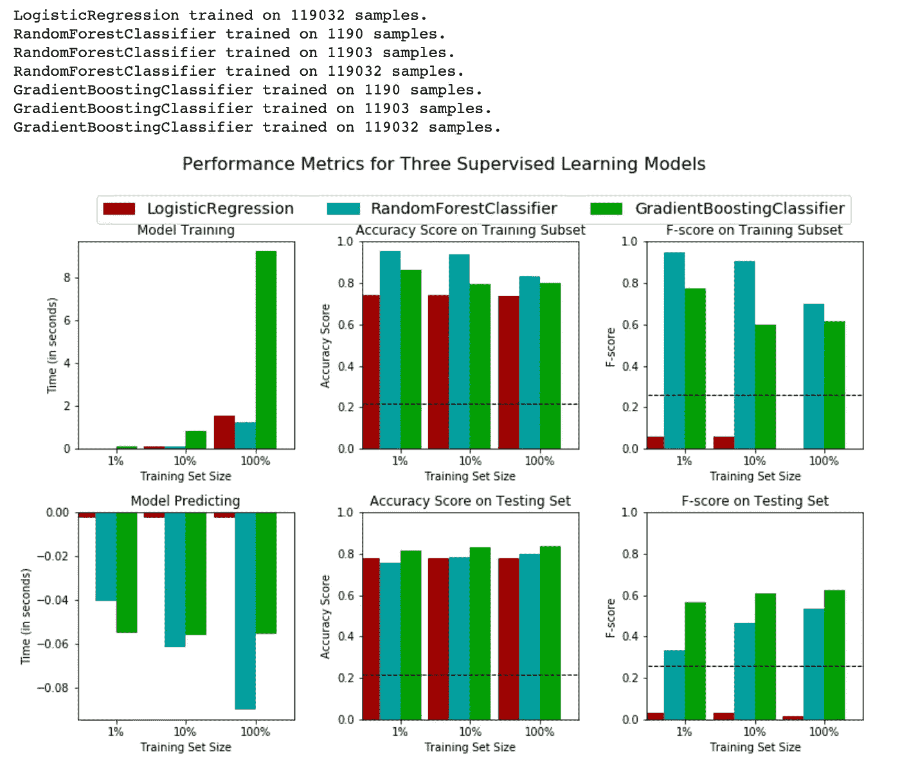

# 模型调整

在这一部分，我们将选择最佳模型用于我们的数据，然后，执行网格搜索优化。

```
# Import 'GridSearchCV', 'make_scorer', and any other necessary libraries
from sklearn.grid_search import GridSearchCV
from sklearn.metrics import make_scorer# Initialize the classifier
clf = RandomForestClassifier(random_state = 1)parameters = {'n_estimators': [10, 50, 80],'max_depth': [None, 2, 3, 4],'min_samples_split': [2,3,4],'min_samples_split': [3],'min_samples_leaf': [1]}# Make an fbeta_score scoring object using make_scorer()
scorer = make_scorer(fbeta_score, beta=0.5)# Perform grid search on the classifier using 'scorer' as the scoring method using GridSearchCV()
grid_obj =  GridSearchCV(estimator=clf, param_grid=parameters, scoring=scorer, cv=None)# Fit the grid search object to the training data and find the optimal parameters using fit()
grid_fit = grid_obj.fit(X_train, y_train)# Get the estimator
best_clf = grid_fit.best_estimator_# Make predictions using the unoptimized and model
predictions = (clf.fit(X_train, y_train)).predict(X_test)
best_predictions = best_clf.predict(X_test)# Report the before-and-afterscores
print("Unoptimized model\n------")
print("Accuracy score on testing data: {:.4f}".format(accuracy_score(y_test, predictions)))
print("F-score on testing data: {:.4f}".format(fbeta_score(y_test, predictions, beta = 0.5)))
print("\nOptimized Model\n------")
print("Final accuracy score on the testing data: {:.4f}".format(accuracy_score(y_test, best_predictions)))
print("Final F-score on the testing data: {:.4f}".format(fbeta_score(y_test, best_predictions, beta = 0.5)))
```

未优化模型
在测试数据上的准确度分数:0.8021
在测试数据上的 F 分数:0.5381

优化模型
测试数据最终精度得分:0.8031
测试数据最终 F 值:0.5415

```
# Import a supervised learning model that has 'feature_importances_'
from sklearn.ensemble import RandomForestClassifier
from sklearn.ensemble import GradientBoostingClassifier# Train the supervised model on the training set using .fit(X_train, y_train)
model_rforest = RandomForestClassifier().fit(X_train, y_train)# Extract the feature importances
importances_rforest = model_rforest.feature_importances_# Plot
print("Random Forest")
vs.feature_plot(importances_rforest, X_train, y_train)
```


在很大程度上影响客户是否会完成产品的最重要因素是会员资格的期限(时间)。顾客成为星巴克会员的时间越长，就越有可能对他们收到的优惠做出反应。然后，影响顾客反应可能性的第二和第三个重要因素是年龄和收入，这很有意义。此外，他们收到的录用通知的数量也会对回应产生很大影响。

```
# Prepare the dataframe of feature importances given to features by best estimator of RandomForest
feat_imp_df = pd.DataFrame(model_rforest.feature_importances_,\
                           index=X_train.columns.tolist(),\
                           columns=['feat_imp']).reset_index()feat_imp_df.rename(columns={'index': 'feature'}, inplace=True)
feat_imp_df['feat_imp_perc'] = np.round((feat_imp_df['feat_imp']/feat_imp_df['feat_imp'].sum())*100,2)
feat_imp_df = feat_imp_df.sort_values(by=['feat_imp_perc'], ascending=False).reset_index(drop=True)
feat_imp_df
```

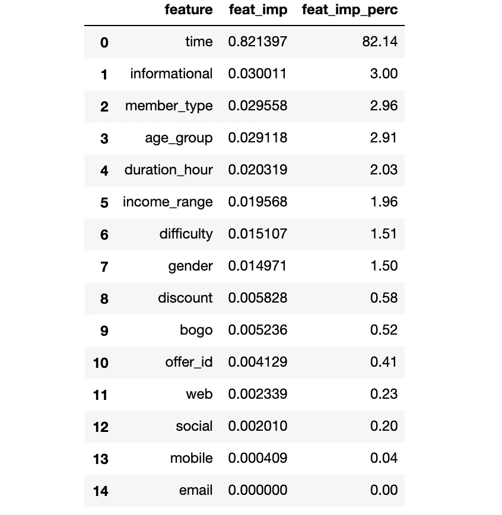

## 特征选择和新模型测试性能

```
# Import functionality for cloning a model
from sklearn.base import cloneimportances = importances_ada
# Reduce the feature space
X_train_reduced = X_train[X_train.columns.values[(np.argsort(importances)[::-1])[:5]]]
X_test_reduced = X_test[X_test.columns.values[(np.argsort(importances)[::-1])[:5]]]# Train on the “best” model found from grid search earlier
clf = (clone(best_clf)).fit(X_train_reduced, y_train)# Make new predictions
y_pred = clf.predict(X_test_reduced)# Report scores from the final model using both versions of data
print(“Final Model trained on full data\n — — — “)
print(“Accuracy on testing data: {:.4f}”.format(accuracy_score(y_test, best_predictions)))
print(“F-score on testing data: {:.4f}”.format(fbeta_score(y_test, best_predictions, beta = 0.5)))
print(“\nFinal Model trained on reduced data\n — — — “)
print(“Accuracy on testing data: {:.4f}”.format(accuracy_score(y_test, y_pred)))
print(“F-score on testing data: {:.4f}”.format(fbeta_score(y_test, y_pred, beta = 0.5)))
```

未优化模型
在测试数据上的准确度分数:0.8031
在测试数据上的 F 分数:0.5415

优化模型
测试数据最终精度得分:0.8253
测试数据最终 F 值:0.6007

# 结论

分析表明，随机森林模型具有最好的训练数据准确性和 F1 值。分析表明，随机森林模型的测试精度为 0.82，F1 值为 0.6。会员资格的长短、年龄和收入等主要因素确实会影响顾客对报价做出反应的可能性。

> 男女都喜欢 BOGO 和打折商品，最好是 BOGO(买一送一)
> 
> 女性顾客比男性顾客更容易受到产品的影响——女性顾客完成了他们所查看产品的 75%,而男性顾客完成了他们所查看产品的 58%。
> 
> 57%的顾客是男性，女性占 41%。
> 
> 常客(3-4 年会员)在会员类型中完成了更高范围的产品。
> 
> 男性和女性都花了将近 17 天的时间来完成报价。
> 
> 大多数成员是在 2017 年加入的。在寒冷季节后期，特别是在(八月、十月、十二月、一月)顾客会员增加，这可能与更多的顾客在寒冷天气喝更多的咖啡有关。

> 机器学习模型建议向秋冬期间在星巴克成为 3-4 名会员的高收入女性发送产品。

# 丰富

获得额外的特征将有助于提供更好的分类结果，因为我们仅限于例如年龄、性别和收入。

还可以对特征工程步骤进行改进，以查看是否有其他新特征要引入，并执行特征缩减方法，以查看它将如何影响模型性能。然而，特征维数减少在我们的例子中并不重要，因为我们没有那么多特征。

另一个改进是探索持续时间、奖励和难度的影响，以及它们如何影响报价响应和购买，并基于这些因素创建新功能。

最后，我们可以通过使用回归算法分析每个客户的消费金额来改进模型，以回答他们对报价的回应可能性有多大的问题，假设消费金额和对报价的回应之间可能存在相关性。

代码可以在[这里](https://github.com/isakkabir/Starbucks-Challenge/blob/master/Starbucks_Capstone_notebook.ipynb)找到。