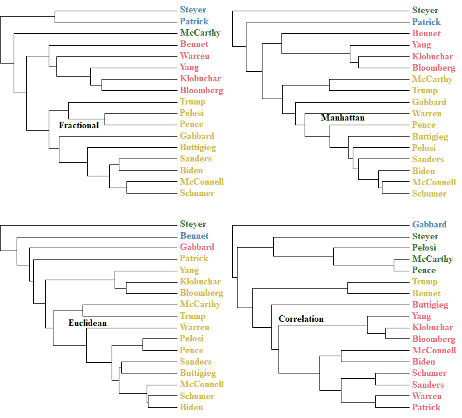
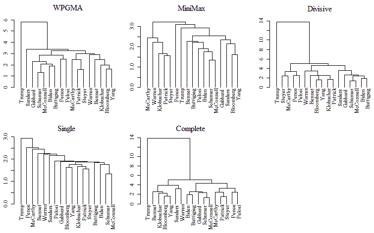

# 谁是大骗子？

> 原文：<https://towardsdatascience.com/whos-a-big-ol-fibber-b6b1259304db?source=collection_archive---------26----------------------->

## 一次从多个 Politifact 配置文件中找出意义，这是实际聚类分析中的一个练习


paweczerwi ski 在 [Unsplash](https://unsplash.com/s/photos/election?utm_source=unsplash&utm_medium=referral&utm_content=creditCopyText) 上的照片

乖乖女的圣诞节！没错，我们四年一次的总统选举周期开始了。每四年，里面的政党举行一次形式上的加冕仪式，而外面的政党装满一辆小丑车进行全国巡演。除非第 22 修正案生效，否则这就是一场小丑赛车。

今年只有一辆小丑车，但马戏团已经拿出一大包来装满它。我们如何区分它们？有很多标准，你需要优先考虑你自己的。这通常包括研究，观看辩论，或者只是等待别人为你做决定。我将只处理“研究”角度的一个方面。与其用更多的废话来填充这篇文章，我将切入正题。我在比较 [Politifact](http://www.politifact.com) 记分卡。你可能已经知道什么是 Politifact 记分卡。

如果你不知道，Politifact 是一家报纸运营的在线“事实核查”实体。它对各种公共实体的声明进行六分制评级。因此，它有以下限制:它是“值得注意”的偏见。声明必须由政治上认为值得注意的人做出，而且声明本身必须有值得注意的来源和值得注意的重要性。由于 Politifact 没有无限的员工和预算，这意味着声明和故事会被忽略。因为决策是由人做出的，所以存在偏见。这背后没有恶意或议程。其次，它的评级包含一些偏见因素，尤其是当评级处于区间的中间时。这是不可避免的。有时需要做出判断。“裤子着火了”和“真实”很容易判断，但是当你处于中间时，可能会有些模糊。

然而，Politifact 对某个人的评价越多，我们对这个人的整体形象就越有信心。这是由于“中心极限定理”，该定理指出，从总体(陈述)中获得的样本(评级)越多，“模糊”元素相互抵消得越多。

但是，偏见问题对于利用 Politifact 档案来说并不是什么大不了的事情。是*简介*问题。我什么意思？大多数人似乎以一种精心挑选的方式使用 Politifact。他们会放大他们认为合适的特定规则。如果你的目标是研究具体问题，那*没什么不对。*如果你的目标是对政治人物进行广泛的比较，那就大错特错了。当我们关注单个数据点时，我们让自己的情绪来驱动结论。如果政治家 A 对我们的一个个人热点问题说了一些令人讨厌的话，而那句令人讨厌的话恰好被裁定为“错误”，那么它会影响我们对政治家 A 的整体看法，而不管该政治家的其他历史。**

# 问题是

不幸的是，我们大多数人都不会硬连线比较个人资料，尤其是在选举前的一年，我们可能需要比较*多个*个人资料。看看这个:


这是特朗普先生、准民主党候选人(截至 2010 年 2 月 10 日)、彭斯先生和国会四名政党领导人的聚合 politifact 简介。误差棒是使用每个人的总裁定数作为“n”的比例的标准误差。条目按照从最多到最少的规则排序。举例来说，很容易一眼就看出特朗普先生与桑德斯先生不相似，但他们两人如何同时与沃伦女士相比较，以及如何同时与其他所有人相比较？

# 一个解决方案？

我们并不是天生就能通过查看多个个人资料来回答这些问题。幸运的是，有一种方法可以回答这些问题:集群。聚类有很多种类型。我不打算详细讨论所有这些问题。如果不熟悉，可以从这篇文章开始[。](https://en.wikipedia.org/wiki/Cluster_analysis)

我在本文中使用的类型称为层次聚类。我碰巧喜欢它，因为它链接了整个数据集，这使得很容易看到一个集群如何与另一个集群相关联。在我开始具体分析之前，我将切入正题，向您展示我的聚类分析的基本结果:


颜色对应于集群。有三个基本的集群，加上特朗普先生在他自己的现实世界里。共和党人的名字用下划线标出。我们得到了一些有趣的结果。南希·佩洛西和 Mssrs 是一类人。彭斯和麦卡锡。米奇·麦康奈尔和 Mssrs 是一类人。桑德斯、布蒂吉格、拜登和舒默，还有加巴德。你们中的一些人可能看着柱形图并不同意。**好**，因为如果你把上面的聚类当成*那个*聚类，你就没有理解聚类的所有问题。

# 比宣传的还要乱！

这棵树是几种选择的结果。没有一种聚类形式是客观的。所有的聚类都要求原始信息的某些方面比其他方面更重要。结果*将*受到这些选择的影响。我现在要脱光了。我将公开我所做的所有选择，以及它们可能如何改变输出。首先，为什么是四个集群？有各种各样令人困惑的方法来为层次聚类选择“最佳”数量的聚类。R 包" [NbClust](https://cran.r-project.org/web/packages/NbClust/) "有超过 30 个索引，它可以通过计算找到层次聚类中的“最佳”聚类数。对于给定的聚类，它们通常彼此不一致。我用了“[肘法](https://en.wikipedia.org/wiki/Elbow_method_(clustering))，基于“T6”聚类平方和。还有一些我没有提到的方法。

聚类通常从创建“距离矩阵”开始。这是所有数据点之间所有“距离”的集合。但什么是“距离”呢？这并不简单。通常我们说的“距离”是指“欧氏距离”。这是两点之间直线的长度。但是还有其他类型的“距离”。“城市街区”或“曼哈顿”的距离就是它听起来的样子。你也可以使用所谓的“相关距离”。我为上面的树选择的是“分数距离”。有很好的理由对超过三维的数据集使用分数距离。其他人对它们的解释比我好得多。我也做了*选择*来解释不确定性。档案中的规则越少，档案相对于实际人物与事实的关系就越不确定。为此，我简单地将原始距离矩阵除以标准误差。这并不复杂，但它确实意味着一个人的不确定性越大，他和其他人就越“亲近”。

# 如此遥远…

但是如果我们不使用分数距离呢？如果我们使用欧几里得距离、曼哈顿距离或相关距离会怎么样？这是什么:


不同距离方法的结果

他们彼此相似，但你可以看到不同之处。每种距离方法强调数据的不同方面。哪个是“真”的？这可能取决于数据。这也可能取决于您想要探索数据的哪些方面。例如，相关距离(1-相关系数)强调两个数据趋势之间的关系如何变化。

# “错误”并不总是坏事。

你可能还记得，我说过我把不确定性粗略地融入了分析中。如果我没有呢？如果我简单地说“比例就是比例”，并(愚蠢地)假定 Politifact 数据的快照总是对人物的准确描述，会怎么样呢？这是如果:



不一样，不是吗？我们在这里看到了什么？我们看到了小样本对 Patrick，Steyer 和 Bennet 的影响。小样本意味着他们的原始数据是极端的。误差函数部分地照顾到了这一点，并使它们有更高的机会出现在先前树的其他聚类中。我们还看到了“垃圾聚类”效应，其中聚类算法无法清晰地分离样本，大多数样本最终聚集在一个大的聚类中。为什么我把这些树分成四簇？主要是为了与第一组树进行比较。

# 这些树不只是生长。

您会注意到，我谈到了距离度量，但没有提到我如何使用它们来构建树。这是因为我没有对任何一棵树使用单一的度量标准。相反，我用五种不同的方法计算了一棵共识树。为什么？在构建层次聚类树的许多不同方法中，哪种方法比其他方法更好还没有定论。所以我结合了几个互不违背对方假设的。

具体来说，我使用了“[单个](https://en.wikipedia.org/wiki/Single-linkage_clustering)”、“ [UPGMA](https://en.wikipedia.org/wiki/UPGMA) ”、“[完全](https://en.wikipedia.org/wiki/Complete-linkage_clustering)”、“[整除](https://www.sciencedirect.com/science/article/pii/S1110016815001933)”、“ [MiniMax](https://www.ncbi.nlm.nih.gov/pmc/articles/PMC4527350/) ”的方法将数据链接起来(又名“链接方法”)。还有其他人，但他们有我不想处理的假设或缺点。例如，沃德的方法只有在使用平方欧几里得距离时才能正常工作。中值/中值/质心方法有可能产生负的*分支长度。甚至我的思想也不去那里。*

这些链接方法中的每一种都从相同的距离矩阵产生不同的树。如果我们输入用于创建第一棵树的分数距离度量，这是每个链接方法的输出:



有明显的不同，但也有相似之处。你会注意到，在大多数树中，特朗普先生是一个异数。佩洛西和彭斯在五棵树中的三棵树上成对出现。如果你看的话，你可以找到其他的相似之处。当达成共识时会发生什么？


回家了，回家了，吉吉吉吉！

# 打开引擎盖

虽然以上这些可能很可爱，但如果我不具体解释我是如何做到的，那就既没用也不道德。我的矩阵和树是我和 T2 一起做的。另外，我使用了[猿](https://cran.r-project.org/web/packages/ape/index.html)、 [protoclust](https://cran.r-project.org/web/packages/protoclust/) 、[簇](https://cran.r-project.org/web/packages/cluster/index.html)、[代理](https://cran.r-project.org/web/packages/proxy/)和[线索](https://cran.r-project.org/web/packages/clue/)包。我通过写一个脚本部分自动化了这个过程(如下)。平方和的聚类是使用旧 GMD 包中的脚本完成的。Cran 知识库不再支持 GMD。相反，你必须从 [GitHub](https://github.com/cran/GMD) 手动添加它。

脚本的命令是`Pol.Trees(ipnut, meth = "frac.dist", ErrAdj = TRUE, consensus = TRUE, frac.f = 2/3)`

参数:

IP nut:*count*数据的数据框架或矩阵，类别为列名，主题为行名。

方法:距离矩阵生成法。可以尝试通过 base R 或 proxy 与 dist 函数一起使用的任何方法。此外，我在脚本中编写了一个名为“chi.dist”的校正“chi distance”。 ***警告:*** 慎用方法，有些零数据点的获取方式不靠谱。

ErrAdj:是否要包括误差调整。默认值为 TRUE。

共识:是否希望生成共识树。默认值为 TRUE。该树采用“phylo”格式。一个错误反而会生成树的线索集合。

frac.f:使用分数距离(frac.dist)时使用的默认分数。

我不得不承认一些事情:这个脚本不会安排和给树上色。他们会很光秃秃的。ape 中有一些命令可以处理这个问题。

# 这一切的意义是什么？

我为什么要写这个呢？你为什么要费心去读它？让我们面对现实吧，有很多情况下我们需要一次比较两个以上的东西，聚类是一个很好的方法。它以我们直观理解的方式直观地展示事物。也可以很好玩。当政治家的行为不符合政党路线时(如佩洛西-彭斯案)，这就是一个发现。

这不会拯救世界，但它可能会帮助人们从太多的数据中找到意义。像 Politifact 这样的网站是有好处的，但是它们会把我们埋葬在数据中。聚类可以将数据转化为理解。

所以，去收集你自己的计数数据，和树一起玩吧。

```
Pol.Trees <- function(ipnut, meth = "frac.dist", ErrAdj = TRUE, consensus = TRUE, frac.f = 2/3){
#This computes and returns a consensus tree based on count data profiles (such as from Politifact). It presumes you are interested
#in comparing proportions, not raw counts. In addition, it automatically adjusts for uncertainty ("error") due to small counts. Even 
#then, I don't recommend having 4 or less total counts per subject.#The parameters are as follows:
    #ipnut: The count data set, wich subject names as the rownames
    #meth: Method to determine distance matrix, default is "frac.dist". WARNING: Not all methods will work properly. Recommended you
    #stick to manhattan, euclidean, frac.dist, chi.dist (both included here), or correlation. The proxy package is a little wonky with some other metrics.
        #Why manhattan distance and not euclidean? [https://bib.dbvis.de/uploadedFiles/155.pdf](https://bib.dbvis.de/uploadedFiles/155.pdf)
    #ErrAdj is whether to apply the error adjustment. Default is TRUE#Several libraries are needed for this script to function.

    library(ape)
    library(protoclust)
    library(cluster)
    library(proxy)
    library(clue)#This section creates then activates the "error adjustment" distance metric.    
    DistErrAdj <- function(x,y)
    {
        sing.err <- sqrt((x^2) + (y^2))
        sum(sing.err)
    }

    if (pr_DB$entry_exists("DistErrAdj") == TRUE)
    {
        pr_DB$delete_entry("DistErrAdj")
        pr_DB$set_entry(FUN = DistErrAdj, names = c("DistErrAdj"))
    }
    else
    {
        pr_DB$set_entry(FUN = DistErrAdj, names = c("DistErrAdj"))
    }

    #This section creates then activates the "fractional" distance metric. It uses a default f of 2/3, which can be altered with the frac.f input.
    frac.dist <- function(x, y, frac)
    {
        frac = frac.f
        sum(singfrac <- (abs(x - y) ^ frac) ^ 1/frac)
    }

    if (pr_DB$entry_exists("frac.dist") == TRUE)
    {
        pr_DB$delete_entry("frac.dist")
        pr_DB$set_entry(FUN = frac.dist, names = c("frac.dist"))
    }
    else
    {
        pr_DB$set_entry(FUN = frac.dist, names = c("frac.dist"))
    }

    #This section creates then activates a correction for the chi distance. The version in proxy generates negative distances.
    chi.dist <- function(x, y)
    {
        sqrt(sum(((x-y)^2)/(colsum/sum(colsum))))    
    }

    if (pr_DB$entry_exists("chi.dist") == TRUE)
    {
        pr_DB$delete_entry("chi.dist")
        pr_DB$set_entry(FUN = chi.dist, names = c("chi.dist"))
    }
    else
    {
        pr_DB$set_entry(FUN = chi.dist, names = c("chi.dist"))
    }

#Creating the proportions and errors for each data point.#This creates a consensus tree without bootstraps and does not automatically plot. It is the non-default. Use it if you want to have a tree
#to manipulate or annotate manually.
        x <- ipnut / rowSums(ipnut)
        q <- sqrt((x * (1 - x)) / rowSums(ipnut))
        colsum <- colSums(x)
        rawdist <- dist(x, method = meth)
        errs <- dist(q, method = "DistErrAdj") / if(ErrAdj == TRUE) {1} else {dist(q, method = "DistErrAdj")}
        findist <- rawdist / errs
        tr.ave = as.hclust(agnes(findist, diss = TRUE, method = "average"))
        tr.prot = protoclust(findist)
        tr.div = as.hclust(diana(findist, diss=TRUE))
        tr.single = as.hclust(agnes(findist, diss = TRUE, method = "single"))
        tr.comp = as.hclust(agnes(findist, diss = TRUE, method = "complete"))
        tr.ensemble <- cl_ensemble(tr.ave, tr.prot, tr.div, tr.single, tr.comp)
        tr.cons <- ladderize(as.phylo(as.hclust(cl_consensus(tr.ensemble))))if(consensus == TRUE)
        {
            tr.cons
        }

        else
        {
            tr.ensemble
        }}
```