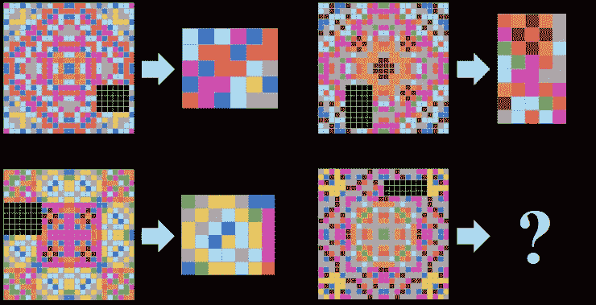
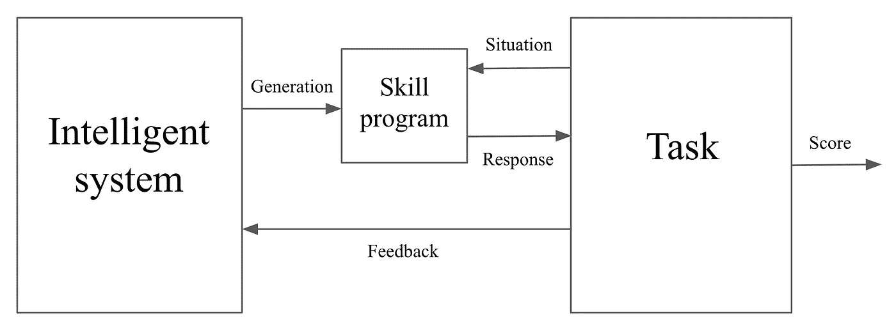

# 谁更聪明？人工智能系统和人类的智商测试

> 原文：<https://towardsdatascience.com/whos-smarter-an-iq-test-for-both-ai-systems-and-humans-cdf44844b612?source=collection_archive---------33----------------------->

根据谷歌人工智能研究员的说法，对人类或机器来说，掌握技能并不等同于一般的智力

平板电脑前的女孩:哈尔·盖特伍德在 [Unsplash](https://unsplash.com/s/photos/iq-test?utm_source=unsplash&utm_medium=referral&utm_content=creditCopyText) 上拍摄的照片

透过围绕人工智能的大肆宣传，[谷歌人工智能研究员弗朗索瓦·乔莱](https://medium.com/u/7462d2319de7?source=post_page-----cdf44844b612--------------------------------)提出了抽象和推理语料库(ARC)，这是一种可能塑造未来人工智能研究进程的智力测试。迄今为止，人工智能还没有令人满意的定义，也没有任何有意义的评估方法，根据他最近的论文([“论智力的衡量”](https://arxiv.org/pdf/1911.01547.pdf))。有一些基准，比如对电子游戏的掌握程度，但它们衡量的只是狭义的技能，而不是可以被称为类人智力的东西。

当然，开发人员并没有声称他们的国际象棋或围棋冠军拥有一般的智力，但该领域的所有此类工作都在朝着这个目标努力，即使只是含蓄地努力。这就是问题所在。目标和评估基准对科学来说是必不可少的，但它们需要明确——用乔莱的话来说就是“精确、量化的智力定义和测量”。如果没有一个正式的定义，人工智能研究人员就会回到不清楚的常用定义，这些定义本质上是概念性的，而不是可操作的。他们缺乏在不依赖测试的情况下被客观衡量的能力，这些测试“隐含着几十年前的定义和偏见”

Chollet 写道，这些偏见在“该领域对棋盘游戏和视频游戏的持续迷恋”中显而易见。他继续说道，不幸的是，这种思维模式“构建了今天的许多研究成果”，不利于人工通用智能取得更大的成功(AGI)。他试图指出假设和偏见，以便更好地定义和测量该领域的智力，这是一个雄心勃勃的目标。接下来的内容将只触及他论文中的几个重要论断，但首先是对 ARC，即测试本身的简要描述。

**定义圆弧**

首先，ARC 是一个可以构建智力测验的框架。最重要的是，这些测试可以应用于人类和人工智能系统。Chollet 论文的最后一部分是一个智力测验，它是按照他的框架中的指导原则建立的。最后，Chollet 写道，他的框架和这个特定的实例都是正在进行中的工作。

测试本身由数据集组成，其中有用于训练和评估的输入网格。每个网格都由各种形状和颜色的图案组成。对于每个单独的测试单元，考生被显示在由输入和输出网格组成的一到三个演示对之间。接下来是一个单一的输入网格，考生用它来构建一个输出网格，以匹配示范对指示的模式。如图 1 所示，这种格式类似于瑞文渐进矩阵，一种可以追溯到 20 世纪 30 年代的智商测试格式。该测试被设计成在没有训练的情况下进行，只有“接近人类先天知识的先验知识”

图 1:“隐含目标是完成对称模式的任务。任务的性质由三个输入/输出示例来说明。应试者必须生成与测试输入的输入网格相对应的输出网格(右下方)。”

**做我们知道的事情**

事实证明，应用于知识和理解的人类先验知识在 Chollet 的 ARC 测试中扮演着重要的角色。他非常明确地指出,“以人类为中心的参考框架不仅是合理的，而且是必要的”,这是为试图实现一般智能的人工智能系统构建的智能测试。他不同意诸如“普遍智力”或任何“用一个绝对的尺度来衡量所有智力”的想法。简而言之，他认为人工智能研究人员需要从目标范围开始。我们所知道的唯一一个范围是“与人类相关的任务空间”，在这个范围内，我们可以确定指示智力程度的指数。这并不排除其他类型的可能的普遍智能(甚至比我们更高的智能)，但我们必须从我们所知道的开始。Chollet 还指出，如果我们所定义的一般智力的范围与我们自己的没有明显的重叠，那么我们完全有可能不能认为那个实体是智能的。这让我想起了路德维希·维特斯坦根的名言“如果一头狮子会说话，我们就无法理解它。”

**到底什么是核心知识**

如上所述，Chollet 提出“类似人类的一般智力测试”必须基于我们对周围世界的理解和感知。他将自己对这些先验的理解建立在发展科学的核心知识理论基础上，该理论是由伊丽莎白·s·斯皮克和凯瑟琳·d·金兹勒在他们的同名论文中提出的。他们确定了“构成人类认知基础的四大类先天假设。”这些类别是:

*   *客体性和基本物理学——凝聚、持续和联系。*
*   *代理性和目标导向——拥有意图，朝着目标行动，并在目标导向的行动中表现出效率。*
*   *自然数和初等算术——抽象数字表示。*
*   *基础几何和拓扑——在 2D 和 3D 环境中定位和导航。*

Chollet 说，最重要的是不仅要在智商测试中包括这些前科，而且要确定智商测试所依赖的任何其他前科。这是为了暴露测试中可能存在的任何主观性，这些主观性可能会对人类或人工智能系统的结果产生偏见。

**过程 vs .神器:是歌手，不是歌**

Chollet 在他的论文中提出的另一点是“过程和工件之间的混淆一直是人工智能概念化中的一个基本问题。”在他对一般智能的正式定义中，Chollet 明确区分了拥有智能的部分，即智能系统(is ),和仅仅产生技能行为的部分，即技能程序(SP)。(见图 2)前者是智能化的过程；后者才是神器。Chollet 认为，目前的人工智能研究往往侧重于后者。在他的思想中，智能的国际象棋程序是由智能过程产生的人工产物，事实上，智能过程不是程序中的机制，而是“创造国际象棋程序的研究人员所展示的智能”。

图 2:“问题的位置:一个智能系统生成一个技能程序来与任务交互。”

**程序综合课程**

Chollet 对过程与工件的讨论也引出了他所认为的人工通用智能发展的前景。他指出，ARC 的程序合成解决方案将能够完成“广泛的与人类相关的任务，这些任务通常需要人类水平的、人类流体的智能。”这种方法当然有其进化的因素，因此，似乎很有可能在几代人的时间里形成一种灵活的解决方案。实际上，程序合成方法会开发自己的课程来学习如何在 ARC 测试中获得高分。为了支持这种方法，Chollet 指出，在 ARC 等心理测试中得分高的人也更有可能在“所有人类认知任务”中表现出色。换句话说，通过程序合成方法开发的人工智能系统在 ARC 测试中得分很高，也可以在其他认知任务中表现出色，这些任务是具有一般智能的人类能够完成的。

此外，人工智能系统还可以使用这些一般的认知技能来推理和解决它事先不知道的情况。事实上，Chollet 说，ARC 解算器和人类一般智能都拥有相同的先验知识，因此人工智能系统“将接近人类的认知能力。”这几乎肯定是一条漫长的道路，Chollet 坦率地承认，上述 ARC 求解器是推测性的，并对其可能性的挑战持开放态度。不过，这似乎是一个智力挑战。

**脚注**

有趣的是，Chollet 指出，这些先验知识也是我们近亲的其他灵长类动物所固有的。因此，进化在它们的发展中起着重要的作用。