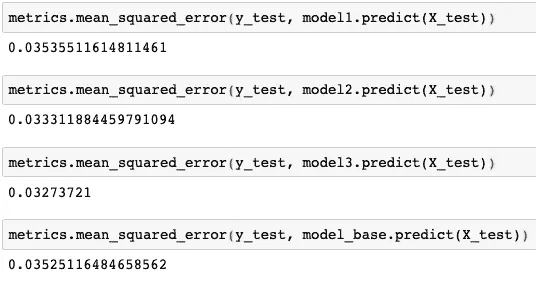
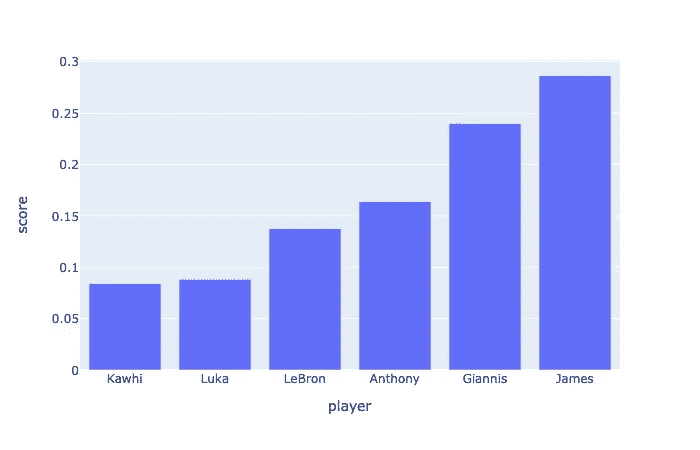
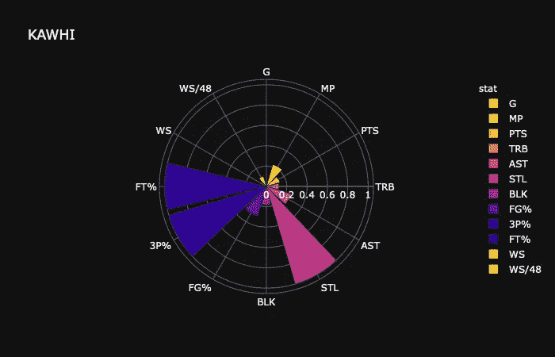
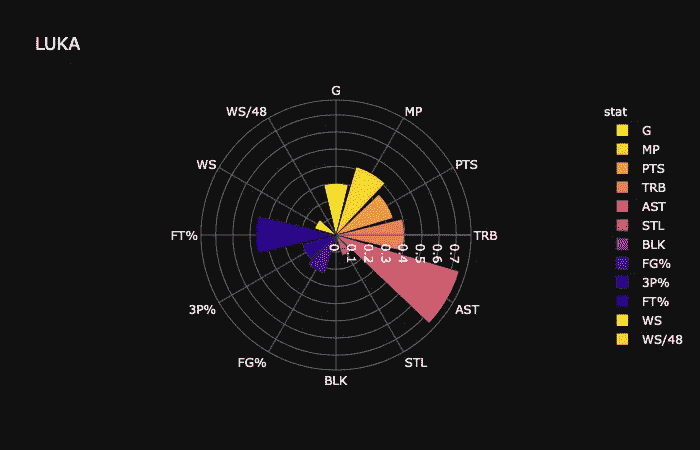
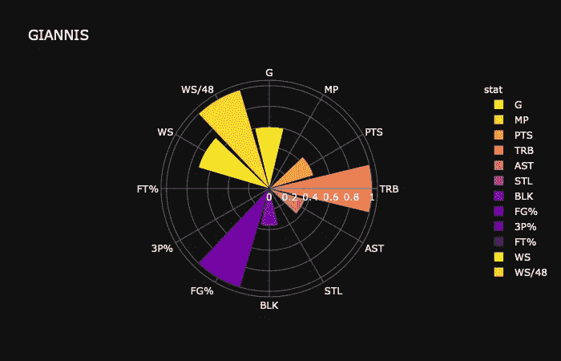

# 谁是本赛季 NBA 的最有价值球员？

> 原文：<https://towardsdatascience.com/whos-the-mvp-of-nba-this-season-3e347c66a40a?source=collection_archive---------45----------------------->

## 机器学习

## 一个案例研究，展示一个机器学习项目从开始到结束的样子。


迪安·班尼特在 [Unsplash](https://unsplash.com?utm_source=medium&utm_medium=referral) 上的照片

别告诉我会是 ***吉安尼斯*** 。让我们从数据中寻找答案。

我会把这个问题框架到一个机器学习项目上，用类似于 ***深度学习用 Python***【1】介绍的机器学习一般工作流程来完成项目。

让我们开始吧。

## 定义问题并获取数据。

我们想问的问题是“ ***谁是 NBA 本赛季的 MVP？***

谁*是*或者*不是*，这好像是一个*二元分类*的问题。所以，我的第一个尝试是建立一个分类器来区分 MVP 球员和非 MVP 球员。

然而，我发现建立一个分类器是不实际的，因为我将面临样本偏差的问题。具体来说，*非 MVP* 球员的数量远大于 *MVP* 球员的数量，这就造成了模型训练和评估的难度。

因此，我把它框定为一个*回归问题*并且输出被定义为每年的 MVP 投票份额。

***要注意*** ，我在这里用我的领域知识(作为一个大粉丝我对 NBA 非常熟悉)为项目选择正确的方向。在构思一个可行的项目时，充分利用你的专业知识是非常重要的。

然后，我们来看看我们掌握的投入 X 和产出 y 方面的数据，数据的 X 部分是从*1989–1990*赛季到*2018–2019*赛季获得 MVP 票数的球员的统计。数据的 y 部分是投票份额。

然后将数据分离成训练和测试数据集。在我们得到最终模型之前，测试数据集永远不会被触及。

```
X_train, X_test, y_train, y_test = train_test_split(X, y, test_size=0.2, random_state=42)
```

## 选择评估指标和评估流程。

这是一个项目的重要步骤，它定义了模型的 ***成功*** 。在这个回归问题中，我用*(***MSE***)作为评价度量。具体来说，该模型试图在训练过程中最小化 MSE。*

*由于样本量较小，我使用了 ***K 倍交叉验证*** 而不是一次性的*训练-验证-测试*分割作为我的评估过程。当样本量较小时，数据的拆分实际上会影响模型的性能。通常使用 K-fold 交叉验证来解决问题。*

## *准备数据。*

*数据的准备包括*缺失值插补*和特征*归一化*。*

```
*my_imputer = SimpleImputer(strategy="median")
my_scaler = StandardScaler()*
```

*特征归一化在回归问题中是必不可少的，如果将原始数据汇集到引擎中，不同规模的特征对于模型训练来说将是一场灾难。*

## *开发一个比基线更好的模型。*

*在建模部分，无论您是初学者还是有经验的数据科学家，都很容易忘记设置基线模型。*

*这里我们使用一个简单的线性模型作为我们的基线模型，并将其与数据的*预处理*一起打包到一个 ***管道*** 中。对管道用法感兴趣的可以参考 sklearn 中的 [***管道功能。***](https://scikit-learn.org/stable/modules/generated/sklearn.pipeline.Pipeline.html)*

```
*from sklearn.linear_model import LinearRegression
model_base = Pipeline([('imputer', my_imputer), ('scaler', my_scaler), ('ln_model',LinearRegression())])
model_base.fit(X_train, y_train)*
```

*基线模型现在可以用来比较了。*

*接下来，我们将开发一个比简单线性回归性能更好的模型。我选择三个候选人， [***弹性网***](https://scikit-learn.org/stable/modules/generated/sklearn.linear_model.ElasticNet.html)[***随机森林回归器***](https://scikit-learn.org/stable/modules/generated/sklearn.ensemble.RandomForestRegressor.html)***深度学习回归*** 。*

*弹性网是*套索*和*脊*的组合，惩罚模型的复杂性。如果感兴趣，请参考下面我以前的一个帖子。*

*[](/a-practical-suggestion-in-linear-regression-cb639fd5ccdb) [## 线性回归中的一个实用建议

### 从弹性网开始，记得调好定义 l1 范数之比的超参数。

towardsdatascience.com](/a-practical-suggestion-in-linear-regression-cb639fd5ccdb) 

对于这三个候选的超参数调优过程，我编写了一个结合了*预处理*、*超参数空间定义*和*交叉* - *验证*过程的函数。

```
def train_hyper_tune(X,y):
    # create the pre-processing component
    my_scaler = StandardScaler()
    my_imputer = SimpleImputer(strategy="median")

    # define regressors
    ## regressors 1: Logistic Regression
    rgs_EN = ElasticNet(random_state=0)
    ## regressors 2: Random Forest regressors
    rgs_RF = RandomForestRegressor(random_state=0)
    ## regressors 3: Deep Learning 
    rgs_DL = KerasRegressor(build_fn=my_DL)

    # define pipeline for three regressors
    ## rgs_LR
    pipe1 = Pipeline([('imputer', my_imputer), ('scaler', my_scaler), ('en_model',rgs_EN)])
    ## rgs_RF
    pipe2 = Pipeline([('imputer', my_imputer), ('scaler', my_scaler), ('rf_model',rgs_RF)])
    ## rgs_DL
    pipe3 = Pipeline([('imputer', my_imputer), ('scaler', my_scaler), ('dl_model',rgs_DL)])

    # create hyperparameter space of the three models
    ## rgs_LR
    param_grid1 = {
        'en_model__alpha' : [1e-1,1,10],
        'en_model__l1_ratio' : [0,0.5,1]
    }
    ## rgs_RF
    param_grid2 = {
        'rf_model__n_estimators' : [50,100],
        'rf_model__max_features' : [0.8,"auto"],
        'rf_model__max_depth' : [4,5]
    }
    ## rgs_DL
    param_grid3 = {
        'dl_model__epochs' : [6,12,18,24],
        'dl_model__batchsize' : [256,512]
    }

    # set GridSearch via 5-fold cross-validation
    ## rgs_LR
    grid1 = GridSearchCV(pipe1, cv=5, param_grid=param_grid1)
    ## rgs_RF
    grid2 = GridSearchCV(pipe2, cv=5, param_grid=param_grid2)
    ## rgs_DL
    grid3 = GridSearchCV(pipe3, cv=5, param_grid=param_grid3)

    # run the hyperparameter tunning
    grid1.fit(X,y)
    grid2.fit(X,y)
    grid3.fit(X,y)

    # return results of the tunning process
    return grid1,grid2,grid3,pipe1,pipe2,pipe3
```

其中深度学习模型 ***my_DL*** 定义如下:

```
def my_DL(epochs=6,batchsize=512):
    model = Sequential()
    model.add(Dense(32,activation='relu'))
    model.add(Dense(16,activation='relu'))
    model.add(Dense(1))
    model.compile(loss='mse',optimizer='rmsprop', metrics=['mae'])
    return model
```

神经网络中的*分类*和*回归*模型在最后一层通常是不同的。这里，对于回归建模，我们在最后一层不使用任何激活函数: *model.add(Dense(1))* 。

但如果是分类问题，就需要增加一个激活函数，比如最后一层的 ***sigmoid*** 。我已经写了一些类似的功能在我的其他职位如下:

[](/end-to-end-project-of-game-prediction-based-on-lebrons-stats-using-three-machine-learning-models-38c20f49af5f) [## 使用三种机器学习模型基于勒布朗数据的端到端游戏预测方案

### 综合指导一个二元分类问题使用三个不同的分类器，包括逻辑…

towardsdatascience.com](/end-to-end-project-of-game-prediction-based-on-lebrons-stats-using-three-machine-learning-models-38c20f49af5f) 

然后，我们运行超参数调整功能。

```
my_grid1,my_grid2,my_grid3,my_pipe1,my_pipe2,my_pipe3 = train_hyper_tune(X_train, y_train)
```

现在，我们已经为这三个模型中的每一个获得了最佳的超参数集。然后我们需要使用训练好的超参数在整个训练数据集上重新调整*。*

```
*def train_on_entire(X,y,pipe,grid_res):
    # fit pipeline
    pipe.set_params(**grid_res.best_params_).fit(X, y)
    # return the newly trained pipeline
    return pipemodel1 = train_on_entire(X_train,y_train,my_pipe1,my_grid1)
model2 = train_on_entire(X_train,y_train,my_pipe2,my_grid2)
model3 = train_on_entire(X_train,y_train,my_pipe3,my_grid3)*
```

*我们不能说一个模型比基于训练数据性能的基线模型(线性回归)更好。因此，我们需要对以前从未接触过的测试数据进行多一步评估。*

**

*测试数据上的表现([裕丰](https://medium.com/@jianan.jay.lin)*

*现在，我们已经得出结论，通过在测试数据集上实现 ***最低 MSE*** ，模型 3 (深度学习回归器)优于其他模型。所以， ***model3*** 是我们最终的模型。*

*通常，一个机器学习模型项目以拥有一个性能相当好的模型而结束。*

*然而，在我们的项目中，这一步还不足以回答问题，“ ***谁是 MVP？*** “这就是我们走得更远的原因。*

## *预测和解释。*

*我们将把我们训练好的模型应用到目标问题中，预测 **MVP** 。于是，我从本赛季(NBA 因 ***COVID19*** 停赛前)的球员统计数据中提取出与我们训练数据相同的特征空间。*

*我们只对有机会赢得 MVP 的顶尖球员感兴趣。分别是**詹尼斯**、**安东尼**、**卢卡**、**詹姆斯**(哈登)**勒布朗**、**科怀**。*

*如果你是一个篮球迷，你一定知道这些人。如果不是，你不需要了解他们就能理解这个机器学习项目。不管怎样，我不会浪费时间介绍他们。*

*这是他们 ***MVP 投票份额*** 的预测。*

**

*由[虞峰](https://medium.com/@jianan.jay.lin)预测 MVP 投票份额*

*我们从媒体那里得到了不同的答案，我们预测的 **MVP** 是**詹姆斯·哈登 T7！没有喜欢，没有讨厌，但都来自数据。(但我个人确实认同这个结果。😀)***

*预测结果后，我需要更深入地挖掘数据来解释结果或支持结果。因此，我使用 ***花花公子图表*** 比较这些玩家的统计数据(我们模型的特征空间)。*

## ***6 号科怀，**预测投票份额= 8.4%*

**

*科怀统计由[玉凤](https://medium.com/@jianan.jay.lin)*

## *第五名卢卡，预测投票份额= 8.8%*

**

*卢卡统计数据由[玉凤](https://medium.com/@jianan.jay.lin)*

## *第 4 名勒布朗，预测投票份额= 13.8%*

**

*勒布朗统计数据由[虞峰](https://medium.com/@jianan.jay.lin)*

## *第三名安东尼，预测投票份额= 16.4%*

**

*安东尼统计由[俞峰](https://medium.com/@jianan.jay.lin)*

## *第二名 Giannis，预测投票份额= 24.0%*

**

*詹尼斯统计由[虞风](https://medium.com/@jianan.jay.lin)*

## *第一名詹姆斯，预测投票份额= 28.7%*

**

*詹姆斯统计数据由[虞峰](https://medium.com/@jianan.jay.lin)*

*我们可以清楚地看到，詹姆斯·哈登的统计数据都在**最好的**(打了*场，场均得分，投篮命中率，抢断等等*)之列。这就是为什么模型预测他是这个赛季的最有价值球员。*

*对生成 ***花梳图*** 感兴趣的可以参考下面的帖子。*

*[](/present-the-feature-importance-of-the-random-forest-classifier-99bb042be4cc) [## 给出了随机森林分类器的特征重要性

### 如何建立一个随机森林分类器，提取特征重要性，并漂亮地呈现出来。

towardsdatascience.com](/present-the-feature-importance-of-the-random-forest-classifier-99bb042be4cc) 

就是这样。一个从头到尾的问题驱动的机器学习项目。* 

## *外卖*

1.  *应用领域知识对于项目设计和数据收集非常重要。*
2.  ***当样本量较小时，使用 K 倍交叉验证。***
3.  *不要忘记在建模前标准化你的特征。*
4.  ***用测试数据上的表现来评估你的模型。***
5.  *使用图形来解释你的预测结果。*
6.  *詹姆斯·哈登是最有价值球员。*

**

*裘德·贝克在 [Unsplash](https://unsplash.com?utm_source=medium&utm_medium=referral) 上的照片*

## *参考资料:*

***弗朗索瓦·乔莱**。[用 Python 进行深度学习。](https://www.manning.com/books/deep-learning-with-python)**