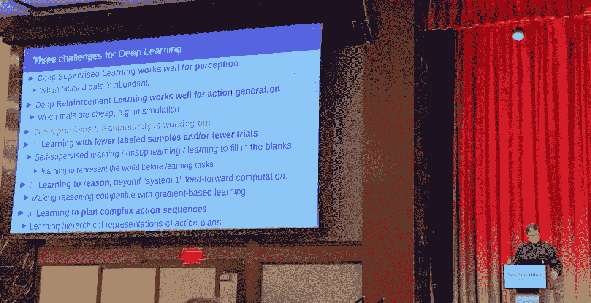
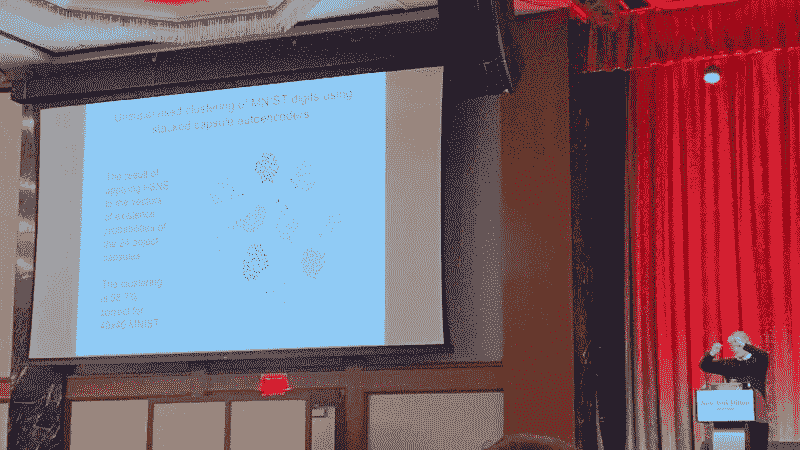

# 为什么一场重大的人工智能革命即将到来，但不是你想的那样——AAAI 2020

> 原文：<https://towardsdatascience.com/why-a-major-ai-revolution-is-coming-but-its-not-what-you-think-aaai-2020-aedbe2a3928f?source=collection_archive---------5----------------------->

## 来自 AAAI 2020 会议:图灵奖科学家辛顿、勒昆和本吉奥致力于让机器理性

从左至右，扬·勒昆、杰夫·辛顿、约舒阿·本吉奥、弗朗西丝卡·罗西和丹尼尔·卡内曼热烈讨论计算机是否真的会“思考”

> 你已经知道深度学习擅长视觉、翻译、玩游戏和其他任务。但是神经网络不像人类那样“学习”，相反，它非常擅长快速模式匹配。今天的研究主要集中在具有更大数据集和复杂损失函数的更大模型上。但是下一次革命可能会更加根本性。让我们来看看两种方法:用层叠胶囊自动编码器添加逻辑和大规模自我监督学习。

# 三位图灵奖获得者都同意深度学习的问题

## **Yann LeCun 提出了深度学习的三大挑战:**

1.  用较少的标记样本学习
2.  学习推理
3.  学习计划复杂的动作序列

## **杰夫·辛顿——“这是关于 CNN 的问题，以及为什么它们是垃圾”:**

1.  CNN 不擅长处理旋转或缩放
2.  CNN 不理解图像中的物体及其组成部分
3.  有线电视新闻网在反对的例子面前是脆弱的

## **Yoshua Bengio —“神经网络需要发展意识”:**

1.  应该从更少的例子中更快地概括
2.  从世界上学习更好的模型，比如常识
3.  更擅长“系统 2”思维(相对于快速识别，较慢的方法思维)

他的讲述总结了大多数人工智能科学家已经知道的事情:深度学习真的擅长于做狭窄的、基于模式的任务，如对象或语音识别。挑战是让人工智能 1)用更少的例子学习 2)对琐碎的对手攻击更鲁棒 3)能够推理 4)计划更复杂的动作序列。

Yann LeCun 阐述了深度学习的三个挑战

# Hinton 提出了堆叠胶囊自动编码器，它将先验注入到神经网络的结构中

T 这里的关键见解是，对于卷积神经网络，我们只需向完全连接的神经网络添加一点点结构(卷积)，它就能极大地帮助网络进行图像识别。

Hinton 现在将基本的神经元结构改变为“胶囊”,其包括 1)用于识别形状的逻辑单元 2)用于姿势的矩阵和 3)用于诸如变形、速度、颜色等其他属性的向量。添加的结构应该有助于神经网络识别和存储关于形状、姿势和其他属性的信息。[全文 Neurips 论文此处](https://papers.nips.cc/paper/9684-stacked-capsule-autoencoders.pdf)。[这里是 AI 入门](https://medium.com/the-mission/how-to-build-the-perfect-deep-learning-computer-and-save-thousands-of-dollars-9ec3b2eb4ce2)。

如下所示，该算法在无监督训练后，在 MNIST 的 10 个数字类别中显示出清晰的分离。这意味着我们可以只使用 10 个标记样本(每个数字一个)来训练神经网络。

想象一个婴儿在玩编号为 1-10 的积木……过一会儿，婴儿应该能够将相似的数字组合在一起(不管姿势、畸形等),尽管她不知道这些数字是什么意思。这就是这里正在发生的事情。

辛顿展示了 MNIST 数字的无监督学习和使用生成的嵌入的类的清楚分离。

## 辛顿正试图教计算机学习关系，这导致了逻辑

Hinton 的 Stacked Capsule 自动编码器是将知识结构构建到神经网络中的一个例子，它使网络能够进行推理。在 MNIST 的例子中，它识别一个数字是如何由许多部分组成的。

更进一步，你可以想象我们可以用这种方式表示其他关系，比如能力(能走，能飞，等等)和特征(有头，有翅膀，等等)。从这里，很容易看到计算机将如何能够推理动物是鸟，因为它有翅膀，可以飞。

## 还有其他方法可以将逻辑与神经网络结合起来，但陪审团仍然没有找到最好的方法。

特斯拉的 autopilot 是神经网络和逻辑系统结合的又一个例子。在这种情况下，神经网络仅用于进行对象识别，然后一组手动编写的规则为汽车提供方向，例如“一名行人在汽车前面行走，踩刹车并停下来”。

最大的区别是 1)Hinton 的关系系统可以使用梯度下降来训练，但是纯符号系统不可以，以及 2)训练系统上的向量表示可以进行相似性，但是符号系统不能。例如，“人类与类人猿相似，因为他们有 4 条腿，圆脸，而且身高差不多。”

你可以想象结合逻辑和系统的其他方式，比如在神经网络或级联系统中集成符号推理，其中逻辑开始是模糊的，然后通过符号规则得到巩固。但肯定不清楚哪种方法最好。

# Yann LeCun 提出大规模的自我监督学习

W hat 如果我们用胶囊跳过了这种花哨的步法，网络还能学习这些关系吗？Yann LeCun 就是这么想的。

婴儿是这样学习的。他们首先观察世界，通过观察物体下落来了解重力。因此，如果你给一个 10 个月大的婴儿看一个悬浮在空中的物体，他们会非常惊讶——婴儿学会了重力，并预计物体会下落，因为他们一直在观察这个世界。

Yann 的论点是，如果我们能够让神经网络进行视频预测，那么我们就有办法让计算机自己学习关于世界的各种关系，而无需将特定的关系注入网络结构。

但是预测未来的视频帧是很难的，因为未来实际上是不可预测的，所以网络将试图将所有可能的未来结合到一个模糊的图像中。Yann 认为[基于能源的模型](https://www.youtube.com/watch?v=LK7OEgrxJiY)可能很快使这成为可能。

# 一场人工智能革命即将到来

今天，围绕人工智能的大部分讨论都集中在制作更大的模型和更复杂的损失函数上。但是神经网络的发明者正在领导攻击神经网络核心缺点的研究。

虽然还不清楚哪种方法会导致下一次突破，但我非常乐观地认为，一些研究将会奏效，并导致人工智能能力的大幅提高。人工智能的用户将通过密切关注和尽快整合这些突破而受益。

感谢我的朋友哈诺兹·巴瑟纳和张俭阅读本文的草稿。

[*获取演讲的完整视频记录*](https://vimeo.com/390347111)

[*在这里学习搭建自己的深度学习计算机，开始练习 AI*](https://medium.com/the-mission/how-to-build-the-perfect-deep-learning-computer-and-save-thousands-of-dollars-9ec3b2eb4ce2)