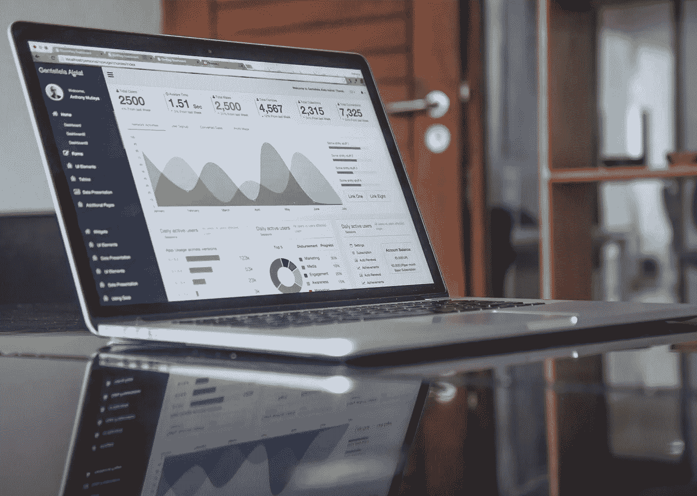

# 为什么会计师非常适合学习编程？

> 原文：<https://towardsdatascience.com/why-accountants-are-great-fit-for-programming-6033927047e6?source=collection_archive---------18----------------------->

## 编程会让你做更有意义的工作

弗兰基·查马基在 [Unsplash](https://unsplash.com?utm_source=medium&utm_medium=referral) 上拍摄的照片

我认为会计师应该学习如何编码。这么做有很多原因，快速的谷歌搜索会给你大量的结果。

> 但是为什么会计师首先非常适合编程呢？

当然，还有其他职业，但我们会计师更适合在工作中利用编程的优势。

以下是我认为我们非常适合学习编程的原因。

# 会计师处理大量的数据

照片由[马库斯·斯皮斯克](https://unsplash.com/@markusspiske?utm_source=medium&utm_medium=referral)在 [Unsplash](https://unsplash.com?utm_source=medium&utm_medium=referral) 拍摄

会计师在日常工作中会接触到数据。我们操纵、转换、计算、存储和共享数据。

多年来，Excel 一直是我们会计师工作的首选工具。但是，随着今天的数据量和速度，新的工具已经出现，以处理这些。而且大部分都需要编程知识。

学习编程允许我们使用这些新工具，并为组织提供新的见解。

# 会计师很了解电子表格

照片由[米卡·鲍梅斯特](https://unsplash.com/@mbaumi?utm_source=medium&utm_medium=referral)在 [Unsplash](https://unsplash.com?utm_source=medium&utm_medium=referral) 上拍摄

我要做一个大胆的声明。

> 所有的应用程序都只是超负荷的电子表格。

它们基本上是我们所知的传统电子表格局限性的变通方法。

我们如何使用电子表格？—我们通常将数据放入其中，对其进行操作，并存储结果。

但是它们有局限性——不够美观，数据可能被破坏，重复数据，无效数据，不太安全，等等。

因此，我们通过分离数据、逻辑和表示来解决这些限制。

*换句话说，我们会计师离创建或理解任何应用程序只有一步之遥，因为我们知道这些应用程序通常可以解决的问题。*

# 会计师处理大量重复性的工作

会计领域存在大量重复性任务，如在系统中输入发票、在实践管理软件中更新客户信息、计算税款等。

随着技术的进步，其中大部分现在都可以自动化，解放了我们的时间，让我们专注于更有价值的任务，从而继续在当今世界发挥作用。

# 会计师耐心且关注细节

[乔·塞拉斯](https://unsplash.com/@joaosilas?utm_source=medium&utm_medium=referral)在 [Unsplash](https://unsplash.com?utm_source=medium&utm_medium=referral) 上的照片

会计是一个训练有素的职业。你必须得到正确的数字，否则你有可能用错误的信息误导你的利益相关者。

耐心和对细节的关注体现在会计的每个阶段——从将交易输入会计系统、进行调整，到创建财务报告。

任何会计师都会有审计电子表格的经历，因为数字没有意义——结果发现你在公式中使用了错误的单元格引用。

编程也是如此。任何有编程经验的人都可能有这样的经历:编码了几个小时，但在运行程序时发现了一个 bug 却发现在代码的某个地方使用了`=`而不是`==`。

如果你考虑一下——调试就相当于审计你的电子表格——只是它现在适用于你的脚本。

# 会计师已经知道商业智能和数据科学——但我们不这样称呼它

[卡洛斯·穆扎](https://unsplash.com/@kmuza?utm_source=unsplash&utm_medium=referral&utm_content=creditCopyText)在 [Unsplash](https://unsplash.com/s/photos/management-accounting?utm_source=unsplash&utm_medium=referral&utm_content=creditCopyText) 上的照片

如今，有很多关于数据科学和商业智能的宣传。

但我们会计师早在这两个术语流行之前就已经知道了。我们称之为**管理会计**。

管理会计是会计的一个分支，主要是为管理层提供相关的决策信息。

这超出了传统的财务数据，可能涉及客户流失、库存交付周期等数据。—用于业务决策的任何数据。

不同之处在于，今天的技术允许以更快的速度收集和处理更大量的数据。

> 我们会计师是每个组织最初的“数据分析师”，如果我们适应并学习编程，我们将继续这样做。

# 会计师拥有商业领域的知识

编程是解决问题的工具。这是达到目的的手段。因此，要想编程好，你必须首先定义要解决的问题。

这就是领域知识的用武之地。会计师知道哪些地方需要改进，哪些地方编程可以提供帮助。

我们也知道如何衡量任何软件解决方案的好处及其对底线的最终影响。

在 [Unsplash](https://unsplash.com?utm_source=medium&utm_medium=referral) 上由 [Helloquence](https://unsplash.com/@helloquence?utm_source=medium&utm_medium=referral) 拍摄的照片

# 给我的会计师同事们

没有比现在更好的学习编程的时间了。如果你不能马上理解，不要担心——任何程序员都经历过。重要的是你开始。

> “种树的最佳时间是 20 年前。第二好的时机就是现在。”
> 
> -中国谚语

我希望这篇文章能鼓励你学习编程。它是你工具箱里的必备工具。

编程是一种解放的体验——它会释放你的时间去处理更有意义的工作。

***查看我的文章如果你是一名会计，我推荐你首先学习哪种编程语言*** [***这里***](https://medium.com/@iamkennethcpa/why-you-should-learn-powerquery-m-as-your-first-programming-language-5cb5c1ceb0ae?source=friends_link&sk=736f56305daa045a3acebb9501db46eb) ***。提示:不是 Python。***

***跟我上*** [***领英***](https://www.linkedin.com/in/kennethinfante/) ***和*** [***推特***](https://twitter.com/iamkennethcpa) ***。***