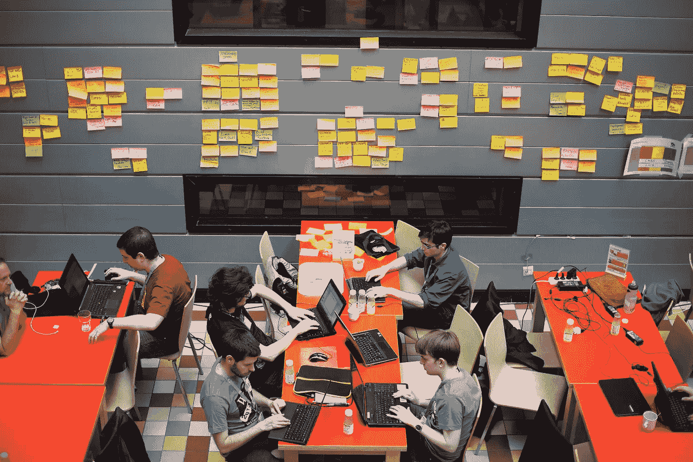

# 为什么人工智能黑客马拉松不会为现实世界的问题建立解决方案

> 原文：<https://towardsdatascience.com/why-ai-hackathons-wont-build-solutions-to-real-world-problems-292421448a95?source=collection_archive---------50----------------------->

【2013 年维基媒体黑客马拉松

## 这里是我们应该做的，而不是成功地建立人工智能解决方案。

这些天有几十个响应新冠肺炎的黑客马拉松正在组织中，1000 多人贡献他们的时间来构建解决方案。我指导过欧洲最大的一个项目，有 1000 多名工程师参与其中。组织者为此投入了数天甚至数周的工作。因此，我真诚地赞扬他们的努力和善意。然而，在没有从组织者和参与者身上带走任何东西的情况下，我质疑黑客马拉松的有效性。

# 为什么黑客马拉松不会构建现实世界的解决方案

1.  **缺乏领域专业知识:**像新冠肺炎这样的社会问题不能仅靠工程师来解决。为了构建现实世界的解决方案，我们需要让决策者、领域专家、用户参与进来——这是参与黑客马拉松的团队通常无法接触到的。
2.  **不同背景的缺乏导致模型中的偏见:**黑客马拉松是由互相认识的团队组成的，因此最终都有相同的背景。这忽略了其他观点和背景。我们已经看到，只由工程师开发的系统最终会出现偏差。在家庭暴力事件中，男性使用 Alexa 和 Google Home 将配偶拒之门外。他们把音乐开得很大声，或者把他们锁在门外。在一个大多数男性工程师构建这些产品的环境中，可能没有人会考虑这种情况。此外，有许多例子表明人工智能和数据传感器可能带有偏见、性别歧视和种族主义[1]。
3.  **开发时间太少:**三四天的时间不足以测试或构建可在生产环境中复制的解决方案。请记住，在一个项目中，你会给评委留下深刻印象，但在另一个项目中，你会构建完整的解决方案。构建一个原型很容易，但是在进入现实世界时，还有数十个其他的外部实体需要考虑。除了技术挑战之外，还有其他需要与原型集成的领域(比如营销、设计和销售)。
4.  **缺乏多样的想法**。当我在指导黑客马拉松的时候，我可以说，在 100 多个想法中，我们可以将它们全部放入 10 到 15 个想法中。其中大部分是相似的——这是因为上面提到的第二点。
5.  **竞争 vs 协作:**既然可以协作，为什么我们还需要 100 多个团队相互竞争？在我之前的一篇文章中，“[为什么 Kaggle 不具有包容性，如何构建一个更具包容性的数据科学平台](/why-kaggle-is-not-inclusive-and-how-to-improve-it-6e2013c82b63)”，我认为像 [Kaggle](http://www.kaggle.com) 这样基于竞争的模型并不是构建现实世界解决方案的最佳模型。在众多原因中，一个关键的问题是人们被激励去赢，而不是一起寻找问题的最佳解决方案。竞争模式的缺点也适用于黑客马拉松。

# 另一种选择？合作的方法

如果我们真的想以包容和有效的方式解决像 COVID-19 这样的社会挑战，我们需要确保几个机制。

1.  **利用全球协作**:当今的大多数挑战本质上都是全球性的。不是一个国家或者一群人能解决的。因此，为了解决这些挑战，我们需要一种新的模式，一种全球社区可以聚集在一起解决问题、共享数据和构建解决方案的模式。在大数据、人工智能和机器学习的世界里，数据是关键。这不是复杂的算法或更好的团队，而是拥有更好(和更多)数据的团队获胜。此外，由于在线课程，教育，特别是像人工智能和人工智能这样的新兴技术，变得容易获得。现在，对于世界上任何地方的任何人来说，从像 Udemy，Coursera 这样的网站开始学习是非常容易的。这些使得有可能获得一个由高度积极的人组成的社区，他们有共同的愿景、动机和使命，并创建全球协作。
2.  **与领域专家紧密合作。**大多数现实世界的问题不仅限于数据科学问题，而是涉及领域专家来创造价值。我们已经看到，在与领域专家合作的同时，来自不同背景的数据科学家帮助公司细化问题，并为问题提供新的视角。
3.  让面临问题的人参与进来:让来自各种背景的人参与进来，尤其是那些面临问题的人。这带来了同理心和无偏见，因为面临问题的人天生不会建造对他们不利的东西。
4.  **遵循自下而上的模式**:我坚信创新的未来是自下而上的，在这种模式下，社区将走到一起合作并解决他们的问题。我在同一个[上写的一篇文章是关于社区将如何驱动人工智能的未来，而不是政府或公司](https://medium.com/swlh/how-communities-will-drive-the-future-of-innovation-not-governments-or-corporations-76b573836ba5)。我认为社区有内在和外在的动机去解决问题，这对于构建未来的解决方案是至关重要的。当面对问题的人能够找到解决方案，这是多么好的一件事。

> “自上而下的协作不起作用，是时候建立自下而上的模式了”

总之，我认为:

> 我们应该更全面地思考，尽最大努力创造**良好的环境**，让我们超越性别、种族和文化背景，关注我们人类如何合作建设更美好的未来。黑客马拉松没有创造这样的环境，因此不太适合构建现实世界的解决方案。

数字化和人工智能在生活的各个方面和经济的各个领域都有巨大的潜力。然而，只有人与技术的结合才能真正实现进步和更高的生产率。我们必须强调社区和有目的的合适的人。这实际上是创造未来解决方案和产品的关键。

# 参考资料:

[1][https://www.logically.co.uk/blog/5-examples-of-biased-ai/](https://www.logically.co.uk/blog/5-examples-of-biased-ai/)