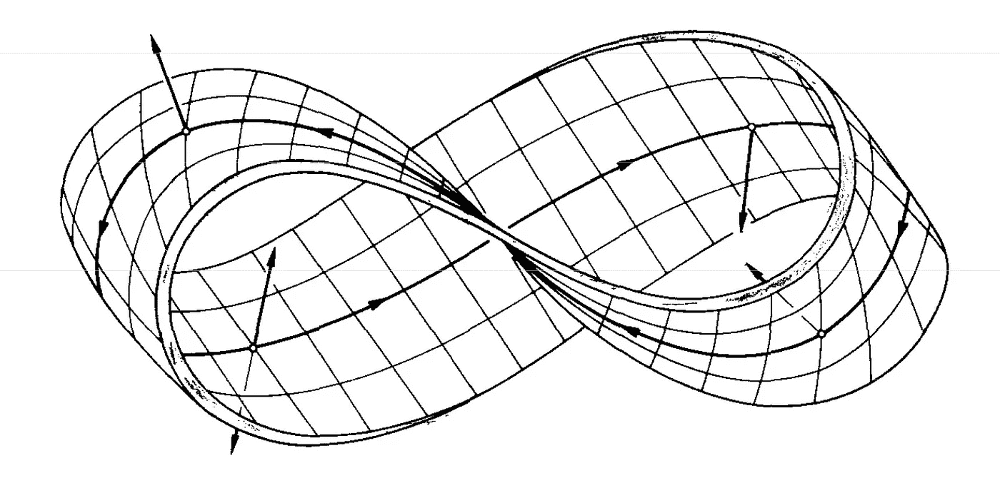

# 为什么人工智能让我们思考🤔

> 原文：<https://towardsdatascience.com/why-ai-makes-us-think-b916aec63d29?source=collection_archive---------40----------------------->

## 论算法的规则

我的意思并不是说“人工”这个形容词会引发哲学思考和关于智力本质以及人性本质的争论。那里没有消息。问问丹尼尔·丹尼特或者任何心灵哲学家就知道了。

我的意思是，人工智能让我们再次思考**计算机化系统的伦理和政治**。

最近，我注意到几个声音呼吁“规范算法”。

从表面上看，这个短语毫无意义。算法是一张**处方**:以确定的方式解决一类问题的一系列步骤。当然，从这个意义上讲，没有必要监管任何算法。

对监管的呼吁实际上旨在针对的不是传统意义上的算法，而是最近才开始被称为算法的东西，即:采用非算法组件来做出自主决策的软件系统。

## 什么？

为了理解正在发生的事情，你需要知道“算法”这个词已经分两步改变了意思:

1.  [**自动反义词**](http://www.fun-with-words.com/nym_autoantonyms.html) :“算法”这个词已经成为它自己的反义词。最初，计算机科学家用它来表示:确定性地解决问题的一组指令。在 AI 的语境中，“算法”的通俗含义已经变成了:通过实例训练的程序，高深莫测地解决一个问题。
2.  [**Pars pro toto**](https://www.lexico.com/definition/pars_pro_toto) :算法这个词不再是专门为以非算法方式完成任务的人工智能组件而保留的，现在也用于指代它所属的整个系统。

就像一个莫比乌斯带或一只鳄鱼颠倒着咬自己的尾巴一样，世界“算法”的意义已经从“确定性配方”转变为“具有非算法、数据驱动的决策组件的计算机化系统”。

## 关系

事实上，正是这种“算法”的新生概念中的“**数据**”和“**决策**”的成分，解释了为什么有理由进行伦理关注和政治辩论，并因此呼吁进行监管。

算法(在新的意义上)利用数据——我们的数据，公民消费者的数据——来做出影响我们的决定。影响我们的资产，运动，工作，自由，权利。简而言之:那会影响我们的生活。

无论何时处理个人数据，**隐私**都是一个问题。隐私与个人的自主性和能动性密切相关。

无论何时做出影响生活的决定，责任都是一个问题:我们审查和质疑决定原因的能力，以及它的合法性。

因此，虽然计算机化系统已经存在并影响我们的生活至少半个世纪了，但它们对我们数据的使用越来越多，决策能力越来越强，这确实证明有理由重新思考它们的道德和政治。

## 清楚

我对那些参与这场辩论的人的建议是，无论他们是政治家、政策制定者、公民还是(计算机)科学家，都应该思考一下他们使用的词汇。思路清晰需要语言清晰。确保你至少清楚“算法”是什么意思。

*Joost Visser 是莱顿大学软件和数据科学教授。Joost 拥有代尔夫特理工大学的计算机科学学位和莱顿大学的哲学学位。*

**NB** :有趣的是，美国国会的[算法问责法案](https://www.congress.gov/bill/116th-congress/house-bill/2231/text)只用了两次“算法”这个词。一次是在其标题中，一次是解释这仅仅是实际法案的简称，然后继续说明其真正的监管对象是“自动化决策系统”。内容明确，标题混乱的法规。

 [## Text - H.R.2231 -第 116 届国会(2019-2020):2019 年算法问责法案

### 指导美国联邦贸易委员会要求使用、存储或共享个人信息的实体进行…

www.congress.gov](https://www.congress.gov/bill/116th-congress/house-bill/2231/text)