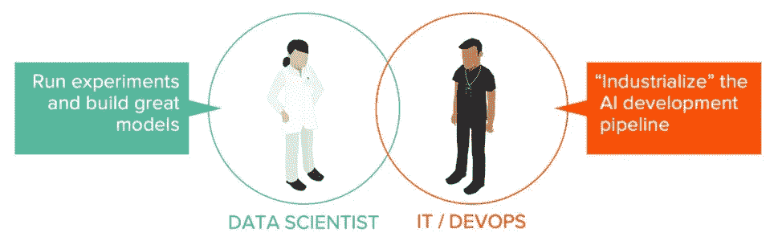

# 为什么人工智能模型很少投入生产

> 原文：<https://towardsdatascience.com/why-ai-models-rarely-make-it-to-production-2f3935f73e27?source=collection_archive---------27----------------------->

## MLOps 思维模式如何振兴你的人工智能项目

与 NVIDIA 的 Tony Paikeday 的联合帖子。

照片由[丹尼尔·奥伯格](https://unsplash.com/@artic_studios?utm_source=medium&utm_medium=referral)在 [Unsplash](https://unsplash.com?utm_source=medium&utm_medium=referral) 上拍摄

# 问题:ML 型号很难发货

在进行人工智能投资后，许多团队发现 ROI 难以捉摸。通常，伟大的实验无法成为伟大的产品。这条推文很好地总结了这种痛苦:

“模型债务”的痛苦，当团队拥有未发布的模型，而这些模型还没有投入生产。[https://twitter.com/ginablaber](https://twitter.com/ginablaber)

在开发具有高预测准确性的模型方面投入了大量人力物力之后，看到企业因未部署或未充分部署的模型而陷入“模型债务”是令人痛苦的。通常情况下，缺少的是一个将机器学习开发和 IT 最佳实践统一起来的“ [MLOps](/the-rise-of-the-term-mlops-3b14d5bd1bdb) ”策略。我们来看看为什么。

# 为什么将 ML 模型投入生产如此困难？

两个主要原因:

1.  **对于数据科学项目，团队不会像对更传统的开发项目那样实施同样的 DevOps 严格性**。与其他生产产品一样，生产 AI 管道应该具有监控、版本控制、可扩展性、&可重复性。组织应该对 IT 团队进行预算，以便为 AI 项目实现相同级别的弹性和可重复性。
2.  人工智能模型不像常规软件。代码发布后，模型性能会迅速下降。需要持续的监控和再培训，而相关的工具在很大程度上仍不成熟——这主要是因为最佳实践仍在不断发展。组织至少应该计划让数据科学家继续参与，即使是在模型已经投入生产之后。

进入生产的计划外步骤

# 如何为成功做计划

**人员:将 IT 和数据科学团队聚集在一起**

许多人工智能工作是不透明的——不是每个人都可以容易地检查或理解它。建造它的人基本上被认为是工匠。因此，组织通常认为这些项目的责任完全在于数据科学团队。这是短视的。

AI 项目需要整合到企业 IT 运营中。人工智能开发人员通常不是——也不应该是——如何构建健壮、可扩展平台的专家。

这是一条双行道:房子的两边都需要为对方的工作做计划。您的数据科学家是否构建了稳健的模型？他们有可扩展的推理设计吗？您的 IT 团队能否支持临时基础架构请求？他们向开发人员提供自助服务环境吗？也许你需要一个“人工智能工程师”的角色？

**流程:实施 AI 项目的设计→测试→生产流程**

今天，许多公司还没有为他们的人工智能项目实施生命周期管理。像任何产品一样，有一个明确的发布周期可以使过程标准化。拥有一点点过程实际上使单个项目更容易出门，因为他们不必每次都重新发明轮子。

期待这个过程的发展和成长——这是你正在使用这个系统的好迹象。但是你必须从某个地方开始。

**技术:快速发展技术的计划**

对于传统的软件开发工作流，现代 devops 工具在不断发展。但是对于人工智能开发来说，随着应用程序生态系统的快速发展填补了工具的空白，工具的发展更加迅速。规划不断发展的 MLOps 应用程序需要灵活的基础设施，并愿意不断研究最新的调度程序、版本控制工具、实验跟踪器等。

您的数据科学家和基础架构团队对管道组件有相同的理解吗？

# 优先生产而不是实验

人工智能的目标是使用模型来影响业务，而不仅仅是为了实验而实验。因此，通过将生产置于实验之上，我们并不是说不要做必要的探索工作——我们是说所有的工作，包括探索，都应该牢记最终结果。

弥合实验和生产之间差距的最快方法是弥合 AI 团队和 IT 团队之间的差距。认可模型开发之外的提升需求。致力于为数据科学项目实现与传统开发项目相同的 DevOps 严格性。

你还可以在 NVIDIA 纯存储&的[这段录音](https://watch.purestorage.com/ondemand2020/detail/videos/analytics/video/6162532212001/simplifying-ai-transformation-with-airi?autoStart=true)中听到更多关于 MLOps 的信息。