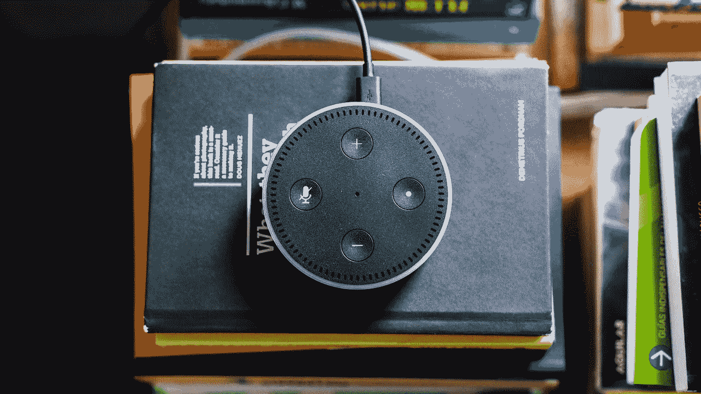

# 为什么亚马逊会有 Alexa 问题，你能从中学到什么

> 原文：<https://towardsdatascience.com/why-amazon-has-an-alexa-problem-and-what-you-can-learn-from-it-2af47bb3378c?source=collection_archive---------58----------------------->

## 事实证明，确实存在数据过多的问题

当亚马逊推出 Alexa 时，许多预言家和技术专家都对这种可能性感到眩晕。最后，这是一台经济实惠的机器，预示着真正的语音激活计算时代的到来，这是一个简单的设备，可以帮助你购物，开灯，烹饪时背诵食谱，等等。事实是，Alexa *开启了一个全新的时代。这并不是大多数乐观主义者所希望的。*

[Alexa 并没有成为一个充满数字助理、让我们生活更轻松的世界的开端，而是迎来了质疑和担忧](https://gizmodo-com.cdn.ampproject.org/c/s/gizmodo.com/the-terrible-truth-about-alexa-1834075404/amp)。它会在不该打开的时候打开。当我们不想听的时候，它会听。Alexa 的底层机器学习模型并不完美——平心而论，没有人指望它们会完美——但训练这些模型需要我们在自己家里创建的数据。这些数据需要注释。这意味着，在某个地方，某个我们不认识的人在听我们和一台我们可能不知道的电脑说话，甚至一开始就在录我们的音。

照片由[安德烈斯·乌雷纳](https://unsplash.com/@andresurena?utm_source=unsplash&utm_medium=referral&utm_content=creditCopyText)在 [Unsplash](https://unsplash.com/s/photos/amazon-alexa?utm_source=unsplash&utm_medium=referral&utm_content=creditCopyText) 上拍摄

我们上面链接的亚当·克拉克·埃斯蒂斯的文章非常详细地阐述了这些问题，但第二段列出了一些最令人不安的东西:

> *“隐私倡导者已经向美国联邦贸易委员会(FTC)提交了一份投诉，指控这些设备违反了联邦窃听法案。记者调查了永远在线的麦克风和人工智能语音助手的危险。像我这样持怀疑态度的科技博客作者认为，这些东西比人们意识到的更强大，并且侵犯了隐私。最近关于亚马逊员工如何审查某些 Alexa 命令的新闻报道表明，情况比我们想象的更糟。”*

现在，我们很多从事技术工作的人都明白，数据是无数公司和解决方案的基石。收集这些数据本质上让这些公司赚钱，并使他们的解决方案更加智能。但是，消费者对他们的每一个行为都被世界上某个地方的第三方编目、存储、分析，有时还被查看和标记的想法并不感到兴奋。

抛开隐私的争论——不是驳回，只是暂时搁置——Alexa 还强调了数据科学和机器学习收集中的一个问题:数据囤积。

只要想想 Alexa 用户创造了多少数据。今天有超过 1 亿个 Alexa 设备。[大约 6600 万人拥有智能音箱](https://techcrunch.com/2019/03/08/over-a-quarter-of-u-s-adults-now-own-a-smart-speaker-typically-an-amazon-echo/)，亚马逊的 Echo 占其中的 60%。这是一个真正惊人的语音数据量。但现在想想我们上面提到的:有时 Alexa 设备只是打开。他们正在收集更多的数据，其中一些可能是非法的，其他的通常质量很差。

现在，当然，其中一些数据将是非常有价值、有用、信息丰富的数据，亚马逊可以利用这些数据让 Alexa 变得更加复杂。没有人否认这一点(尽管还是有一些隐私问题)。[问题是并非所有数据都是平等的](https://medium.com/alectio/all-data-is-not-created-equal-ae87e21d6001)。事实上，有些数据非常糟糕。

收集所有的数据，嗯，这是我们这个行业的普遍习惯。但是你最终得到的是这样一个场景:很难理解什么是有用的数据，什么是无用或有害的数据。其目的可能是从大量数据中构建更好的模型，但现在留给你的是一个巨大的数据价值问题。这意味着您将需要一个高级和广泛的数据监管过程，以发现实际上会使您的模型更好的数据。

现在，亚马逊并没有因为资本而受到伤害，但是光靠钱并不能解决问题。但对我们其余的人来说，囤积太多数据并假设这些数据都是有用的或者我们可以在以后解决这些问题的后果更加可怕。尽可能地收集每一份数据会有污染基于这些数据构建的模型的风险。

这就是为什么我们认为数据收集和监管对于商业成功至关重要。了解哪些数据对你的项目有用，哪些数据无用是至关重要的。拥有一个数据监管策略意味着你可以从中形成一个数据收集过程。让我们解释一下:

比方说，你正在研究自动驾驶汽车模型。这是一个数据贪婪的问题，但也是一个有大量有害和冗余数据的问题，这些数据对你的模型没有帮助。我们可以帮助您找到哪些数据真正改善了您的模型现在的行为，以及随着时间的推移，您继续训练它。比方说，理解您的模型对乡村道路数据的需求意味着您可以派司机去收集这些数据，而不是浪费 I-80 上的宝贵资源。随着模型所需数据的发展，您的收集策略也可以随之发展。

换句话说，拥有一个数据收集和管理策略是一件好事。这会让你的公司像亚马逊一样成功吗？那是一项艰巨的任务。但是你不会发现自己浪费时间在坏数据上训练好模型。这当然是一件好事。