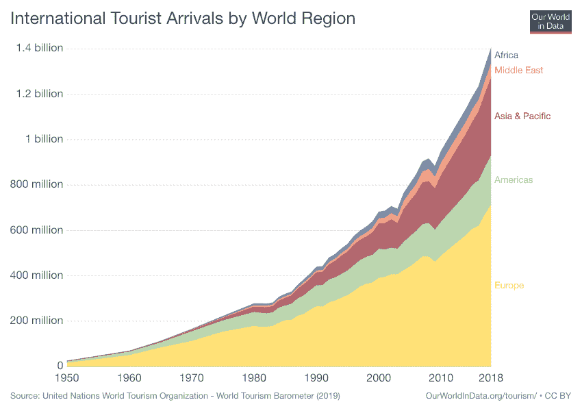
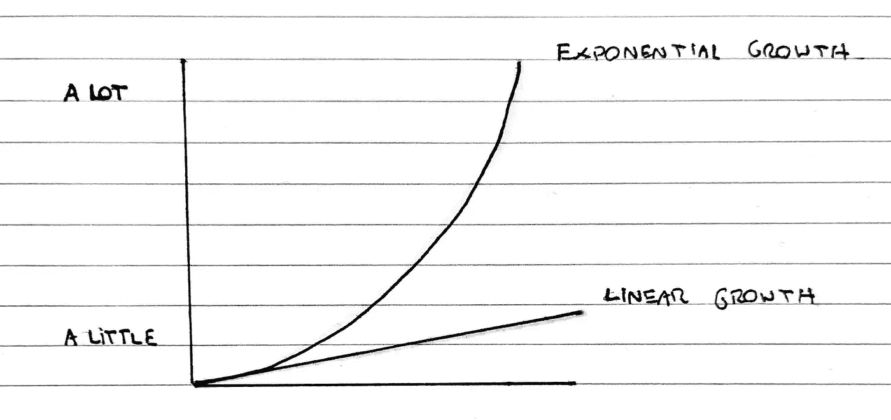
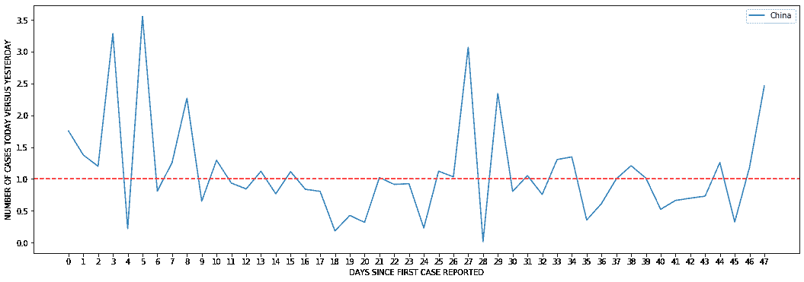
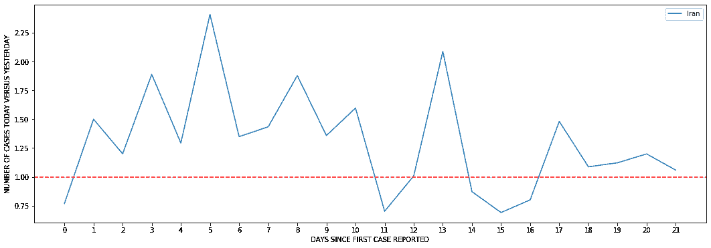
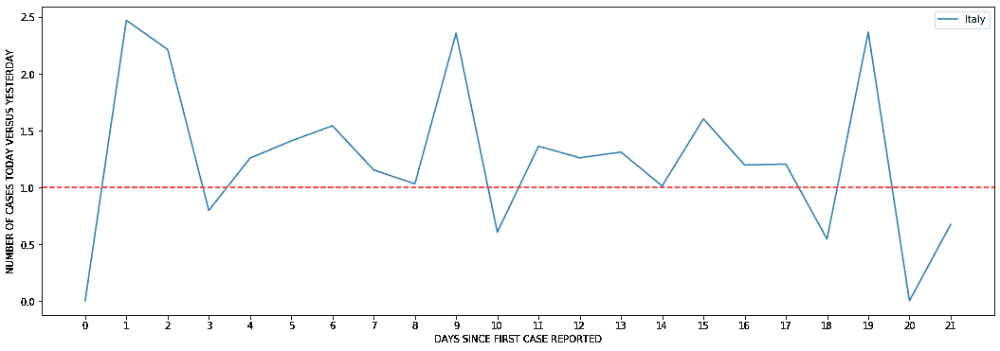
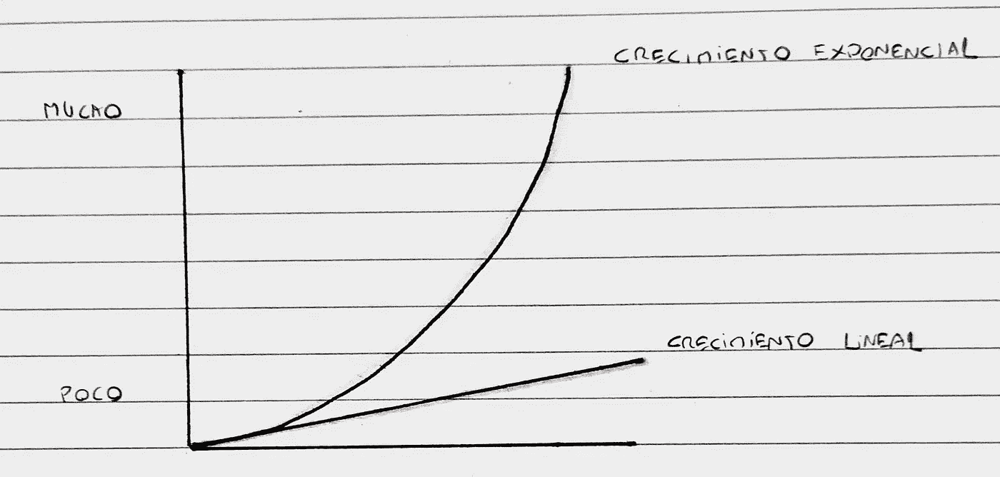
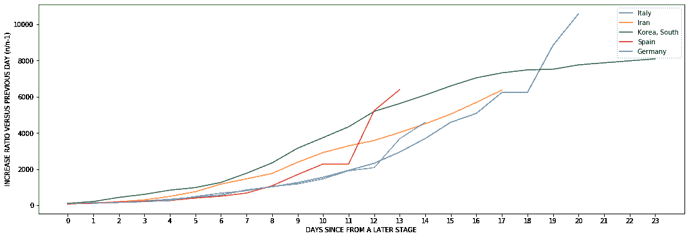
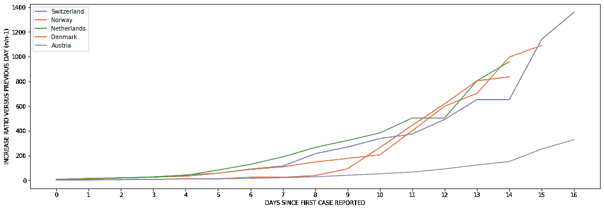
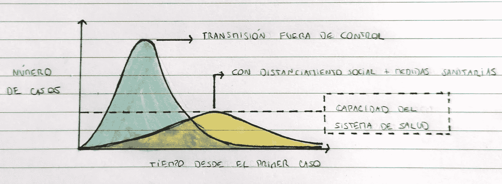
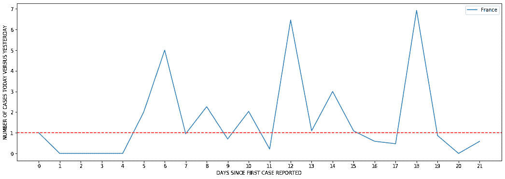

# 我们数据人为什么以及如何帮助对抗新冠肺炎

> 原文：<https://towardsdatascience.com/why-and-how-should-we-data-people-help-fight-against-covid-19-eng-esp-a45ee5e3688a?source=collection_archive---------24----------------------->

图片来自 [Tim Mossholder 在 Unsplash](https://unsplash.com/@timmossholder)——免费库存图片

## [变更数据](https://towardsdatascience.com/tagged/data-for-change)

## 英文和西班牙文

# **—英文版—**

## 为什么是我们

在过去的日子里，你有多少次发现自己在谈论冠状病毒？或者在网上查看主要报纸，寻找最新消息？在不到几个月的时间里，世界的优先事项发生了巨大变化，新冠肺炎现在是世界各国政府议程上的唯一议题。有时，我们似乎生活在科幻电影中。像西班牙和意大利这样的国家关闭边境，设置封锁，以阻止已经显示出令人眩晕和暴力的爆发。尽管我们对这种病毒还有很多不了解，但我们每天遭受的新闻轰炸并没有让任何人更容易理解。假新闻、从可疑来源上传新闻的网站、过多的模因和社交网络传播，在信息至关重要的时刻只会让情况变得更糟。

很多人都在谈论著名的指数增长和平坦化曲线的必要性。然而，很少有网站和专业人士愿意用一种每个人都能理解的方式来解释这些概念。看起来我们想要过度复杂的解释来展示某种智慧，而现在重要的事情是允许普遍获取信息。

鉴于这种情况，一方面，作为数据领域的专业人士，我们很荣幸能够理解微积分，以及什么是指数曲线，它是如何表现的，拐点是什么，以及平坦曲线的概念实际上是如何工作的。然而，从逻辑上来说，并非所有人都是如此。我们不能要求孩子、老人或其他领域的专业人士从早到晚熟悉这些想法。

另一方面，一些组织提供了用于调查和报告的开源数据。例如，约翰霍普金斯大学 CSSE 分校的数据仓库给出了每天报告的、康复的和死亡的病例数。因此，没有理由不从我们的立场出发，至少用可视化和简单的解释来促进理解和普遍获取信息。

## 我们目前所知的

就像没有人会为了去超市而购买一级方程式赛车一样，显然，我们不能要求世界上任何卫生系统的结构、供应和组织方式能够在任何给定时间面对疫情。在正常情况下，这是不划算的。然而，即使考虑到这一点，主要问题是，根据以前的汽车类比，虽然一些国家足够幸运地拥有奔驰、奥迪或法拉利，但许多国家仍然开着 1995 年的大众帕萨特，或者更糟，80 年代的菲亚特 Uno 或 Mini。

在这种情况下，我们面对的是一种不分种族、洲或社会经济阶层的病毒。这种病毒能够像我们一样轻易地跨越国界和海洋。如果你想知道新冠肺炎是如何如此迅速地失去控制的，只要看看过去 70 年里世界各地区国际游客人数的变化就知道了:

来源:[我们的数据世界](https://ourworldindata.org/) —开放存取和开源图表和主题

尽管如此，我们从未想到，在不到两个月的时间里(我在中国报告首例病例后 54 天写这篇文章)，会有 157 个国家感染了冠状病毒。然而，在我们作为人类的防御中，到目前为止我们对新冠肺炎的了解帮助我们理解了理解这种快速传播的 5 个关键概念:

1.  **潜伏期**:从感染到出现症状的时间。尽管存在潜伏期为 19 至 27 天的病例[1]，但这些似乎是异常值。根据世界卫生组织，对新冠肺炎潜伏期的大多数估计为 1-14 天[1]。一些政府和组织已经宣布中值和/或平均潜伏期约为 3-5 天，分布的第 95 百分位为 12.5 天。这意味着 95%的人会在头 13 天出现症状[1]。
2.  **序列间隔**:传输链中连续病例之间的时间【3】。新冠肺炎病毒的连续间隔估计为 5-6 天[4]。这意味着许多人在传染给其他人之前就会出现症状。事实上，尽管发病前 3-5 天的症状前传播(出现症状前的病毒传播)是流感或普通流感传播的主要驱动因素，但新冠肺炎似乎并非如此。德克萨斯大学的研究人员发现，大约 10%的患者是被携带病毒但尚未出现症状的人感染的[5]。
3.  **发病率或传染率**:疾病传播的速度。它是由它的繁殖数来表示的，繁殖数代表单个感染者将病毒传播给的平均人数[1]。根据世卫组织，对新冠肺炎来说，这个数字被理解为在 2 和 2.5 之间[4]。然而，有研究表明其范围为 2.24 至 3.58 [6]。作为参考，普通流感的生殖数是 1.3，而 SARS 是 2.0 [1]。
4.  **死亡率**:在 2020 年 1 月 29 日举行的世卫组织新闻发布会上，新型冠状病毒的病死率估计在 2%左右。然而，它指出，在不知道有多少人被感染的情况下，确定死亡率的百分比还为时过早。先前的估计是这个数字为 3% [1]。
5.  **它传播的难易程度**:疫情爆发的规模取决于病毒在人与人之间传播的速度和难易程度。冠状病毒主要通过半径约 1.8 米内的人际接触传播，人们通过咳嗽和打喷嚏传播病毒颗粒。这些颗粒可以落在附近人的嘴或鼻子里，但也有可能通过触摸病毒最近降落的表面，然后触摸人的嘴来感染病毒[7]。然而，冠状病毒如此容易传播的原因似乎在于其生物组成。事实是，这种病毒比 SARS 更容易传播，迄今为止感染人数是 SARS 患者的十倍以上[8]。

数百万携带病毒的人跨越国界，有时甚至在不知情的情况下如此迅速地感染他人，这就是病毒诞生的地方，也是我们最近可能听说过的著名的指数增长的地方。下面的 gif 是使用由 [3Blue1Brown](https://www.youtube.com/channel/UCYO_jab_esuFRV4b17AJtAw) 制作的视频的一部分完成的，它显示了人们在旅行社区之间是多么容易传染:

来源:[YouTube 上的 3Blue1Brown 视频](https://www.youtube.com/watch?v=Kas0tIxDvrg&t=345s) |作者许可。参见 3Blue1Brown [网页](https://www.3blue1brown.com/faq#license)

从被感染的人那里被感染，从其他人那里被感染，如此等等，总数是如何在几天内呈指数增长的。这意味着数量成倍增加。怎么会？鉴于攻击率或传染率大于 1，对于每个感染病毒的人，我们将看到更多的人被感染。因此，随着时间的推移，这种从被感染者那里感染到从其他人那里感染的逻辑被传播开来，这要感谢更多的人感染了这种病毒。以这样的曲线结束:

由作者绘制

如果我们看看 1 月 22 日至 3 月 6 日期间中国境外有记录的病例总数，我们可以很容易地注意到指数行为:

来源:[YouTube 上的 3Blue1Brown 视频](https://www.youtube.com/watch?v=Kas0tIxDvrg&t=345s) |作者许可。参见 3Blue1Brown [网页](https://www.3blue1brown.com/faq#license)

不幸的是，YouTube 频道 [3Blue1Brown](https://www.youtube.com/channel/UCYO_jab_esuFRV4b17AJtAw) 显示的数字并非巧合。使用前面提到的约翰·霍普金斯大学 CSSE GitHub 数据库上提供的按国家分类的数据，我们可以看到，在中国以外，到目前为止受影响最大的 10 个国家在查看与前一天相比的增长率时都遵循非常相似的行为:

作者使用约翰·霍普金斯大学 CSSE 分校的数据制作的图表

这里的主要区别是疾病爆发的实际开始时间。如果我们选取同一组国家，并从较晚的阶段开始检查它们的曲线，而不是从它们宣布第一个病例的那天开始，这些曲线实际上非常相似:

作者使用约翰·霍普金斯大学 CSSE 分校的数据制作的图表

在过去 3 周内宣布了首例病例的国家也出现了同样的情况:

作者使用约翰·霍普金斯大学 CSSE 分校的数据制作的图表

我知道这看起来不太乐观。事实是我们迟早都会感染病毒。大多数政府目前努力实现的目标是延缓这种大规模传染，以便世界各地的国家卫生系统能够应对需要援助的人数。

**在这里，伙计们是我们了解正在发生的核心问题的地方**。很多人在反对所谓的狂热和偏执时，都把注意力集中在病毒的死亡率上。然而，尽管 2——3%的死亡率已经相当高了(低于世界其他流行病和疾病，但大大高于季节性流感的 0.1%),但各国目前面临的最大风险是卫生系统的崩溃。回到汽车的类比，记住当一些国家开豪华车的时候，大量的人仍然开着 1980 年的车。或者更糟，他们甚至可能没有一辆合适的车！如果像意大利或西班牙这样的国家无法应对一场侵略性的疫情，其他国家可能会遭受更严重的后果。当医院开始耗尽呼吸器和病床时，老年人、患有其他疾病的病人以及世界上资源较少的大部分人口可能会成为最大的受害者。

这就是为什么现在的主要目标恰恰是让曲线变平的想法。最近有很多关于这方面的讨论，但是从与家人和朋友的交谈中，我注意到，不幸的是，这不是一个容易理解的概念。简而言之，政府试图做的不是永远阻止病毒的传播，而是推迟人们被感染的时间，以便他们能够治疗每个人，而不会导致卫生系统的崩溃。

由作者绘制

但是，考虑到前面提到的成倍增长，如果每个病毒携带者会感染 2 到 3 个人，我们如何才能延缓新冠肺炎病毒的传播呢？没那么简单，但是**我们需要今天的新增病例数少于昨天的新增病例数，以此类推尽可能多的天数**。为了实现这一目标，鉴于病毒仅在人与表面之间传播，隔离和卫生措施是实现最终目标的关键。

[《华盛顿邮报》发表了一篇令人惊叹的文章，名为“为什么冠状病毒这样的疫情呈指数级传播，以及如何使曲线变平”](https://www.washingtonpost.com/graphics/2020/world/corona-simulator/)通过一组动画清楚地显示了同时感染人数的差异，这些动画显示了有和没有社会距离的社区内的传染情况。但是，最终目标是使今天的新病例数与昨天的新病例数之比小于 1。我们目前进展如何？一些国家比其他国家做得更好，但我们仍有很长的路要走。例如，中国、韩国和台湾似乎正朝着正确的方向前进:

作者使用约翰·霍普金斯大学 CSSE 分校的数据制作的图表

作者使用约翰·霍普金斯大学 CSSE 分校的数据制作的图表

作者使用约翰·霍普金斯大学 CSSE 分校的数据制作的图表

而其他一些国家则像伊朗、法国或意大利一样一直在苦苦挣扎:

作者使用约翰·霍普金斯大学 CSSE 分校的数据制作的图表

作者使用约翰·霍普金斯大学 CSSE 分校的数据制作的图表

作者使用约翰·霍普金斯大学 CSSE 分校的数据制作的图表

## 作为数据专业人员，我们还能做些什么？

*   **用简单的话解释**:帮助其他人看到你可能在图表上看到的东西，以及所有关于病毒行为的精彩在线解释。
*   **提供可视化**:事实证明，通过可视化，我们都能更好地理解。此外，好的、免费的可视化可以像病毒一样传播。就像《信息是美丽的》中的[数据包](https://informationisbeautiful.net/visualizations/covid-19-coronavirus-infographic-datapack/)一样，我之前使用的视频来自 [3Blue1Brown](https://www.youtube.com/channel/UCYO_jab_esuFRV4b17AJtAw) 或者来自 [Washington Post](https://www.washingtonpost.com/graphics/2020/world/corona-simulator/) 的惊人文章。
*   组织内部的帮助:所有公司都会受到病毒的影响。理解它现在是如何影响的是减少未来影响的第一步。
*   **参与开源项目**:如果你已经是行业内的资深专业人士，考虑让自己参与任何开源项目或团队，尝试虚拟地召集有经验的人一起工作，以获得可行的见解。例如，Flixbus 的数据副总裁 Alexander Stage 正在 LinkedIn 的职位中招聘数据专业人员和研究人员。

不管是什么情况，我们的目标都是从我们每个人的立场出发做出贡献。新冠肺炎展示了人类最糟糕的和最好的一面。从人们囤积卫生纸，储备所有人甚至食物银行，到意大利人在阳台上一起唱歌。让我们为最后一组尽一份力吧！

# —西班牙语版本—

## 什么事？

他们最近几天有多少次谈到冠状病毒？或者检查主要新闻网站是否有最新的更新？在不到两个月的时间里，世界的优先事项发生了巨大变化，coid-19 成为全球数百个国家政府议程上的唯一项目。现在我们好像在看科幻电影。像西班牙和意大利这样的世界大国关闭边界，并对其人民实施封锁，以阻止一场它已经证明是迅速和暴力的爆发。虽然我们对冠状病毒的了解还很多，但轰炸我们每天收到的信息并不一定使我们大家更容易理解。虚假新闻、从可疑来源收集笔记的网站、梅梅和过多的社交媒体出版物，在信息至关重要的时候，使媒体变得混乱不堪。

著名的指数曲线和展平这种曲线的概念得到了广泛的讨论。但是，很少门户网站和专业人员关心如何以大家都能理解的方式解释这些概念。有时，我们似乎喜欢将这些解释复杂化，以显示某种程度的智慧，而现在最重要的是普遍获得信息。

作为当今世界的专业人士，我们有幸理解计算，准确理解指数曲线是什么，它的行为方式，它的转折点是什么，以及展平曲线的概念意味着什么。但是，从逻辑上讲，并非所有人都是如此。我们不能要求儿童、老年人或只是其他专业人员熟悉这些概念。

此外，一些组织还提供了开放日期，供调查和报告使用。例如，位于 GitHub 的 Johns Hopkins CSSE 的“T0”数据存储库每天提供全球每一城市报告、检索和死亡的总人数。因此，我们没有理由不从我们的专业中至少提供能够有助于民众理解的解释和看法。

## 到目前为止我们知道些什么

正如任何人都不会只有一级方程式赛车去购物一样，显然，我们不能要求世界上任何卫生系统的结构、供应和组织方式使我们能够随时应对大流行病。在正常情况下，如果基础设施和人员能够在流行病最严重的时候对其提出要求，那将是不具成本效益的。但是，即使考虑到这一点，问题仍然是，按照汽车的类比，虽然一些国家有幸拥有奔驰、奥迪甚至法拉利的最新车型，但许多国家仍在使用大众汽车，但更重要的是，大多数国家仍然经营着一辆或一辆 80 年代甚至更早的小型菲亚特。

在这方面，我们作为一个星球面临着不分种族、大陆或社会阶层的病毒。像我们一样容易跨越国界和海洋的病毒。如果我们想知道为什么 coid-19 如此迅速地离开我们的手，我们只需看看过去 70 年来旅游业的发展:

资料来源:[我们的世界在数据](https://ourworldindata.org/) —开放存取和开放源码图表及主题

由于国际人口流动的增加，我们从未想象过，在不到两个月的时间里(自从中国报告首例病例以来的 54 天前，我撰写了这个故事)，会有 157 个国家感染了 coid-19 冠状病毒。但是，在我们作为人类的防卫中，迄今对病毒了解甚少，使我们能够了解病毒的五个关键方面，以了解这种传播:

1.  **潜伏期或潜伏期**是指感染与症状发生之间的时间。虽然有 19 至 27 天[1]的情况，但这些情况似乎是例外情况。据世界卫生组织称，大多数估计数将 coid-19 的潜伏期定为 2 至 14 天[1]。一些国家政府和组织报告的平均潜伏期约为 3-5 天，而 95%的人口预计在头 13 天出现症状[1]。
2.  **序列间隔**:对应于传输链中连续事例之间的时间[3]。coid-19 的序列间隔估计为 5 至 6 天[4]。也就是说，很多人会先出现症状，然后才能传染给别人。事实上，虽然疾病头 3-5 天的无症状传播(症状前传播)是常见流感的主要传染源，但 coid-19 似乎并非如此。得克萨斯大学的研究人员估计大约。10%的患者感染了病毒，但尚未表现出症状[5]。
3.  **传染率或发作率**:是指疾病传播的速度，以感染者平均人数表示。[1]。据世界卫生组织称，就 coid-19 而言，这一数字为每名感染者 2 至 2.5 人。然而，研究表明，这一数字可能高达 3.58 [6]。以 SARS 为例，常见流感的相同数字分别为 1.3 和 2.0。
4.  **死亡率**:虽然很难根据不同的测试策略来估计各国政府的死亡率，但世界卫生组织在 2020 年 1 月 29 日的记者招待会上表示，冠状病毒的死亡率可能约为 2%。以前的数字表明，这一数字约为 3% [1]。
5.  **传染性有多容易**:爆发的规模直接取决于病毒是如何迅速和容易地以人与人之间的方式传播的。当人们打喷嚏或咳嗽时，冠状病毒主要是通过半径小于 1.8 米的接触以人与人之间的方式传播的。然而，一旦接触到这些微粒可能落在其上的表面，也可能会通过双手接触表面而感染[7]。但是，冠状病毒之所以如此容易传播，是因为它的生物组成，事实证明比 SARS 快得多，容易得多，而且感染 SARS 的人数已经超过后者的 10 倍[8]。

因此，在这几百万人跨越国界、携带病毒、有时甚至不知情、迅速传染给其他人的人群中，我们最近可能都听说过的著名指数曲线正在出现。下面的 gif 是从[【3blue 1 brown】](https://www.youtube.com/watch?v=Kas0tIxDvrg&t=345s)拍摄的视频中提取出来的，清楚地表明了在社区间传播是多么容易:

资料来源:[3 blue 1 brown video on YouTube](https://www.youtube.com/watch?v=Kas0tIxDvrg&t=345s)|作者许可。参见 3Blue1Brown [网页](https://www.3blue1brown.com/faq#license)

受感染者的感染情况，等等，是受感染者总数如何呈指数增长的。也就是说它会成倍增长。怎么做？由于感染率高于 1，每一个感染病毒的人，我们一定会看到更多的感染者。因此，随着时间的推移，受感染者传染的逻辑分布在更多的感染者身上，最终形成了这样一个曲线:

作者画的

如果我们看看 1 月 22 日至 3 月 6 日期间在中国境外登记的病例总数，我们可以很容易地看到这种行为:

资料来源:[3 blue 1 brown video on YouTube](https://www.youtube.com/watch?v=Kas0tIxDvrg&t=345s)|作者许可。参见 3Blue1Brown [网页](https://www.3blue1brown.com/faq#license)

不幸的是，YouTube 频道[【3blue 1 brown】](https://www.youtube.com/channel/UCYO_jab_esuFRV4b17AJtAw)显示的数字并不匹配。使用 johns hopkins csse 提供的 GitHub 存储库按国家分列的数据，我们可以看到，在中国以外，受影响最严重的 10 个国家都在经历着非常相似的增长曲线:

作者使用约翰霍普金斯综援资料制作的图表

图中各国之间的主要区别只有在疫情真正爆发时才会出现。如果我们把同一组国家放在一个更高级别的地方，而不是从他们宣布第一个案例的那一天起，曲线就更加相似:

作者使用约翰霍普金斯综援资料制作的图表

在过去 3 周内宣布第一批病例的国家也是如此。

作者使用约翰霍普金斯综援资料制作的图表

我知道这些图表看起来并不特别乐观。事实是，我们很可能迟早都会感染病毒。大多数国家政府目前正在努力减缓感染速度，以避免大规模感染，使保健系统崩溃，从而能够处理需要医疗援助的病例数量。

而这里是发生什么事的关键所在。很多人对我们所经历的狂热者和偏执狂争论不休，从而对病毒的死亡率产生了共鸣。然而，即使 2-3%的死亡率并不是微不足道的，但目前最大的风险是保健系统的崩溃。回到汽车的类比，让我们回顾一下，虽然一些国家拥有豪华汽车，但许多国家仍在经营一辆 80 年代的汽车。更糟的是，他们连车都没有！如果像意大利或西班牙这样的国家无法应对这种侵略性爆发，其他国家可能会遭受更严重的后果。老年人、患有其他疾病的人，甚至更严重的疾病，或者仅仅是社会上处境最不利的阶层，可能受到最严重的影响。

这就是为什么现在的目标正好是使这一增长曲线平坦化的主要原因。虽然最近很多人谈到这一点，但我在与朋友和家人交谈时注意到，不幸的是，这不是一个大家都能理解的概念。简而言之，各国政府正在努力实现的目标不是永远制止这种传染，而是推迟我们感染的时间，以便卫生系统能够继续运作而不崩溃。

作者绘制的图表

但是，如果每一个感染病毒的人又会感染 2 到 3 个人，我们怎么能阻止 coid-19 的传染呢？这并不容易，但我们需要今天的新案件数量少于昨天的新案件数量等等。《华盛顿邮报》一篇名为《T2》的优秀文章“冠状病毒等突破指数传播，以及如何宣传‘T3’”(冠状病毒等哪些爆发呈指数性传播，如何缓解)清楚地表明了同时感染人数的差异通过以下途径传播的情况:一次感染一个人的人数；一次感染一个人的人数；一次感染一个人的人数；一次感染一个人的人数；一次感染一个人的人数；一次感染一个人的人数；一次感染一个人的人数；一次感染一个人的人数；一次感染一个人的人数；一次感染一个人的人数；一次感染一个人的人数；一次感染一个人的人数；一次感染一个人的人数最终目标是，今天新病例数与昨天新病例数的比率低于 1。我们怎么到现在为止？一些国家似乎比其他国家做得更好，但我们肯定还有很长的路要走。例如，中国、南科尔拉台湾似乎正朝着正确的方向前进:

作者使用约翰霍普金斯综援资料制作的图表

作者使用约翰霍普金斯综援资料制作的图表

作者使用约翰霍普金斯综援资料制作的图表

其他国家，如伊朗、西班牙和意大利，看起来不太好:

作者使用约翰霍普金斯综援资料制作的图表

图片来源:Charts created by the author using data from Johns Hopkins CSSE

图片来源:Charts created by the author using data from Johns Hopkins CSSE

## 作为数据科学专业人士,我们还能做些什么?

*   **用简单的词语解释**:帮助其他人看到图表在说什么,以及指数曲线背后的所有喋喋不休,以及平滑它的想法。
*   **提供可视化(T3):事实证明,我们都通过可视化更好地理解。好的开源可视化甚至可以成为病毒式的,例如来自[信息是美丽的](https://informationisbeautiful.net/visualizations/covid-19-coronavirus-infographic-datapack/)的数据包,如前面提到的来自[3Blue1Brown](https://www.youtube.com/channel/UCYO_jab_esuFRV4b17AJtAw)的视频或来自[华盛顿邮报](https://www.washingtonpost.com/graphics/2020/world/corona-simulator/)的迷人文章。**
*   **在组织内部做出贡献(T11):所有组织都将受到冠状病毒的某种形式的打击。协作了解您现在如何影响是减少未来影响的第一步。**
*   **参与开放式项目**:对于行业中的高级专业人士,可以参与开源项目或加入希望将专业人士聚集在一起进行可操作见解的团体。例如,flixbus 的数据副总裁 Alexander Stage 正在招募数据专业人员和研究人员。(T15)

无论情况如何,目标是从我们每个人的立场做出贡献。COVID-19 正在展示最糟糕和最好的人类比赛。From people stockpiling toilet paper, [stocking out everyone else and even food banks](https://www.youtube.com/watch?v=PLGJi97F1Nc) , to [people in Italy singing all together from their balconies](https://www.youtube.com/watch?v=Q734VN0N7hw) 。让我们为最后一组做出贡献!

无论如何,目标是从我们的标题中做出贡献。冠状病毒正在显示出人类最糟糕和最好的一面,从[人在超市](https://www.youtube.com/watch?v=Q734VN0N7hw)购买几十卷卫生纸并耗尽其余部分,到意大利的[邻居在阳台上唱歌。让我们从我们的领域尝试添加到最后一组!](https://www.youtube.com/watch?v=Q734VN0N7hw)

来源:

[1] [https://www.worldometers.info/coronavirus/coronavirus-incubation-period/](https://www.worldometers.info/coronavirus/coronavirus-incubation-period/)

[2] [https://www.who.int/news-room/q-a-detail/q-a-coronaviruses](https://www.who.int/news-room/q-a-detail/q-a-coronaviruses)

[https://www.definitions.net/definition/serial+interval](https://www.definitions.net/definition/serial+interval)

[4] [https://www.who.int/docs/default-source/coronaviruse/situation-reports/20200306-sitrep-46-covid-19.pdf?sfvrsn=96b04adf_2](https://www.who.int/docs/default-source/coronaviruse/situation-reports/20200306-sitrep-46-covid-19.pdf?sfvrsn=96b04adf_2)

[5] [https://www.eurekalert.org/pub_releases/2020-03/uota-csq031320.php](https://www.eurekalert.org/pub_releases/2020-03/uota-csq031320.php)

[6] [https://www.sciencedirect.com/science/article/pii/S1201971220300539](https://www.sciencedirect.com/science/article/pii/S1201971220300539)

[7] [https://www.livescience.com/how-coronavirus-spreads.html](https://www.livescience.com/how-coronavirus-spreads.html)

[8] [https://www.nature.com/articles/d41586-020-00660-x](https://www.nature.com/articles/d41586-020-00660-x)