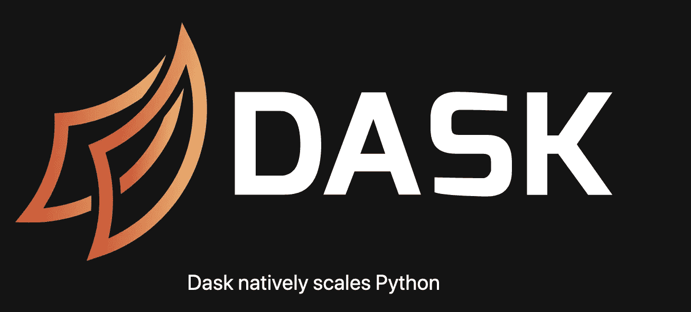
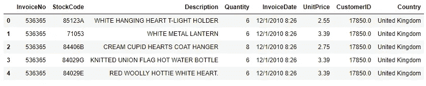
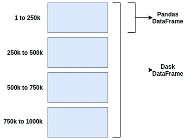
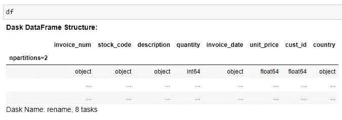

# 为什么以及如何将 Dask 与大数据结合使用

> 原文：<https://towardsdatascience.com/why-and-how-to-use-dask-with-big-data-746e34dac7c3?source=collection_archive---------19----------------------->

## 作为一名数据科学家


[来源](https://unsplash.com/photos/ia-kDal-Tqs)

如果你一直在关注我的文章，很可能你已经读过我以前的一篇关于 [**为什么以及如何使用拥有大数据的熊猫**](/why-and-how-to-use-pandas-with-large-data-9594dda2ea4c) 的文章。

作为一名数据科学家， [Pandas](https://pandas.pydata.org/) 是 Python 中用于数据清理和分析的最佳工具之一。

在清理、转换、操作和分析数据方面，它是真正的游戏规则改变者。

毫无疑问。

事实上，我甚至创建了自己的 [**工具箱，用于使用 Pandas 进行数据清理**](/the-simple-yet-practical-data-cleaning-codes-ad27c4ce0a38) 。工具箱不过是用熊猫处理杂乱数据的常用技巧的汇编。

# 我对熊猫又爱又恨

不要误解我。

熊猫很棒。很强大。


[堆栈溢出流量到关于所选 Python 包的问题](https://www.kdnuggets.com/2019/11/speed-up-pandas-4x.html)

对于数据清理和分析，它仍然是最受欢迎的数据科学工具之一。

然而，在进入数据科学领域一段时间后，我处理的数据量从 10MB、10GB、100GB 增加到 500GB，有时甚至更多。

我的电脑要么性能低，要么运行时间长，因为大于 100GB 的数据无法有效使用本地内存。

那时我意识到熊猫最初不是为大规模数据而设计的。

那时候我才意识到**大数据和大数据**的鲜明区别。

> 丹·艾瑞里教授的一个著名笑话:


[(来源)](https://www.facebook.com/dan.ariely/posts/904383595868)

“大”和“大”这两个词本身是“相对的”，以我的拙见，大数据是指小于 100GB 的数据集。

现在，Pandas 处理小数据(通常从 100MB 到 1GB)非常高效，性能很少成为问题。

但是当你有比你的本地 [RAM](https://en.wikipedia.org/wiki/Random-access_memory) (比如 100GB)大得多的数据时，你或者仍然可以使用 [Pandas 在一定程度上用一些技巧](/why-and-how-to-use-pandas-with-large-data-9594dda2ea4c)来处理数据，或者选择一个更好的工具——在这种情况下是 [**Dask**](https://dask.org/) 。

这一次，我选择了后者。

# 为什么 Dask 像魔术一样工作？🌟



[达斯克](https://dask.org/)

对我们中的一些人来说， [**Dask**](https://dask.org/) 可能是你已经熟悉的东西。

但是对于大多数有抱负的数据科学家或刚开始接触数据科学的人来说，Dask 可能听起来有点陌生。

这完全没问题。

事实上，直到我面对熊猫的真正局限，我才开始了解达斯克。

> 请记住，如果您的数据量足够低，并且可以放入 PC 的内存空间，Dask 不是必需的。

> 所以现在的问题是…
> 
> **Dask 是什么，为什么 Dask 处理大数据比熊猫好？**

## ⚡ ⚡️ ️Dask 以 Python 并行计算库而闻名

通过它的并行计算特性， [Dask](https://docs.dask.org/en/latest/why.html) 允许快速有效的扩展计算。

它提供了一种简单的方法来处理 Python 中的大数据，这比常规的 Pandas 工作流程要简单得多。

换句话说，Dask 允许我们轻松地**扩展到集群**来处理大数据，或者**缩减到单台计算机**来通过利用 CPU/GPU 的全部能力来处理大数据，所有这些都与 Python 代码完美集成。

很酷不是吗？

就性能和可伸缩性而言，可以将 Dask 视为 Pandas 的扩展。

更酷的是，你可以在 Dask dataframe 和 Pandas Dataframe 之间切换，按需进行任何数据转换和操作。

# 大数据怎么用 Dask？

好了，理论到此为止。

是时候把手弄脏了。

你可以[安装 Dask](https://docs.dask.org/en/latest/install.html) 并在你的本地 PC 上尝试使用你的 CPU/GPU。

> B 但是我们在这里谈论的是**大数据**，所以让我们做一些**不同的**。
> 
> 走吧**大**。

不要通过缩小到单台计算机来驯服“野兽”，让我们通过**扩展到集群**来发现“野兽”的全部力量，因为**是免费的**。

是的，我是认真的。

理解设置集群(例如 AWS)并将 Jupyter notebook 连接到云对于一些数据科学家来说可能是一件痛苦的事情，特别是对于云计算的初学者来说，让我们使用 [**土星云**](https://www.saturncloud.io/s/) 。

这是我最近在尝试的一个新平台。

Saturn Cloud 是一个托管的数据科学和机器学习平台，可实现 DevOps 和 ML 基础设施工程的自动化。

令我惊讶的是，它使用了 **Jupyter 和 Dask** 到 **scale Python 来处理大数据**使用了我们熟知和喜爱的库(Numpy、Pandas、Scikit-Learn 等)。).它还利用了 [**Docker**](https://www.docker.com/) **和**[**Kubernetes**](https://kubernetes.io/)，以便您的数据科学工作可重现、可共享并可投入生产。

Dask 的用户界面主要有三种类型，即数组、包和数据帧。在下面的代码片段中，我们将主要关注 **Dask Dataframe** ，因为作为一名数据科学家，这是我们最常用于数据清理和分析的。

## 1.将 CSV 文件读取到 Dask 数据帧

```
import dask.dataframe as dddf = dd.read_csv('[https://e-commerce-data.s3.amazonaws.com/E-commerce+Data+(1).csv',](https://e-commerce-data.s3.amazonaws.com/E-commerce+Data+(1).csv',) encoding = 'ISO-8859-1', blocksize=32e6)
```

Dask dataframe 在正常文件读取和数据转换方面与 Pandas dataframe 没有什么不同，这使得它对数据科学家非常有吸引力，稍后您将会看到这一点。

这里我们只是读取了存储在 [S3](https://aws.amazon.com/s3/) 中的一个 CSV 文件。因为我们只想测试 Dask 数据帧，所以文件大小很小，只有 541909 行。



读取 CSV 文件后的 Dask 数据帧

**注意:**我们也可以[在一行代码中读取多个文件](http://docs.saturncloud.io/en/articles/3760116-read-public-data-from-s3-in-saturn)到 Dask 数据帧，而不管文件大小。

当我们从 CSV 加载数据时，Dask 将创建一个数据帧，该数据帧是按行分区的，即行按索引值分组。这就是 Dask 能够按需将数据加载到内存中并超快速处理数据的方式— **它通过分区**。



[由 Dask 完成的分区](https://www.saturncloud.io/s/practical-guide-to-dask/)

在我们的例子中，我们看到 Dask 数据帧有 2 个分区(这是因为在读取 CSV 时指定了`blocksize`),有 8 个任务。

**【分区】**这里简单地指在 Dask 数据帧内分割的熊猫数据帧的数量。

我们拥有的分区越多，每次计算需要的任务就越多。



Dask 数据帧结构

## 2.使用`compute()`执行操作

现在我们已经将 CSV 文件读入 Dask dataframe。

重要的是要记住，虽然 Dask 数据帧与 Pandas 数据帧非常相似，但确实存在一些差异。

我注意到的主要区别是 Dask dataframe 中的这个`compute`方法。

```
df.UnitPrice.mean().compute()
```

大多数 Dask 用户界面是*懒惰的，这意味着**它们不会评估，直到你使用`compute`方法明确地要求一个结果**。*

*这就是我们如何通过在`mean`方法后添加`compute`方法来计算`UnitPrice`的平均值。*

## *3.检查每列缺失值的数量*

```
*df.isnull().sum().compute()*
```

*同样，如果我们想检查每一列的缺失值的数量，我们需要添加`compute`方法。*

## *4.根据条件筛选行*

```
*df[df.quantity < 10].compute()*
```

*在数据清理或探索性数据分析(EDA)过程中，我们经常需要根据某些条件过滤行，以了解数据背后的“故事”。*

*我们只需添加`compute`方法，就可以做和在熊猫身上做的完全一样的操作。*

*然后嘣！我们得到了结果！*

## *🚀使用 Python 创建 Dask 集群并大规模运行 Jupyter 的演示*

*既然我们已经大体了解了如何使用 Dask。*

*是时候看看如何[在土星云上创建 Dask 集群](http://docs.saturncloud.io/en/articles/3652101-spin-up-dask-on-saturn)并在 Jupyter 中大规模运行 Python 代码了。*

*我录制了一个简短的视频，向您展示如何在几分钟内在 Dask 集群中进行设置和运行 Python 代码。尽情享受吧！😊*

*[如何创建 Dask 集群并在土星云上运行 Jupyter 笔记本](http://bit.ly/saturn-cloud-demo)*

# *最后的想法*

**

*[来源](https://www.pexels.com/photo/man-in-white-button-up-shirt-3155367/)*

*感谢您的阅读。*

*从功能上来说，熊猫还是赢了。*

*在性能和可扩展性方面，Dask 领先于 Pandas。*

*在我看来，如果您的数据大于几 GB(相当于您的 RAM)，出于性能和可伸缩性的目的，请使用 Dask。*

*如果你想在几分钟内创建一个 Dask 集群，并大规模运行你的 Python 代码，我强烈推荐你在这里免费获得土星云的 [**社区版**](http://bit.ly/saturn-cloud-community-edition) 。*

*一如既往，如果您有任何问题或意见，请随时在下面留下您的反馈，或者您可以随时通过[我的网站](https://www.admondlee.com/)或 [LinkedIn](https://www.linkedin.com/in/admond1994/) 联系我。在那之前，下一篇文章再见！😄*

# *关于作者*

*[**Admond Lee**](https://www.linkedin.com/in/admond1994/) 目前是东南亚排名第一的商业银行 API 平台[**Staq**](https://www.trystaq.com)**—**的联合创始人/首席技术官。*

*想要获得免费的每周数据科学和创业见解吗？*

*你可以在 [LinkedIn](https://www.linkedin.com/in/admond1994/) 、 [Medium](https://medium.com/@admond1994) 、 [Twitter](https://twitter.com/admond1994) 、[脸书](https://www.facebook.com/admond1994)上和他联系。*

*[](https://www.admondlee.com/) [## 阿德蒙德·李

### 让每个人都能接触到数据科学。Admond 正在通过先进的社交分析和机器学习，利用可操作的见解帮助公司和数字营销机构实现营销投资回报。

www.admondlee.com](https://www.admondlee.com/)*