# 为什么以及何时避免将 S3 作为数据湖的数据平台

> 原文：<https://towardsdatascience.com/why-and-when-to-avoid-s3-as-a-data-platform-for-data-lakes-c802947664e4?source=collection_archive---------3----------------------->

如今，数据湖在大型企业中风靡一时。数据湖是源系统数据的原始副本和转换数据的单一存储，用于报告、可视化、高级分析和机器学习等任务。

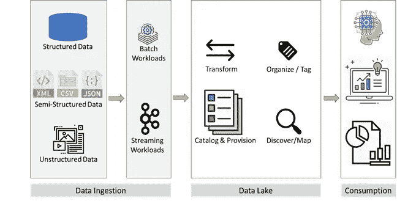

图 1:数据湖生态系统

对象存储(如 S3)正成为数据湖的首选平台，这有两个主要原因:

*   它们在云中提供廉价、耐用和几乎无限的存储
*   它们实现了计算和存储的分离，允许其中任何一个独立扩展

在这篇博文中，我将深入探讨对象存储的一些优势，这些优势是它们作为数据湖平台受欢迎的原因。我还将研究一些经常被低估的挑战，这些挑战困扰着许多数据湖用例中对象存储的使用。

# 对象存储的好处:耐用、便宜、几乎无限的存储空间

像 S3 这样的对象商店提供 11 个 9 的耐用性(99.9999999999%)和 4 个 9 的可用性(99.99%)，并且他们设法以几乎无限的规模做到这一点，价格低得令人难以置信，大约为每月 23 美元/TB。相比之下，本地数据仓库设备(DWA)在几年前非常流行。不包括企业支持，DWA 的成本为每 TB 数万美元。数百万美元的 DWA 合同通常只支持几百兆字节。

当 IT 领导考虑为他们的数据湖选择数据平台时，对象存储每月 23 美元的价格实在太诱人了。对于数据湖预计要容纳的大量数据(从数百 TB 到数 Pb ),使用最便宜的存储是有意义的。像 S3 这样的对象商店看起来(不正确，我们将在本文后面看到)比许多大型企业仍在使用的 DWA 具有千倍的价格优势。

# 对象存储的好处:存储和计算的分离

数据湖所需的存储规模使得使用像 DWA 这样将存储和计算结合在一个包中的体系结构极其昂贵。通过将存储和计算分离开来，我们可以在任何给定时间将适量的按需计算用于需要分析的数据。这大大降低了数据分析解决方案的总体成本。

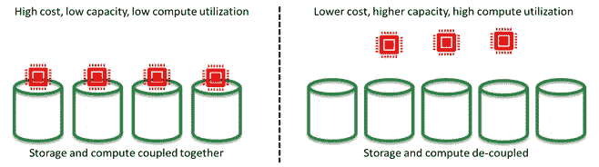

图 2:存储和计算的分离

可以理解，所有这些优势对于推动 S3 和其他对象存储作为数据湖平台的流行至关重要。但是对象存储带来了许多没有得到足够重视的挑战。对于来源于 RDBMS 且经常刷新(每天/每小时)的数据来说尤其如此，这些数据构成了企业中高质量数据的主体。

# 对象存储的缺点:不变性

所有对象存储，包括 S3、GCS 和 Azure Blob 存储，都是不可变的。这意味着文件一旦写入对象存储，就永远无法编辑。用户只能硬删除旧文件并创建新文件，或者逻辑删除旧文件并创建新文件(版本控制)。

当使用 S3 作为来自 RDBMS 的、频繁刷新的数据的数据平台时，这导致为每个表创建大量的小文件。

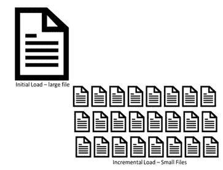

图 3:来源于 RDBMS 的数据的许多小文件的问题

随着时间的推移，插入、更新和删除操作越来越多，试图获得表的当前状态变得更加耗费时间和计算。大多数数据科学家回避这项复杂的任务，而是要求直接访问源系统，这违背了使用数据湖的初衷。

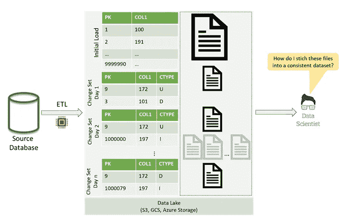

图 4:在 S3 上使用原始变更集的问题

U =更新，I =插入，D =删除

# 解决方案，第 1 部分:数据分区

一种解除最终用户合并变更的责任的解决方案是对数据进行分区，然后重写最近插入、更新和删除所针对的分区。这在一定程度上减轻了最终用户的负担。但是，性能问题仍然存在，特别是如果表有大量的列，而分析只需要这些列的一个子集。

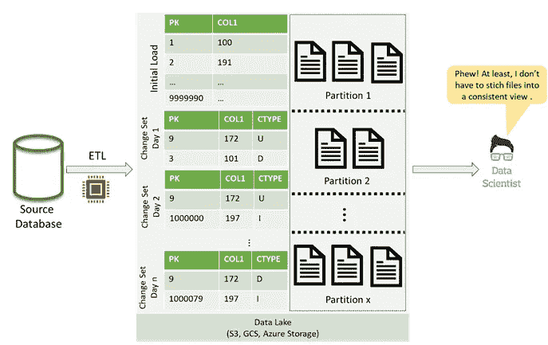

图 5:使用分区合并变更集

# 解决方案，第 2 部分:使用列存储

上述解决方案可以通过使用像 [Apache Parquet](https://parquet.apache.org/) 或 [Apache ORC](https://orc.apache.org/) 这样的列格式来改进。列格式通过更好的数据压缩和将 I/O 限制在分析所需的列上，显著提高了性能。然而，从各种语言和工具(如 Python、R 或 Tableau)中读取 Parquet 文件仍然具有挑战性。

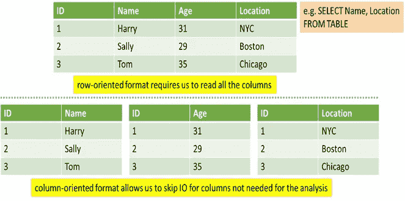

图 6:列存储有助于提高性能

# 解决方案，第 3 部分:使用 SQL 接口简化访问

为了进一步构建这个解决方案，许多工程师在原始拼花文件上添加了 SQL 接口(如 [AWS Athena](https://aws.amazon.com/athena/) 、 [Presto](https://prestodb.io/) 或 [Spark SQL](https://spark.apache.org/sql/) )。这使得最终用户的数据访问更加简化，他们现在可以跨他们喜欢的编程语言和工具(如 Python、R 或 Tableau)发出 SQL 查询。

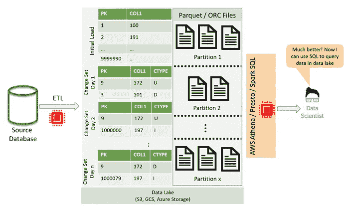

图 7: SQL 接口简化了对数据湖中数据的访问

# 解决方案，第 4 部分:使用 Delta Lake 增加功能

上述解决方案可以通过使用类似于 [Delta Lake](https://delta.io/) 的开源存储层来再次改进。Delta Lake 进一步改进了 Parquet 格式，增加了对 ACID(原子性、一致性、隔离性、持久性)事务的支持，支持流和批处理用例的 lambda 架构，以及访问上一次刷新日期/时间(时间旅行)的数据的能力。

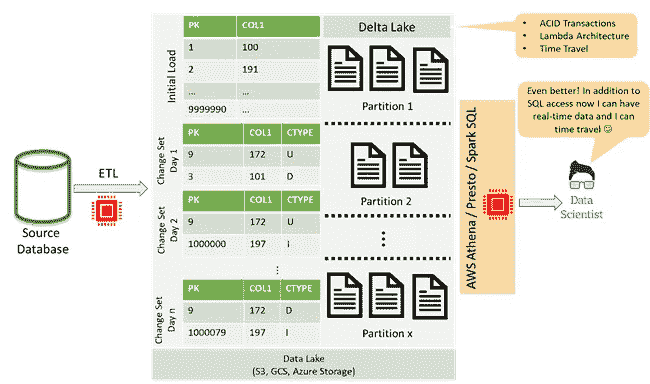

图 8: Delta Lake 增加了事务、同步批处理和流用例，以及时间旅行

# 问题解决了？

没那么快！上面的架构确实代表了一个可行的解决方案，许多企业为能够设计和实施这样的解决方案而沾沾自喜。公平地说，能够大规模实现这一目标是一项不小的成就。然而，这种架构仍然受到许多问题的困扰，有很大的改进空间。将 S3 顶部的三角洲湖作为数据湖平台的关键问题包括:

*   该架构没有解决变更集的创建问题，而创建变更集是非常具有挑战性的
*   实现和支持企业级的弹性提取、转换和加载(ETL)解决方案非常复杂
*   编写 Parquet 和 Delta 文件需要额外的计算和技术知识，以大规模配置和运行 Apache Spark 等集群计算平台
*   SQL 接口访问(通过 [AWS Athena](https://aws.amazon.com/athena/) 、 [Presto](https://prestodb.io/) 或 [Spark SQL](https://spark.apache.org/sql/) 等技术)需要额外的计算基础设施，从而增加了解决方案的整体复杂性和成本
*   该解决方案的复杂性使得支持成本高昂
*   S3 提供有限的元数据和标记功能
*   在 S3 中集成对象的表级或行级安全性，特别是对于大型复杂的企业来说，可能相当具有挑战性
*   最后但同样重要的是，这种平台的性能远远落后于它要取代的数据仓库设备的性能

> G 考虑到隐藏的计算和支持成本、安全集成和性能问题，S3 作为来自 RDBMS、频繁刷新的数据的数据平台与其每月 23 美元/TB 的承诺相去甚远。一旦我们将所有成本加起来，它就会开始攀升到每月每 TB 数千美元的范围内。对于这样的钱，有更好的选择。

云规模的托管分析数据库，如[雪花](https://www.snowflake.com/)、[谷歌 BigQuery](https://cloud.google.com/bigquery) 或 [Azure Synapse Analytics](https://azure.microsoft.com/en-us/services/synapse-analytics/) 提供了两个世界的最佳选择。通过将存储和计算分开，它们提供了可与 S3 相媲美的存储成本，以及一个托管数据平台，该平台抽象出了实施云规模分析解决方案的复杂性。它们提供了与 S3 的 Parquet/ORC/Delta Lake 相似的 TCO，具有 AWS Athena/Presto/Spark SQL 接口，同时拥有更好的性能、安全集成和模式支持。他们还降低了运营开销，同时将技术&人才风险转移给第三方供应商。

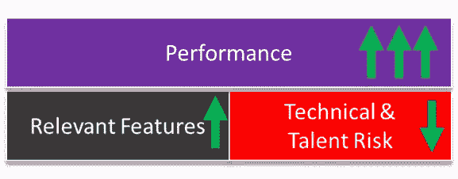

图 9:托管分析数据库相对于“对象存储+ Delta Lake + SQL 接口”解决方案的优势

# 那么来源于 RDBMS 的大部分静态数据呢？

来源于 RDBMS 的大部分静态数据(即，它在几周或几个月内不会改变)不会像来源于 RDBMS 的频繁刷新的数据那样产生太多的 ETL 计算和支持开销。然而，我的建议是，对于此类使用情形，相比基于 S3 的 Parquet/ORC/Delta Lake 存储，更倾向于云规模的托管分析数据库，因为围绕元数据管理、安全集成和性能的所有挑战和成本仍然存在。

# 半结构化数据呢？

大多数进入企业的半结构化数据(通过 XML、JSON 和 CSV 之类的格式)都有一个相当稳定的模式，可以被吸收到关系表中。大企业中的大多数此类数据经常被分析数据库摄取，如 [AWS Redshift](https://aws.amazon.com/redshift/) 或通过基于 S3 的 Parquet/ORC/Delta Lake storage 的 SQL 接口访问，如 AWS Athena、Presto 或 Spark SQL。对于这种使用情形，我的建议是考虑将存储和计算分开的托管分析数据库。

# TCO 应该是你的北极星

最后，应该根据总拥有成本(TCO)来判断解决方案，考虑它们带来的功能和解决方案中固有的风险。如果两个解决方案具有相似的 TCO，但其中一个提供了更好的功能，那么选择该解决方案应该是显而易见的。此外，应仔细考虑与内部开发的解决方案相关的技术和人才风险。一般来说，对于大型企业来说，在合理的情况下，将技术和人才风险转移给声誉良好的供应商产品更有意义。

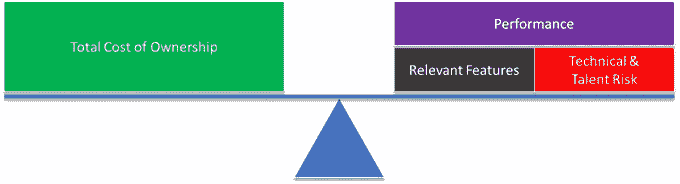

图 10:平衡 TCO、性能、特性和风险

# 那么什么时候对象存储作为数据湖平台有用呢？

对象存储(如 S3)仍然是其他用例的优秀数据平台，如半结构化和非结构化数据，这些数据不能或不应该(出于成本或效用原因)被吸收到云规模的分析数据库中。例如，将图像、音频文件、视频、电子邮件、PowerPoint 演示文稿、Word 文档或 pdf 导入托管分析数据库是没有意义的。此外，许多云计算规模的分布式数据库使用对象存储(如 S3)作为数据接收接口，有些甚至使用对象存储作为后台内部管理的存储平台。

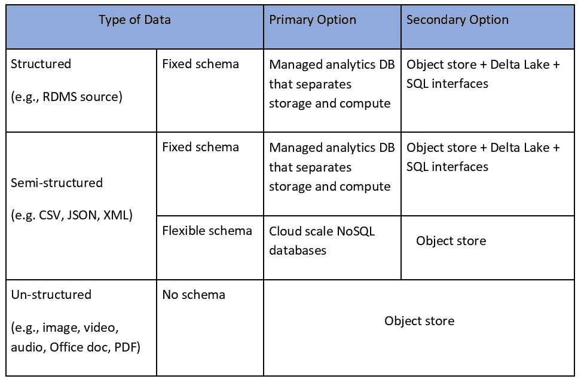

表 1:建议

在未来的帖子中，我们将深入讨论为什么将存储和计算分开的云规模托管分析数据库(如[雪花](https://www.snowflake.com/)、[谷歌 BigQuery](https://cloud.google.com/bigquery) 或 [Azure Synapse Analytics](https://azure.microsoft.com/en-us/services/synapse-analytics/) )与专门构建的 CDC 工具(如 [Qlik Replicate](https://www.qlik.com/us/products/qlik-replicate) 、 [Oracle GoldenGate](https://www.oracle.com/middleware/technologies/goldengate.html) 或 [HVR CDC](https://www.hvr-software.com/product/change-data-capture/) )更适合企业数据湖中以 RDBMS 为来源、频繁刷新的数据。

*免责声明:这是个人博文。这里表达的观点代表我自己的观点，不代表我现在或以前的雇主的观点。所有内容仅用于教育目的，不保证适用性。*