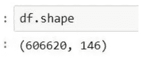
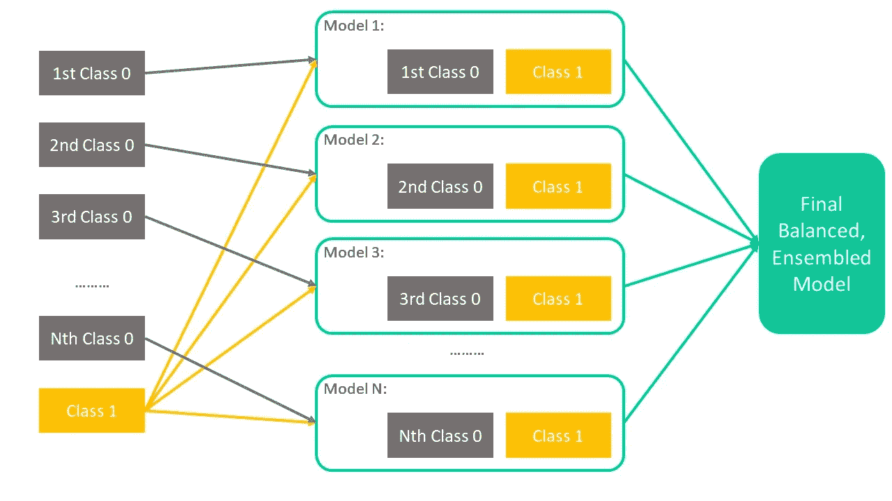

# 为什么异常检测并不总能保存不平衡的数据

> 原文：<https://towardsdatascience.com/why-anomaly-detection-wont-save-your-imbalanced-data-becb9dd71915?source=collection_archive---------19----------------------->

## 快速了解异常检测的失败并讨论替代解决方案

## 第 0 节:简介

当一个事件的两个或多个互斥结果出现的频率相差很大时，就会出现数据失衡。例如，如果你的营销活动只有 0.001%的转换率(让我们保存退出业务的另一天)，那么你的转换客户与非转换流量是 0.001%比 99.999%。这是有问题的，因为如果您需要预测哪个客户可能会转换，您的模型将会错误地将所有东西都归类为多数类。让我们来看看我的客户的数据:

正如我们所见，数据严重失衡，有 60 万条“非采纳者”记录，而只有 816 行“采纳者”记录。

***(TL；博士:*** *数据已经过清理，并应用了不同技术的特征工程/转换，如套索选择、丢弃稀疏特征、空值插补等。管理团队决定将指标作为 ROC。因为这不是我们在本文中的重点，所以让我们继续理解数据已经被清理，目标/指标已经被定义。)*

## 第 1 部分:基线常规培训

有许多解决方案，并且已经探索了许多“主流”方法来试图解决不平衡问题。我所说的“主流”是指:

*   对多数类进行欠采样，使其更接近稀有类(1:1、1:2、1:3、1:5、1:7…使用聚类分层重采样)
*   用合成数据过采样稀有类( [SMOTE](https://imbalanced-learn.readthedocs.io/en/stable/generated/imblearn.over_sampling.SMOTE.html) ， [ADASYN](https://imbalanced-learn.readthedocs.io/en/stable/generated/imblearn.over_sampling.ADASYN.html) ，[K-means SMOTE](https://imbalanced-learn.readthedocs.io/en/stable/generated/imblearn.over_sampling.KMeansSMOTE.html#imblearn.over_sampling.KMeansSMOTE)…你说吧！)
*   复制稀有类几次(在训练集上效果惊人，但严重过度)
*   训练时在模型中给予稀有类更多的权重

**将训练和测试分割成 80:20 的比例后，我能得到的最好结果是应用 1vs1 类比例的欠采样来训练**[**RandomForestClassifier()**](https://scikit-learn.org/stable/modules/generated/sklearn.ensemble.RandomForestClassifier.html)**，这意味着每类有大约 650 条记录用于训练，测试集中大约有 160 条 1 类和 120，000 条 0 类。**该模型产生了 69.9%的 ROC 得分:

## 第 2 部分:异常检测

上述模型的性能不是很好，它只对大约 1300 条记录进行训练，并用于预测 120，000 条记录。当我们将训练集中的类别 0 从 480，000 条记录减少到仅 650 条记录以匹配更小的类别时，丢失了许多信息。因此，我们对数据进行了异常检测。

根据[定义](https://en.wikipedia.org/wiki/Anomaly_detection)，异常检测将大多数类别训练为“规则事件”，并将尝试将罕见事件识别为不规则模式。对我们来说，这听起来几乎是一个完美的解决方案，让我们来看看:

首先，为了避免“[维数灾难](https://en.wikipedia.org/wiki/Curse_of_dimensionality)，我应用了[核主成分分析](https://en.wikipedia.org/wiki/Kernel_principal_component_analysis) (KPCA)来浓缩数据的特征，并使用[一类 SVM](https://scikit-learn.org/stable/modules/generated/sklearn.svm.OneClassSVM.html) 来训练我们的异常检测模型。[根据定义](https://en.wikipedia.org/wiki/Kernel_principal_component_analysis#:~:text=In%20the%20field%20of%20multivariate,a%20reproducing%20kernel%20Hilbert%20space.)，KPCA 相对于 PCA 的最大优势在于其将非线性可分数据投射到高维空间并使数据可分的能力。

AUC_ROC = 0.5

该模型在 ROC 评分上只有 50%，这只是对二元分类器的随机猜测。我尝试了用不同的超参数进行多次迭代，例如，你可以调整“nu”参数成为真正的异常比率，在我们的例子中，它是 0.1%。但是没有什么能让 ROC 分数提高几个百分点，但是为什么…？

让我们通过在 3D 图上用前 3 个组件可视化核心主要组件来看一看:

由作者创建

黄点是转换客户(稀有类)，蓝点是非转换流量(多数类)，黄点与蓝点完美地融合在一起，没有区别，现在我们很清楚**“稀有”并不总是意味着“异常”，它可能只是意味着数据量较小，**因此，**SVM 不可能在类之间绘制超平面。**

**根据 Heiko Hoffmann 博士的说法，KPCA 和一流的 SVM 通常会产生非常有竞争力的表现。这不适用于我们的情况，因为上面的 3D 图显示了数据的不可分辨性。如果数据可以转换到一个线性可分的空间，结果应该是这样的:**

****

**左:原创；上:PCA 下:KPCA；来源:https://rpubs.com/sandipan/197468**

**为了证明我的结果，我还尝试了另外两种异常检测技术:[隔离森林](https://en.wikipedia.org/wiki/Isolation_forest)和[本地异常因素](https://en.wikipedia.org/wiki/Local_outlier_factor)。毫不奇怪，它们不起作用。虽然我对异常检测没有很好地工作感到有点失望，但我并没有就此止步——必须有更好的方法来处理不平衡的数据和信息丢失。**

## ****第三部分:平衡装袋分级机****

**我们在第 1 节中了解到，大多数数据点在训练中没有使用，在没有任何合成数据的情况下，0 类和 1 类的 1:1 比率效果最佳。这迫使我们仅使用来自每个类别的 650 个数据点来进行训练，并且由于仅从类别 0 中提取了 650/420，000 ≈ 0.155%的数据点，这导致了巨大的信息损失。**

****我们可以通过集合多个平衡模型**来解决这个问题，并且每个单独的模型取多数类的不同子样本。它的工作方式与随机森林非常相似，不同之处在于 Bagging 分类器中的每个单独模型都从多数类中选取不同的样本，因此它会根据尽可能多的数据点进行训练，以提供更好的“覆盖范围”。该算法可以用下图来解释:**

****

**由作者创建**

**让我们来写代码(你可以在我的 [Github](https://github.com/RichLovesDS/MyWork) 上找到完整的项目代码):**

********

**平衡装袋模型 ROC 比随机森林覆盖面积大，精度不变，ROC 得分从 69.9%上升了 **3.5%** 到 **73.4%** ，回忆从 76.1%上升了 **8.6%** 到**84.7%**太神奇了！😀**

## **第 4 节:结论和进一步措施**

**总结一下，到目前为止，我们已经讨论了异常检测、KPCA 可视化以及平衡打包。我希望这篇文章能帮助你对以下主题形成一些好的想法:**

*   **异常检测在概念上如何工作**
*   **为什么有时异常检测不起作用，以及如何用清晰的可视化表示来检查问题**
*   **异常检测不起作用时处理不平衡数据的强大替代技术**

**如果您的项目有足够的时间，还有一些其他重要的主题值得探索，也有一些限制值得注意:**

*   **当当前数据没有产生最佳结果时，产生更好结果的最佳方式总是引入质量更好的额外数据。一个好的模型可以让你提高 3%的准确率，但是一个质量更好、设计更好的数据集可以让你提高 30%——“垃圾进垃圾出”！**
*   **为您的套装模型调整超参数**
*   **[均衡增压](https://imbalanced-learn.readthedocs.io/en/stable/generated/imblearn.ensemble.RUSBoostClassifier.html#imblearn.ensemble.RUSBoostClassifier)、[叠加、混合](https://www.analyticsvidhya.com/blog/2018/06/comprehensive-guide-for-ensemble-models/#:~:text=Blending%20follows%20the%20same%20approach,run%20on%20the%20test%20set.)等。**
*   **主成分最优个数的网格搜索**
*   **在线使用模型时，考虑时间成本以获得更好的可伸缩性**

**祝你黑客愉快！！💪🏻**

**[1] H. Hoffman，[核主成分分析用于新颖性检测](http://heikohoffmann.de/documents/hoffmann_kpca_preprint.pdf) (2006)，HeikoHoffmann**