# 为什么反粒子必须存在于自然界

> 原文：<https://towardsdatascience.com/why-antiparticles-must-exist-in-nature-e9b67ac8983f?source=collection_archive---------35----------------------->

图片由来自 [Pixabay](https://pixabay.com/fr/?utm_source=link-attribution&utm_medium=referral&utm_campaign=image&utm_content=1222516) 的 [Gerd Altmann](https://pixabay.com/fr/users/geralt-9301/?utm_source=link-attribution&utm_medium=referral&utm_campaign=image&utm_content=1222516) 提供。

## 为什么量子力学和相对论的结合使得反粒子的存在不可避免

在下文中，我将论证(遵循[费曼](https://books.google.com.br/books?id=QKrU9Ir0cSsC&pg=PA1&dq=Feynman+reason+antiparticles&hl=en&sa=X&ved=0ahUKEwjhrtS-1OLoAhXMHrkGHVJkDw8Q6AEIKDAA#v=onepage&q=Feynman%20reason%20antiparticles&f=false))反粒子在自然界存在需要两个条件:第一是粒子的[能量永远是正的](https://www.sns.ias.edu/ckfinder/userfiles/files/%5B32%5DCMP_80_1981.pdf)，第二是自然界遵守相对论原理。

# 时空图的鸟瞰图

为了全面掌握本文的结论，需要对[时空图](https://en.wikipedia.org/wiki/Minkowski_diagram#Spacetime_diagrams)(或[闵可夫斯基图](https://en.wikipedia.org/wiki/Minkowski_diagram) ) 的几何性质进行解释。时空图是时空中粒子运动的图形表示。

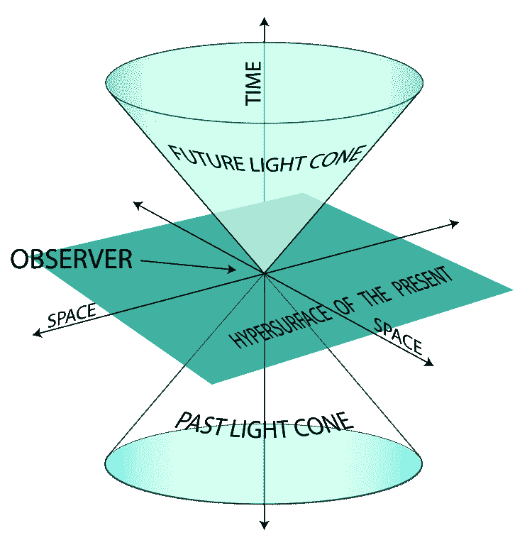

图 1:二维光锥([来源](https://en.wikipedia.org/wiki/Light_cone))。

为了更好地理解时空图中[间隔的可能类型，最好只使用两个维度，一个时间维度(纵轴)和一个空间维度(横轴)，如图 2 所示。观察者在图上的轨迹被称为](https://en.wikipedia.org/wiki/Spacetime#Spacetime_interval)[世界线](https://en.wikipedia.org/wiki/World_line)。

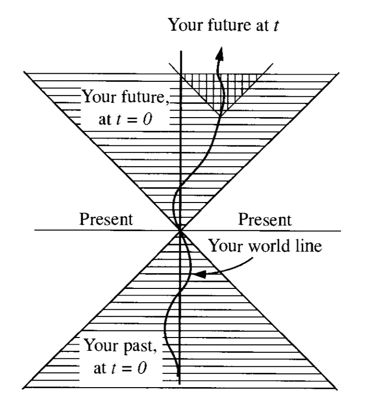

图 2:2D·闵可夫斯基图是一种用一个空间维度和一个时间维度描述宇宙中发生的事件的图表([来源](https://books.google.com.br/books?id=Kh4xDwAAQBAJ&dq=griffiths+electrodynamics&hl=en&sa=X&ved=0ahUKEwjEqMHHnuToAhVhDrkGHXpsBCkQ6AEIKDAA))。

在闵可夫斯基图中，速度是曲线斜率的倒数。一个光子以光速 *v* = *c* 运动，一条 45 度线描述它(为了方便我们选择 c=1)。一个观察者以介于零(一条垂直线代表一个静止的粒子)和光速之间的恒定中间速度移动，沿着一条具有中间斜率的线移动。其他类型的世界线的斜率不能小于 1，这将它们限制在图 2 中由两条 45 度线(形成一个楔形)限定的区域内。观察者不能进入楔形区之外的区域。如果在这个外部区域有两个相互影响的事件，它们之间的信息会比光更快，因果关系会被破坏，因为事件的顺序会根据参考系而改变。这将在后面更详细地讨论。

# 什么是反粒子？

自然界中的每一种粒子都有其关联的[反粒子](https://en.wikipedia.org/wiki/Antiparticle) **。**反粒子与其关联粒子质量相同，但电荷相反。最著名的例子就是带正电的[正电子](https://en.wikipedia.org/wiki/Positron)(或反电子)。正电子是带负电的电子的反粒子。大多数标准量子场论书籍都以同样的方式定义反粒子。在这里我将遵循[兰卡斯特和布伦德尔的](https://books.google.com.br/books?id=Y-0kAwAAQBAJ&printsec=frontcover&dq=lancaster+blundell+quantum+field+theory&hl=en&sa=X&ved=0ahUKEwiywvGauuToAhVhLLkGHTADCXwQ6AEIKDAA#v=onepage&q=lancaster%20blundell%20quantum%20field%20theory&f=false)方法，这相当令人耳目一新。

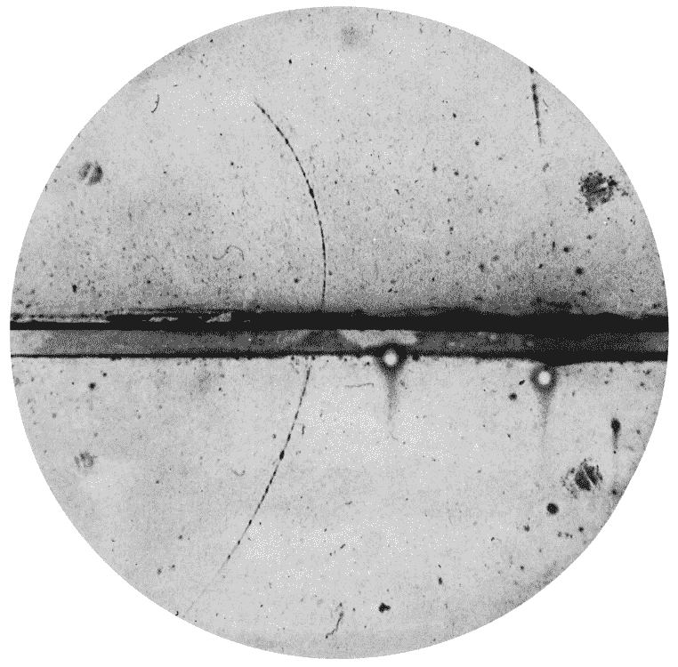

图 3:观测到的第一个正电子(向上的曲线)。正电子进入左下方的小室，被铅平面(粗水平线)减速，被外加磁场弯曲，然后向左上方弯曲。([来源](https://en.wikipedia.org/wiki/Positron))。

## 费曼-斯图克伯格:粒子在时间中向后运动

在 20 世纪 40 年代，[理查德·费曼](https://en.wikipedia.org/wiki/Richard_Feynman)和[恩斯特·斯塔克尔伯格](https://en.wikipedia.org/wiki/Ernst_Stueckelberg)(独立地)引入了将具有负能量的状态视为时光倒流的粒子的想法。我们现在称这些状态为反粒子。例如，在电磁场中带电粒子的运动方程(EOM)中

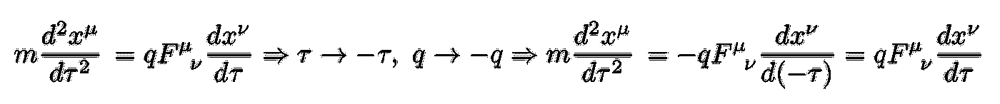

等式 1:如果在电磁场中带电粒子的 EOM 中，改变时间和电荷的符号，等式保持不变。

一个人改变了时间的符号，他马上就能看到，这与电荷反转具有相同的效果。这意味着一个在时间中向后运动的粒子看起来很像一个带着相反电荷在时间中向前运动的反粒子。

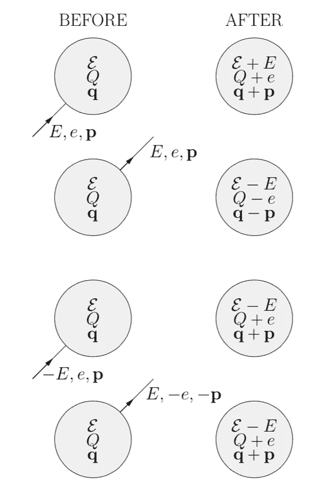

图 4:正文中描述的等价性([来源](https://books.google.com.br/books?id=Y-0kAwAAQBAJ&printsec=frontcover&dq=lancaster+blundell+quantum+field+theory&hl=en&sa=X&ved=0ahUKEwiywvGauuToAhVhLLkGHTADCXwQ6AEIKDAA#v=onepage&q=lancaster%20blundell%20quantum%20field%20theory&f=false))。

让我简单提一下所谓的 [CPT 定理](https://en.wikipedia.org/wiki/CPT_symmetry#Derivation_of_the_CPT_theorem)，一个所有物理现象都遵守的基本对称性。CPT 分别代表电荷 C、宇称 P、时间反转 t，根据这个定理，在电荷共轭、宇称变换、时间反转下，物理定律不变。在我们目前的情况下，我们可以忽略 P，专注于 CT。解释反粒子的另一种方式是说它是 CT 对称的。

# 量子力学中的微扰理论

让我们考虑一个处于某种初始状态的粒子 *ψᵢ* 。在量子力学中，跃迁振幅和粒子跃迁的概率

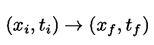

方程式 2:从空间和时间的起点到终点的转变。

分别由下式给出:

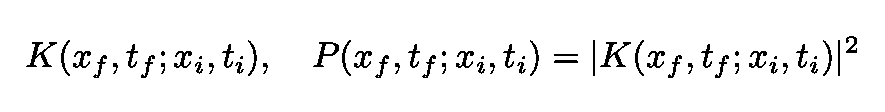

等式 3:等式 3 中的概率幅度和相应的转移概率。2.

其中 *K* 被称为[传播器](https://en.wikipedia.org/wiki/Propagator)。对应于传播子的[格林函数](https://en.wikipedia.org/wiki/Propagator#Non-relativistic_propagators)为:

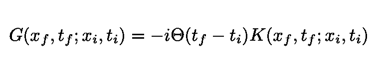

方程 4:对应于方程中传播子的格林函数。3.θ函数将因果关系嵌入格林函数。

请注意，因果关系是通过θ函数内置到格林函数中的，如果θ函数的自变量为负(如果最终时间大于初始时间)，则θ函数为零。

如果系统是[时间平移不变的](https://en.wikipedia.org/wiki/Time_translation_symmetry)，传播器仅依赖于时间差*t*—*t*’。自由格林函数 *G* ₀由下式给出:

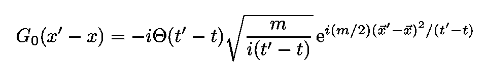

等式 5:位置空间中的自由格林函数 G₀。

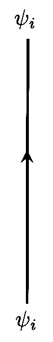

图 5:粒子从 *ψᵢ到*ψᵢ，没有任何相互作用。

上图描述了以下返回转换:

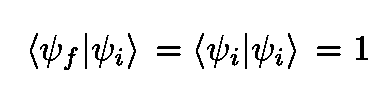

等式 6:一个非相互作用的粒子进行跃迁的跃迁振幅 *ψᵢ→ ψᵢ是 1(什么也没发生)。*

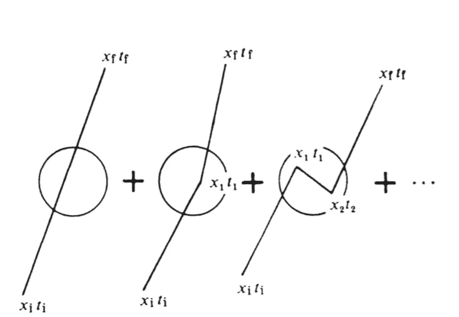

图 6:扰动序列([来源](https://books.google.com.br/books?id=nnuW_kVJ500C&printsec=frontcover&dq=ryder+qft&hl=en&sa=X&ved=0ahUKEwi6nfCnnevoAhW0H7kGHcQICb4Q6AEIKDAA#v=onepage&q=ryder%20qft&f=false))。

一个粒子对另一个粒子的散射，用一个势 *V* ( ***x*** *，t* )的相互作用来描述。在存在相互作用的情况下，跃迁振幅或格林函数不能精确计算。然后使用扰动展开(对小 a 电位 *V* 有效):

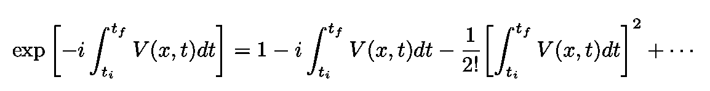

方程 7:微扰展开式，对 V 小有效。

现在，函数格林函数 G₀可以表示为[动量空间](https://en.wikipedia.org/wiki/Position_and_momentum_space)中的积分:

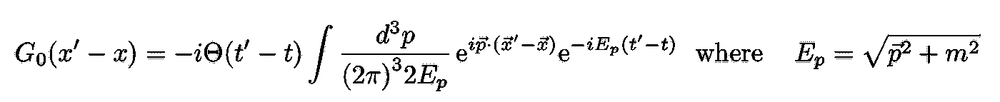

等式 8:自由格林函数 G₀表示为动量空间中的积分。

## 两个相互作用

现在假设粒子与电势*v*(***x****，t* )在点 *x* ₁和 *x* ₂.相互作用两次为了简单起见，让我们用 *x.* 来表示坐标对( ***x*** ， *t* )，以找到初始状态 *ψᵢ* 返回到 *ψᵢ* 的幅度。在两次相互作用之后，让我们遵循[费曼](https://books.google.com.br/books?id=QKrU9Ir0cSsC&pg=PA1&dq=Feynman+reason+antiparticles&hl=en&sa=X&ved=0ahUKEwjhrtS-1OLoAhXMHrkGHVJkDw8Q6AEIKDAA#v=onepage&q=Feynman%20reason%20antiparticles&f=false)并写出粒子遵循的三个步骤，即:

*   首先，处于初始状态的粒子 *ψᵢ* 在 *x* ₁与 *V* 相互作用，进入中间状态 *m* ，能量 *E* ( *m* )。
*   然后粒子从***x***₁→**x**₂自由演化为时间(t₂ - *t* ₁).与此步骤相关的自由格林函数由等式给出。5 或 Eq。8.在该步骤中，所有可能的中间(或虚拟)状态 *m* 被求和。
*   在 *x* ₂与 *V* 的第二次相互作用将状态转换回初始状态 *ψᵢ.*

我们获得:

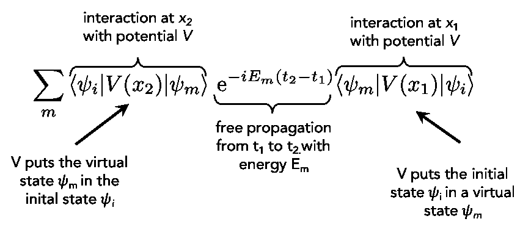

等式 9:从 *ψᵢ → ψᵢ* 返回的振幅在势中是二次的。中间状态已经结束。

情商。9 可以写成将中间态作为平面波(注意省略了一些常数):

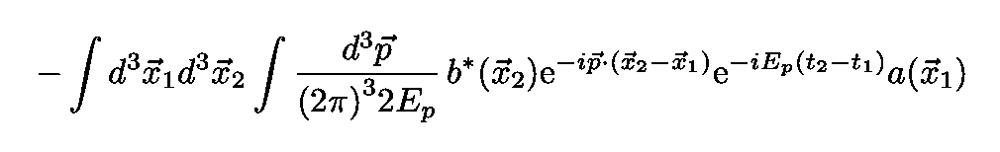

等式 10:等式。9 使用平面波作为中间状态。

因素 *a* 和 *b* 读作:

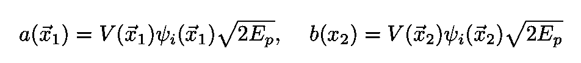

等式 11:等式中使用的系数 a 和 b。10.

其中能量由等式给出。8.因此中间状态是动量 ***p*** 和能量 *E* ( *p* )的粒子(参见[费曼](https://books.google.com.br/books?id=QKrU9Ir0cSsC&pg=PA1&dq=Feynman+reason+antiparticles&hl=en&sa=X&ved=0ahUKEwjhrtS-1OLoAhXMHrkGHVJkDw8Q6AEIKDAA#v=onepage&q=Feynman%20reason%20antiparticles&f=false))。下图说明了这一过程:

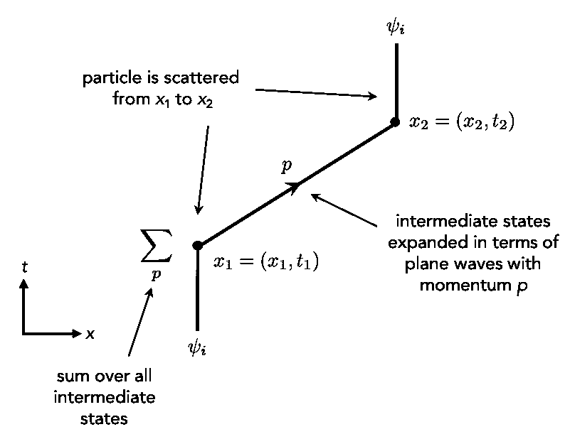

图 7:二次贡献跃迁振幅 *ψᵢ → ψᵢ(基于* [*来源*](https://books.google.com.br/books?id=QKrU9Ir0cSsC&pg=PA1&dq=Feynman+reason+antiparticles&hl=en&sa=X&ved=0ahUKEwjhrtS-1OLoAhXMHrkGHVJkDw8Q6AEIKDAA#v=onepage&q=Feynman%20reason%20antiparticles&f=false) *)。*

由于我们对粒子返回到其初始状态的概率感兴趣(在电势 *V* 中达到二阶),我们对等式给出的直接跃迁(没有任何 *V* s)的振幅求和。其中一个对应于等式给出的 *V* 散射。10，并将结果平方。概率(直到 *V* )变为:

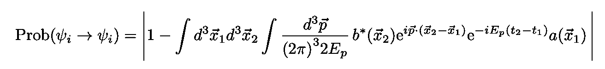

等式 12:回归概率展开到 v 中的二次项。

## 傅立叶变换的一个小插曲

一个函数***f*(*τ*)的傅立叶变换等于它分解成成分频率 *ω* (注意傅立叶变换不仅限于变量 *t* 和ω)。傅立叶变换输出一个复函数 *ω* 。它的模表示原函数 *f* ( *τ* )中各频率的量。*逆*傅立叶变换从其频域表示合成原函数 *f* ( *τ* )(参见[维基百科](https://en.wikipedia.org/wiki/Fourier_transform))。数学上，傅立叶变换及其逆变换由下式给出:**

**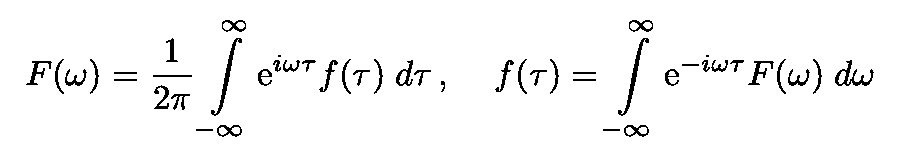**

**等式 13:时频傅立叶变换及其逆的定义。**

**下图说明了从时间到频率的傅立叶变换。**

**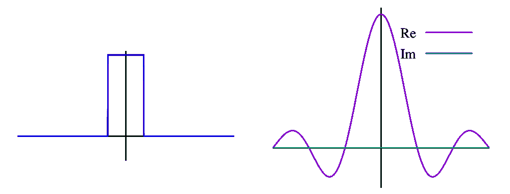**

**图 8:单位脉冲函数(t 的一个函数)的傅立叶变换及其傅立叶变换( [*源*](https://en.wikipedia.org/wiki/Fourier_transform) *)。***

# **反粒子的必然性**

**为了证明反粒子的必然性，我们假设所有的能量都是正的(见[费曼](https://books.google.com.br/books?id=QKrU9Ir0cSsC&pg=PA1&dq=Feynman+reason+antiparticles&hl=en&sa=X&ved=0ahUKEwjhrtS-1OLoAhXMHrkGHVJkDw8Q6AEIKDAA#v=onepage&q=Feynman%20reason%20antiparticles&f=false))。然后，我们将动量积分转换成方程式。12 由以下给出:**

****

**情商。14:方程 12 中的动量积分**

**对能量进行积分 *ω=E* ( *p* )并定义一个函数 *F* ( *ω* )使得 *F* ( *ω* )=0 对于 *ω < m.* 注意，**T25x**₁， **x****

**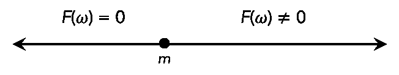**

**图 9:函数 F( *ω)。***

**情商。14 变成了:**

**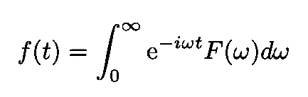**

**等式 15:一个仅包含正频率的傅里叶分解函数。**

**跟随[费曼](https://books.google.com.br/books?id=QKrU9Ir0cSsC&pg=PA1&dq=Feynman+reason+antiparticles&hl=en&sa=X&ved=0ahUKEwjhrtS-1OLoAhXMHrkGHVJkDw8Q6AEIKDAA#v=onepage&q=Feynman%20reason%20antiparticles&f=false)，考虑以下定理。函数 *f* ( *t* )只能分解为正频率(如等式。15)，根据这个定理， *f* ( *t* )对于任何**有限的**时间范围*t = t*₂-*t*₁*不能为零，除非它对于**所有**次都相同地消失。***

***现在让我们把这个定理应用于我们目前的情况。首先，固定空间坐标 ***x*** ₁和 ***x*** ₂并考虑 *ω* 的依赖型动量积分。***

***但是对于一个固定的 ***x*** 的₁来说，动量积分 Eq。当第二坐标 ***x*** ₂位于 ***x*** ₁.的光锥之外时，14 不能等于零我们的结论是。14 必须包括含有类空间隔的非零振幅(运动速度超过光速的粒子)。***

***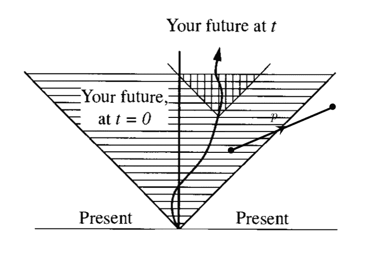***

***图 10:具有类空间隔的光锥。***

***但是正如我们在引言中解释的，类空间隔具有依赖于帧的事件顺序。因此，在另一个参考系中，一些中间粒子被视为“在时间中“传播**”的粒子(参见图 11)。现在，为了结束讨论，让我们给粒子加上一个**电** **电荷**。如上所述，根据[费曼-斯图克伯格的解释](https://en.wikipedia.org/wiki/Antiparticle#Feynman%E2%80%93Stueckelberg_interpretation)，这些在时间上向后**移动**的中间(或虚)粒子相当于在时间上向前**移动**的反粒子！*****

***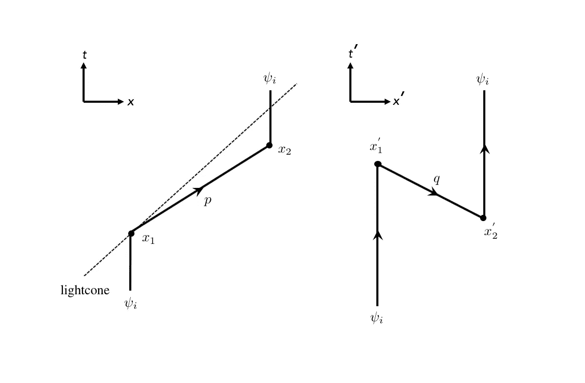***

***图 11:光锥内外运动的必然性。***

***为了使论点更清楚，让我们详细研究图 11。假设我们换到一个新的(带撇的)参考系中，其中₂让我们看看会发生什么。在新的参考系中，直到 *t* = *t* ₂只有一个运动粒子 *ψᵢ* 。然而，在 *t* ₂，电势 *V* 产生了两个粒子，其中一个似乎在时光倒流。然后在 *t* ₁，原始粒子和向后运动的粒子相遇并消失。换句话说，两个粒子在新的参考系中相互湮灭。***

***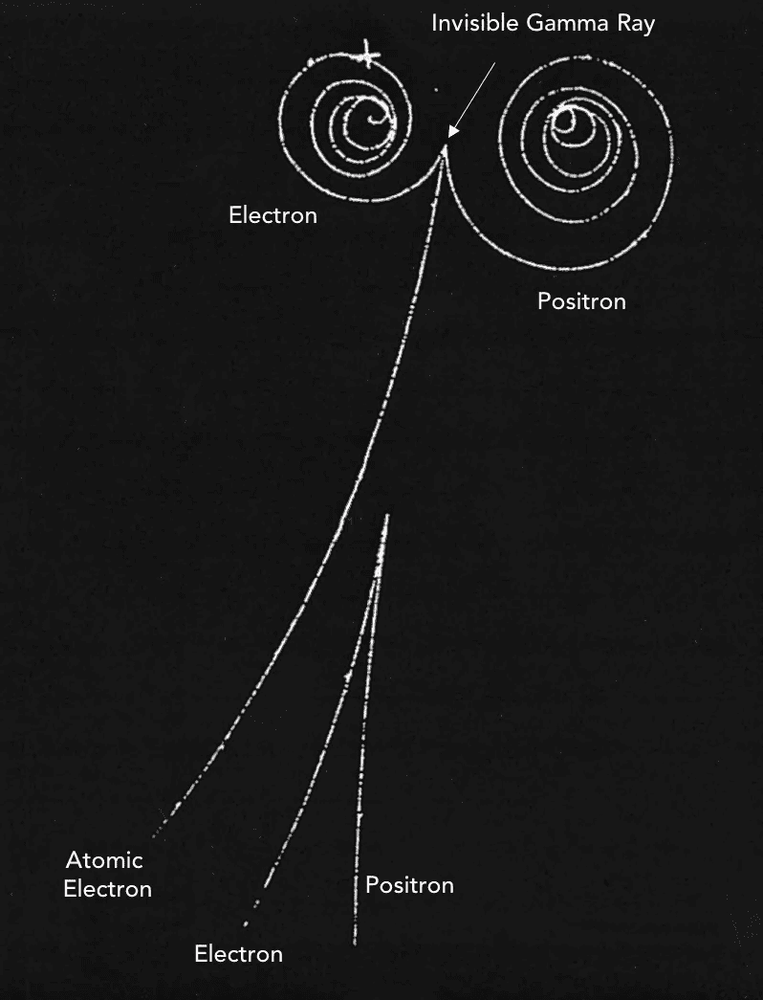***

***图 12:显示两个配对生产事件的气泡室图像。在顶部，看不见的伽马射线产生了 e⁻ e⁺对(由磁场引起的螺旋轨迹)。第二个 e⁻e⁺对，在底部，使用伽马射线的所有能量([源](https://ase.tufts.edu/cosmos/view_picture.asp?id=1357))。***

***因此我们得出结论，这两个条件(能量正性和相对性)意味着粒子对可以被创造和湮灭！***

***我的 [Github](https://github.com/marcotav) 和个人网站 [www.marcotavora.me](https://marcotavora.me/) 有一些其他有趣的材料，既有关于物理的，也有关于数学、数据科学和金融等其他主题的。看看他们！***