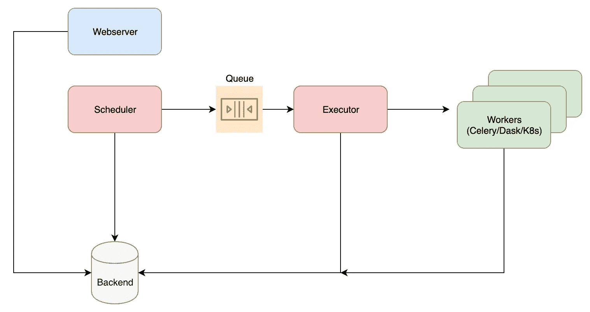
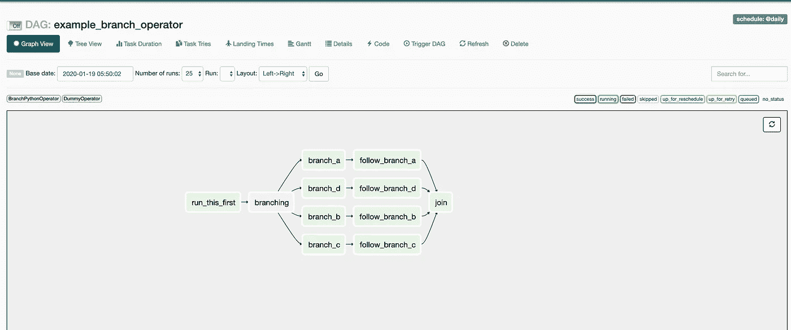
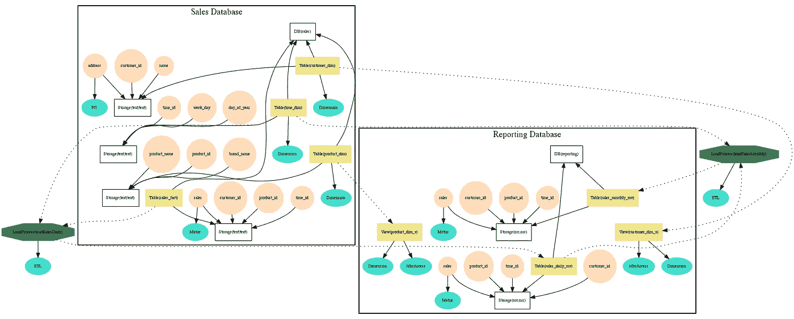

# 为什么 Apache Airflow 是管理数据管道的最佳选择

> 原文：<https://towardsdatascience.com/why-apache-airflow-is-a-great-choice-for-managing-data-pipelines-48effcce3e41?source=collection_archive---------8----------------------->

## 一瞥使气流比它的前辈更好的能力

在 [Unsplash](https://unsplash.com?utm_source=medium&utm_medium=referral) 上由 [Seika I](https://unsplash.com/@seiseisei?utm_source=medium&utm_medium=referral) 拍摄的照片

[Apache Airflow](https://airflow.apache.org/) 是一个开源调度程序，用来管理你的日常工作。这是一个很好的工具，可以组织、执行和监控您的工作流，使它们无缝地工作。

阿帕奇气流解决了很多前人面临的问题。让我们先了解一下架构，然后我们来看看是什么让气流更好。

## 熟练的技艺

Dag(有向无环图)表示气流中的工作流程。DAG 中的每个节点代表一个需要运行的任务。用户提及特定 DAG 需要运行的频率。用户还可以为 DAG 中的每个任务指定触发规则。例如，您可能希望在之前的某个任务失败后立即触发警报任务。

让我们试着理解气流的各种成分。

## 核心组件

气流主要由以下部件组成-

1.  调度程序
2.  网络服务器
3.  执行者
4.  后端

## 调度程序

它负责根据提到的频率安排您的任务。它会查找所有符合条件的 Dag，然后将它们放入队列中。如果 DAG 出现故障并且启用了重试，则计划程序会自动让该 DAG 重试。可以在 DAG 级别限制重试次数。

## 网络服务器

网络服务器是气流的前端。用户可以从用户界面启用/禁用、重试和查看 DAG 日志。用户还可以在 DAG 中深入查看哪些任务失败了，失败的原因是什么，任务运行了多长时间，以及任务上次重试的时间。

这个 UI 让 Airflow 优于竞争对手。例如，在 Apache Oozie 中，查看非 MR (map-reduce)作业的日志是一件痛苦的事情。

## 执行者

它负责实际运行一个任务。执行器控制哪个工作线程运行一个任务，并行运行多少个任务，并随着任务的进展更新任务的状态。

您可以在由 Celery 或 Dask 或 Kubernetes 管理的多个工人上运行您的任务。

这些任务是从队列中提取的，队列可以是 Redis 或 RabbitMQ。

默认情况下，Airflow 使用 SerialExecutor，它在本地机器上一次只运行一个任务。不建议在生产中这样做。

## 后端

Airflow 使用 MySQL 或 PostgreSQL 来存储配置以及所有 DAG 和任务运行的状态。默认情况下，Airflow 默认使用 SQLite 作为后端，因此不需要外部设置。不建议将 SQLite 后端用于生产，因为可能会丢失数据。

气流部件

# 那么，是什么让气流成为数据管道的合适调度器呢？

## 监视

气流提供了多种监测方法。您可以从 UI 中看到任务的状态。它会在 DAG 失败时发送一封邮件。如果任务违反了定义的 SLA，您也可以发送电子邮件。还可以从 Airflow UI 本身查看任务的日志。

气流 DAG UI

## 血统

这项功能是最近在 Airflow v1.10 版中推出的。Lineage 允许您跟踪数据的来源、数据的变化以及数据随时间的移动位置，如 Hive 表或 S3/HDFS 分区。

当你在存储器中读写多个数据任务时，这非常方便。用户需要为每个任务定义输入和输出数据源，并在 Apache Atlas 中创建一个图表，描述各种数据源之间的关系。

Apache Atlas 实例图示例(来自[https://atlas.apache.org/#/QuickStart)](https://atlas.apache.org/#/QuickStart))

## 传感器

传感器允许用户基于特定的先决条件触发任务。用户需要指定传感器的类型和检查条件的频率。例如，当特定分区(如日期)可用时，您可以使用 HDFS 分区传感器来触发任务。

## 用户化

Airflow 还允许用户创建自己的操作员和传感器，以防现有的丰富生态系统不能满足您的要求。我写了一个 SparkOperator，因为官方不允许我调整所有参数。所有代码都是用 Python 写的，这使得任何开发者都可以轻松集成。

除了上面提到的所有好处，Airflow 还可以与 Hadoop、Spark 等大数据生态系统中的所有服务无缝集成。由于所有代码都是用 Python 编写的，开始使用 Airflow 只需要几分钟。可以看看[官方快速入门指南](https://airflow.apache.org/docs/stable/start.html)。

您还可以探索 https://databand.ai/[的](https://databand.ai/)更强大的设置，以监控由 Apache 气流驱动的数据管道。

 [## 数据带-数据管道可观察性| Dag 和 ML 的可观察性

### 从数据源到机器学习模型，全面了解您的数据管道。请求演示跟踪所有管道…

databand.ai](https://databand.ai/)