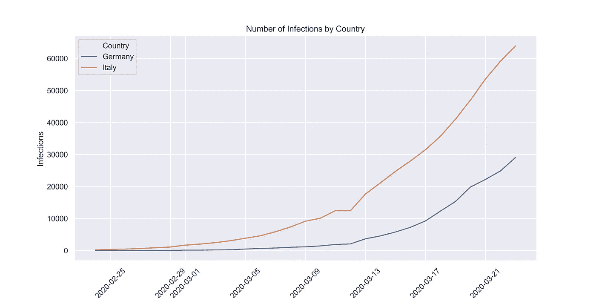
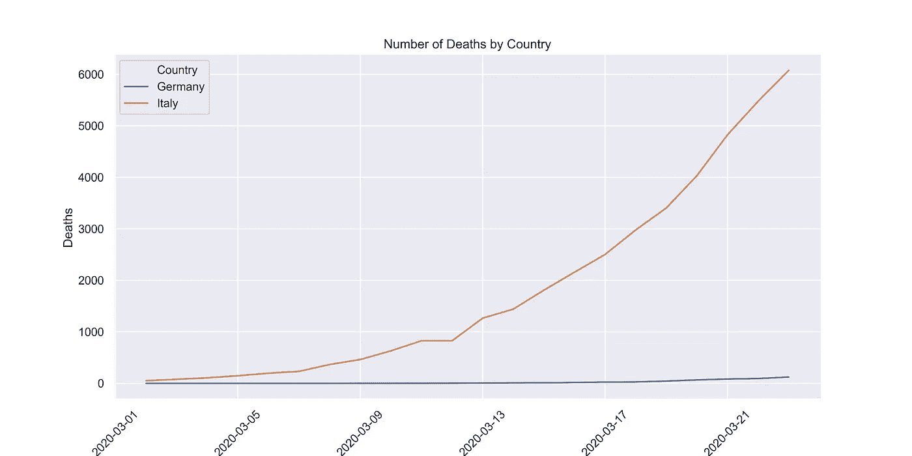
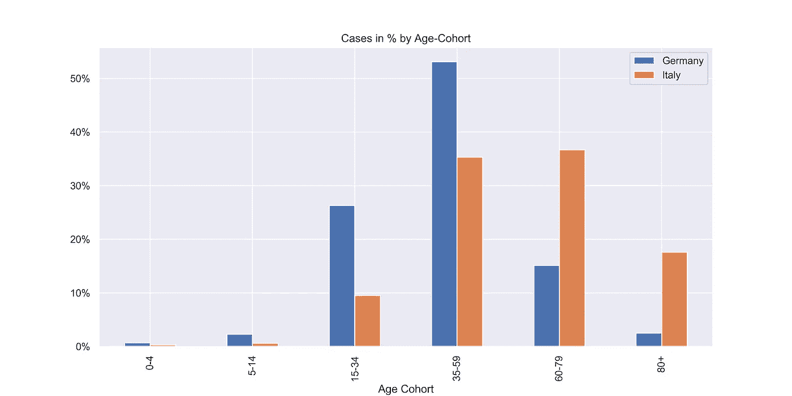
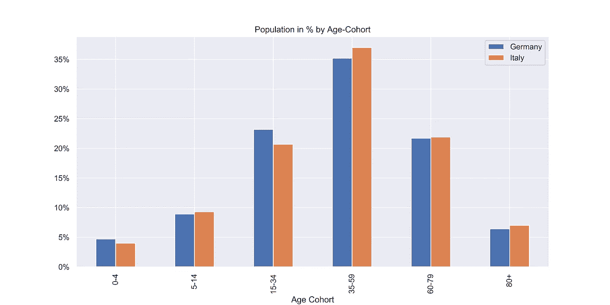
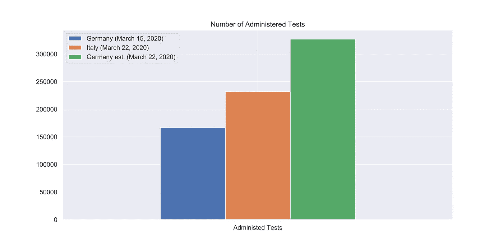
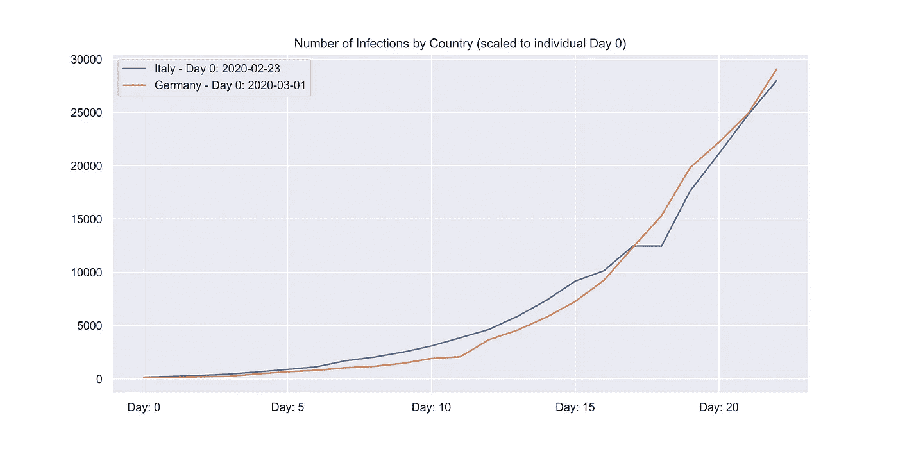
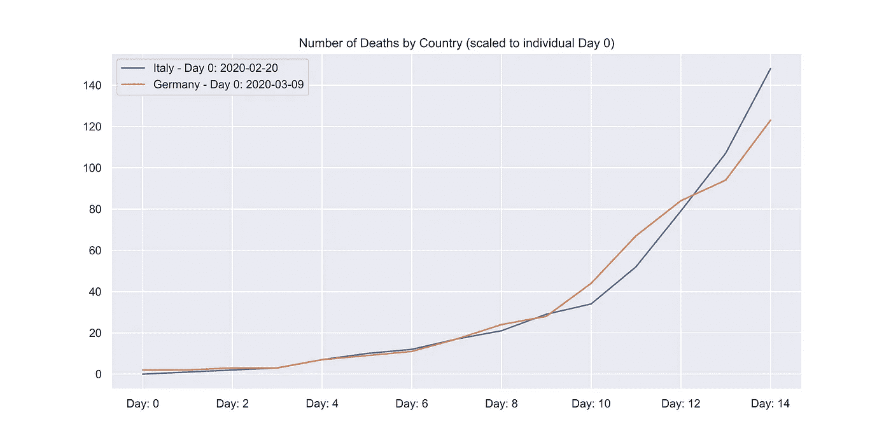

# 为什么德国和意大利的新冠肺炎统计数据如此不同？

> 原文：<https://towardsdatascience.com/why-are-covid-19-statistics-so-different-for-germany-and-italy-ee5bf376f461?source=collection_archive---------4----------------------->

## 德国似乎是新冠肺炎的一个例外，因为德国的感染率相对较高，但病死率极低(0.4%)，尤其是与意大利(9.5%)相比。

# 前言:

我在周末写了这篇文章的第一稿，因为我对这两个国家的数据似乎存在差异感到非常惊讶，并希望更好地了解是什么导致了这种差异。在完成这篇文章后，我不确定我是否应该发表它，因为我不喜欢意大利和德国非常相似但时移发展的可怕结论。所以我在周一和周二更新了数据，只是想看看情况是否有显著变化。他们没有。

我的分析表明，意大利领先德国 7 到 19 天。我认为实际数字更接近范围的高端。这一假设很大程度上基于实施的检测与报告病例的比率(德国每例 13.1 次检测；意大利为 3.9)以及人口年龄组差别不大的事实。

我的分析还表明，由于可能有许多未被发现的病例，意大利大大高估了其病死率。

# 第一章。当前事实

*   当前感染
*   当前死亡人数
*   当前病死率

## 当前感染:

**2020 年 3 月 24 日:**

让我们先来看看两国的感染人数。在撰写本文时，报告的感染人数如下(基于来自[约翰·霍普斯金大学](https://github.com/CSSEGISandData/COVID-19/tree/master/csse_covid_19_data/csse_covid_19_time_series)的数据):

*   **义大利:****63927**
*   德国:29056 人

**随时间发展(2020 年 2 月 24 日—2020 年 3 月 24 日):**

现在让我们来看看这两个国家的发展情况。我们可以看到，随着时间的推移，这两个国家的感染人数显著增加，这一点大家都很清楚。

**来源:**自己可视化。来自约翰·霍普斯金大学的数据截至 2020 年 3 月 24 日

## 当前死亡人数:

**2020 年 3 月 24 日:**

在写这篇文章的时候，以下人数被报道死于该病毒(基于来自约翰·霍普斯金大学的数据)

*   **意:****6077**
*   德国:123 票

**随时间发展(2020 年 3 月 1 日-2020 年 3 月 24 日):**

与感染相比，新冠肺炎首例死亡病例的出现有一定的滞后性，这也是我们关注 3 月 1 日以来数据的原因。意大利已经有数千人死亡，而德国的死亡人数在下面的图表中几乎不存在。

**来源:**自己的可视化。数据来自[约翰·霍普斯金大学](https://github.com/CSSEGISandData/COVID-19/tree/master/csse_covid_19_data/csse_covid_19_time_series)截至 2020 年 3 月 24 日。与意大利相比，德国的死亡人数确实显得微不足道。

## 当前病死率(CFR):

为了计算病死率，我们用报告的死亡人数除以报告的感染人数。然而，我们应该意识到有两种偏见在起作用:

*   **未解决的病例:**很不幸，一小部分目前被感染的人将会死亡。未解决病例的存在导致**低估 CFR** 。
*   **未确诊病例:**几乎可以保证很多感染病例没有上报。因此，**可能大大高估了 CFR** 。虽然未检测到的病例数量因国家而异，但一项研究表明 86%的病例可能未被检测到。

让我们来看看计算出的病死率:

*   **意大利:****6077/63.927 ~ 9.5%**
*   德国:123 / 29.056 ~0.4%

# 第二章。假设

看着这些数字，我大吃一惊。它们对我来说没有任何意义。我开始研究并发现了几个我想研究的领域:

*   **假设 1:** 意大利，平均来说，比德国要古老得多。
*   假设 2: 在这两个国家中，考试的数量不成比例。
*   **假设三:**意大利领先曲线，或者换句话说，德国落后。

## 意大利比德国历史更悠久

人们经常引用意大利是世界上第二老的人口。老年人口肯定可以解释这两个国家不同年龄组病例分布的差异。

**来源:**自己可视化。数据基于[RKI-报告](https://www.rki.de/DE/Content/InfAZ/N/Neuartiges_Coronavirus/Situationsberichte/2020-03-22-de.pdf?__blob=publicationFile)、[RKI-仪表板](https://experience.arcgis.com/experience/478220a4c454480e823b17327b2bf1d4)(德国)和[ISS-报告](https://www.epicentro.iss.it/coronavirus/bollettino/Infografica_22marzo%20ENG.pdf)(意大利)。意大利的病例是在 10 年队列中报道的。然而，由于德国人更为集中，我把他们作为 x 轴。为了改变意大利人的群体，我假设了一个线性分布。这意味着意大利 30-39 组报告病例的一半被分配到 15-34 组，另一半被分配到 35-59 组。

研究这个说法的时候我惊呆了。德国的中位年龄(45.9)与 2015 年的意大利(45.9)一样高，2018 年更高(德国:47.1 /意大利:45.5)，现在更高(德国:47.8 /意大利:46.5)——基于当前[中情局的《世界实况报道》](https://www.cia.gov/library/publications/the-world-factbook/fields/343rank.html)。

所以，也许年龄群组分布不同？我从经济合作与发展组织的统计数据页面中提取数据，并比较了这些群体，发现他们非常相似。意大利确实有一条稍微偏右的长尾巴。即“35-59 岁”人群比“15-34 岁”人群多 2%左右。

**来源:**自己的可视化。数据来自****。****

**进一步的研究当然可以花在这两个国家的社会动态方面，例如，年轻的成年人多久去看望他们的父母或者甚至和他们住在一起。然而，虽然我认为它可以解释一些差异，但它不能说明一切。**

## **管理的测试数量不成比例**

**据说[德国的考试率非常高](https://www.theguardian.com/world/2020/mar/22/germany-low-coronavirus-mortality-rate-puzzles-experts)。毫无疑问，德国分散的技术先进的实验室(见[视频](https://www.spiegel.de/wissenschaft/coronavirus-christian-drosten-zur-verbreitung-des-virus-im-sommer-a-fb4fc65c-2910-470a-9148-1f46ca9e3454) : 2:26)有助于德国的测试能力。然而，意大利也不是没有测试过。他们已经做了很多。**

****

**来自[的](https://ourworldindata.org/covid-testing)和[的](https://github.com/pcm-dpc/COVID-19/blob/master/schede-riepilogative/regioni/dpc-covid19-ita-scheda-regioni-20200321.pdf)的考试数据。对德国来说，最近一次“官方”测试是在 3 月 15 日。然而，也有人说每周有 160，000 次测试的能力，这使我们看到了绿色条。**

**虽然管理的测试的绝对数量很有趣，但我认为将每个检测到的案例管理的测试的**数量作为测试强度的代理也是有意义的。对于 3 月 22 日，该比率大致如下:****

*   ****意大利:232，222 例(总检测数)/ 59，138 例(检出病例)~ 3.9 例****
*   ****德国:327，000(总检测数)/ 24，873(检出病例)~ 13.1****

**由于测试的周转时间，这里可能有一些不准确，但总的来说，数字似乎证实了德国的测试比意大利更广泛。这使得我们有理由假设德国抓住了更多的轻微病例，而意大利可能偏向于已经表现出严重症状的更严重的病例。这一假设符合[声明](https://time.com/5799586/italy-coronavirus-outbreak/)(3 月 10 日)的说法，即意大利只是在测试危急病例。换句话说，意大利的未确诊病例数可能远高于德国。如前所述，更多的未识别病例将高估病死率。**

## **意大利走在了潮流的前面**

**虽然我认为前面的两个论点提供了一些关于严重不同的病死率的解释，但我认为现实要简单得多。**

**人类思维很难理解指数增长，这就是为什么有人可能会认为早期关于感染和死亡的图表看起来不太相似。**

**然而，如果我们从另一个有利的角度来看，我们将两国的第 0 天重新设定为不同的一天，那么发展看起来惊人地相似。**

## **意大利在传染病方面走在了前面**

**让我们看一张图表，比较德国从 2020 年 3 月 1 日开始与意大利从 2020 年 2 月 23 日开始的累积感染情况。**

****

****来源:**自己的可视化。数据来自[约翰·霍普斯金大学](https://github.com/CSSEGISandData/COVID-19/tree/master/csse_covid_19_data/csse_covid_19_time_series)截至 2020 年 3 月 24 日**

**这些结果意味着，如果我们将意大利一周前(**七天**)的感染数据与德国的数据进行比较，模式看起来非常相似。**

## **意大利走在了这条曲线的前面——死亡**

**现在让我们比较一下德国从 2020 年 3 月 9 日开始与意大利从 2020 年 2 月 20 日开始在累积死亡方面的发展。**

****

****来源:**自己的可视化。数据来自约翰·霍普斯金大学截至 2020 年 3 月 24 日**

**这意味着，如果我们将 19 天前意大利的死亡人数与德国的数据进行比较，模式看起来又非常相似。好消息是，最近德国曲线似乎有些变平。**

# **结论:**

## **1)意大利走在了潮流的前面**

**在我看来，意大利在比较累计死亡人数时领先 19 天，在比较感染人数时领先 7 天。我认为，鉴于在德国进行的更广泛的测试，死亡和感染的滞后不同这一事实是完全合理的(即，意大利的真实感染人数可能要高得多，因此我们必须追溯到更早的时间，以找到匹配的时期)。**

**因此，根据死亡人数对不同时期进行比较更有说服力，也可能更能反映现实。虽然在多重先决条件的情况下，尸检和死因归属可能会有一些差异，但我确实认为，即使考虑到这些差异，我们也不会看到非常不同的情况。**

**我只是希望，作为一个国家，我们可以很好地利用这个开端，并以某种方式避免最糟糕的事情发生。**

## **2)意大利高估了他们的 CFR**

**对我来说，从分析中可以明显看出，意大利有许多轻微的病例过去没有、现在仍然没有被注意到和检测到。因此，在计算病死率时，它们没有记录在准确的分母中。准确的病死率将会大大降低。**

**如果你想知道新冠肺炎教是如何在德国传播的，看看这个图片吧:**

** [## 德国新冠肺炎发展的交互式可视化

### 在这一点上，德国对新冠肺炎在地区层面上的发展没有很好的形象化，所以我决定…

towardsdatascience.com](/an-interactive-visualization-of-the-covid-19-development-in-germany-2b87e50a5b3e)** 

# **数据:**

** [## 德国/意大利比较

### 可比数据感染，百分比德国，意大利，德国，意大利 0-4，128，158，0-4，0.7%，0.3%…

docs.google.com](https://docs.google.com/spreadsheets/d/1ywbNPQXCLhU6S6xJOHZXgdwhOZc_qfBVR2z-Zn-ARk4/edit?usp=sharing)  [## fbo sler/covid 19-德国-意大利-对比

### 回购以创建介质商品的数据。为 fbo sler/covid 19-德国-意大利-比较开发做出贡献，由…

github.com](https://github.com/FBosler/covid19-germany-italy-comparison)**