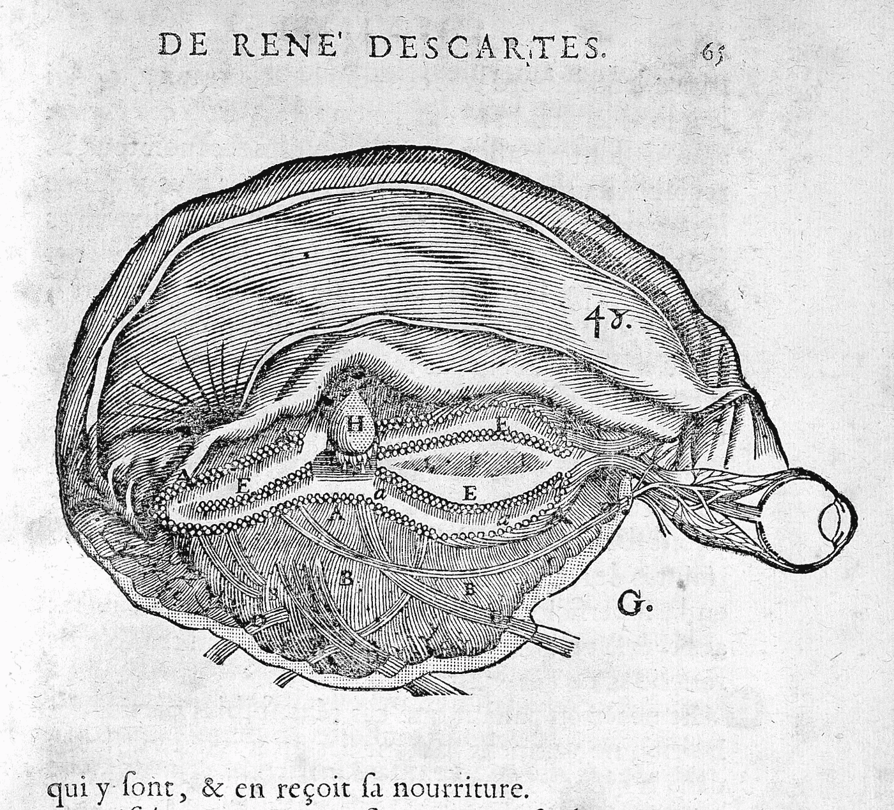
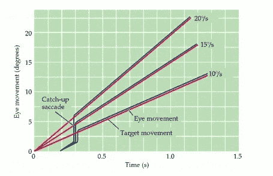
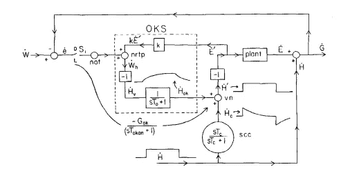
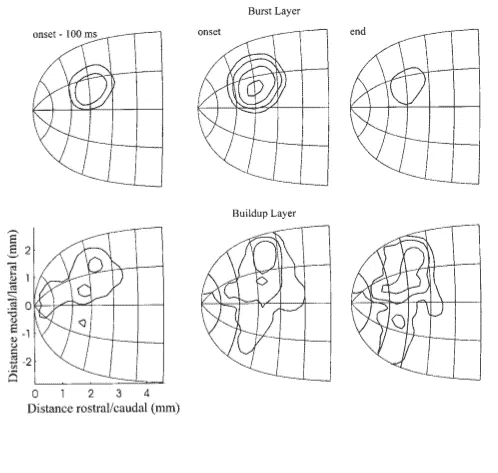

# 为什么眼球运动如此有趣？

> 原文：<https://towardsdatascience.com/why-are-eye-movements-so-damned-interesting-76bf293a7bde?source=collection_archive---------38----------------------->

## “扫视”是 2000 年来让科学家和哲学家着迷的古怪行为。

**图 1:**Reuter ophtrope，一种 19 世纪的模型，用于研究响应肌肉动作的眼球运动。克里斯蒂安·乔治·西奥多·鲁埃特，公共领域，通过维基共享

我在研究生院的第一次实习是在劳伦斯·斯塔克博士的眼球运动研究实验室。我的父亲(一个真正的医生)来访，我很兴奋地展示了实验室。他似乎被满墙的老花眼杂志迷住了。但在长时间的专注之后，他说:“老花眼？你变老了；你需要老花镜。还有什么好说的？”我发现很难不同意这一点，所以我努力解释为什么我发现眼球运动如此有趣。

然而，对眼球运动的研究在整个科学史上发挥了关键作用，并且不可避免地与视觉和知觉的研究交织在一起，成为心理学、神经科学和控制论等新兴领域的熔炉。几千年来，眼球运动吸引了一些最伟大的人物，包括亚里斯多德、托勒密、盖伦、阿尔哈曾、达芬奇、培根、笛卡尔、亥姆霍兹和谢灵顿。

也许最有影响力的古人是佩格蒙的盖伦(公元 129-200 年)。他是古代最多产的作家之一，他现存的*作品超过 100 万字。(他也是罗马皇帝马可·奥勒留、路奇乌斯·维鲁斯、康茂德、塞普蒂米乌斯·塞维鲁和卡拉卡拉的私人医生。)盖伦使我们第一次详细了解了肌肉收缩。他认识到肌肉以激动剂/拮抗剂对的方式工作，并推测它们是由流经神经的“动物精神”驱动的。他解剖了恒河猴，详细描述了六块眼外肌的组织和结构，甚至还进行了矫正斜视和白内障的手术。对于公元 200 年来说还不错。*

在接下来一千年的大部分时间里，数学和科学的大部分进步都可以归功于“伊斯兰黄金时代”。阿拉伯数学家ḥasan·伊本·阿尔海萨姆(*拉丁化*阿尔哈曾)扩展了亚里斯多德、托勒密和盖伦的思想，并且是第一个将这些理论应用于假设检验的“科学方法”的人。在接下来的一千年里，他的贡献领先或预见了许多发展。他推断，视觉是光线照射到视网膜上的结果，而不是从眼睛发出的。他计算了空间中存在的一个表面，即单眼视觉(两只眼睛看到相同的图像)。阿尔哈曾(以及托勒密)也指出，眼球运动要么是共轭的(相同)，要么是分离的(相反)。在 19 世纪，这一现象被正式确立为“海林定律”，并继续成为神经科学和心理学研究和争论的重要话题。(稍后将详细介绍这一点。参见图 5。)

阿尔哈曾受埃及哈里发的委托，治理阿斯旺的尼罗河洪水。但他的计划被证明是行不通的，他被哈里发 Al-Hakin bi-Amr 阿拉逮捕。在软禁期间，阿尔哈曾写下了他的七卷本《光学之书》。这被广泛认为建立了光学作为第一个现代科学学科，阿尔哈曾经常被称为“光学之父”他的著作在 200 年后首次被翻译成拉丁文，并在 1571 年出版后对文艺复兴时期的科学家产生了广泛的影响。

西方科学最重大的进步是意大利(大约 1280 年)发明了矫正眼镜，但眼球运动在文艺复兴时期重新受到关注。列奥纳多·达·芬奇创造了数百个眼睛和大脑的解剖研究(使用牛，因为人体解剖是被禁止的)。他是第一个发现视神经穿过大脑半球的人(图 2)。约翰尼斯·开普勒在视网膜图像方面的工作扩展了阿尔哈曾的想法。就连弗朗西斯·培根也对眼球运动有所评论，尽管不可否认，这不是他最好的作品:

*眼睛以同样的方式移动；因为当一只眼睛移到鼻孔时，另一只眼睛就从鼻孔移开。原因是同意的运动，在精神和部分精神是强大的。*

**图 2:** 在没有人体解剖的情况下，莱昂纳多·达·芬奇绘制了详细的图画，描绘了眼睛、心室系统和神经的结构和功能(大约在 1508 年)。注意，他正确地识别了视神经穿过大脑半球的视交叉。图片来源:皇家收藏信托女王伊丽莎白二世陛下 2019。

**眼睛和科学革命**

对于历史爱好者来说，勒内·笛卡尔对这一领域产生最持久的影响可能不足为奇。通过他对视网膜光学、反射弧和眼球运动力学的开创性研究，他提供了第一个完整的神经生物学观点。笛卡尔物理学是不折不扣的机械论，将企业置于一个可测试的科学基础上，并引领了跨越生物学几个分支的科学革命。

例如，他的眼部肌肉手术的“气球理论”(1664 年)，开启了一项长达 300 年的探索，以揭示肌肉收缩的机制。笛卡尔提出肌肉由来自中央储库(脑室[图 3])的液压流体提供动力。他的理论昙花一现，在 1667 年被 Jan Swammerdam 推翻，他证明肌肉收缩时体积不变。(从这一点开始，对典型肌肉的研究过渡到了更方便的蛙腿。)加尔瓦尼(1791 年)证明了电可以引发肌肉收缩，从而产生了电动理论(并激发了玛丽·雪莱的*弗兰肯斯坦* ) *中的动画*。蛋白质折叠和弹簧理论统治了这个领域 100 年。现代的滑动灯丝理论是由安德鲁·huxley⁴.在 1954-1969 年提出的顺便提一下，安德鲁·赫胥黎获得了诺贝尔生理学和医学奖，但不是因为他在肌肉方面的工作。他和艾伦·霍奇金在 1952 年开发了神经动作电位传播的数学模型。他同父异母的哥哥阿尔多斯·赫胥黎写了《美丽新世界》。

**图 3:勒内·笛卡尔的肌肉收缩气动理论。**勒内·笛卡尔的‘气球(液压)肌论’1664 年。笛卡尔假设大脑中的脑室是液体的储存库。图片:维基共享

**为什么要眼球运动？**

眼球运动的科学吸引力是什么？除了我们对视觉的自然迷恋，动眼系统作为一个研究系统拥有三个独特的优势。

首先，与科学中的几乎所有其他事物不同，眼球运动的目标或目的是显而易见的。它们受到有意识和无意识的控制，允许对反射、意志控制以及心理过程进行研究。

第二，动眼系统几乎是可以想象的最简单的机械系统。人的眼球几乎是球形的，眼睛不与环境进行物理交互(它不需要举起任何东西)。这大大简化了用于模拟其操作的动力学方程。眼睛由 6 块眼外肌共同控制。在很大程度上，水平眼球运动是由一对肌肉(内侧和外侧直肌)驱动的。垂直运动和回旋运动只是稍微复杂一些。例如，上斜肌使用由腱环形成的滑轮，滑车(图 4A)，有效地平衡肌肉力量，同时反转其方向。另一个有趣的花絮:猫头鹰和鹰拥有完整的 6 块眼外肌，尽管事实上它们几乎不能移动它们奇怪形状的眼睛(图 4B)。猫头鹰的头部运动类似于哺乳动物的眼睛运动。

**图 4:眼部肌肉的解剖。a .**6 块眼肌 b .猫头鹰只能在眼窝内移动眼睛 2 度左右。图鸣谢:(A) MBBS:爱学习【https://lovetostudymbbs.wordpress.com/(B)马丁，G.R. (2017)。是什么驱动了鸟类的视觉？票据控制和掠食者探测使飞行黯然失色。*神经科学前沿* **11** : 619

第三，只有少数几种不同的*类型*的眼球运动:

1.迅速扫视:眼睛的快速“跳动”,以改变眼睛在空间中的位置，就像阅读时一样。"扫视"是法语中"混蛋"的意思。人类婴儿会迅速扫视，但不会跟踪运动。

2.追踪运动(平滑追踪、视动、全场追踪):追踪眼球运动的缺陷是精神分裂症**、**自闭症和其他疾病的证据。

3.聚散:双眼同时向相反方向运动，以保持双眼视觉。聚散的一个极端例子是“斗鸡眼”

4.前庭眼反射:当头部转动时，眼睛反向转动以稳定凝视。三个前庭半圆管检测角加速度，充当生物陀螺仪。VOR 的紊乱会导致晕动病和眩晕。

…以及眼球运动:

5.调节:通过重塑镜片来改变焦距。

6.瞳孔:缩小瞳孔以降低光线强度。头部外伤会导致不对称的瞳孔反应。

正如我们将看到的，这 6 个运动由独立的控制系统驱动，但在功能上是集成的。简单的眼球运动动力学允许集中、渐进的研究，经常导致远远领先于生理学和神经生物学其他领域的突破。

**眼球运动的规律**

眼睛运动本质上是二维的，但是眼睛可以以三个自由度运动(水平、垂直和旋转)。眼部肌肉本身的解剖结构很难阻止眼睛做出一些非常怪异的事情(想想变色龙)。这一观察导致了一系列的研究来理解为什么他们*不*。在 19 世纪，将观察结果之间的几乎任何关系都视为自然“法则”是一种时尚因此，这个时代见证了几个“眼球运动定律”的发现，逐渐形成了一种理解，即支配眼球运动的是神经生物控制，而不是机械约束。

*东德尔定律(弗朗西斯库斯·科尼利厄斯·东德尔斯 1818-89)*

如果眼睛运动是围绕轴的简单旋转，45 度倾斜的眼睛运动将与眼睛/视网膜旋转 10 度的相同位置的两次运动(水平，然后垂直)非常不同。唐德定律指出，对于任何一个凝视方向，眼睛的 3D 空间方位是唯一的，并且与眼睛如何到达该凝视方向无关。

*上市定律(约翰·贝纳蒂克·利斯廷 1808–1882)*

Listing 定律指出，通过从一个特定的“主要”参考方位开始，然后绕着位于与主要方位的凝视方向正交的平面内的轴旋转，可以达到所有实现的眼睛方位。换句话说，唐德定律告诉我们，眼睛的最终方向独立于眼球运动的路径，而列名定律告诉我们那个方向是什么。

为了将这些规律可视化，科学家们建立了复杂的物理模型来研究眼睛的旋转和眼肌的活动。第一台这样的设备的发明者克里斯蒂安·乔治·西奥多·鲁埃特称之为“眼底镜”(图 1)。唐德定律和李林定律都可以在这个模型上得到证明。肌肉收缩或伸展的程度在模型后面的标尺上测量。其他版本使用悬吊重物来制造肌肉张力。

*赫尔曼·赫尔姆霍茨(1821-1894)*

该领域的一个统一人物是博学的赫尔曼·赫尔姆霍茨。今天，他可能因为对电磁学、亥姆霍兹波 equation⁶和流体力学中的亥姆霍兹定理的研究而更加出名，但是他对生理光学和眼科学的全面研究可能有更大的 impact⁷.

Helmholtz 通过实验证实了 Listing 定律，将不同眼睛位置的视觉后像与 Listing 的预测进行了比较。他发明了*检眼镜*，医生用来检查你眼睛的熟悉设备。他也是第一个测量神经信号速度的人(在当时，神经信号被认为是瞬时的，就像电一样)。

他的学生可能更有名，包括海因里希·赫兹和诺贝尔奖获得者阿尔伯特·迈克耳孙和马克斯·普兰克。他的另一个学生是威廉·马西米兰·冯特(1832-1920)。在实验室工作期间，冯特发展了他在实验方法方面的技能，并开发了一种先进的眼底镜设计。他确立了自己作为极具影响力的神经生理学家的地位。冯特是第一个自称为“心理学家”的人，也经常被称为“实验心理学之父”。反过来，冯特在其职业生涯中培养了多达 170 名博士生，在智力上开拓了两个领域——神经科学和心理学。

*赫林定律(卡尔·埃瓦尔德·康斯坦丁·赫林 1834–1918)*

赫林的等神经支配定律指出，两只眼睛的眼球运动总是相等的，但方向不同。在共轭眼球运动(迅速扫视和平滑追踪)中，眼球同等地一起运动。对于分离运动(如聚散)，神经支配是相等的，但相反。这意味着什么是违反直觉的，但很容易证明。考虑将双眼重新注视新目标的任务(图 5)。最简单的解决方案是独立地改变眼睛的位置。但是，眼睛根据赫林定律移动，两只眼睛移动到新的视觉方向，然后在相反的方向(聚散度)重新建立双眼视觉。这是托勒密观察的形式化，阿尔哈曾进一步证明了眼球运动受到某种神经控制逻辑的限制。也许令人惊讶的是，在快速眼动睡眠期间，海林定律被违反了，在大多数时间里，个体的眼球运动或多或少是相互独立的。这与梦通过眼球运动来想象场景的观点相矛盾，“除非每只眼睛都在体验不同的 dream⁸"(Fig.”。

**图 5:** 描绘了在眼睛独立运动或眼睛遵循赫林的均等神经支配定律的情况下，重新激发穆勒刺激的预测。维基共享 [E4zase1vrvlo6pe](https://commons.wikimedia.org/w/index.php?title=User:E4zase1vrvlo6pe&action=edit&redlink=1) (2016)

**图 6:睡眠期间快速眼动(REM)不协调——违反了赫林定律。**鸣谢:周伟民、金伟民(1997)。快速眼动睡眠期间双眼眼球运动不协调。*Exp Brain Res*1997**117(1):**153–60。

和许多伟大的科学家一样，海林和亥姆霍兹既是同事又是对手。亥姆霍兹认为海林定律是习得行为；赫林认为这是本能，或者说是“天生的”每个人都独立地推导出双眼单视界，即在两个视网膜上具有相同解剖差异的空间点的轨迹，或单一视觉的点(首先由阿尔哈曾描述)。赫林发展了视觉超敏锐理论，展示了一组光感受器的分辨率如何超过单个感受器的大小。他还提出了色觉的“对手理论”(亥姆霍兹提倡托马斯·杨和詹姆斯·克拉克·麦克斯韦的替代、三色受体理论)。

*谢灵顿定律(查理斯·斯科特·谢灵顿 1857–1952)*

19 世纪的最后一个定律是谢灵顿的相互神经支配定律，其中对抗肌的动作伴随着对抗肌的相互放松。这实质上是在现代神经生物学的背景下重申笛卡尔的气球理论。他还引入了本体感觉这个术语，来描述动觉第六感(“肌肉感觉”)，从而发现了检测肌肉拉伸、张力和速度的感觉神经元，如高尔基腱器官和肌梭。谢灵顿因为在神经元功能、突触通讯和反射方面的工作获得了诺贝尔奖。

20 世纪早期:理论生物学的突破

20 世纪中期，随着生理学的两项最高成就，更多的难题迎刃而解:(1)神经传导的霍奇金-赫胥黎模型(除其他外，该模型解释了控制由亥姆霍兹测量的神经信号速度的生物化学过程)和(2)肌肉收缩的赫胥黎滑动细丝模型，该模型也解释了肌肉的力-速度和长度-张力关系。电生理记录技术的发展使得研究人员能够测量单个神经元产生的信号。

与此同时，麦卡洛克和皮茨 1943 年的论文展示了神经元网络如何像计算机一样执行逻辑和数学运算。1949 年，唐纳德·赫布(Donald Hebb)提出了突触修改的第一条规则，展示了简单的过程如何能够负责根据经验重新连接网络——从而开创了计算生物学和神经网络的新领域。

**控制论**

电生理学与所有组件(机械设备、肌肉和神经元)的模型相结合，提供了在“系统”水平上研究神经肌肉控制的独特机会。这使得研究人员能够更深入地研究神经回路，以了解眼球运动命令在大脑中是如何规划、协调和执行的。

1948 年，诺伯特·韦纳将这个新兴领域定义为控制论，即“动物和机器中控制和交流的科学研究”。他的见解是，为分析信号和控制系统(在电气和机械工程中)而开发的大量分析方法可以用来理解神经生物控制。

控制论中最重要的成果之一正是我的顾问拉里·斯塔克的工作。当然，这项工作与眼球运动有关。他通过应用频率分析和控制 theory⁹ ⁰.诱发振荡，测量了瞳孔反射中神经反馈的时间延迟了解延迟的持续时间和神经信号的速度有助于确定电路的位置。

图 7:快速扫视和平滑追踪运动的结合。平滑的追踪系统反应大约快 50 毫秒。猴子的扫视和平滑追踪眼球运动。 *J. Physiol* 。 **191** ，第 609–631 页

由于四种眼外眼运动的每一种都有不同的潜伏期，表明不同的上游神经处理和独立的控制系统(VOR 50-100 毫秒，平滑追踪 100-130 毫秒，聚散度 160-180 毫秒，迅速扫视 200 毫秒)，因此还需要更多的研究。事实上，赫林定律暗示了这一点。例如，当眼睛开始跟踪一个目标时，平滑跟踪系统首先开始跟踪方向和速度，随后是矫正性(“追赶”)迅速扫视，以聚焦在目标上(图 7)。

同时代的人(特别是约翰·霍普金斯大学的大卫·罗宾逊)开始将电生理学与控制理论结合起来，研究参与计划和执行眼球运动的单个神经元。这使得控制系统的定量的、可测试的电路图的创建成为可能，这些控制系统涉及产生迅速扫视、平滑追踪、VOR 和聚散度眼球运动。

罗宾逊关于扫视反馈控制的里程碑式的工作是在猕猴身上完成的——与盖伦解剖的猕猴是同一物种。他创造的另一个模型(图 7)是*一个*综合平滑追踪和 VOR 控制的可能模型，尽管它绝不是唯一的。这些模型表明，眼睛运动是由反馈控制系统驱动的，其中运动神经元被驱动以最小化目标速度或位置与实际速度或位置之间的误差。要么这是使用控制理论研究眼睛的一个愉快的意外，要么是大自然效率的证明。

图 8:集成了 VOR 和平滑追踪系统的系统模型。鸣谢:罗宾逊，D.A. (1981)。控制系统分析在眼球运动神经生理学中的应用。*安。修订版神经科学***4**:463–503

在我的实验室轮岗几年后，我与另一位电子工程教授(也是罗宾逊的同事)爱德华·凯勒一起工作，他正在研究涉及迅速扫视的规划和执行的猴子脑干神经元的群体行为。大脑的一个区域，即上丘，保持着一个不是视觉差异或几何位置的空间图，而是眼睛位置和感兴趣的目标之间的误差信号的空间图(图 9)。这里，与运动神经元不同，决定眼球运动幅度的是神经活动的位置，而不是其强度。下游的传出通路将这个空间信号转换成运动神经元所需的时间控制信号。

**图 9:15 度角时上丘 2 层中的二维群体活动。斜向扫视**。SC 在对数空间图中编码迅速扫视的幅度和方向。每个部分都显示了在丘运动图上的分布活动。*顶部*:突发神经元层中表现为恒定轮廓曲线的活动。*底部*:同样表示构建的神经元层。*左*:扫视开始前 100 毫秒。*中间*:迅速扫视开始时的活动分布。*右侧*:扫视结束。鸣谢:安德森，R.W .，凯勒，E.L .，甘地，新泽西州&达斯，S. (1998)。猴子上丘二维扫视相关群体活动。神经生理学杂志，**80**:798–817

对较低脑干活动的电极记录似乎表明，眼球运动是在受试者意识到之前进行的，这激起了关于自由意志的辩论。一个更令人欣慰的解释是，大脑不断参与运动控制的应急计划。

**那又怎样？**

许多遗传、医学和心理疾病可以通过眼球运动的异常来诊断⁴.在我的母校，眼球运动是一年级验光学生的必修课，因为他们有可能诊断未知的医疗状况，如中风或脑肿瘤。因为大多数人从来不去看神经科医生，所以早期发现的唯一机会是去找验光师。简单的眼球运动测试也是普通体检的一部分。

psilocybin 的使用有效地降低了位置反馈系统的“增益”,因此受试者在观看场景时将只移动 20%的眼睛。60%的精神分裂症患者表现出不自主的眼球震颤，即眼睛的快速来回抽动。随着大量饮酒，平稳的追踪系统开始失效，眼睛会以不稳定的眼球运动进行追踪(正如标准的现场清醒测试所揭示的)。在最初的 4-5 个月，婴儿不能产生跟踪运动。

你自己试试吧，下次家里有新成员的时候。通过测试宝宝的眼球运动来逗乐你的朋友或打扰公婆。在最初的六个月里，你能引起的只是扫视性的眼球运动。但是，与清醒的婴儿相比，无论你给婴儿喝多少酒，他仍可能通过现场清醒测试。

你还觉得眼球运动没意思吗？

我放弃了。你就像我爸爸一样。

=结束=

***罗素·安德森*** *在媒介上发表了几部科学伪史。他拥有加州大学电子工程学士学位和生物工程博士学位。他的教授中至少有 5 人研究过眼球运动(劳伦斯·斯塔克、埃德·凯勒、史蒂夫·雷曼、埃德温·刘易斯和史蒂文·海宁)。他在实验室讲授拉里·史塔克的“眼球运动”课程，担任生物控制论的编辑，并在史密斯-凯特尔维尔眼科研究所与埃德·凯勒一起进行博士后研究。离开学术界后，他在 HNC Software、J.P. Morgan、Halifax Bank of Scotland、Opera Solutions、KPMG 和 IBM 等公司工作了 20 多年，构建商业预测解决方案……脑子里总是想着眼球运动。*

问题/评论:anderson.transactionanalytics@outlook.com

**参考文献:**

*1。即使对伯克利来说，斯塔克医生也是个怪人。他是三个看似不相关的系的教员:生理光学(视光学学院)、神经科学(UCSF)和电气工程(UCB)。尽管他自己没有博士学位。作为二战加速计划的一部分，他在 21 岁时获得了医学博士学位。他在朝鲜战争中短暂行医，然后进入学术界。*

*2。培根，女(1561-1626)。在:*弗朗西斯培根的作品*。j 斯佩丁，RL 埃利斯，DD 希思，编辑。伦敦。1857 年(第 628 页)*

*3。科布，M. (2002 年)。[《时间线:驱除动物精神:简·斯瓦默达姆论神经功能》](https://web.archive.org/web/20050515053936/http:/janswammerdam.net/NRN.pdf)。自然评论神经科学*。**3(5):**395–400。

*4。赫胥黎和尼德格尔克(1954)。“活肌纤维的干涉显微术”。*性质*。(4412):971–973*

*5。马丁，G.R. (2017)。是什么驱动了鸟类的视觉？票据控制和掠食者探测使飞行黯然失色。*神经科学前沿* **11** : 619。*

*6。*亥姆霍兹方程采用∇(*f)*=-k **f**，*的形式，对空间波传播和扩散等问题有广泛的应用。

*7。亥姆霍兹，H. (1910)。*生理光学论文*。纽约:多佛*

*8。T49 周，王维明(1997)。快速眼动睡眠期间双眼眼球运动不协调。*Exp Brain Res*1997**117(1):**153–60。*

*9。斯塔克和谢尔曼，下午(1957)。合意瞳孔对光反射的伺服分析研究。 *J .神经生理学* **20** :17。*

10。为了更好地近似，眼球运动可以被建模为二阶线性系统。这是偶然的，因为有更完整的数学理论可以用于分析。另一方面，斯塔克教授向我保证，“上帝把一切都设计得像二阶线性微分方程。”

*11。富克斯，1967 年。猴子的扫视和平滑追踪眼球运动。 *J .生理学*。 **191** ，第 609–631 页*

*12。罗宾逊，D.A. (1981)。控制系统分析在眼球运动神经生理学中的应用。*安。修订版神经科学***4**:463–503*

13。安德森，R.W .，凯勒，E.L .，甘地，新泽西州&达斯，S. (1998)。猴子上丘二维扫视相关群体活动。 *J .神经生理学，***80**:798–817。

14。 Srivastava，a .、Ahmad，O.F .、Pacia，C.F .、Hallet，M. &伦古特区(2018)。迅速扫视和运动的关系。*运动障碍杂志****11(3)****93–106。*