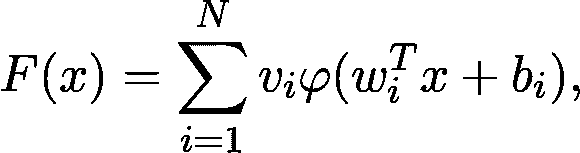

# 为什么神经网络如此强大？

> 原文：<https://towardsdatascience.com/why-are-neural-networks-so-powerful-bc308906696c?source=collection_archive---------16----------------------->

## 通用逼近定理

众所周知，神经网络非常强大，它们可以用于几乎任何统计学习问题，并取得很好的结果。但是你想过为什么会这样吗？为什么这种方法在大多数场景下比很多其他算法更强大？

和机器学习一样，这有精确的数学原因。简单来说，一个神经网络模型所描述的函数集合是非常庞大的。但是*描述一组函数*是什么意思呢？一组函数怎么可能很大？乍一看，这些概念似乎很难理解，但是它们可以被恰当地定义，从而解释为什么某些算法比其他算法更好。

# 作为函数逼近的机器学习

我们来抽象一下观点，公式化一下什么是机器学习问题。假设我们有了数据集

其中*x*⁽ᵏ⁾*t5】为数据点， *y* ⁽ᵏ⁾ 为与该数据点相关的观测值。观察值*y*⁽ᵏ⁾*t13】可以是一个实数，甚至是一个概率分布(在分类的情况下)。任务很简单，就是找到一个函数 *f(x)* ，其中 *f(x* ⁽ᵏ⁾ *)* 约为 *y* ⁽ᵏ⁾ *。***

为此，我们预先确定一组参数化的函数，并选择最适合的参数配置。例如，线性回归使用函数族

作为参数函数族，以 *a* 和 *b* 作为参数。

如果我们假设有一个真实的底层函数 *g(x)* 描述了 *x* ⁽ᵏ⁾和 *y* ⁽ᵏ⁾之间的关系，这个问题可以表述为一个函数逼近问题。这使我们进入了近似理论的美丽但非常技术性的领域。

## 近似理论入门

很可能你一生中遇到过几次指数函数。它的定义是

其中 *e* 是著名的欧拉数。这是一个*超越函数*，基本上就是说你不能用有限多次的加法和乘法来计算它的值。然而，当你把它输入计算器时，你仍然会得到一个值。这个值只是一个近似值，尽管它通常足以满足我们的目的。事实上，我们有

这是一个多项式，因此它的值可以显式计算。 *n* 越大，越接近真实值。

逼近论的中心问题是为这些问题提供一个数学框架。如果你有*任何*函数 *g(x)* 和一族从计算方面更容易处理的函数，你的目标是找到一个足够接近 *g* 的“简单”函数。本质上，近似理论寻找三个核心问题的答案。

*   什么叫“足够近”？
*   我可以(或应该)用哪一组函数来近似？
*   从一个给定的近似函数族中，哪一个函数是最合适的？

如果这些听起来有点抽象，不要担心，因为接下来我们将研究神经网络的特殊情况。

# 作为函数逼近器的神经网络

所以，我们来重申一下问题。我们有一个函数 *g(x)* ，它描述了数据和观察值之间的关系。这并不确切，只是对某些值而言

其中 *g(x* ⁽ᵏ⁾ *) = y* ⁽ᵏ⁾.我们的工作是找到一个 *f(x)*

*   从数据中归纳知识，
*   并且在计算上可行。

如果我们假设所有的数据点都在子集 *X* 中，也就是说

我们想要一个函数，其中数量*上确界范数*

越小越好。您可以通过绘制这些函数、给图形包围的区域着色并计算所述区域沿 *y* 轴的最大扩展来想象这个量。

即使我们不能评估任意值的 *g(x)* ，我们也应该始终致力于在这种更广泛的意义上近似它，而不是要求 *f(x)* 只适合已知的数据点 *xₖ* 。

所以，问题给出了。问题是，我们应该用哪组函数来近似？

## 单隐层神经网络

从数学上讲，具有单个隐藏层的神经网络被定义为

其中φ是非线性函数(称为激活函数),例如 sigmoid 函数

和

数值 *x* 对应的是数据，而 *wᵢ* 、 *bᵢ* 和 *vᵢ* 是参数。是函数族

足以逼近任何合理的函数？答案是响亮的是！

# 通用逼近定理

全盛时期的通用逼近定理:)资料来源:Cybenko，g .(1989)[“sigmoid 函数叠加的逼近”](http://citeseerx.ist.psu.edu/viewdoc/download?doi=10.1.1.441.7873&rep=rep1&type=pdf)，*控制、信号和系统的数学*，2(4)，303–314。

1989 年的一个著名结果，叫做*普适逼近定理*指出，只要激活函数是类 sigmoid 的，并且要逼近的函数是连续的，一个单隐层的神经网络就可以逼近到你想要的精度。(或者*学习*机器学习术语中的 it。)

不要担心确切的定理看起来很难，我会详细解释整个过程。(事实上，我故意跳过了像*密集*这样的概念，以使解释更清晰，尽管不那么精确。)

**步骤一。**假设要学习的函数是 *g(x)，*连续。我们先固定一个小数字 *ε* 在函数周围画一个 *ε* 宽的条纹。 *ε* 越小，结果越好。

**步骤二。**(最难的部分。)找到表格的一个函数

完全在条纹内。该定理保证了这种*F(x)*的存在，因此这类函数被称为*通用逼近器*。这是神经网络令人敬畏的地方，赋予了它们真正的力量。

然而，有几个警告。例如，该定理没有提到 N，即隐藏层中神经元的数量。对于小的 *ε* ，这可能*非常*大，从计算的角度来看是不好的。我们想尽可能快地计算预测，计算一百亿项之和肯定不好玩。

第二个问题是，即使这个定理保证了一个好的逼近函数的存在，它也没有告诉我们如何找到它。虽然这可能令人惊讶，但这在数学中是非常典型的。我们有非常强大的工具来推理某些对象的存在，而不能够明确地构造它们。(有一个数学学派叫*建构主义*，拒绝泛逼近定理的原始证明之类的纯粹存在性证明。然而，这个问题是根深蒂固的。如果不接受非构造性的证明，我们甚至不能谈论无限集合上的函数。)

然而，最大的问题是，在实践中，我们永远不会完全知道底层功能，我们只知道我们观察到的:

有无数种可能的配置可以任意地很好地适合我们的数据。他们中的大多数都可怕地概括了新数据。你肯定知道这种现象:这是可怕的过度拟合。

# 权力越大，责任越大

事情是这样的。如果你有 *N* 个观察值，那么你可以找到一个完全符合你的观察值的 *N-1* 次多项式。这没什么大不了的，你甚至可以用[拉格朗日插值](https://en.wikipedia.org/wiki/Lagrange_polynomial)显式写下这个多项式。然而，它不会推广到任何新的数据，事实上这将是可怕的。下图展示了当我们试图将一个大次数的多项式拟合到一个小数据集时会发生什么。

同样的现象也适用于神经网络。这是一个巨大的问题，而通用逼近定理没有给我们任何关于如何克服这个问题的提示。

一般来说，函数族越有表现力，就越容易过拟合。权力越大，责任越大。这被称为[偏差-方差权衡](https://en.wikipedia.org/wiki/Bias%E2%80%93variance_tradeoff)。对于神经网络，有很多方法可以减轻这种影响，从 L1 正则化权重到减少层数。然而，由于神经网络的表达能力如此之强，这个问题总是在后台隐约出现，需要持续关注。

# 超越通用逼近定理

正如我所提到的，这个定理没有给出工具来为我们的神经网络找到一个参数配置。从实用的观点来看，这几乎和通用近似性质一样重要。几十年来，神经网络不受欢迎，因为缺乏有效的计算方法来拟合数据。有两个基本的进步，使它们的使用变得可行:反向传播和通用 GPU-s。有了这两个技术，训练大型神经网络就轻而易举了。你可以用你的笔记本训练最先进的模型，甚至不用流汗。自从通用逼近定理以来，我们已经走了这么远！

通常，这是标准深度学习课程的起点。由于其数学上的复杂性，神经网络的理论基础没有被涵盖。然而，通用逼近定理(及其证明中使用的工具)非常深刻地揭示了为什么神经网络如此强大，它甚至为工程新架构奠定了基础。毕竟谁说只允许我们组合 sigmoids 和线性函数？

[***如果你喜欢把机器学习概念拆开，理解是什么让它们运转，我们有很多共同点。看看我的博客，我经常在那里发表这样的技术文章！***](https://www.tivadardanka.com/blog)