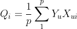
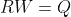
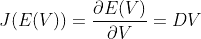
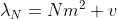

# BatchNorm 有效的真正原因

> 原文：<https://towardsdatascience.com/why-batchnorm-works-518bb004bc58?source=collection_archive---------30----------------------->

## 了解“损失情况”如何随着批量标准化而变化

[来源](https://pixabay.com/photos/schrecksee-bergsee-allg%C3%A4u-2534484/)

归一化技术是我们在分析任何形式的数据时拥有的一些伟大的工具，调整分布的均值和方差的简单操作导致深度神经网络中各种归一化技术的灾难性成功，其中之一是著名的批量归一化 Ioffe 等人。

每个人都听说过:

Ioffe 等人的算法-1。

目前，对 BatchNorm 成功的最广泛接受的解释，以及其最初的动机，与所谓的内部协变量转移(ICS)有关。非正式地，ICS 指的是由对先前层的更新引起的层输入分布的变化。据推测，这种持续的变化会对训练产生负面影响。BatchNorm 的目标是减少 ICS，从而补救这种影响。

在易勒雅斯等人的文章中，作者提出了一个观点，即批处理范式的性能增益和内部协变量移位的减少之间似乎没有任何联系。或者说这种联系充其量也是脆弱的。事实上，他们发现在某种意义上，BatchNorm 甚至可能不会减少内部协变量偏移，并证明在自然条件下，损失和梯度的 Lipschitzness(基本上是损失表面及其梯度的平滑度)在具有 BatchNorm 的模型中得到改善，因此证明 BatchNorm 以一种基本的方式影响网络训练:它使相应的优化问题的前景明显更加平滑。

这里，我们将分析误差空间权重为二次的模型的误差表面的二阶属性，然后重新对表面进行参数化，以便根据输入协方差矩阵的特征谱进行分析，并由此使用结果来推断为什么批处理范数可能会提高收敛速度，以及为什么它会使网络在初始化时保持不变。

对于在权重空间 *{W}* 中搜索误差函数 *E(W)* 最小的最优值 *W** 的各种学习算法，基于梯度下降，它们的性质由 *E(W)* 曲面的二阶性质控制。

对于这种分析，我将集中于神经网络的单层，其中 *X(N* x *1)* 作为这一层的输入向量，并且 *W(1* x *N)* 是这一层的权重，并且 *Y(1* x *1)* 是这一层的输出，为了方便考虑均方误差:

*p 是数据集的大小*

很明显，误差曲面在权重上是二次的，因此将其重写为:

其中 R 定义为:

*其中 Xui 是第 u 个输入向量(Nx1)的第 I 个分量，因此 R 显然是第 N 个* **x** *N 个输入协方差矩阵。*

*Q 是一个 N 维向量，*定义为:

c 只是一个常数:

现在 *E(W)* w.r.t. *W* 的梯度是 *J(E) = RW-Q* 而二阶导数的海森矩阵显然是 ***H = R***

最小化 *E(W)* 的解空间 ***W**** 显然包含梯度为零的条目，因此该解空间是线性方程解的**子空间**

(来自 *J(E)* =0)

现在，这种 *RW=Q* 是线性代数( *Ax=b* )中常见的一类问题，工程应用中的很多问题都可以用这种格式公式化，然后分析 *A* 的本征谱来解决。

由于解空间 *W** 是 *RW=Q* 的解的子空间，现在如果 *R* 的所有列都是独立的，因此 *R* 具有满秩，很明显，这个子空间塌陷到一个点(唯一解)。

现在这一切都很好，但是**我们为什么要这样做？**

**当损失曲面的权重为二次时***r*的特征向量定义了 *E(W)* 的主轴(这可以从“噪声和振动的主动控制(Colin Hansen，Scott Snyder)】section-6.5.2)⁵
中研究，我们可以通过下式计算曲面在任一单位向量 *u* 方向的二阶导数:

选择*为 **H** (=R)的特征向量，我们可以得到 *E(W)* 在主轴方向的二阶导数，从矩阵对角化可知，**将是 *H* (= *R* )** 的特征值。*

*我们已经用 *R* 和我们的 Hessian = *R* 表示了我们的梯度，并且由于我们可以用 *R* 定义 *E(W)* 的主轴，我们将在包含我们的误差表面的空间上进行 2 个变换:*

*   ***通过基本平移，以解决点**为中心*

**

*   ***旋转**，我们要把这个 *V`* 旋转到 *E(W)* 的主轴上，这样就可以分析主轴方向上的黑森。现在，如果我们将一个矩阵乘以一个向量，就会产生一个空间变换(从旋转、平移到将空间压缩成一个点)。为了实现旋转，**我们将把 *V`* 乘以特征向量矩阵 *R*** ，包含相互正交的归一化特征向量 *R* ，将这个矩阵命名为*(通用约定)，显然这个矩阵将是正交的，并且列的维数将与 *W* 相同，所以:**

****

**完整的转变将是:**

****

**基于此，我们的方程 *E(W)* 被重新参数化为:**

****

**其中 ***D*** 正好是对角线上含有 ***R*** 特征值的对角矩阵(也叫矩阵对角化) ***E_o*** 正好是 *E(W*)。***

**记住 *V* 还是一个矢量，但是**V*V*的每一个分量都代表了误差面对应的主轴。****

**然后，**

****

**λ_j 是 *D 的第 j 个对角元素，*也是 R(=H)的第 j 个特征向量的特征值**

**和**

****

**𝛿(j,k)=1 代表 j=k，其他地方代表 0**

**显然，输入协方差矩阵的特征值给出了误差表面的二阶导数。**

**将这两个结果放在一个矩阵中给出了作为对角特征矩阵的 Hessian*D*，(***H = D****)*，因此**

****

**由于梯度下降的基本权重更新规则是:
*= V(k+1)——*η**J(E(V))*
*V(k+1)= V(k)——*η** D * V(k)***

***V(k)* 是第 k 个时间步长 *V* 的值。**

***V* 是 *N* x *1* 向量，这导致 *N* 解耦方程(由于 *V* 中的每个分量都是正交的)，并且由于 *V=U(W-W*)* ，对于最优解 ***V* 衰减到零**，因此每个分量沿着主方向 as 演化**

****

***Vj(0)* 是初始化时 *V* 的第 j 个分量**

**现在，为了使 V *j* 在多个时间步长(k > 0)上收敛到零，具有正幂的项的幅度必须小于 1，因此**

**| 1-*η***λ_ j*|<1
0<*η*<2/*λ_ j***

**由于这只是指数衰减的公式，V ***j* 在特征时间**内衰减到零**

****

*   **对于 *η* 在(1/ *λ_j* ，2/*λ_ j*)
    1-*η***λ_ j*范围内为负，因此收敛为振荡行为，步长较大**
*   **对于范围(0，1/ *λ_j* )内的 *η* ，
    步长较小，收敛需要较高的 k 值(时间步长)**
*   **那么，如果 *η =* 1/ *λ_j* ，如果这样的选择是可能的，那么在单次迭代中就达到了收敛。**

**现在，如果所有特征值相等，**λ***_ j =***λ**，对于所有 *1 < =j < =N* ，由于 *H=D* ，**收敛在单个步骤**中达到，其中:**

***η*= 1/**λ****

****但是这种高度对称的情况很少发生**。从几何学上讲，如果误差曲面 *E(W)* 的横截面是 N 维空间 *{W}* 中的超球(由环绕主分量形成的超球，这些特征值相等，它们被同等地拉伸或压扁，因此是超球)，就会发生这种情况，但这是非常罕见的。 *E(W)* 截面为椭圆形，沿不同主方向有不同的特征值。**

**根据上述等式，η*必须在(0，1/ *λ_mx* 和 *λ_mx* 之间选择，λ_mx* 是输入协方差矩阵的最大特征值，最慢的时间常数为**

**

*最小步长*η*= 1/***λ****_ max*给出:*

**

***沿非零曲率最小的主方向衰减**(基本上是非零特征值最小的特征向量，即 *λ_mn* )。*

*这清楚地表明**对于权重为二次的误差曲面，学习动态由 Hessian** 的特征值分布控制。*

*既然我们知道这个，为什么停在这里，让我们在这里检查特征谱。*

*假设输入分量，即***【Xi】***对于所有 *1 < =i < =N* 是独立的，并且每个分量是从均值***【m***和方差 ***v*** 中提取的(为了方便起见，考虑一个输入的所有分量在数值上具有相同的均值和方差)。我们将 ***p*** 作为数据大小，将 **N** 作为向量维数，假设**α*****= p/N***(量化训练集的比率)，得到本征谱如下(本征谱的完整推导可以在 I. Kanter、Yann Lecun 和 A. Solla 1991 的联合著作中找到)*

**

*来自 LeCun 等人的等式-13。*

*在哪里*

****

*对于 **λ** ∈ ( **λ** -， **λ** +)，谱是连续的，那么在 **p** 和 **α** 趋于无穷大的极限内， **λ- =λ+ = *v****

*   *现在应该清楚的是，如果 *p < N* ，则 *R* 的独立列的数量将等于*p .*R 不会是满秩的，因此 *N、*中总共有( *N-p* 个特征值将为零，从而导致对于所有零特征值(基本上是谱)的权重为 1-α的δ函数贡献*
*   ***当输入有偏置，即 ***m≠0*** 时，会出现一个大的 *N*** 阶孤立特征值，称为 **λ** _ *N* 。这一点可以清楚地理解，考虑
    的结构 ***R*** 为***p→***∞**极限，
    1。所有非对角元素都等于 ***m*** (两者均值的乘积)
    2。所有对角线元素都等于 ***v+m******

***因此，特征向量*U _ N =(1…1)*对应于特征值***

******

***∫*R * U _ N =(Nm+v)* U _ N****

*****和其他所有 *N-1* 特征值等于 *v*** ，(怎么？满足 *trace(R) =特征值之和= N(m + v)* 的事实)，此外，谱的连续部分在λ- = λ+= *v* 处折叠成δ函数，作为 *p* - > inf，并且只有一个值(= **λ_** *N* )大于 **λ** +。***

***如果 *m* =0，即无偏置的居中输入，显著降低 **λ** _ *N* ，则 **λ** _ *N* 的最大部分被消除，并且由于 **λ** _ *N* 最大(***λ****_ max*，降低其值**会影响 *t_mx******

***因此，很明显，有偏输入会产生较大的特征值，并导致收敛缓慢，为了消除这种情况，可以将输入居中，
或者，根据我们之前的等式，另一种处理方法是使用与 *N* (被观察神经元的输入数量)成反比的个体学习率。***

***所有这一切清楚地证明了以下几点***

*   ***对于损失面，梯度依赖于 i/p 协方差矩阵和权重，但 Hessian 在给定主轴方向(这里是第 I 列 *U* )是常数，只依赖于 i/p 协方差矩阵***
*   ***偏置输入减缓收敛***
*   ***输入协方差矩阵的大特征值(与其他特征值相比很大，但不是绝对大)也会减缓收敛***
*   ***误差曲面的 Hessian 特征值谱受输入分量分布方差的控制***
*   ***通过很好地控制协方差矩阵的特征值，可以使用大的学习率***

*****就批次而言:*****

*   ***我们知道“相对”大的特征值(基本上，外围特征值)损害了收敛性，并且批处理范数抑制了这些异常值(基于戈尔巴尼和 al.⁴的特征谱图)，指出了 BN 工作的原因之一***

******

*****图 6** 来自古尔巴尼等人 al.⁴，y 轴显示 **λ_mx** / **λ_mn** 其中 **λ_mx** 和 **λ_mn** 分别是 Hessian 的最大和最小特征值。***

******

*****戈尔巴尼和 al.⁴的图 7** 显示了批次规范和无批次规范的损失表面的海森特征谱***

*   ***在这个博客的第一部分，我们有一个分析的原因，为什么“相对”大的特征值伤害，戈尔巴尼和 al.⁴显示在梯度能量方面。通过分析(图表和附录 E)，他们表明，如果没有批次范数，在时间步长 *t* 计算的“随机”梯度的方向与朝向最优值的方向不一致，相反，它主要位于主特征向量的子空间中，并且主要与朝向最优值的方向正交。但是在批量范数之后，梯度方向几乎与主特征向量
    正交，并且更好地对准最优点的方向。因为，当梯度在主特征向量的方向上对齐时，只有那些分量得到训练，而其他分量(具有低特征值)需要时间来训练(因为梯度主要朝向其他方向，主特征向量的方向)，并且梯度在具有低特征值的方向上的投影很小，因此收敛很慢。即使在上面这里，正如我们计算的**t =(1/*η***λ*)**，对于给定的η，low **λ** 需要更多的时间，现在这个 **λ** 基本上是在给定特征向量方向上的二阶导数，小意味着更平坦的区域。并且，**这些具有小λ的方向贡献了几乎 50%的 Hessian 特征值的 L1 能量*****

******

***基本上，这些小特征值对损耗很重要，最佳路径由这些方向组成。***

******

*****图 11** 来自戈尔巴尼和 al.⁴，y 轴是损失梯度在最主要特征值方向上的投影的范数与损失梯度的范数之比，显然，在非 batchnorm 模型中，损失梯度主要在最主要特征值的方向上***

*   ***上一点是关于 Hessian 特征值的 L1 能量(此处为 **λ** _i)，现在讨论梯度的能量(梯度能量基本上由梯度向量的协方差的特征谱描述)，因为小的特征值大约包括 Hessian 特征值的 50%的 L1 能量，**几乎所有的梯度能量都集中在异常值**所跨越的子空间中。所以基本上，特征值小的那些组成了梯度能量的一小部分，但是根据第二点，它们很重要，所以这使得整个收敛过程很慢。***

******

***戈尔巴尼和 al.⁴的图 12，y 轴是损耗梯度向量与损耗向量本身的内积，很明显，在非批处理网络中，“随机”损耗梯度与实际损耗方向正交***

*   ***如前所述，收敛完全取决于这些特征值，相对异常值的缺失允许使用基于***【λ_ MX】***的微调学习速率，因此**使得网络对于初始化**不变。***
*   ***降低协方差矩阵的特征值(通过保持协方差矩阵接近单位矩阵，例如在 BatchNorm 中)允许更高的学习速率，如上所示***
*   ***批处理范数据说使所有权重的训练以相等的速率发生，它的发生是因为那些特征值不具有任何离群值，如以上所述，所有参数的相同学习速率((=1/ ***λ_mx*** ))将给出相同的收敛速率。***
*   ***批范数也可以被视为重新参数化误差表面，使其在每个方向上更平滑***

***[1]:“批量归一化:通过减少内部协变量偏移加速深度网络训练”([https://arxiv.org/pdf/1502.03167.pdf](https://arxiv.org/pdf/1502.03167.pdf))***

***[2]:“批处理规范化如何帮助优化？”([https://arxiv.org/pdf/1805.11604.pdf](https://arxiv.org/pdf/1805.11604.pdf))***

***[3]:“协方差矩阵的特征值:在神经网络学习中的应用”([http://yann . le Cun . com/exdb/publis/pdf/le Cun-kanter-solla-91 . pdf](http://yann.lecun.com/exdb/publis/pdf/lecun-kanter-solla-91.pdf))***

***[4]:“基于 Hessian 特征值密度的神经网络优化研究”([https://arxiv.org/pdf/1901.10159.pdf](https://arxiv.org/pdf/1901.10159.pdf))***

***[5]:“噪声和振动的主动控制(柯林·汉森，斯科特·斯奈德)([https://books.google.co.in/books?id=COfqBgAAQBAJ&pg = pa 403&lpg = pa 403&dq = of+特征向量+of+输入+相关性+矩阵+定义+of+误差+曲面&source = bl&ots = jksc 91 oc _ 1&SIG = acfu 3u 2 xd 6 e 2 ar 4 qziymyqyxsgzwlhmd](https://books.google.co.in/books?id=COfqBgAAQBAJ&pg=PA403&lpg=PA403&dq=The+eigenvectors+of+the+input+correlation+matrix+define+the+principal+axes+of+the+error+surface&source=bl&ots=jKSC91Oc_1&sig=ACfU3U2XD6E2ar4WqziymyQYxSGzWLHMDQ&hl=en&sa=X&ved=2ahUKEwjk4Kfb_MflAhVl6nMBHZPFDBkQ6AEwAnoECAYQAQ#v=onepage&q&f=false)***