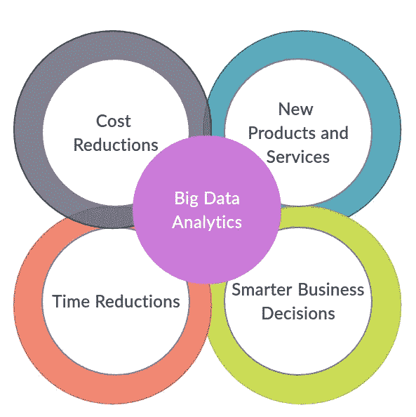

# 为什么选择大数据？

> 原文：<https://towardsdatascience.com/why-big-data-bf0d65933782?source=collection_archive---------21----------------------->

术语大数据可以描述为大量结构化和非结构化数据。大数据这个术语相当新。甚至在术语出现之前，公司已经使用电子表格、反馈表格和图表处理了几十年的大规模数据集，以跟踪客户的见解和趋势。如今唯一的不同是，我们有合适的工具和技术专家来获得大数据的好处。

# 是什么引发了大数据这一术语…

大约在 2005 年，[当社交媒体开始流行起来](https://ourworldindata.org/grapher/users-by-social-media-platform?time=2019&country=Facebook~Instagram~MySpace~Pinterest~Reddit~Snapchat~TikTok~Tumblr~Twitter~WeChat~Whatsapp~YouTube)并且大约在 2010 年有 50 亿部手机在使用的时候，人们意识到每天产生多少数据。我们可以肯定今天会有更多的数据产生，希望你能理解。脸书、Twitter、LinkedIn 等社交媒体平台上的数十亿社交媒体用户每天产生大约 250 万 TB 的数据。手机，我们安装在手机上的应用程序也是大数据的主要来源，这些大数据每时每刻都在为我们的核心做出贡献。[谷歌现在平均每秒处理超过 40，000 次搜索](https://www.internetlivestats.com/google-search-statistics/)(每天 35 亿次搜索)！。它是否让你想到上个月，去年你在谷歌搜索了多少次？所有这些都导致了对严重增长的预测。每年全球数据的 40%和全球 IT 支出的 5%。如此多的数据确实推动了数据科学领域开始保留其自身和当今的商业世界。

# 那么是什么让大数据有价值呢？

正是应用以及大数据如何服务于人类需求，让大数据变得有价值。大数据允许我们建立更好的模型，从而产生更高精度的结果。我们正在目睹公司如何营销自己和销售产品的巨大创新方法。如何管理人力资源？如何应对灾难？和许多其他应用，基于证据的数据正被用来影响决策。

举个例子，你们可能都在 YouTube 上有过这样的经历，他们保存了我们已经观看的视频的详细信息，并根据我们使用 YouTube 的兴趣和行为来展示下一个要观看的视频。这缩小了我们必须经历的巨大选择范围。因此，正如 YouTube 一样，其他企业也可以利用技术，根据实际消费者发出的信号，做出更明智的决策。大数据使商业人士能够听到每个消费者的声音，而不是普通消费者的声音。

你可能已经注意到，在使用脸书的时候，出现在你面前的广告是基于你过去通过浏览器搜索的内容，以及你在帖子上分享和评论中讨论的内容。这就是惊人的大数据的工作方式。现在，许多公司，包括沃尔玛、塔吉特百货和亚马逊，都使用这些信息来个性化他们与客户的沟通，这反过来又能更好地满足消费者的期望，让客户更满意。也就是说，大数据实现了个性化营销。消费者通过 Twitter 或脸书等社交媒体网站产生大量可公开获取的数据。通过这些数据，这些公司能够看到他们的购买历史，他们搜索了什么，他们看了什么，他们去过哪里，以及他们通过喜欢和分享对什么感兴趣。

因此，通过检查大规模和各种数据集，即所谓的大数据，可以发现隐藏模式等信息。未知的相关性、市场趋势和客户偏好，可以帮助组织做出明智的业务决策。这将导致组织更聪明的业务活动，更有效的运作，更满意的消费者和更高的利润。

Thomas H.Davenport 在他的报告“[大公司的大数据](https://www.sas.com/en_us/whitepapers/bigdata-bigcompanies-106461.html)”中提到，公司通过以下方式从大数据中获得价值:

大数据分析给公司带来的好处-按作者分类的图表

当存储大规模数据时，使用 Hadoop 和基于云的分析公司等大数据技术可以减少他们微不足道的成本。此外，他们可以找到更有效的方式来开展业务。借助 Hadoop 和内存分析的速度以及识别新数据源的能力，企业可以立即处理分析信息，这有助于企业根据学习结果立即做出决策。举例来说，如果客户改变了他们的偏好，服务很可能会变得不那么有效。组织可以利用大数据做的另一件事是开发基于数据的新产品和服务。大多数在线公司采用这种方法，因为他们显然需要使用基于数据的产品和服务。LinkedIn 就是一个例子，他们正在使用大数据和数据科学家开发一个庞大的产品和功能列表，包括你可能认识的人、你可能喜欢的群体、乔布斯可能感兴趣、谁查看了我的个人资料等。这些产品可以吸引数百万新客户加入 LinkedIn。最后，大数据业务决策还可能涉及其他分析领域，如供应链、风险管理或定价。让大数据决策变得更智能的原因是，使用外部数据源来改进分析。例如，在供应链决策中，公司越来越多地使用外部数据来捕捉和衡量供应链风险。

# 大数据的应用

大数据具有巨大的潜力，可以在许多应用领域实现更高精度的模型。这些高度精确的模型正在影响和改变商业。这里我只举几个例子。我们都熟悉的一个领域是**推荐引擎**。这些引擎利用用户模式和产品特性来预测最佳匹配产品，以丰富用户体验。如果你曾经在亚马逊购物，你知道你会得到基于你以前的购买和搜索的推荐。同样，网飞会根据你的收视历史推荐你观看新的节目。

公司使用的另一种技术是**情绪分析**，或者简单地说，分析对事件和产品的感受。举个例子，在亚马逊，我可以在购买前阅读评论，也可以写评论。通过这种方式，可以通知其他客户。最重要的是，亚马逊可以跟踪特定产品的产品评论和趋势。例如，他们可以判断一个产品评论是正面的还是负面的。由于这些评论是用英语或其他语言写的，它使用了一种叫做**的自然语言处理技术**，以及其他文本分析方法。同样，亚马逊可以分析个人或公众对这种产品的总体看法。这就是为什么情感分析经常被称为观点挖掘。每当重大事件发生时，比如选举，新闻频道就充斥着 Twitter feed 分析。品牌利用情感分析来了解顾客对其产品的态度，积极的、消极的、中立的。这很大程度上依赖于自然语言处理的使用。

移动设备无处不在，人们几乎总是随身携带手机。移动广告对企业来说是一个巨大的市场。平台利用移动设备中的传感器，如 GPS，并基于这种海量数据提供实时的基于位置的广告，提供折扣。这一次，让我们想象一下，我买了一栋新房子，碰巧在家得宝几英里范围内。给我发送关于油漆、货架和其他与新家相关的购买的移动优惠券会让我想起家得宝(最大的家装零售商之一)。我很有可能会去家得宝。

每个企业都想了解他们的消费者的集体行为，以捕捉不断变化的景观。一些大数据产品通过开发模型来捕捉用户行为，并允许企业**为其产品**锁定正确的受众，从而实现这一点。或者为未知领域开发新产品。考虑这个例子。在对他们工作日的销售进行分析后，航空公司可能会注意到他们上午的航班总是售完，而下午的航班则低于容量。该公司可能会根据这样的分析决定增加更多的早间航班。请注意，他们不是使用个人消费者的选择，而是使用所有购买的航班，而不考虑是谁购买的。然而，他们可能会决定更密切地关注这些消费者的人口统计，利用大数据在其他地理区域添加类似的航班。

随着基因组测序技术的快速发展，生命科学行业正在经历生物医学大数据的巨大吸引力。这些生物医学数据正被许多应用程序用于研究和**个性化医疗**。在个性化医疗之前，大多数没有特定癌症类型和阶段的患者接受相同的治疗，这种治疗对一些人来说比其他人更有效。这一领域的研究使分析大规模数据的方法得以发展，以开发适合每个人的解决方案，从而假设更有效。患有癌症的人现在仍然可以接受标准的治疗计划，例如手术切除肿瘤。然而，医生也可以推荐一些个性化的癌症治疗方法。与许多其他领域一样，生物医学大数据应用的一大挑战是我们如何整合多种类型的数据源，以进一步深入了解问题。

大数据的另一个应用来自植入**智能城市**的大量传感器的互联网络。通过实时分析传感器生成的数据，城市可以为居民提供更好的服务质量。它有助于改善日常生活，例如更有效地管理交通流量或最大限度地节约能源。

总结一下，大数据出现的时间并不长，但是这些属性把我们带到了一个数据时代。跨行业的大型组织正在加入这种数据经济。大多数公司不是将传统数据和大数据分开，而是将它们结合起来，形成一个新的综合体。最后，重要的是要记住，大数据的主要价值不是来自原始形式，而是来自对数据的处理和分析，以及从分析中得出的见解、产品和服务。

本文的动机来自加州大学圣地亚哥分校的 *Coursera* 课程系列“大数据专业化”。如果有什么要添加或修改的，欢迎在下面评论。