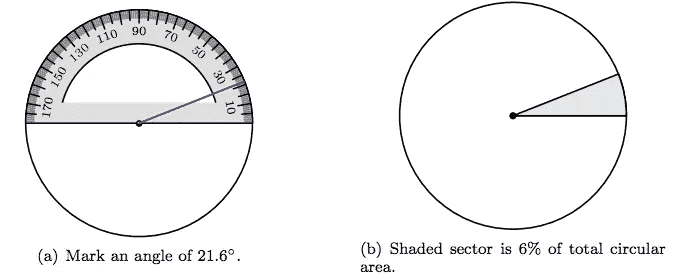
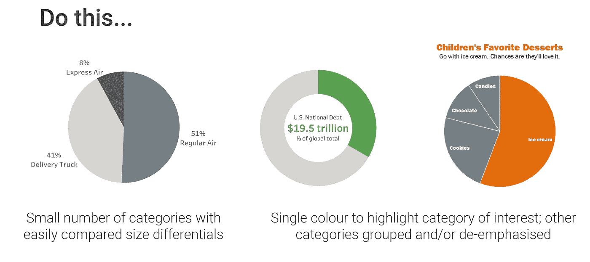
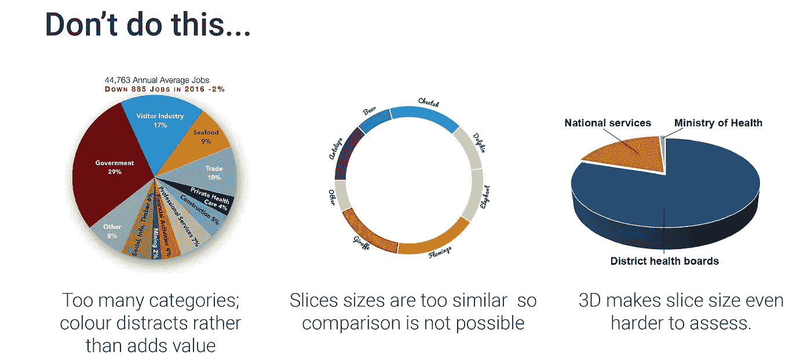

# 为什么生日蛋糕意味着饼状图永不消亡

> 原文：<https://towardsdatascience.com/why-birthday-cakes-mean-that-the-pie-chart-will-never-die-e128e390017?source=collection_archive---------33----------------------->

## 数据可视化大师强烈反对饼图，但大众永远不会被说服——也不应该被说服。

图片由露丝·布莱克在 [iStockphoto](https://www.istockphoto.com/) 上拍摄

在那些从事数据可视化工作的人当中，表达他们对饼状图的厌恶几乎是一种通过仪式，甚至可能被视为一种职业责任，人们会看到他们发出严厉警告，要求他们不惜一切代价避免使用饼状图。我不相信。事实上，我的演示文稿和仪表盘都包含它们，我还在培训课程中教授其他人构建它们。我是一个叛逆者，一个实用主义者，还是饼状图是“邪恶的”这一信息存在根本性的错误？

# 为什么所有的仇恨？

《数据即圣经》“量化信息的可视化展示”的作者爱德华·塔夫特曾被《纽约时报》称为“数据的达芬奇”,他曾说:

> “唯一比饼图更糟糕的是其中的几个”——爱德华·塔夫特

持这种观点的不止他一个人。由数据可视化领导者撰写的无数书籍、文章和博客文章用同样充满激情的标题宣传相同的信息。看看科尔·努斯鲍默·克纳弗里克的《[死亡到饼状图](http://www.storytellingwithdata.com/2011/07/death-to-pie-charts.html)》和斯蒂芬·诺的《[把馅饼留到甜点](http://www.perceptualedge.com/articles/08-21-07.pdf)》。

他们的论点是，人类的大脑并不具备测量角度的能力(这是构建饼图的基础)。

图片由 LibreTexts [数学库](https://math.libretexts.org/Bookshelves/Pre-Algebra/Book%3A_Prealgebra_(Arnold)/07%3A_Percent/7.07%3A_Pie_Charts)

我们的大脑旨在快速处理信息并赋予其意义，但它用于处理信息的属性类型是相似性、接近性和封闭性。它们被称为前注意属性或感知的格式塔法则，Elijah Meeks 写了一系列关于这些如何应用于数据可视化的文章——点击这里查看。有 7 个属性，但角度不在其中。

正是这一点促使数据记者兼 Insider 数据高级编辑 Walter Hickey 在他的一篇博客文章中这样写道:

> “饼图无疑是数据可视化历史上最糟糕的信息传达方式。”—沃尔特·希基

测量角度很难。测量和比较多个角度就更难了。我不否认这一点。这就是为什么我们在学校学会了使用量角器，也是为什么我们中没有人会考虑手工制作一个饼状图。

但是…

当你出生时，你的大脑不知道如何给字母、单词和句子赋予意义——你是被教导的(我假设你在这方面已经达到了相当不错的技能水平，否则你不会读这篇文章)。饼状图也是如此，尽管背景不同。

# 为什么我认为饼图很棒

从我们出生的那一刻起，我们的家庭就向我们强调庆祝我们和我们亲近的人的生日的重要性。庆祝活动的中心总是生日蛋糕。我们很快了解到切片的大小是一个重要的度量。小时候，数量总是胜于质量，所以快速识别并获得最大份额提供了竞争优势。同样重要的是，如果你有兄弟姐妹，确保我们得到的任何一份至少比我们兄弟姐妹的大。或者，如果你出生在一个控制狂的家庭，像我一样(我可能是最大的罪魁祸首)，你会拿出尺子或量角器来确保每个人都得到完全相同大小的一块。

当面对以饼图形式呈现的数据时，这对我们未来的业务环境非常有利。只要切片大小明显不同，并且不太多(记住，我们的大脑一次只能保留大约 5 位信息)，那么我们就可以很好地解释数据。

斯蒂芬·诺曾经说过:

> “数据可视化是抽象信息的图形显示，有两个目的:理解和交流。”—斯蒂芬·诺

我相信这真的是争论的关键。呈现数据是为了向观众传达信息。诚然，作为一种呈现数据的方法，饼状图是我们大脑处理起来更复杂和更困难的方法之一，但就像人类的语言一样，我们从出生就开始练习，所以我们天生就理解这种类型的可视化。正是这种熟悉超越了格式塔法则，并将饼图提升为向商业受众传达数据的最有价值的图表类型之一(与条形图并列)。

(带上网络仇恨者和网络流氓……)

我不是叛逆者，我接受饼图的内在缺陷，但我也是一个相信观察胜过理论的科学家。在我 20 年展示数据和教授数据可视化的经验中，听众更难理解认知上更简单的饼状图类型的替代品，如[树状图](https://datavizcatalogue.com/methods/treemap.html)和[华夫图](https://en.wikipedia.org/wiki/File:Square_Pie_Chart_-_Waffle_Chart.jpg)(尽管我很喜欢它们)。条形图和饼图是所有图表类型中默认的和最多产的，这并不是偶然的。

当精度是关键时，选择条形图——它在比较数值时总是做得更好，但是当你试图制作的数据和点允许时，请随意使用饼图。

这并不是说我提倡饼状图或其表亲甜甜圈图的自由支配。让我对你的数据失去兴趣的最简单的方法就是展示一个 3D 的、爆炸式的饼状图，但那完全是另一回事了。注意良好的信息设计是至关重要的——图表的所有元素都必须支持对受众信息的有效传达。

图片由各种通过谷歌

图片由各种通过谷歌

设计你的图表，不管它是什么类型，最大限度的清晰和交流是关键。饼图不是“邪恶的”，不需要避免，实际上可以成为你的数据可视化工具箱中的一个巨大资产，因为它们很容易被你的观众消费(双关语)。