# 为什么黑洞会发光

> 原文：<https://towardsdatascience.com/why-black-holes-emit-light-908cdef80153?source=collection_archive---------11----------------------->

## 霍金辐射背后的物理学的简单解释

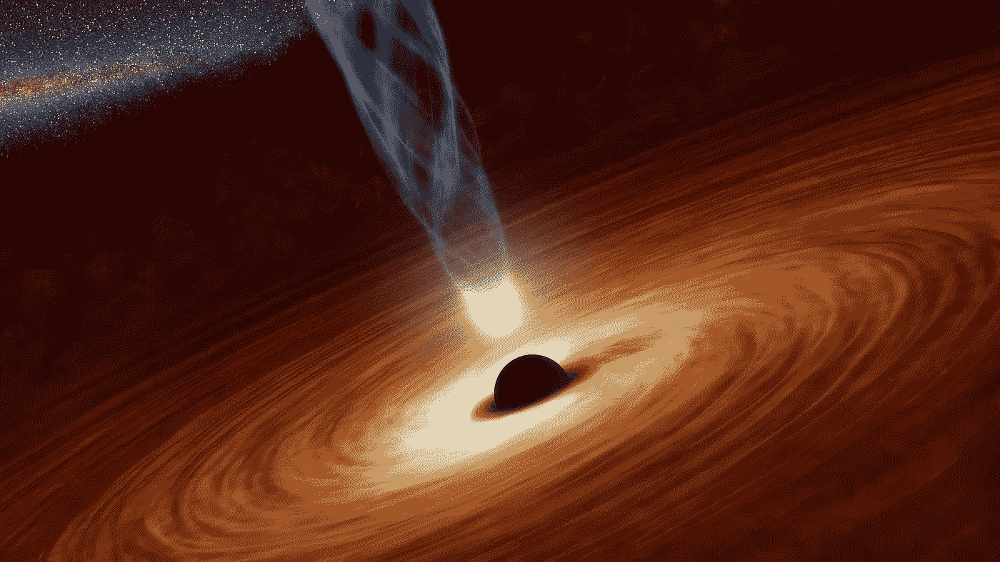

图片标准普尔[大卫马克](https://pixabay.com/fr/users/12019-12019/?utm_source=link-attribution&utm_medium=referral&utm_campaign=image&utm_content=92358)德[皮克斯贝](https://pixabay.com/fr/?utm_source=link-attribution&utm_medium=referral&utm_campaign=image&utm_content=92358)

根据[爱因斯坦的经典引力理论](https://en.wikipedia.org/wiki/General_relativity)，黑洞是一个具有极强引力场的时空区域，任何东西都无法逃离(甚至光也不行)。结果黑洞只能*吸收*物质。这个性质的结果是黑洞的大小永远不会减少。然而，当考虑到量子效应时，这种情况发生了巨大的变化。正如本文将展示的，由于其表面附近量子场的真空波动(所谓的[事件视界](https://en.wikipedia.org/wiki/Event_horizon)，黑洞发射出粒子[，如光子(光的粒子)、中微子等](http://math.ucr.edu/home/baez/physics/Relativity/BlackHoles/hawking.html)。因此，黑洞并不是完全黑的！这一突破性发现的作者是著名的英国物理学家斯蒂芬·霍金。

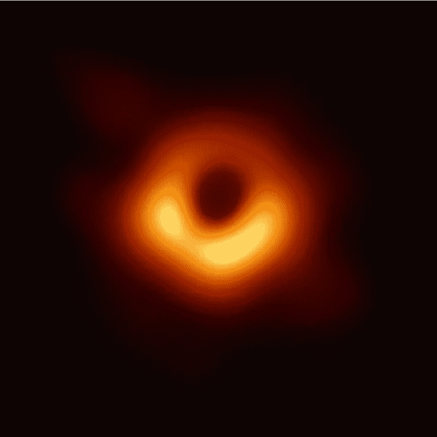

图 1:有史以来第一张黑洞图像。这个特殊的黑洞位于[星系 M87](https://en.wikipedia.org/wiki/Messier_87) 的中心。我们在图像中看到的是来自围绕黑洞旋转的热气的排放物([来源](https://www.npr.org/2019/04/10/711723383/watch-earth-gets-its-first-look-at-a-black-hole))。

粒子是由静态黑洞发出的预测让物理学界大吃一惊。霍金之前的工作表明*旋转的*黑洞产生粒子。但是与他的预期相反，在没有旋转的情况下，不会产生粒子，[他发现](https://link.springer.com/article/10.1007/BF02345020)甚至*静止的*黑洞也会产生粒子。

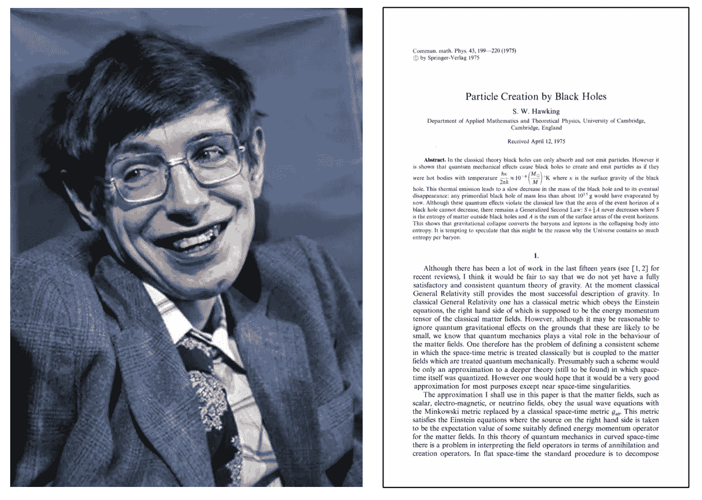

图 2:斯蒂芬·霍金和他的开创性论文([来源](https://www.biography.com/scientist/stephen-hawking))。

在本文中，我将遵循 [Mukhanov 和 Winitzki](https://books.google.com.br/books?id=vmwHoxf2958C&printsec=frontcover&dq=mukhanov+and+winitzki&hl=en&sa=X&ved=0ahUKEwjaxe-J5d3oAhW2LLkGHagCDYEQ6AEIKDAA#v=onepage&q=mukhanov%20and%20winitzki&f=false) 对二维时空中无质量标量场的 Hawking 温度的推导(在 4 维时空中的推导可以在 [Hawking 的原始论文](https://link.springer.com/article/10.1007/BF02345020)中找到)。

## 霍金辐射的物理起源

霍金辐射起源的标准解释如下。一般来说，量子涨落的特点是不断产生虚粒子-反粒子对。在黑洞视界附近经常发生的是，两个粒子中的一个穿过视界，而另一个粒子[作为霍金辐射](http://math.ucr.edu/home/baez/physics/Relativity/BlackHoles/hawking.html)逃逸。

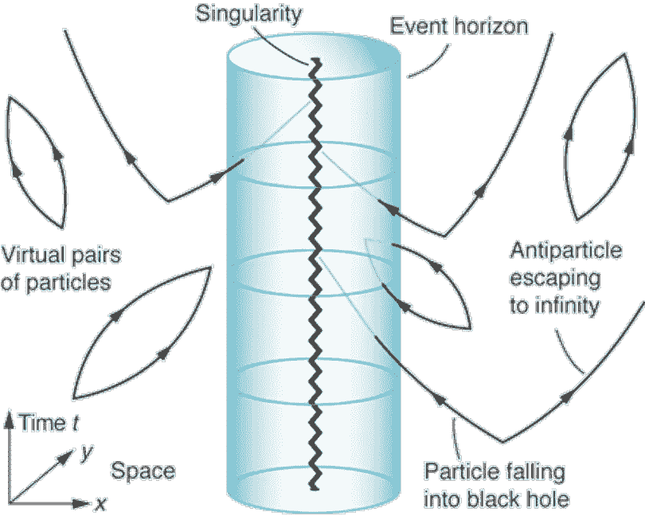

图 3:正如文中所解释的，当一对粒子在黑洞附近产生，其中一个落入黑洞时，另一个粒子作为霍金辐射逃逸([来源](https://science.sciencemag.org/content/295/5559/1476/tab-figures-data))。

虽然这种解释是普遍存在的，但它并不精确地对应于实际的计算，这将在这里解释。关于这个问题更详细的讨论，见[施梅尔策和贝兹](http://math.ucr.edu/home/baez/physics/Relativity/BlackHoles/hawking.html)。

# 史瓦西黑洞

[史瓦西黑洞](http://en.wikipedia.org/wiki/Schwarzschild_Black_Hole)是不旋转的球对称黑洞。它是最简单的黑洞，只包含一个参数，它的质量*m .**2D*史瓦西[线元](https://en.wikipedia.org/wiki/Line_element)在球坐标中表示为:**

**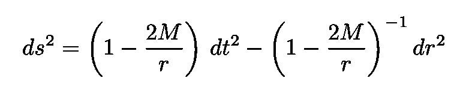**

**方程 1:二维的史瓦西线元素。**

**有关上述表达式的详细解释，请参见下面的文章。**

** [## 循环虚时间和温度之间的神秘联系

### 一个显而易见的事故可能蕴含着物理学上的一个巨大谜团

towardsdatascience.com](/the-mysterious-connection-between-cyclic-imaginary-time-and-temperature-c8fb241628d9) 

情商。1 似乎表明在[史瓦西度规](https://en.wikipedia.org/wiki/Schwarzschild_metric)中有两个[奇点](https://en.wikipedia.org/wiki/Gravitational_singularity)(时空中引力场变为无穷大的位置)，一个在 *r* =0，另一个在 *r* = 2 *M，*即所谓的[史瓦西半径](https://en.wikipedia.org/wiki/Schwarzschild_radius)。更具体地说，代入 *r* = 2 *M，*线元素的两个分量变成:

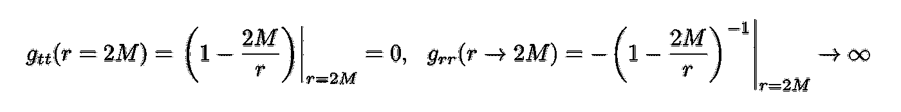

等式 2:在 r=2M 时计算的(t，r)坐标中的史瓦西度规张量的分量。

然而，正如下一节将要展示的，史瓦西黑洞唯一的物理奇点[位于 *r* =0。在 *r* = 2 *M* 处的明显奇点实际上仅仅是一个坐标奇点，可以通过转换到一个新的坐标系统来消除。为了说明这一点，我们将引入所谓的](https://en.wikipedia.org/wiki/Gravitational_singularity)[克鲁斯卡尔–塞克雷斯坐标](https://en.wikipedia.org/wiki/Kruskal%E2%80%93Szekeres_coordinates)。

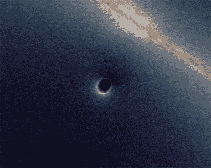

图 4:由史瓦西黑洞产生的引力透镜(在远程光源和观察者之间发生的物质对光的弯曲)，该黑洞穿过星系的视线平面([源](https://en.wikipedia.org/wiki/Gravitational_singularity))。

## 克鲁斯卡尔-塞克雷斯坐标

Kruskal–sze keres 坐标如下所示。首先定义“[乌龟坐标](https://en.wikipedia.org/wiki/Eddington%E2%80%93Finkelstein_coordinates#Tortoise_coordinate)”*r**(*r*)和对应的乌龟光锥坐标:

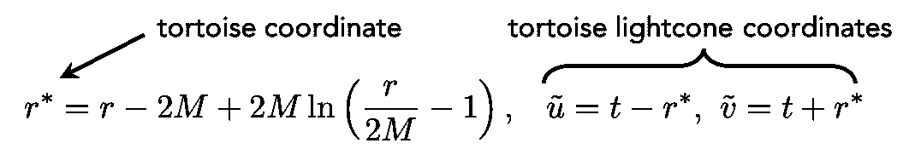

等式 3:乌龟坐标和乌龟光锥坐标的定义。

注意 *r* *在 *r* = 2 *M* 处是单数。这意味着在 *r* = 2 *M* 处也是奇异的乌龟光锥坐标不覆盖被定义为黑洞内部的*r*2*M*的区域。为了覆盖整个史瓦西黑洞时空，我们需要再次改变我们的坐标系。这个新坐标系将是[Kruskal–Szekeres 光锥坐标](https://en.wikipedia.org/wiki/Kruskal%E2%80%93Szekeres_coordinates)的[解析延伸](https://en.wikipedia.org/wiki/Analytic_continuation)，定义如下:

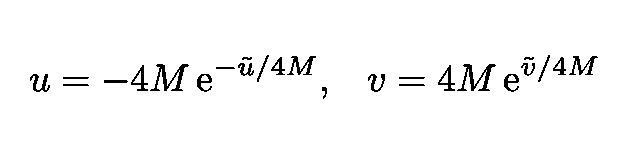

等式 4:克鲁斯卡尔–塞克里斯光锥坐标。

线元素变成:

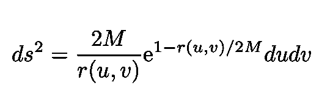

等式 5:等式中 Kruskal–Szekeres 光锥坐标中的线元素。4.我们注意到 r=2M 处的奇点不存在。

现在和 Eq 比较一下。1.我们看到，选择这种坐标系，史瓦西半径 r*T21 = 2*M*处的奇点消失。因此，如前所述， *r* = 2 *M* 是[坐标奇点](https://en.wikipedia.org/wiki/Coordinate_singularity)(坐标系的一种手段)而不是[物理奇点](https://en.wikipedia.org/wiki/Gravitational_singularity)。这意味着当自由落体的观察者穿过半径 *r* = 2 *M，*他不会感觉到任何异常。*

现在，请注意，Kruskal–Szekeres 光锥坐标具有以下有效域:-∞ < *u* < 0 和 0 < *v* < ∞。这些坐标不包括区域*r<2*M*。换句话说，它们只在黑洞外有效，对于*r>2*m .*然而注意，线元素 Eq。5 对于所有-∞ < *u* < ∞和-∞ < *v* < ∞都是定义良好的，覆盖了所有的史瓦西时空。然后我们必须[解析地](https://en.wikipedia.org/wiki/Analytic_continuation)扩展坐标 *u* 和 *v* 以包括值 *u* > 0 和 *v* < 0。**

在 [Mukhanov 和 Winitzki](https://books.google.com.br/books?id=vmwHoxf2958C&printsec=frontcover&dq=mukhanov+and+winitzki&hl=en&sa=X&ved=0ahUKEwjaxe-J5d3oAhW2LLkGHagCDYEQ6AEIKDAA#v=onepage&q=mukhanov%20and%20winitzki&f=false) 之后，我们可以使用等式根据原始坐标( *t，r* )来表示新的、克鲁斯卡尔-塞克雷斯光锥坐标( *u* ， *v* )。第三第四第五。我们得到以下两个关系:

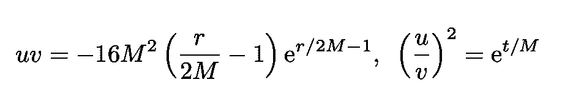

等式 6:根据 *t* 和 *r.* 的 Kruskal–Szekeres 光锥坐标

假设我们解析地继续 *u* 和 *v* ，这些关系将对所有史瓦西黑洞时空有效。

为了获得著名的史瓦西黑洞的 Kruskal-Szekeres 图，我们引入了两个新的坐标，即

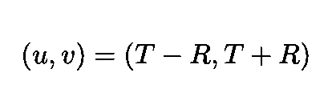

等式 7:坐标 u 和 v 的定义。

现在，为了覆盖整个图表，我们必须扩展坐标( *u* ， *v* )。将扩展变量( *u* ， *v* )用原始坐标( *t* ， *r* )表示，我们得到两组坐标，即:

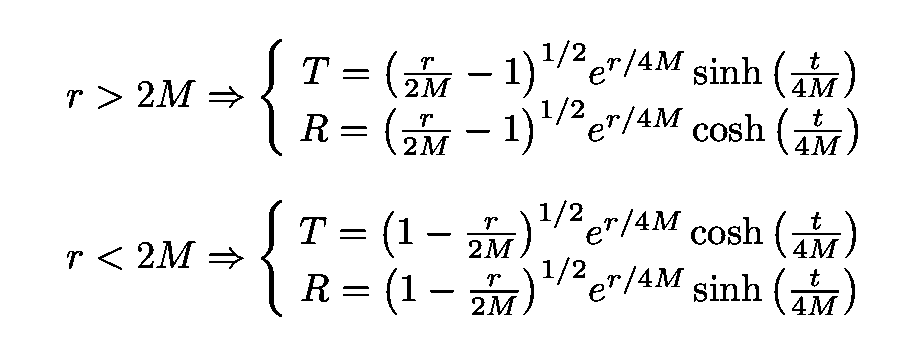

等式 8:史瓦西黑洞几何上的两组 Kruskal–Szekeres 坐标。顶部的一对坐标覆盖了黑洞的外部( *r >* 2 *M)* ，而底部的一对坐标覆盖了其内部( *r <* 2 *M)* 。

Kruskal-Szekeres 图如下所示:

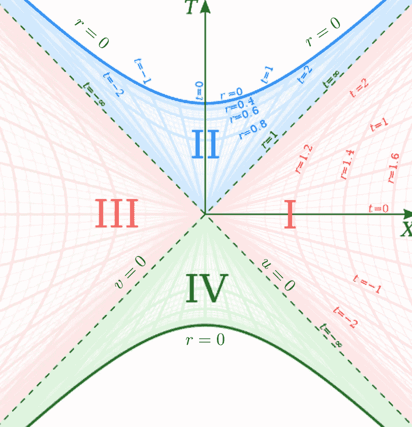

图 5:Kruskal–Szekeres 图，其中轴是坐标(T，R)。史瓦西黑洞时空被分成四个渐近区域 I、II、III 和 IV。常数 r 的曲线是双曲线，常数 t 的线是直线([来源](https://en.wikipedia.org/wiki/Kruskal%E2%80%93Szekeres_coordinates))。

请注意几个重要特征:

*   我们看到( *u* ， *v* )零测地线是斜率为π/4 和-π/4 的线
*   来自 Eq。6、超曲面 *r* = const 对应于 *T* - *R* 平面中的以下双曲线:

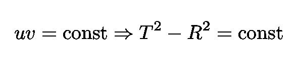

等式 9:超曲面 *r* = const 对应于 *T* - *R* 平面中的以下双曲线。

*   来自 Eq。6、对于*r>2*M，*我们有*uv<0，这就暗示了双曲线 *r* =常数由等式。9 是时间型的。对于 *r <* 2 *M* 则相反， *uv >* 0 和双曲线 *r* =来自等式的常数。9 个是类似太空的。所以只有在黑洞之外，史瓦西坐标 *r* 才有通常的解释。**
*   从等式中的第二个表达式。6、我们看到曲面 *t* =常数用直线表示。对于 *r <* 2 *M* (黑洞内)时间 *t* 成为空间坐标。在外面， *t* 仍然解释为时间。不严格地说，在视界内部，空间和时间被有效地互换了！
*   在 *T* 的两个值处出现两个奇点:

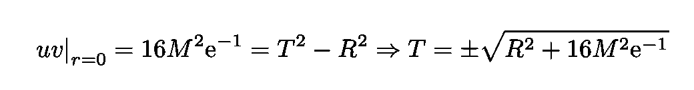

方程 10:对应于 r=0 的两个类空奇点。

*   超出两个 *r* = 0 曲面的区域不能被这些坐标覆盖。

# 量化

为简单起见，让我们写出二维弯曲时空中纯量无质量场的作用:

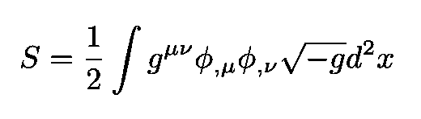

方程式 11:具有度规张量 **g** 的弯曲二维时空中无质量标量场的作用。

*S* 对应的标量场方程可以用光锥乌龟坐标或者 Kruskal–Szekeres 光锥坐标来写。在这两种情况下，它是两项的总和:

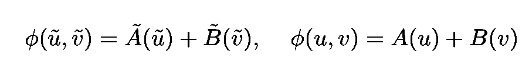

等式 12:根据光锥乌龟坐标和 Kruskal–Szekeres 光锥坐标写出的对应于上述动作 S 的标量场等式。

这是 *S* 的[共形不变性](https://en.wikipedia.org/wiki/Conformal_symmetry)的一个结果(在我之前的一篇文章中有更详细的解释)。 *A* s 和 *B* s 是行为良好的函数(有和没有“~”)。下面的解决方案就是一个简单的例子:

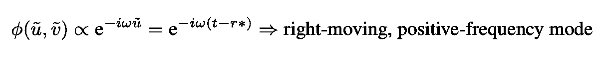

等式 13:这个解表示从黑洞传播出去的右移模式(相对于史瓦西时间 t)。

根据光锥乌龟坐标书写的史瓦西线元素由下式给出:

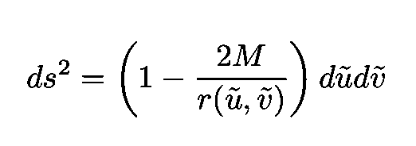

等式 14:用光锥乌龟坐标书写的史瓦西线元素。

在离黑洞很远的地方，这条线元素变成了:

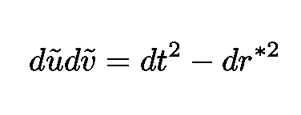

等式 15:上面 r → ∞的线元素。

我们看到，在离黑洞非常远的地方，静止观测者的适当时间与等式中的 *t* 重合。15.因此，该观测器将具有正 *ω* 的模式(相对于 *t* 的频率)与粒子相关联(参见 [Mukhanov 和 Winitzki](https://books.google.com.br/books?id=vmwHoxf2958C&printsec=frontcover&dq=mukhanov+and+winitzki&hl=en&sa=X&ved=0ahUKEwjaxe-J5d3oAhW2LLkGHagCDYEQ6AEIKDAA#v=onepage&q=mukhanov%20and%20winitzki&f=false) )。

像通常在量子场论中一样，我们根据创造和湮灭算符来扩展场:

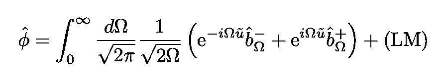

等式 16:确定相关的产生和湮灭算符的场ϕ的展开。(LM)代表向左移动的模式。

对应于 *b* 湮灭算符的真空被称为 Boulware 真空，根据远离黑洞的观测者的观察，它不包含任何粒子:

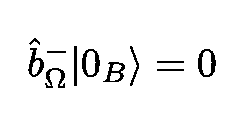

方程式 17:boul ware 真空。

正如我们之前看到的，光锥乌龟坐标只覆盖了史瓦西黑洞时空的一部分(在视界之外)，Boulware 真空在视界上有奇异的行为，因此它在物理上是不成立的。此外，相应的能量密度将在视界处发散，量子涨落将产生强烈的逆反应，这将使弱扰动经典引力场的基本假设无效。

与光锥乌龟坐标相反，Kruskal–Szekeres 光锥坐标覆盖了所有的 Schwarzschild 黑洞时空，并且在事件视界处定义明确(非奇异)。在地平线附近，Kruskal–sze keres 坐标中的线元素为:

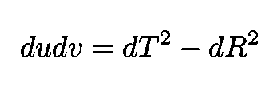

等式 18:地平线附近 Kruskal–sze keres 光锥坐标中的线元素。

因此，穿过视界的观察者与相对于 *T* 频率ω > 0 的模式相关联。再次扩大领域，如方程式。16 我们得到:

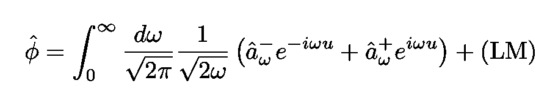

等式 19:使用 kruskal–szekeres 光锥坐标定义相应的产生和湮灭算子的场ϕ的扩展。和以前一样,( LM)和以前一样代表左移模式。

非奇异真空态现在具有有限的能量密度，导致量子波动的小逆反应，让经典引力场保持应有的微扰。克鲁斯卡尔真空，遵守

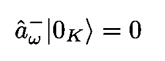

方程式 20:克鲁斯卡尔-塞克里斯真空所遵循的条件。

因此，可以用黑洞附近的“真正”真空来鉴别。

现在，对于远处的观察者来说，克鲁斯卡尔-塞克里斯真空**包含了粒子**！它们的数量密度可以精确地按照我以前的一篇文章结尾的步骤得到，链接如下。我们需要做的唯一修改就是将加速度 *a* 替换为 1/4 *M* 项(即所谓的[表面重力](https://en.wikipedia.org/wiki/Surface_gravity#Schwarzschild_solution))。

 [## 当量子场遇到引力:Unruh 效应

### 加速度和温度之间的关系

towardsdatascience.com](/when-quantum-fields-meet-gravity-the-unruh-effect-69d03783d6bb) 

然后，我们获得由远处观察者测得的热光谱和相应的[霍金温度](https://en.wikipedia.org/wiki/Hawking_radiation#Emission_process)的以下表达式:

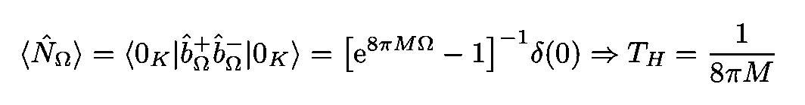

方程 21:远处观测者测得的热谱，以及相应的温度(所谓的霍金温度)。

霍金辐射非常暗淡，被落入我们目前识别的所有黑洞中的大量热气体发出的辐射淹没。

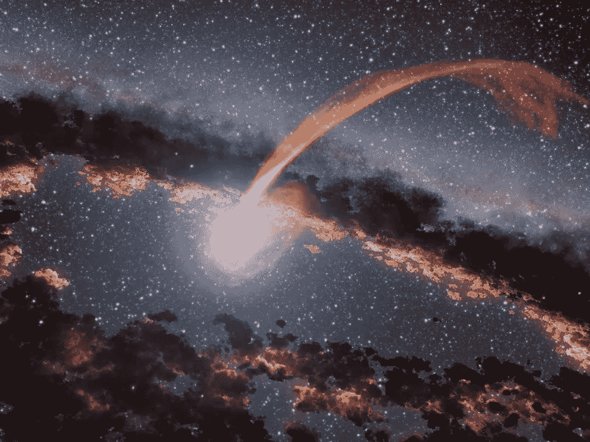

图 6:一颗恒星发出的炽热物质流被一个被尘埃环包围的黑洞吞噬的示意图。

这可能是它还没有被观察到的原因之一。来自 Eq。21，我们看到只有质量极小的黑洞才会发出强度可测量的霍金辐射。

我的 Github 和个人网站 www.marcotavora.me 还有一些其他有趣的材料，既有关于物理的，也有关于数学、机器学习、深度学习和金融等其他主题的。看看吧！**