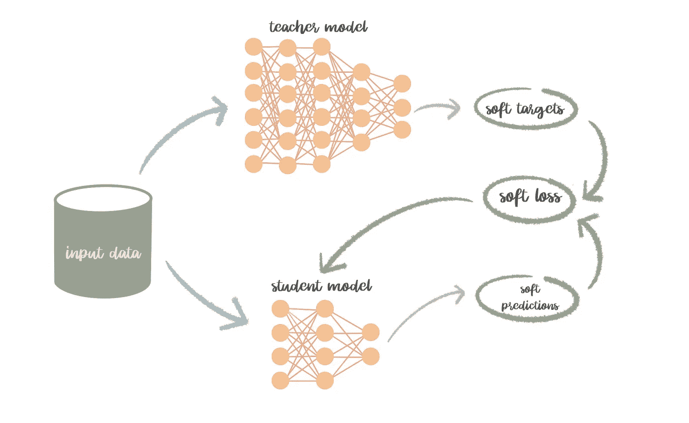

# 小的就够了，为什么还要费心部署一个巨大的神经模型呢？

> 原文：<https://towardsdatascience.com/why-bother-deploying-a-huge-neural-model-when-the-small-one-is-enough-47b9a2da8df1?source=collection_archive---------57----------------------->

## 性能优于原始技术的模型压缩技术

西蒙·米加吉在 [Unsplash](https://unsplash.com/t/nature?utm_source=unsplash&utm_medium=referral&utm_content=creditCopyText) 上的照片

深度神经网络是一种强大的机器学习方法。它在许多任务中有着非常出色的表现，包括视觉识别、自然语言处理以及语音识别。建立一个在下游任务中表现良好的深度神经网络通常需要拥有数百万甚至数十亿个参数。Krizhevsky 的模型赢得了 ImageNet 的图像分类竞赛，它有超过 6000 万个参数，只有五个卷积层和三个全连接层[1]。

部署具有这些巨大参数的模型需要大量资源和计算开销。而有时目标设备具有有限的资源，并且计算将是繁重的，尤其是对于实时应用或具有在线学习算法的应用。那么，我们如何在减小模型尺寸的同时，实现与原来更大的模型相同的性能呢？我们能否以某种方式将知识从大模型转移到小模型？

在这篇文章中，我们将通过模型压缩技术将知识从庞大的神经模型转移到较小的神经模型，而不会显著降低性能。对神经模型进行模型压缩可以通过使用参数共享和修剪或者通过使用知识提取来完成。我们将会看到它们的区别、优点和缺点。

## 参数共享和修剪

参数修剪和共享的思想是通过探索模型参数的冗余。通过检查原始模型参数，我们希望去除冗余和不敏感或不重要的参数，同时仍然保证原始模型的性能。在丢弃冗余参数后，具有 50 个卷积层的 ResNet-50 具有超过 38 亿个参数，可以节省超过 75%的参数和 50%的计算时间[1]。进行参数共享和修剪的三种技术是量化和二值化、参数修剪和共享以及结构矩阵。

*   **量化和二值化。**这种技术的思想是通过减少存储每个权重的位数。这种技术的极端情况是进行二进制化(使用 0-1 权重值)，如 BinaryConnect、BinaryNet 等。这种技术的缺点是使用大型 CNN，如 GoogleNet，会大大降低模型的准确性。
*   **参数修剪和共享**。就像名字一样，这种技术试图在一个预先训练好的 CNN 中去除冗余和无信息的权重。然而，在全连接层中使用这种技术可能会消耗大量内存。可以通过减少整个网络中的参数和操作的总数，或者通过使用哈希函数将权重分组用于参数共享，来去除权重。
*   **结构矩阵**。为了修剪完全连接的层，我们可以应用具有更少参数的矩阵乘法。这将减少记忆成本，也加快了推理和训练阶段的时间。但是，加入矩阵乘法可能会给模型带来偏差；因此，它可能会影响性能。即使找到合适的结构矩阵也很困难，因为没有理论上的方法来推导它。

由于所有的技术都试图删除一些模型参数，因此很难保持性能不下降。

## 知识蒸馏

与试图降低权重的参数剪枝和共享不同，知识提炼试图在更紧凑的模型(学生)中再现繁琐模型(教师)的输出。以便学生模型能够以与教师模型相同的方式进行归纳。不正确答案的相对概率显示了模型的泛化倾向。比如一张汽车的图像，可能有极小的概率被误认为是公交车，但这个概率还是比误认为是食物要大。

由于概率告诉我们关于教师模型的性能，我们然后可以使用这些概率作为目标标签来训练学生模型以转移概括能力。这些概率被称为**软目标。**

> “当软目标具有高熵时，它们为每个训练案例提供的信息比硬目标多得多，训练案例之间的梯度差异也小得多，因此小模型通常可以在比原始笨重模型少得多的数据上训练，并使用高得多的学习率。”[2]

为了训练学生模型，我们可以使用相同的训练集，或者使用与教师模型不同的训练集。图 1 显示了知识提炼是如何工作的。我们通过在训练时使用软损失来更新学生模型。但是，向学生模型提供有关硬标签的信息可以显著提高其性能。因此，我们不是使用软损失来更新学生模型，而是使用硬损失来更新它。硬损失是由带有基本事实标签的硬预测产生的熵损失。在训练学生模型时，我们使用软损失和硬损失的加权平均值。

图一。使用教师模型中的软目标传递知识插图[图片来自作者]

在 MNIST 数据集上，该模型即使在用于训练学生的训练数据缺失的情况下也能取得很好的效果。这种方法也适用于大型数据集。它表明，对于包含 1 亿张带标签图像的 15000 个类别的内部谷歌数据集 JFT 来说，进行知识提取可以更快。作者将数据集分成 61 个专家模型(具有子集训练数据的小模型)，每个模型中有 300 个类别。在较小的专业型号上，培训只需要几天时间，而不是几个星期。这些专家模型所做的其他改进是，与笨重的模型相比，准确性提高了 4.4%。

看到这种知识提炼的结果可能会引发一个问题*“这种方法会在每个数据集上都表现良好吗？”*。通过研究浅线性和深线性分类器的特定情况[3],知识提炼的成功有三个关键因素:

*   **数据几何**。第一个特征是我们用来训练模型的数据分布的几何属性，即类分离。类别分离对风险的收敛速度有直接影响。结果表明，多项式次数越高的数据越有效，学生获得的风险越低。
*   **优化偏差。**不仅在知识提取阶段，优化偏差通常也会影响训练阶段的收敛速度。在这种情况下，使用梯度下降非常有利于最小化学生目标。
*   **单调性强。**至于当我们增加训练数据的数量时，神经网络中的训练通常如何更好地工作，这也适用于这里。如果通过增加训练数据的数量来降低学生模型的风险，知识提炼将会起作用。

根据这些实验的结果，作者假设类似的特性也发生在非线性分类器中。尽管知识提炼取得了成功，但它也有一些缺点。其中之一是这种技术只能应用于具有 softmax 函数的分类任务，这限制了它的使用。另一个是，有时模型假设过于严格，无法使不同方法的性能具有竞争力。

## 参考资料:

[1]程，杨，王，周，张，2017 .深度神经网络的模型压缩和加速综述。 *arXiv 预印本 arXiv:1710.09282* 。
[2]辛顿，g .维尼亚尔斯，o .和迪安，j . 2015。从神经网络中提取知识。 *arXiv 预印本 arXiv:1503.02531* 。
[3] Phuong，m .和 Lampert，c .，2019 年 5 月。走向理解知识的升华。在*机器学习国际会议上*(第 5142–5151 页)。