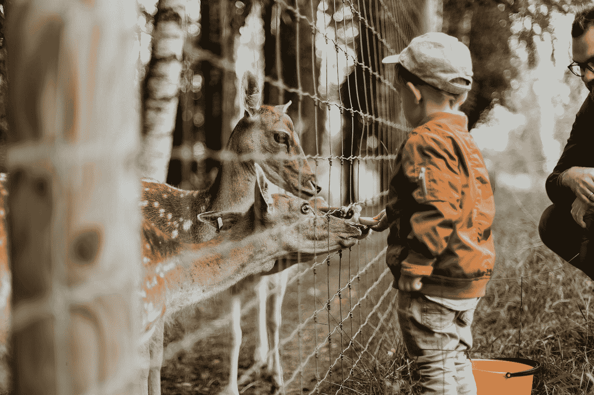
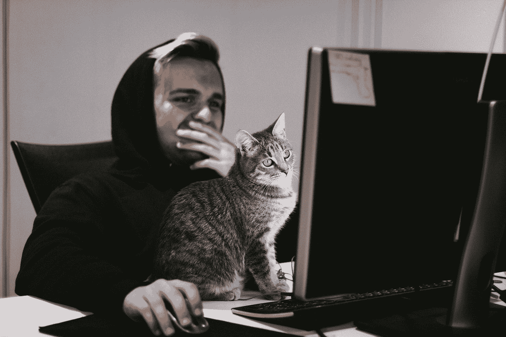

# 我以为动物住在动物园里？从模型动物园中选择计算机视觉模型

> 原文：<https://towardsdatascience.com/why-build-a-model-if-you-can-steal-one-computer-vision-without-training-models-c259a165cd90?source=collection_archive---------48----------------------->

## [入门](https://towardsdatascience.com/tagged/getting-started)

## 使用预先存在的计算机视觉模型进行对象检测

[戴加·埃拉比](https://unsplash.com/@daiga_ellaby?utm_source=medium&utm_medium=referral)在 [Unsplash](https://unsplash.com?utm_source=medium&utm_medium=referral) 上的照片

在我的上一篇博客中，我讨论了计算机视觉的一些基本概念，以及如何使用 [OpenCV](https://opencv-python-tutroals.readthedocs.io/en/latest/index.html) 创建面部识别过滤器。但是如果你想在图像中检测除了人脸以外的东西呢？有两种可能的前进方式:

1.  **训练你自己的模型:**如果你有很多图像准备好要识别的物体，使用 OpenCV 的内置函数(如 k-Nearest-Neighbors)或更强大的机器学习库，如 [PyTorch](https://pytorch.org/) 和 [TensorFlow](https://www.tensorflow.org/) ，你可以建立自己的模型。然而，这意味着你需要成百上千的图片来显示你感兴趣的物体。为这些创建模型也需要时间、硬盘空间和计算机能力。你还需要已经有各种计算机视觉训练算法的知识，如区域卷积神经网络(R-CNN)，更快的 R-CNN，你只看一次(YOLO)。
2.  **使用预先存在的公开可用模型:**网上有许多资源可以帮助您在程序、应用或动态分析中构建对象检测。在我的上一篇博客中，我利用 OpenCV 预先训练的人脸和眼睛的 haar 级联模型快速构建了一个有趣的人脸过滤器。像脸书·艾的 [Detectron2](https://github.com/facebookresearch/detectron2) 等 Python 库有强大的预训练模型准备就绪(通常被称为*模型动物园*)。许多人在[上下文中的公共对象(COCO)](https://cocodataset.org/) 图像数据集上接受训练。或者，你可以在网上找到预先训练好的模型，导入深度学习框架，如 PyTorch 或 TensorFlow，如[ModelZoo.co](https://modelzoo.co/)等网站。

[Ga](https://unsplash.com/@neringa?utm_source=medium&utm_medium=referral) 在 [Unsplash](https://unsplash.com?utm_source=medium&utm_medium=referral) 上拍照

上述选项中的后一种显然灵活性和可定制性要差得多。因此，如果你试图在一幅图像或一段视频中发现一些非常独特的东西，最好还是走自己的路线。但是，根据您项目的目标和需求，使用来自*模型动物园*的现有模型可能对您有利，因为它可以节省您的时间、精力和硬盘空间。例如，在我的上一篇博客中，这个项目的目标并不是真的需要训练我自己的面部识别模型。我想看看能不能造出一个很酷的滤镜戴在人们的脸上。如果我试图训练我自己的模型，我将需要找到或创建一个面部图像数据集(这本身需要时间)，然后训练模型。但是，我所需要的是哈尔瀑布，然后我准备去。因为对象检测是一项如此常见的任务，所以使用我现有的工具要有效得多。更进一步说，许多模型很容易实现，根本不需要实际了解它们是如何工作的，也不需要太多关于计算机视觉的知识。这对于只需要对象检测功能并需要专注于其他任务的软件工程师来说特别好。

## 选择适合您的型号

有这么多模型可供选择，你如何知道在你的项目中使用哪一个？还是应该完全训练你自己的模型？以下是一些需要考虑的事项:

1.  它有你需要的功能吗？有些模型只是帮助你在检测到的物体周围画一个方框，而其他模型可能会帮助你检测物体的更多独特特征，如人的四肢。但是可能没有一个模型是最适合你的，尤其是当你有一个特定的项目时。例如，也许你想检测狮子狗的图像，而不是其他品种的狗。Detectron2 使用 COCO 图像的基线狗检测算法可能会帮助您识别图像或视频中的狗，并丢弃猫的图像，但它不会完全让您达到目标。一种方法是从已有的模型出发，构建你自己的模型。
2.  **训练一个新模特是多余的吗？**因为如此多的物体探测任务都是相似的，我是不是要重新发明轮子来创造一个全新的模型？对于像面部识别或文本检测这样的普通任务来说尤其如此。当然，用这些任务来练习训练是一个很好的编码/建模练习，但是当项目的最后期限即将到来并且已经有太多已经存在的时候，这是多余的。
3.  **够快吗？**许多模型都是使用 R-CNN)、更快的 R-CNN 和 YOLO 等算法构建的。一些算法速度更快，而另一些算法在内存方面效率更高。如果你试图处理视频中的实时图像，一定要使用更快的 R-CNN 或 YOLO。许多模型动物园列出了速度和内存指标供您考虑([这里是探测器 2 的](https://github.com/facebookresearch/detectron2/blob/master/MODEL_ZOO.md))
4.  **是否足够注重细节？**使用 YOLO 算法构建的模型非常快，但有时会以牺牲特异性为代价。因此，YOLO 非常适合视频直播，但可能很难找到远处的人群。根据您试图检测的内容，确保您的模型有能力做到这一点。
5.  **是否符合你的技能水平？**有些模型和 python 包很好拿。我的上一篇博客使用 OpenCV 轻松实现了 haar 级联。但是，请确保您拥有使用您的模型的技能和能力。这似乎是显而易见的，但是你很容易贪多嚼不烂。一些模型可能需要您可能不熟悉的 python 包，或者需要您理解您没有遇到过的概念。我确实遇到过这种情况，当我试图使用某个地方的一个模型时，我感到力不从心。

总的来说，选择一个模型，无论是你创建的还是你发现的，很大程度上是关于平衡效率(计算机的和你的)和任务要求你的详细程度。