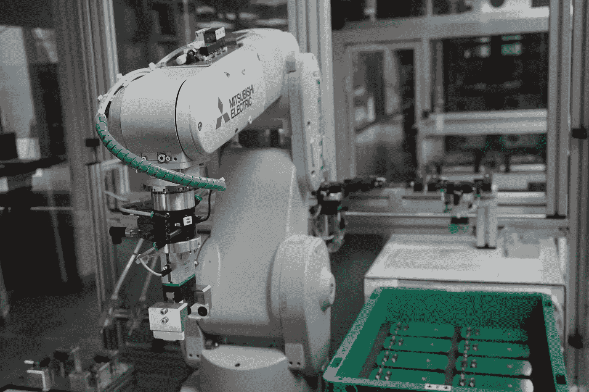
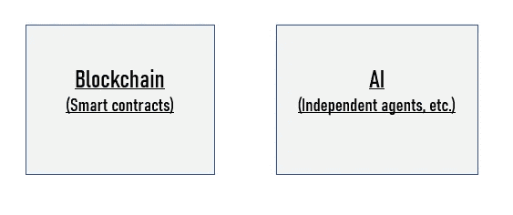
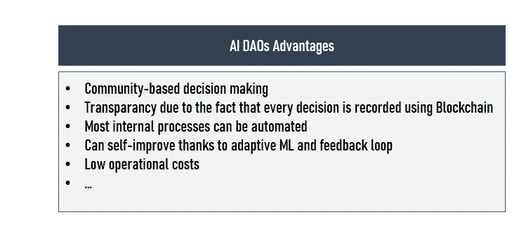
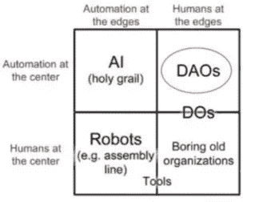
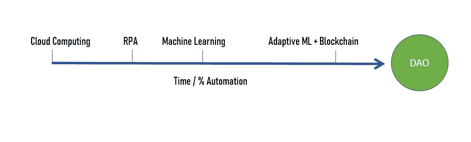
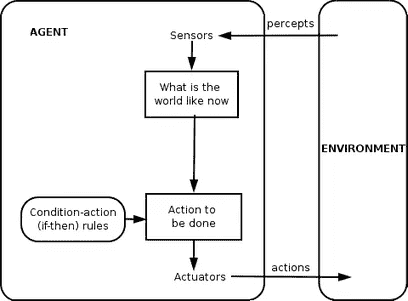

# 为什么要建立人工智能去中心化自治组织(AI DAO)

> 原文：<https://towardsdatascience.com/why-building-an-ai-decentralized-autonomous-organization-ai-dao-85d018700e1a?source=collection_archive---------15----------------------->

## 为什么大多数传统商业组织都处于危险之中(商业模式，AI 代理等。)

帕特里西奥·达瓦洛斯在 [Unsplash](/?utm_source=unsplash&utm_medium=referral&utm_content=creditCopyText) 上拍摄的照片

除了实施人工智能的复杂挑战，一些公司已经开始分析建立人工智能分散自治组织(AI DAOs)的可能好处。

在我最近的任务中，我必须帮助创建新的商业模式，确定正确的人工智能方法，并为创建几个人工智能 Dao 概念证明创建路线图。**事实上，我们认为这些数据驱动的全自动化组织将在未来几年成为大多数传统组织的主要威胁。**

在这篇文章中，我将帮助你理解我们所说的去中心化自治组织(Dao)的含义，从商业模式的角度看它们的战略重要性，以及人工智能在 Dao 崛起中的关键作用。

# 分散自治组织

让我们从定义本文的关键概念开始。

> **(****道*** *):通过编码为计算机程序的规则运行的组织，称为智能合约。(*[*1*](https://en.wikipedia.org/wiki/Decentralized_autonomous_organization)*)**

> *DAO 的目标是创建一个没有“人”的层级管理也能运行的组织。*

*理论上，人类和组织之间的任何交互都可以表示为一个契约。基于区块链技术的智能合同(信息传输和合同执行)使我们能够基于云构建这些类型的组织。目标是能够自动化所有的管理和行政职能。一个 AI DAO 的 AI 方面可以与自主做出决定的独立代理相关。*

**

*Dao 不仅代表了一场技术革命。事实上，人工智能道可以使用人工智能代理创造自己的产品和服务并出售，而利润将归人类所有。我相信，一旦普遍收入在几个国家开始实施，DAOs 将会发挥重要作用。*

> ***三种涉道方式。***
> 
> *1.可以买股票/加密货币/代币
> 2。他们可以授予你
> 3。您可以让他们为 DAO 执行特定的任务*
> 
> *收入部分可以与主动或被动工作相关。例如，查找 bug、开发软件或 DAO 要求的任何任务。被动工作可能意味着共享某些东西，比如你的计算机处理周期、存储，甚至是你的数据。*

*事实上，DAO 是一种实现令牌所有权、契约义务和业务逻辑规则的计算机算法。当所有这些事情结合起来，我们就获得了一个自主的、数据驱动的、透明的公司，通过**智能合约**在虚拟股东之间分配价值。*

> ***智能合同:** *一种自动执行的合同，买卖双方的协议条款被直接写入代码行。守则和其中包含的协议存在于一个分散的区块链网络中。* ( [2](https://www.investopedia.com/terms/s/smart-contracts.asp) )*

**

*根据我的经验，只有少数分散的自治组织(Dao)已经存在，但是它们的规则已经作为智能契约建立起来了。组织可以执行行动，但我没见过独立决策的系统。大多数时候，它遵循智能合约开发人员编写的规则。*

*我们的目标是建立一个不需要人力投入的组织，不仅能很好地运作，而且能对其结构进行独立的深思熟虑的改变。*

**

# *战略重要性*

*出于几个原因，我们相信开发 DAO 的能力将是未来的基础。与目前的组织相比，Dao 有几个竞争优势。*

*由于缺乏层级结构，道安内部的创新过程与传统组织相比可能要好得多。在一个道中，每个创新的想法都可以由任何人提出，并由整个组织考虑。*

*从运营成本来看，**让人类处于边缘，同时受益于自动化和人工智能独立代理是一个重大的游戏规则改变者**。*

*Dao 代表了商业组织发展的一个新阶段。我们认为几种技术(人工智能、区块链等)的融合。)不仅会创造新的商业模式，还会创造新的组织类型，与我们的一些业务部门展开竞争。*

*因此，大公司开始预测 Dao 的影响是非常关键的。我们还希望看到越来越多的小型独立 Dao，每个人都可以轻松地投资其中。出于这个原因，创建我们自己的 AI DAOs 并与我们的客户分享所有权可能是战略性的。这种转变将对客户和组织之间的互动方式产生重大影响。*

**

*由维塔利克·布特林制作*

*我们可能会进入一个时代，在这个时代，大多数公司都可以由人工智能(未来可能是 AGI)来运营，并相互交流。这种潜在的“**人工智能对人工智能的经济**”([3](https://blog.singularitynet.io/how-to-create-the-future-of-decentralized-autonomous-organizations-7919d4e5ce36))对我们现有的商业模式构成了重大威胁。由于与 Dao 相比缺乏竞争力，许多公司可能会消失。我们问自己这样的问题:*

*   *面对一个更好地利用数据并且运营成本更低的组织，我们如何保持竞争力？*
*   *我们的客户会对销售类似产品的爱道有什么反应？
    ”*
*   *能否建立“内部”艾道，将客户转化为投资人？*

# *新的业务模式、路线图和使用案例*

*理论上，我认为 AI DAOs 是有史以来最具成本效益和最开放的商业模式。由于 DAOs 的性质(不需要员工或执行经理)，这些组织可以在几乎不可能的利润率上生存，并且只需要覆盖现有的成本。*

> ***任何企业都可以从一个有着道一样雄心的模式中获益。***

*我们的路线图是逐步实现 AI DAO 概念。它可以从一小部分管理和行政角色的自动化开始，但随着公司变得更加数据驱动，智能合同处理越来越复杂的任务，这些百分比将随着时间的推移而增加。*

**

*此外，我们将 DAOs 视为一个在其实现中具有一定纯度的构造。会有这样的情况，一家公司中只有 10%的人是这样运作的.*

***说到具体的用例，我选择/确定了以下几个:***

*   ***用例# 1——营销** 一种人工智能方式，其中人工智能选择最好的公司或用户来投放广告。在每个营销周期之后，人工智能会评估投资回报率，并相应地调整其营销行动。这个想法是通过反馈环创造一个良性循环，帮助组织不断适应。*
*   ***用例 2——Art** 使用生成模型(gan ),我们可以创建 AI DAOs 来交易他们的作品，并将利润作为加密货币令牌分配给他们的股东。人工智能可以识别新趋势(社交媒体上的 NLP)，创建自己的对象(3D 打印)，并使用自主代理在线销售(特定网站)。利润将使用加密货币进行分配。*
*   ***用例#3 —自动售货机**
    与自动售货机相关的 AI DAO 不仅可以用来取钱和送点心，还可以用这些钱自动重新订购商品。这台机器还将管理清洁服务，并自行支付租金。它没有管理器，所有这些流程都预先写入了代码。( [4](https://cointelegraph.com/ethereum-for-beginners/what-is-dao) )*

*谈到商业模式，我们正处于一场大规模革命的边缘。**事实上，人们将有可能同时选择数百种不同的商业模式并为之做出贡献。***

*我们设想在未来，人们可以搜索他们喜欢的任何类型的企业，评估不同的角色，和/或投资于它们。薪酬将基于绩效，允许每个人完全控制自己的收入。*

# *人工智能*

*正如你可能已经知道的，大多数当前的人工智能解决方案在决策过程中有所帮助**，但很少从他们的行动中学习并优化他们自己做出的决定。**通常，解决这种情况最明显的方法是根据新的可用数据和标签重新训练模型。*

*可能需要适应性 ML 和理解因果关系的改进来解决从错误中学习的能力。因此，我不会说人工智能对于一个复杂的人工智能道已经成熟。*

*我们已经使用负责执行网络决策的人工智能代理建立了分散式组织的概念验证。这种方法提供了更多的可伸缩性。例如，投资者可以简单地将他们的偏好传达给人工智能代理，而不是为每一个行动投票。这些数以百万计的微观决策可以由网络的人工智能代理自动处理。*

> *理想情况下，我们试图建立一个系统，其中不同的人工智能可以寻找不同的参数(例如，品牌，人力资源等。)并为员工和股东做出最佳决策。*

*事实上，AI DAOs 可以结合执行不同子任务的多种算法，并可以访问网络上交换的训练数据。这个想法是创建一个巨大的**反馈回路**，系统将不断地从行动和客户数据中学习。*

*人工智能对于自我管理的理念也是必不可少的。一个特别的例子是，当"一体行动"讨论与供资有关的项目时。在这种情况下，自主代理必须首先确认他们与核心价值和目标一致。*

*我们已经确定了两到三个与 AI 相关的可能的 AI 架构。但是，其他的也可以存在。此外，一条路径可以与其他路径组合。( [6](https://www.slideshare.net/BigchainDB/artificial-intelligence-ai-daos-decentralised-autonomous-organisations-bigchaindb-ipdb-meetup-4-april-05-2017)*

*第一个在今天是不可能实现的，因为我们还没有成功创造出一个**人工智能** (AGI)。想象一下，一个 AGI 系统利用智能合约，负责运行组织并与令牌持有者(人类)进行交互。*

> *人工通用智能:能够像任何人一样理解世界的机器，并且具有学习如何执行大量任务的相同能力。( [7](https://www.zdnet.com/article/what-is-artificial-general-intelligence/) )*

*截至今天，我们认为依赖人工智能代理似乎是最具可扩展性的解决方案。**我们的内部项目基于这种方法。我们经常依赖强化学习算法。***

> ***人工智能代理:**自主实体，通过传感器和随后的致动器对环境进行观察，采取行动，指导其活动实现目标。智能代理也可以学习或使用知识来实现他们的目标。它们可能非常简单，也可能非常复杂。*

**

*[来源](https://en.wikipedia.org/wiki/Intelligent_agent)*

# *劣势和障碍*

*在尝试构建第一个 DAO 概念验证时，我意识到有许多问题需要解决，例如技术限制、复杂性和道德问题:*

***首先，**关键要提醒大家的是，对这项技术的了解和使用案例还很少。由于这个原因，失败的可能性很高。从法律的角度来看，Dao 还没有合法的分类，这是一个问题，因为即使我们成功了，我们也不能合法地将这个自治实体…*

*可以想象，开发一个 DAO 会带来许多与数据安全和特定领域知识相关的问题。由于所有的代码在区块链上都是可见的，并且很容易访问，已知的安全漏洞可能会被黑客利用，直到所有的参与者通过协商一致同意修复缺陷。我们目前正在尝试利用**同态加密**来解决这个问题。*

> ***同态加密:**一种加密方法，允许对密文数据进行数学运算，而不是对实际数据本身进行运算。( [8](https://brilliant.org/wiki/homomorphic-encryption/) )*

*一把刀的制造部分还是有限的。我的意思是，在机器人变得更便宜、更容易使用之前，一个处理实体产品的组织将永远需要人力。商业案例仍然不够明显，不足以说服内部 C 级高管进行大规模投资。*

*另一个挑战是当今组织日益增长的复杂性。事实上，业务流程正变得越来越复杂，因此当涉及到平稳、公平的操作时，一个适当的自管理 DAO 需要考虑更多的问题。**我们的目标是简化和优化治理机制。***

*构建 DAO 概念验证的另一个关键挑战是定义日常业务运营的所有规则。这是一项非常复杂和乏味的任务。理想情况下，您的概念验证可能需要几个月才能成为现实，因为定义和评估所有这些小任务需要时间。*

*总的来说，**一个新刀就像一个创业公司。它需要产品/市场的匹配和可靠的商业模式**。另一个问题与不同人工智能代理的协调有关，以实现整个系统的目标。**即使规则明确且得到执行，问题还是会出现。***

*我们也质疑遗传算法在更新代码中的作用。此外，我们还想确定 Dao 是应该尝试保持其他货币的余额，还是应该只通过发行其内部令牌来奖励行为？*

*由于上述原因，在 AI DAOs 成为可扩展的商业机会并获得牵引力之前，我们还有很长的路要走，但权力结构分散的趋势增加了这些类型的组织很快成为可能的可能性。*

*我认为大公司应该已经尝试建立概念证明，以更好地理解这个新组织如何影响他们的商业模式。*

## *要了解更多信息，我推荐以下链接:*

*   *[人工智能(AI) DAOs(分散自治组织)](https://www.slideshare.net/BigchainDB/artificial-intelligence-ai-daos-decentralised-autonomous-organisations-bigchaindb-ipdb-meetup-4-april-05-2017)*
*   *[如何创造去中心化自治组织的未来](https://blog.singularitynet.io/how-to-create-the-future-of-decentralized-autonomous-organizations-7919d4e5ce36)*
*   *[什么是刀](https://cointelegraph.com/ethereum-for-beginners/what-is-dao)*
*   *[多智能体系统和分散人工超级智能](https://arxiv.org/ftp/arxiv/papers/1702/1702.08529.pdf)*