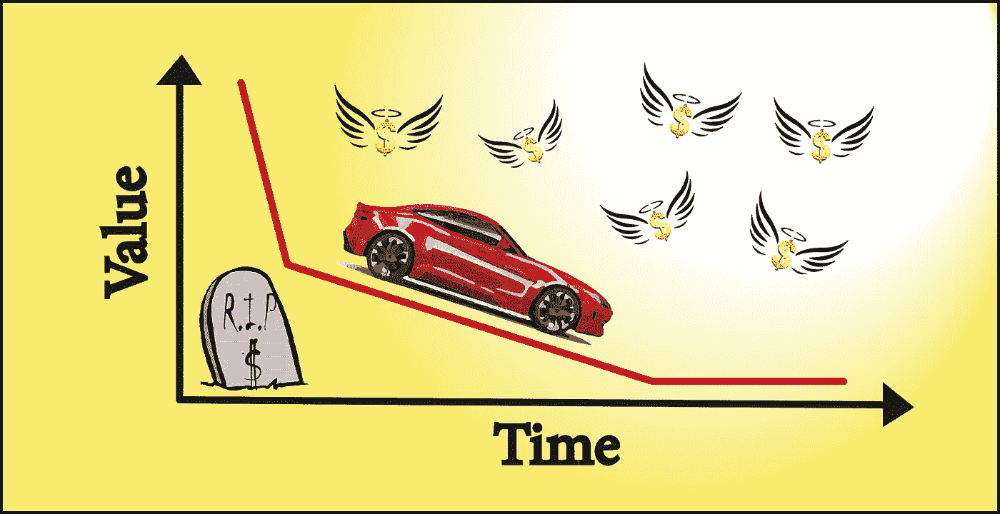
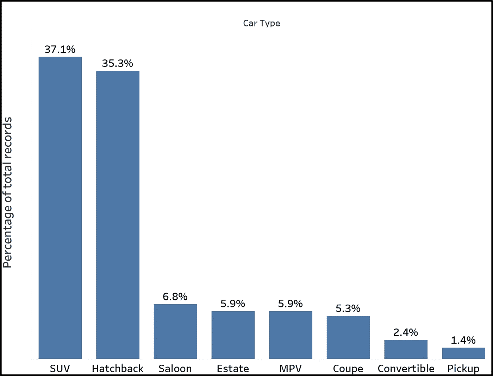
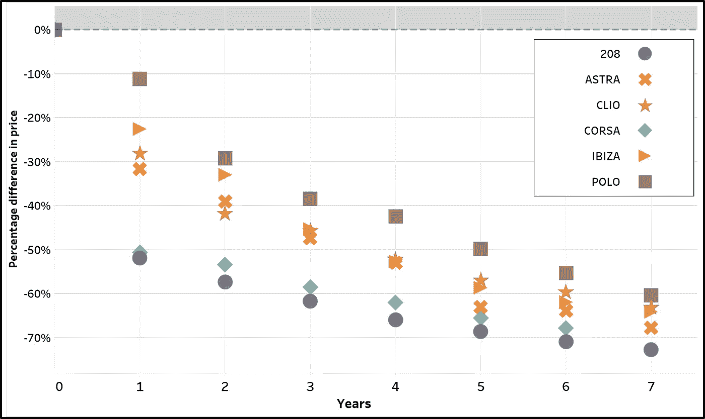
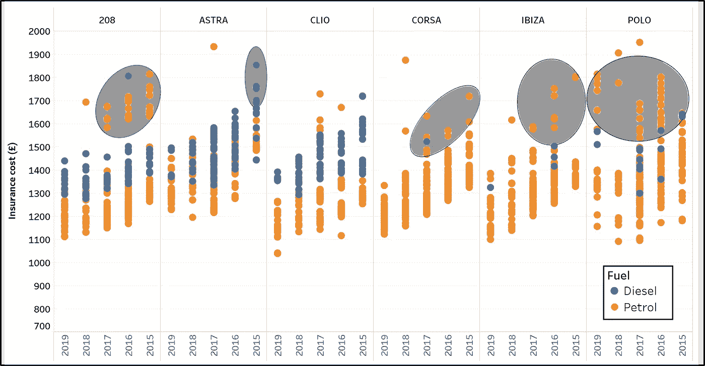

# 为什么买新车可能不是最好的主意？

> 原文：<https://towardsdatascience.com/why-buying-a-new-car-may-not-be-the-best-idea-1370f2a91bfc?source=collection_archive---------77----------------------->

## web 抓取和数据可视化如何帮助您做出更明智决策的示例。

图片由亚历山德拉·布伦南提供

汽车:通勤、旅行、购物的一种方式，根据交通部的说法，是英国最主要的交通方式。2018 年，83%的总行驶公里数是通过汽车完成的。(交通运输统计 GB 2019[1])。汽车广告唤起自由、力量和独立的感觉。将它们持续下降的实际价格[2](名义价格除以通胀)与看似无限的可用金融选项结合起来，难怪 2018 年每户家庭的平均汽车数量为 1.2 辆(不包括伦敦为 1.3 辆)。似乎每个人都能看到拥有一辆车的好处，然而它确实提出了一个问题:买一辆新车在经济上是否明智，或者买一辆二手车是否是一项更合理的投资(提示:是后者)。

为了证明这一假设，使用 python 的 beautiful soup 从一个受欢迎的汽车市场收集了总共 85，000 条新车和二手车记录。搜集到的数据包括平均价格从 8700 英镑(达契亚桑德罗斯)到 101000 英镑(奥迪 RS 7s)的车型。然而，在这项研究中，新车与老款车的比较将集中在**掀背车**上，因为这种车型占总市场的 35%,如下图所示。使用 Tableau 将数据可视化。其余类别/型号的数据，以及其他信息，如每种型号的平均价格和市场份额，可以在 [tableau public](https://public.tableau.com/profile/antonios.alexiadis#!/vizhome/Carvaluedepreciationandinsightfulanalytics_/Story1) 网站上找到。

不同车型的新车/旧车市场份额。包含少于 0.1%的类型被移除以避免视觉混乱。

为了描述价值折旧的幅度，选择了六个模型，如下图所示。这些车型约占两厢车的 17.4%，新车平均价格在 16，700 英镑(雷诺 Clio)至 21，500 英镑(标致 208)之间。该图清楚地表明，一辆新车的价格在一年后平均下降了 30%。第一年内，标致 208 和沃克斯豪尔 Corsa(也称为欧宝 Corsa)的价值降幅最大，达到惊人的 50%。这种下降趋势持续到第 7 年，新车价格平均下降 65%。大众 Polo 似乎是赢家，一年后价值仅贬值 10%，七年后贬值 60%。注意数据中的异方差水平也很有趣。第一年的贬值幅度在 10%和 52%之间，七年后缩小到 60%和 70%，这表明，不管在拥有汽车的最初几年中经历的损失(例如，Polo 车主)，一段时间后，它们都下降到相同的结果。

一些受欢迎的掀背车随着时间的推移汽车价值贬值(%)。大众 POLOs 相比其他车型表现更好。标致 208s 和欧宝 CORSAs 在初次购买后的第一年贬值约 50%。

另一个与拥有汽车相关的重要因素是保险费用。为了确定哪些因素对保险成本的影响最大，上图中所示的掀背车的报价是从保险比较网站上获得的，并在下图中根据其生产年份绘制出来。显示的高保险费用是由于我在英国很少开车，反映了保险公司必须承担的风险增加。然而，很明显，除了汽车的制造年份，一个很大的影响因素是汽车使用的燃料。柴油车的保险费用更高，如 208、ASTRA 和 CLIO 所示。另一个导致灰色区域内保险成本增加的因素是同一型号的高性能、大马力版本的存在。很明显，保险公司在为 200+马力的 208s 和 CORSAs 投保时会感到焦虑。

不同车型的保险成本与生产年份的函数关系。柴油汽车的保险费用更高。灰色区域对应同一型号的高性能版本。

购买新车的诱惑力显而易见:先进的安全功能、较低的维护成本、定制的机会，以及在耗尽你破旧的掀背车后你可能渴望的新鲜的零英里起步。如果一辆新车是不可转让的，考虑你购买的汽车品牌，考虑你是否想在几年内卖掉它，它的价值会下降多少。最终，数据表明购买一辆新车在经济上是不值得的。如果价值上最大的贬值是在第一年，买一辆一两年的车，把剩下的辛苦赚来的钱花在其他东西上:家里，假期，大学，家庭，不是更好吗？

# **参考文献**

[1]交通运输统计，GB (2019)。[https://assets . publishing . service . gov . uk/government/uploads/system/uploads/attachment _ data/file/870647/TSG b-2019 . pdf](https://assets.publishing.service.gov.uk/government/uploads/system/uploads/attachment_data/file/870647/tsgb-2019.pdf)

[2]:剑桥计量经济学(Cambridge Econometrics)，英国消费价格:解释汽车和服装鞋类的实际消费价格下降(2015)。[https://assets . publishing . service . gov . UK/government/uploads/system/uploads/attachment _ data/file/416395/BIS-15-194-consumer-prices-in-the-UK-explain-the-down-in-real-consumer-prices-for-cars-and-closure-and-shoes . pdf](https://assets.publishing.service.gov.uk/government/uploads/system/uploads/attachment_data/file/416395/BIS-15-194-consumer-prices-in-the-UK-explaining-the-decline-in-real-consumer-prices-for-cars-and-clothing-and-footwear.pdf)

[3]:在线视觉供你摆弄 tableau 公共:[https://public.tableau.com/profile/antonios.alexiadis#!/viz home/carvaluedepreciationandsigningfulanalytics _/story 1](https://public.tableau.com/profile/antonios.alexiadis#!/vizhome/Carvaluedepreciationandinsightfulanalytics_/Story1)