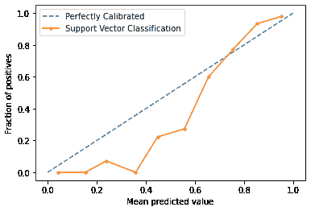

# 为什么选择校准器？概率校准系列的第 1 部分

> 原文：<https://towardsdatascience.com/why-calibrators-part-1-of-the-series-on-probability-calibration-9110831c6bde?source=collection_archive---------22----------------------->

## [概率校准](https://towardsdatascience.com/tagged/probability-calibration)

## 为什么以及何时应该校准分类器的概率


由[威廉·沃比](https://unsplash.com/@wwarby?utm_source=unsplash&utm_medium=referral&utm_content=creditCopyText)在 [Unsplash](https://unsplash.com/s/photos/measurement?utm_source=unsplash&utm_medium=referral&utm_content=creditCopyText) 上拍摄的照片

本系列的主题是在标准 ML 课程中很少出现但在行业中经常出现的东西——概率校准。在本系列的第一篇文章中，我将对分类器的概率校准做一个总体介绍，并讨论什么时候使用校准品是有意义的。

# 介绍

在机器学习中，有时需要**概率**分类器——不仅返回最可能的类别标签，还返回该类别的概率的分类器。当预测的概率与感兴趣的事件的真实概率匹配时，概率分类器被很好地校准。例如，如果欺诈分类器返回 0.1 或 10%的特定信用卡申请欺诈的可能性，如果相似类型的申请在 10 个样本中平均有 1 个是真正欺诈的，则该数字被认为是校准良好的。

当预测概率的绝对值(而不仅仅是等级顺序)对建模者很重要时，这一点很重要。体育博彩就是一个例子。

在 2018 年世界杯之前，[VegasInsider.com](https://www.vegasinsider.com/soccer/story.cfm/story/1892706)公布了德国赢得比赛的 5/1 赔率，这意味着每一美元，如果德国赢了，你可以拿回 6 美元(原始美元加上 5 美元支出)，否则就没有美元。所以如果你想赌德国赢，你最好确定德国比⅙有更大的胜算。如果您构建了一个分类器来预测每个队的获胜概率，并且其输出是德国:0.25，英格兰:0.1，您希望确保分类器告诉您德国有 25%的获胜机会，而不是仅仅说德国比英格兰有更好的机会。


下注之前，先了解自己的胜算。由 [Kay](https://unsplash.com/@kaysha?utm_source=unsplash&utm_medium=referral&utm_content=creditCopyText) 在 [Unsplash](https://unsplash.com/s/photos/casino?utm_source=unsplash&utm_medium=referral&utm_content=creditCopyText) 上拍摄

# 校准图

校准图是检查分类器在已知结果的给定数据集上的校准程度的标准方法。(只对二元分类器有效；对于多类分类器，每个类需要一个单独的校准图)为了创建校准图，遵循以下步骤。

1.  使用分类器对数据集中的样本进行评分。
2.  根据预测的正类概率将数据分组。
3.  计算每个箱中实际阳性的分数。
4.  对于每个条柱，用 y 轴上的实际阳性分数和 x 轴上的条柱中点(平均预测概率)绘制一个点

让我们使用 [sklearn 的 calibration_cruve](https://scikit-learn.org/stable/modules/generated/sklearn.calibration.calibration_curve.html) 在真实数据集上绘制一个校准图

```
from sklearn.datasets import make_classification, load_breast_cancer
from sklearn.svm import SVC
from sklearn.model_selection import train_test_split
from sklearn.calibration import calibration_curve
from matplotlib import pyplot# generate 2 class dataset
X, y = sklearn.datasets.load_breast_cancer(return_X_y=True)# split into train/test sets
trainX, testX, trainy, testy = train_test_split(X, y, test_size=0.5, random_state=2)# fit a model
model = SVC()
model.fit(trainX, trainy)# predict probabilities
probs = model.decision_function(testX)# reliability diagram
fop, mpv = calibration_curve(testy, probs, n_bins=10, normalize=True)# plot perfectly calibrated
pyplot.plot([0, 1], [0, 1], linestyle=' - ', label='perfectly calibrated')# plot model reliability
pyplot.plot(mpv, fop, marker='.', label='Support Vector Classification')
pyplot.xlabel('Mean predicted value')
pyplot.ylabel('Fraction of positives')
pyplot.legend()
pyplot.show()
```



完美校准的分类器具有 y = x 形式的校准曲线，如图中蓝色虚线所示。将 SVC 分类器的校准曲线与完美曲线进行比较，我们可以看到，它预测的概率在低端太低，在高端太高。这是最大利润法的典型情况；彻底的解释可以在[这里](https://scikit-learn.org/stable/modules/calibration.html)找到。

当开箱即用分类器的输出没有很好地校准时，正如我们上面的例子中的情况，可以训练校准器来纠正这种情况。它是从原始分类器输出到校准的概率分数的映射。如何训练这样的校准器是下一篇博文的主题，然而，在训练校准器之前，我们应该首先问自己，校准器是否是绝对必要的。同样值得注意的是，在现实生活中，我们永远无法实现一个“完美校准”的分类器，即使有校准器也不行。我们需要校准曲线与完美曲线的匹配程度在很大程度上取决于具体的使用情况。

# 谷歌的推荐

谷歌工程师在他们的[机器学习速成班——分类:预测偏差](https://developers.google.com/machine-learning/crash-course/classification/prediction-bias)中表达了非常强烈的反对校准器的观点:

> 您可能会尝试通过对学习的模型进行后处理来纠正预测偏差，也就是说，通过添加一个调整模型输出的**校准层**来减少预测偏差。例如，如果您的模型具有+3%的偏差，您可以添加一个将平均预测值降低 3%的校准图层。但是，添加校准层并不是一个好主意，原因如下:
> 
> 你只是治标不治本。
> 
> 你已经建立了一个更脆弱的系统，你现在必须保持更新。
> 
> 如果可能，避免校准层。使用校准层的项目往往会变得依赖于它们——使用校准层来修复模型的所有缺陷。**最终，维护校准层会变成一场噩梦。**

# 何时使用校准品

在同一篇文章中，谷歌还列出了预测偏差的可能根源:

*   不完整的特征集
*   噪声数据集
*   漏洞百出的管道
*   有偏训练样本
*   过度强正则化

我强烈建议在使用校准品之前，仔细阅读该列表并尝试解决这些问题。

话虽如此，尽管谷歌善意的警告，校准器还是经常被使用。这并不意味着它们都是由糟糕的工程师创造的。在实践中，事情要复杂和微妙得多，有时不可能“治标不治本”，以下是一些使用校准品的典型场景:

# 一些类型的分类器本质上没有被很好地校准

谷歌使用逻辑回归作为他们的例子，并声称*“逻辑回归预测应该是无偏的。”*然而，许多其他类型的分类器，例如随机森林或 SVM，却不是这样。特定类型的分类器是否被很好地校准取决于它的学习算法和损失函数。有关一些常见类型的分类器校准效果的详细比较以及对潜在原因的更深入解释，请查看 [scikit-learn 的概率校准指南](https://scikit-learn.org/stable/modules/calibration.html)。

# 训练期间欠采样或过采样

这些是在实践中用于处理数据集中不平衡的技术。例如，在信用卡交易数据集中，可能会有大量的虚假(非欺诈性)结果和相对较少的真实结果。在不平衡的数据集上训练标准的 ML 模型通常是具有挑战性的-少数类的实例很少意味着学习算法通常不能很好地概括少数类的行为。这通常会导致较差的预测准确性。

处理这种情况的一个典型策略是重采样，要么通过欠采样(随机移除多数类的样本)，要么通过过采样(复制数据集中的少数类)。这种策略提高了预测精度，但代价是在训练集和测试集之间引入了类别分布的差异。即使分类器在训练集上校准良好，它也不再在测试集上校准，因为分布已经改变。

[本文](https://www3.nd.edu/~dial/publications/dalpozzolo2015calibrating.pdf)详细研究了这一问题，并介绍了一种获得更加校准的输出的方法，该方法实质上是在原始输出和最终输出之间添加一个校准层。

# 标签移位

标签转移是[机器学习](https://d2l.ai/chapter_multilayer-perceptrons/environment.html#label-shift)中分配转移的一种类型，在生产 ML 系统中很典型。在这种情况下，P(X|y)保持不变，但 P(y)发生变化。这将导致模型产生未校准的结果。再次使用信用卡交易的例子—也许欺诈在 2019 年是一个大问题，10%的交易是欺诈性的，但在 2020 年大多数欺诈者都走了，只有(！1%的交易是欺诈性的。把 2019 年的数据全部扔掉，往往是不可取的。更好的方法是使用更新的数据和新的基础欺诈率来校正模型的校准。[这篇博文](https://www.chrisstucchio.com/blog/2020/calibrated_classifier_base_rates.html)详细分析了这一现象，并提出了一个很好的解决方案。


克里斯·劳顿在 [Unsplash](https://unsplash.com/s/photos/change?utm_source=unsplash&utm_medium=referral&utm_content=creditCopyText) 上的照片

# 部分观察数据集

在生产 ML 系统中，标签有时来自观察到的事件，例如用户是否观看了视频或偿还了贷款，这意味着我们只在具有观察到的事件的数据集上有标签。例如，在信贷承销中，我们只观察已发放贷款的支付模式。如果我们在带有观察标签的训练数据上训练一个模型，它将不会得到很好的校准，因为训练数据的贷款将比测试数据集少得多，测试数据集包括所有传入的申请(假设当前的生产模型在拒绝具有高违约概率的贷款申请方面做得很好)。

这是 ML 中众所周知的反馈循环问题，恢复测试集上正确数据分布的一种方法是使用[exploration](https://tech.affirm.com/exploration-for-machine-learning-at-affirm-632ea5930f54)——批准一些通常被拒绝的贷款申请，并增加这些贷款的权重。然而，这是一个昂贵的策略，在大得多的训练集上是不可取的。即使钱不是问题，它也会遭受其他问题，如高方差和数据集转移。同样，在这种情况下，很难训练一个现成的校准模型，而在一个精确的测试数据集上训练校准器更有效。

# 摘要

在这篇博文中，我解释了为什么对分类器进行校准是重要的，并讨论了何时使用校准器来校正分类器的输出是有意义的，而不是修复算法或训练数据。在接下来的几篇文章中，我将介绍训练校准器的不同方法以及评估它们的方法。