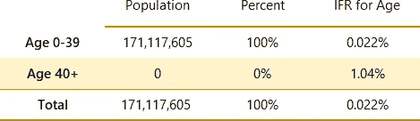
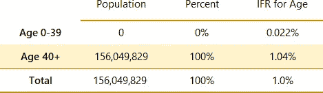
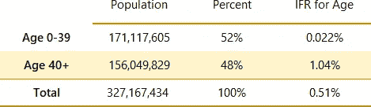
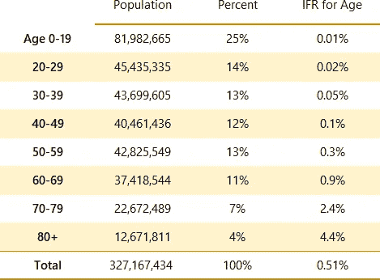
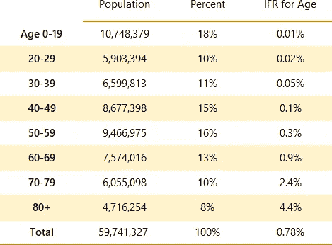
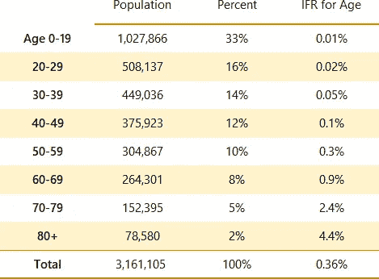
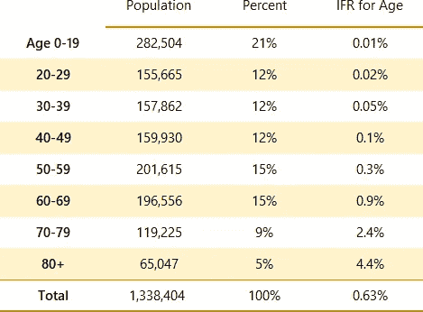
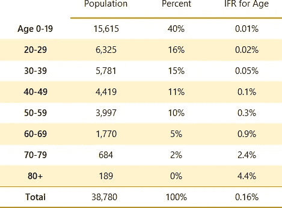

# 为什么对新冠肺炎死亡率的比较具有误导性

> 原文：<https://towardsdatascience.com/why-comparisons-of-covid-19-fatality-rates-are-meaningless-db509d21e4fc?source=collection_archive---------44----------------------->

## 新冠肺炎的综合死亡率是特定年龄死亡率的平均值。由于各州和国家的人口统计学差异，大多数“总死亡率”的比较是误导性的或无用的。

从最年轻的人到最年长的人，新冠肺炎的死亡率相差多达 400 倍。当计算新冠肺炎的总死亡率时，总死亡率是年轻人、老年人和介于两者之间的所有人(即整个人口)的死亡率的综合。

在我们抛开测试差异后，不同州和国家的死亡率差异主要是人口统计学差异的结果，而不是疾病本身差异的结果。

这篇文章解释了为什么新冠肺炎不同地区的明显差异主要不是生物学的作用，而主要是 T2 数学的作用。

[梁杰森](https://unsplash.com/@ninjason?utm_source=unsplash&utm_medium=referral&utm_content=creditCopyText)在 [Unsplash](https://unsplash.com/s/photos/flags?utm_source=unsplash&utm_medium=referral&utm_content=creditCopyText) 上拍照

# 加权平均是如何工作的:新冠肺炎的例子

综合死亡率计算为特定年龄死亡率的加权平均值。(在本文中，当我说“致死率”时，我指的是感染致死率，或 [IFR](https://en.wikipedia.org/wiki/Case_fatality_rate#:~:text=Infection%20fatality%20rate%20The%20term%20infection%20fatality%20rate,account%20for%20all%20asymptomatic%20and%20undiagnosed%20infections.%20%5B7%5D) 。有关加权平均值的一般描述，请参见此[文章](https://sciencing.com/use-weighted-averages-8511475.html)。)

让我们来看看加权平均值是如何影响疾病致死率的。

假设新冠肺炎 40 岁以下人口的死亡率为 0.022%，40 岁及以上人口的死亡率为 1.04%。我没有编造这些数字；它们是根据我在本系列第 2 部分[中介绍的实际费率计算的。](/the-uncanny-consistency-of-covid-19-age-based-fatality-data-e2abe37b570)

再假设你有两个国家:青年的美国和老年的共和国，它们的名字暗示了人口统计数据。让我们看看这种病毒在这两个国家是如何发展的。

## 青年的美国

在年轻的美国，100%的人口年龄在 40 岁以下。由于 40 岁以下人口的死亡率为 0.022%，这意味着整个国家的死亡率为 0.022%。这显示在表 1 中。

表 1 —假设国家*和美国*的新冠肺炎死亡率，其中所有人口的年龄都在 40 岁以下。总感染死亡率为 0.022%。

总死亡率是一个加权平均值，但老年人口的权重为零，因为在这个假设的例子中，老年人口占 0%。因此，整个权重为 0.022%系数，总结果为 0.022%。

一个从美国青年广播的记者可能会报道，“新冠肺炎的风险被大大夸大了。我们看到的死亡率只有五千分之一。新冠肺炎远没有季节性流感致命。”

> 在我们开始谈论吸烟、重症监护室床位或合并症之前，意大利的死亡率比美国相同疾病的死亡率高 53%。这种差异并不是这种疾病在这两个国家表现不同的结果；这是因为人口统计学不同。

## 老年共和国

与此同时，在老龄化的 T4 共和国，100%的人口年龄在 40 岁或以上。

同样，总死亡率是一个加权平均值，其中一个权重是零，但在这种情况下，年轻人口是 0%，因此 100%的权重是基于老年人口及其 1.04%的比率。如表 2 所示。

表 2——假设国家*老年共和国*的新冠肺炎死亡率，其中全部人口年龄在 40 岁或以上。总病死率为 1.04%。

与《美国青年》的记者不同，《老年共和国》的记者有权做出这样的报道:“新冠肺炎令人难以置信地致命，杀死了超过 1%的感染者。它的致命性是季节性流感的十倍。”

在这两种情况下，疾病是相同的，但记者们对新冠肺炎在他们国家的致命性的不同说法都是正确的，因为这些国家的人口统计数据不同。

## 两国的联合

现在，假设年轻的美国和老年的 T2 共和国合并成一个国家。我们可以称这个组合为*美利坚合众国、*，因为图中显示的[人口数](https://www.census.gov/newsroom/press-kits/2019/detailed-estimates.html)和[死亡率](/the-uncanny-consistency-of-covid-19-age-based-fatality-data-e2abe37b570)实际上是美国的正确数字。

为了组合这些数字，我们计算一个加权平均值，其中两个权重都不为零。如表 3 所示。

表 3-美国新冠肺炎死亡率。总病死率为 0.51%。

来自美国的记者可以准确地报道“新冠肺炎的总死亡率为 0.5%。”

## 对于同样的疾病，一个国家的死亡率怎么可能是另一个国家的 50 倍？

由于基于年龄的死亡率完全相同，这三个国家的总死亡率相差 50 倍。这种疾病在这三个国家没有什么不同。一个 65 岁的人从*老年共和国*搬到*青年美国*不会神奇地将他们的风险从 1.04%降低到 0.022%。不管他们生活在哪个国家，他们的风险是完全一样的。

问题在于这些国家的人口不同，因此不同人口面临的综合风险也不同。这种死亡率上的差异不是医学现象。这是一种基于加权平均值计算方式的数学现象。

# 与真实国家的真实死亡率比较

到目前为止，我已经给出了一个基于年龄的体重的简化视图，使数学更容易理解。为了更现实的目的，我们需要使用更小的年龄段。表 4 显示了美国更详细的基于年龄的人口和死亡率。

表 4——美国基于年龄的详细新冠肺炎死亡率。按年龄划分的感染率(IFRs)来自本系列的[第 2 部分](/the-uncanny-consistency-of-covid-19-age-based-fatality-data-e2abe37b570)，其中描述了 IFRs 的计算方法。

在疫情早期，意大利有大量关于死亡率的新闻报道。没有充分覆盖的是意大利人口比美国人口年长多少。意大利是世界上人口最老的国家之一。它拥有 16000 多名 100 岁以上的人。

如果我把我为美国计算的相同的基于年龄的死亡率简单地应用于意大利人口，我得到的结果如表 5 所示。意大利的总死亡率为 0.78%，而美国的总死亡率为 0.51%。

表 5 —意大利基于年龄的死亡率。意大利人口的总死亡率为 0.78%。

这使得意大利的死亡率比美国高 53%。(数学上是(0.78%-0.51%)/0.51% = 52.9%。)

在我们开始谈论意大利吸烟率上升 40%的影响，或者意大利人均重症监护室床位不到美国一半的 T2 事实之前，仅仅因为人口年龄的差异，意大利在新冠肺炎的死亡率就比美国高 53%。在意大利，一个 65 岁的不吸烟且没有并发症的人和一个 80 岁的人有着同样的风险。从比例上来说，区别在于意大利 80 岁的老人是美国的两倍。

> 当计算中考虑了所有相关变量时，新冠肺炎的“总死亡率”可用于特定的统计目的。出于其他目的，新冠肺炎没有一个正确的总死亡率，我们需要停止迷惑自己，以为有。

# 从国家到州:州死亡率

同样的现象也出现在美国的州一级。美国的平均年龄是 [38.2](https://www.census.gov/newsroom/press-kits/2019/detailed-estimates.html) ，但是各州的平均年龄从犹他州的 31.0 到缅因州的 44.9 不等。

从表 6 可以看出，新冠肺炎在犹他州的总死亡率为 0.36%。请注意，基于年龄的死亡率仍然没有改变。

表 6 —犹他州的新冠肺炎总死亡率为 0.36%。

由于缅因州人口较老，其死亡率为 0.63%，如表 7 所示。

表 7–缅因州的新冠肺炎总死亡率为 0.63%。

仅仅基于人口统计学的差异，缅因州的死亡率比犹他州高 75%(或 1.75 倍)。

为了形成鲜明的对比，我们可以比较一下加拿大努纳武特地区，那里的平均年龄为 26.2 岁。如表 8 所示，如果这种病毒曾经到达那么远的北方，它将导致 0.16%的总死亡率。(努纳武特目前没有新冠肺炎病例报告。)

表 8 —努纳维特的总体新冠肺炎死亡率为 0.16%。

缅因州的死亡率比犹他州高 75%，比努勒维特高 3.9 倍，因为缅因州 70 岁和 80 岁的老人比犹他州或努勒维特多得多。疾病没有什么不同，但是人群不同。

# 结论

媒体报道没完没了地关注新冠肺炎的总死亡率，但“总死亡率”几乎毫无意义。从年轻人到老年人，死亡率相差 400 倍，而且由于国家和州人口统计的差异，死亡率也相差 2-4 倍。

当计算中考虑了所有相关变量时，新冠肺炎的“总死亡率”可用于特定的统计目的。

出于其他目的，新冠肺炎没有一个正确的总死亡率，我们需要停止迷惑自己，以为有。

*这是关于新冠肺炎死亡率的 5 集系列报道的第 3 集:*

*   [*第一部分*](/new-data-shows-a-lower-covid-19-fatality-rate-1d69361a50af) *:为美国建立一个全面的基础 IFR*
*   [*第二部分*](/the-uncanny-consistency-of-covid-19-age-based-fatality-data-e2abe37b570) *:基于年龄的 IFRs*
*   *第 3 部分:基于人口统计的各州和各国 IFRs 的差异*
*   [*第四部分*](/estimating-year-of-age-specific-risks-for-covid-19-328ceba7cd4d) *:按个别年份分列的 IFRs*
*   *第 5 部分:有无共病的国际财务报告准则*

# 更多详情请访问新冠肺炎信息网站

更多美国和州级数据，请查看我的新冠肺炎信息网站。

# 我的背景

20 年来，我一直专注于理解软件开发的数据分析，包括质量、生产率和评估。我从处理噪音数据、坏数据、不确定性和预测中学到的技术都适用于新冠肺炎。