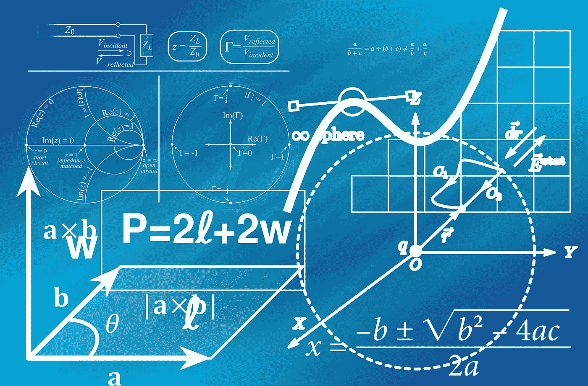
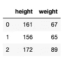
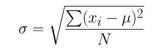
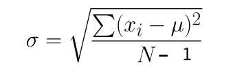

# 为什么计算熊猫和 NumPy 的标准差会产生不同的结果？

> 原文：<https://towardsdatascience.com/why-computing-standard-deviation-in-pandas-and-numpy-yields-different-results-5b475e02d112?source=collection_archive---------36----------------------->

## 好奇？让我们来谈谈统计数据、人口和样本…



图片由[皮克斯拜](https://pixabay.com/?utm_source=link-attribution&utm_medium=referral&utm_campaign=image&utm_content=1044090)的 Gerd Altmann 提供

有多少人注意到当你用 pandas 计算标准差并与 NumPy 函数的结果比较时，你会得到不同的数字？

> 我打赌你们中的一些人没有意识到这个事实。即使你知道，你也可能会问:为什么？

在这篇短文中，我们将证明:

> 使用两个库的标准偏差结果确实是不同的(至少乍一看是这样)，
> 
> 讨论为什么会这样(关注总体、样本，以及这如何影响每个库的标准偏差的计算)
> 
> 最后，向您展示如何使用 pandas 和 NumPy 获得相同的结果(最后，他们应该就标准差这样一个简单的计算达成一致)

让我们开始吧。

**NumPy 和 pandas 的标准差**

让我们首先创建一个带有权重和高度的简单数据框，稍后我们可以使用它来计算标准差。

```
import pandas as pddf = pd.DataFrame({'height' : [161, 156, 172], 
                   'weight': [67, 65, 89]})
df.head()
```



这是一个只有两列三行的数据框。我们将只关注一个列，即 *weight* ，并比较这个特定列的 pandas 和 NumPy 的标准偏差结果。

先从**熊猫**说起吧:

```
df.weight.std()
13.316656236958787
```

现在让我们使用 **NumPy** 做同样的事情:

```
import numpy as np
np.std(df.weight)
10.873004286866728
```

> 我们得到 13.31 和 10.87。它们确实是完全不同的数字，为什么会这样呢？

**人口标准差**

出现上述数字差异的原因是软件包使用不同的公式来计算标准偏差。最常见的标准差公式是:



其中:

*σ* =总体标准差

人口数量

*xi* =来自总体的每个值

=人口的意思

这个等式指的是**总体标准差**，这是 **NumPy** 默认使用的。

当我们收集这些数据时，实际上很少与人群打交道。更有可能的是，我们将研究人口样本，而不是整个人口本身。

**样本标准偏差**

当我们研究样本而不是人群时，问题会有所改变。因此，标准差的新公式为:



其中:

*σ* =样本标准偏差

*N* =样本的大小

*=来自样本的每个值*

*=样本意思*

*这个等式指的是**样本标准差**，这是**熊猫**默认使用的。*

***总体和样本之间的差异***

*正如你已经注意到的，区别在于等式的分母。当我们计算**样本标准差**时，我们除以 *N- 1* ，而不是像我们计算**总体标准差时那样只使用 *N* 。***

*这是因为在统计学中，当从样本中计算总体标准差时，为了得到一个无偏估计量，我们应该使用(N-1)。这就是所谓的一个自由度，我们减去 1 是为了得到一个无偏估计量。*

*我将不讨论为什么我们应该使用一个自由度的细节，因为这是一个相当复杂的概念。如果你愿意，你可以看这个视频来更好地理解。*

***那么熊猫标准差是正确的吗？***

*所以我告诉过你，为了得到无偏估计量，你应该用 N-1。这是通常的情况，因为大多数情况下你要处理的是样本，而不是整个群体。这就是为什么熊猫的默认标准差是使用一个自由度计算的。*

*然而，情况可能并不总是如此，所以在使用其中一个之前，请确定您的数据是什么。同样，如果您想使用一个特定的库来实现其中一个，您可以使用参数 ddof 来控制两个包中的自由度。*

*让我们看一下以前的例子，在这个例子中，我们使用 pandas 得到了 13.31σ=，使用 NumPy 得到了 10.87σ。*

```
*df.weight.std()
13.316656236958787import numpy as np
np.std(df.weight)
10.873004286866728*
```

*您可以通过使用 *ddof* 参数来更改 NumPy 中的自由度，以将其更改为无偏估计量:*

```
*import numpy as np
np.std(df.weight, ddof=1)
13.316656236958787*
```

*您可以看到，现在结果与熊猫计算给出的默认标准差相同。*

*同样，您可以更改默认的熊猫标准差计算，使其不使用自由度:*

```
*df.weight.std(ddof=0)
10.873004286866728*
```

***总结***

*在本文中，我们讨论了计算样本和总体的标准差，并触及了统计学中自由度的概念。*

*我们已经演示了如何在 pandas 和 NumPy 中计算标准偏差，以及如何能够控制两个包中的自由度。*

*我希望这解决了最初的好奇心，并解释了为什么在使用一个库或另一个库时，标准差结果最初似乎是不同的。*

**最初发表于 aboutdatablog.com:* [为什么计算熊猫和 NumPy 的标准差会得出不同的结果？](https://www.aboutdatablog.com/post/why-computing-standard-deviation-in-pandas-and-numpy-yields-different-results)，*2020 年 4 月 29 日。**

**PS:我正在 Medium 和*[***aboutdatablog.com***](https://www.aboutdatablog.com/)*上撰写以简单易懂的方式解释基本数据科学概念的文章。你可以订阅我的* [***邮件列表***](https://medium.com/subscribe/@konkiewicz.m) *在我每次写新文章的时候得到通知。如果你还不是中等会员，你可以在这里加入*[](https://medium.com/@konkiewicz.m/membership)**。***

**下面还有一些你可能喜欢的帖子**

**[](/what-are-lambda-functions-in-python-and-why-you-should-start-using-them-right-now-75ab85655dc6) [## python 中的 lambda 函数是什么，为什么你现在就应该开始使用它们

### 初学者在 python 和 pandas 中开始使用 lambda 函数的快速指南。

towardsdatascience.com](/what-are-lambda-functions-in-python-and-why-you-should-start-using-them-right-now-75ab85655dc6) [](/jupyter-notebook-autocompletion-f291008c66c) [## Jupyter 笔记本自动完成

### 数据科学家的最佳生产力工具，如果您还没有使用它，您应该使用它…

towardsdatascience.com](/jupyter-notebook-autocompletion-f291008c66c) [](/7-practical-pandas-tips-when-you-start-working-with-the-library-e4a9205eb443) [## 当你开始与图书馆合作时，7 个实用的熊猫提示

### 解释一些乍一看不那么明显的东西…

towardsdatascience.com](/7-practical-pandas-tips-when-you-start-working-with-the-library-e4a9205eb443) [](/pandas-data-manipulation-functions-7b3519fc1370) [## Pandas 数据操作函数:apply()、map()和 applymap()

### 以及如何在熊猫身上正确使用它们…

towardsdatascience.com](/pandas-data-manipulation-functions-7b3519fc1370)**