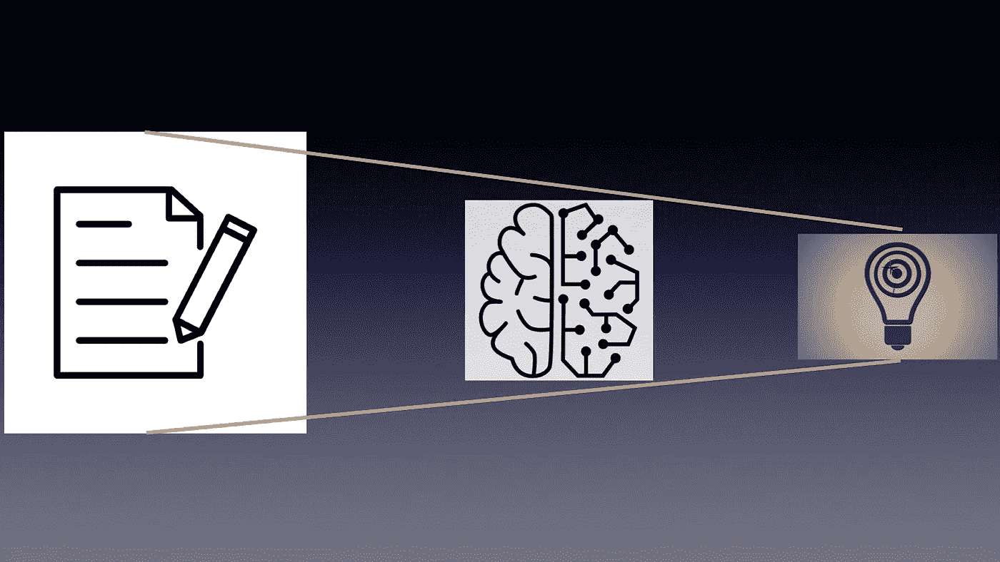
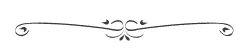

# 为什么要首先明确数据科学模型的目的？

> 原文：<https://towardsdatascience.com/why-crystallise-the-purpose-of-your-data-science-model-first-48f39c68cb4e?source=collection_archive---------54----------------------->

图片由[名词项目](https://thenounproject.com/)和【thebluediamondgallery.com 提供

> “如果给我一个小时来拯救地球，我会用 59 分钟来定义问题，用 1 分钟来解决问题。”

阿尔伯特·爱因斯坦说过。数据科学模型开发也是如此吗？

您可能同意，模型开发过程经常会失去对要解决的问题的关注，导致未满足的期望，甚至放弃项目。在数据科学项目中，十分之八的项目失败是很常见的。但是为什么会这样呢？

通常在项目开始时，没有计划好正确的涉众的识别以及与他们的紧密合作。尽管这是项目成功的基础，但它缺乏极端的关注和判断。

首先，关键是要知道如何使用这些模型，它们的结果是什么，以及这些结果将达到什么目的。确切地说，模型的目标并没有清楚地列出来。模型将被使用的端到端过程没有被清楚地阐明和记录。模型在这些过程中的影响没有得到广泛的讨论和认可。仍然有许多不清楚的陈述和未完成的工作。流程的完整大图是不可用的或高质量的。包含模型及其真实影响的流程图没有经过彻底的探索、审查和批准。它如何影响过程之外的实体没有被充分考虑。

此外，当正确的利益相关者没有参与这些讨论时，流程细节没有得到足够的引出、验证和批准。急于进入下一步，做更令人兴奋的开发模型的工作会分散开发团队的注意力。充足的时间没有在计划中被封锁，或者没有建立适当的质量关口，它使团队双方产生分歧。

所有这些不明确的目标，对这些模型使用方式的期望差距，最终会产生许多问题，最终，您可能会发现开发该模型是为了解决一个与预期不同的问题。

因此，如何确保模型的目的是绝对明确的，并且它们是相应地构建的。所有的模型实际上都是错误的——一个模型只在目的上是正确的。因此，为了建立一个合适的模型，在项目开始的时候，就需要与合适的涉众进行接触。与利益相关者的讨论必须深入和严格，以得出关于模型的目标及其使用的绝对合理的结果。它需要完整地阐述端到端流程，模型将如何使用，以及它们将如何解决问题，并经过彻底的讨论、同意、记录和批准。最后，模型在端到端流程中的影响必须得到利益相关方的验证和批准，以确保它们符合组织的价值观、原则和行为准则。

因此，明确模型的目的、它们的目标以及它们要实现的结果是极其重要的，之后的一切都要遵循这个目标。然后开发的模型将满足所有的期望，并且也是合乎道德的。

*最初发表于*【https://www.seemasutradhar.com】