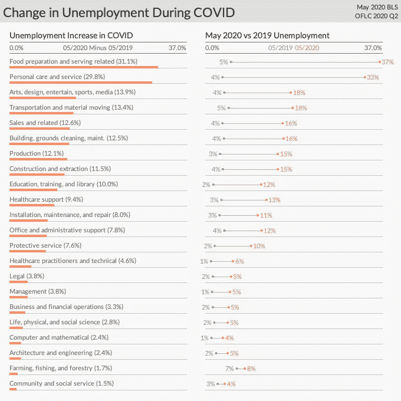
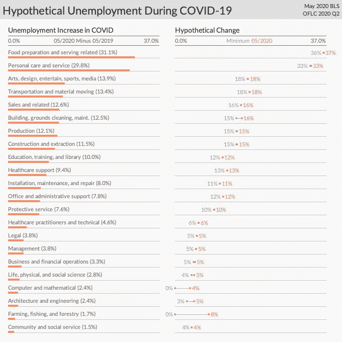
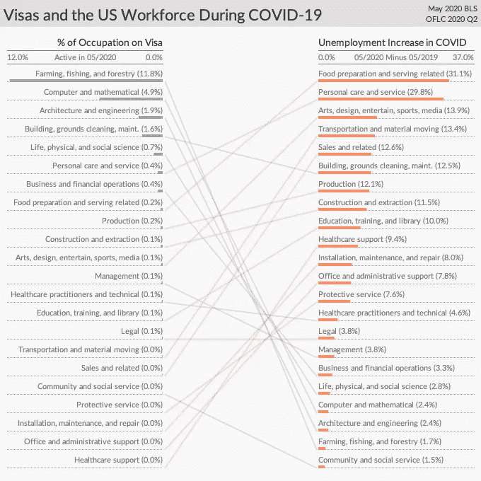
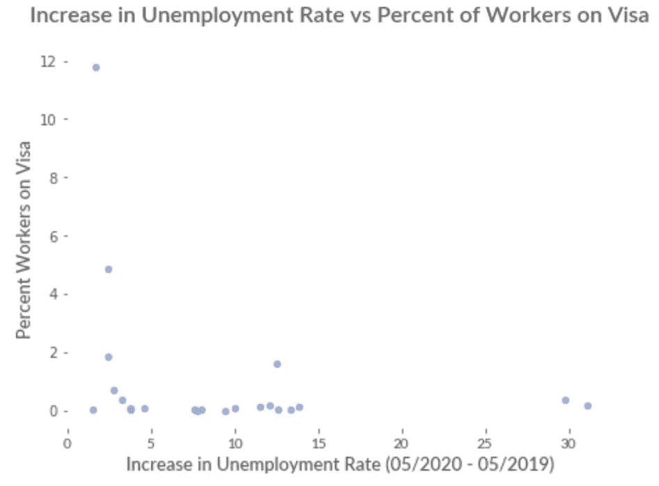

# 为什么削减工作签证不能解决失业问题

> 原文：<https://towardsdatascience.com/why-cutting-work-visas-will-not-solve-covid-unemployment-7bae19d4a7fd?source=collection_archive---------77----------------------->

八分之一的美国人发现自己失业了，随着新冠肺炎案件的攀升，党派分歧使国会的反应陷入瘫痪。为了应对后果，美国参议院的一些人要求特朗普总统减少移民，本月，政府暂停发放许多新的工人签证，同时寻求开始“对一系列广泛的移民法规进行永久性修改”。尽管限制的最终形式和持续时间仍不明朗，但这些政策有帮助吗？先前的研究和分析对削减工作签证以解决 COVID 失业提出了质疑。事实上，这可能会让事情变得更糟。

**首先，先前的研究表明，减少移民可能不会为公民创造就业机会。**早期对专业和非专业职业的调查未能发现增加限制的好处，一项以美国为重点的研究观察到“H-1B[签证]就业的大幅下降没有被本地就业的增长抵消”[6](https://www.nber.org/papers/w23902.pdf)[[7](https://www.jstor.org/stable/3590383?seq=1)]。特别是对于 H-1B 劳工来说，美国可能只是缺少能胜任签证持有者工作的工人，而这些人的技能绝对需要多年的学习。事实上，研究表明，总的来说，移民实际上可能会减少长期失业。综上所述，早期的研究强调了新限制的风险和有限的好处。

与去年同期相比，COVID 期间每个主要职业群体的失业率都有所上升(2020 年 5 月对 2019 年 5 月)。左边的失业人数增加了。先前和新的失业在右边。

考虑到这些先前的发现，对最近数据的分析进一步表明，潜在的收益无法证明限制工人签证的成本是合理的。在疫情之前就有很多关于这个主题的研究，因此，尽管之前的证据已经不鼓励减少这些签证，但本分析转向最近的信息。然而，即使有可能不正确的假设，即从签证持有者手中夺走的每一份工作都将流向同一主要职业群体的公民，并且随着所有签证*的完全取消，失业率仅下降了不到半个百分点(13.3%至 12.9%)，只有四个主要的 BLS 职业群体的改善超过一个百分点[[9](https://www.bls.gov/web/empsit/cpseea30.htm)[[10](https://www.foreignlaborcert.doleta.gov/performancedata.cfm)]。鉴于这一慷慨的预测将限制发挥到了极致，来自最新订单的实际数字可能要少得多**。此外，鉴于早期的发现“减少上限导致 1B 就业下降，而没有产生本地就业的抵消性增长”和典型的不可约失业率，这些令人沮丧的预测可能*高估了*收益，进一步警告这些限制[ [6](https://www.nber.org/papers/w23902.pdf) ][ [11](https://onlinelibrary.wiley.com/doi/abs/10.1111/j.1468-232X.1983.tb00262.x) ]。

即使对签证工人的减少做出了慷慨的预测，大多数职业群体的失业率也下降很少。请考虑一下，失业率大幅上升的职业群体(左侧)的预期收益往往非常小(右侧)。

鉴于这一低上限，仔细观察就能解释为什么签证工人的分布削弱了改善失业率的潜力。为了更深入地理解这些发人深省的预测，数据显示，只有 1/200(0.5%)的美国就业劳动力持有受调查签证*，而 BLS 追踪的大多数(82%)主要职业群体持有客工签证的比例不到 1%。这意味着美国签发的签证数量太少，不足以对 COVID 的大规模失业产生重大影响。此外，在 COVID 期间失业率高增长的职业中，外来工人很少。具体而言，平均只有 0.2%的失业大幅增加的职业(2020 年 5 月与 2019 年 5 月相比，绝对值≥5%)持有这些签证，相比之下，相对较小(<绝对值 5%)增加的职业持有这些签证的比例为 2.2%(p<0.05)。鉴于疫情期间外来工集中在表现相对较好的职业，在最需要帮助的地方几乎没有潜在收益。

持有签证的工人比例最大的职业群体(左图)失业率的增幅往往最低(右图)。例如，“计算机和数学职业”在图表的左侧排名靠前，而在右侧排名靠后。

**最后，在讨论了减少外来工人的低潜在收益后，本文转向了高潜在成本。由于签证限制，一些工作可能会流向本地工人，但经济可能会失去其他工作，这是一个难以预测的成本。然而，考虑到失业和签证集中度之间的不匹配，考虑到签证工作人员*所从事的八分之一以上(13.5%)的工作目前没有足够的公民甚至有可能担任这些职位，如果将所有签证工作人员的工作给予相同主要专业群体的失业公民**。当然，公民可能会改变职业，但特别是对于 H-1B 的职位，这可能需要相当长的时间，许多角色需要多年的培训。无论如何，本地劳动力供应限制了签证减少带来的收益，并为潜在风险描绘了一幅令人担忧的画面。**

圆点代表 BLS 各主要职业群体。那些失业率大幅上升的国家，持有签证的工人相对较少。这种不匹配可能会增加潜在的失业和限制。

也就是说，上述预测可能高估了收益，低估了成本。根据之前的研究结果，外来务工人员的减少可能会导致工作转移的效率低于上述预测，尤其是 H-1B 或类似签证。从观察签证上限下降的先前研究来看，与从上述假设中可能看到的情况相比，签证减少后本地就业的有限增长可能表明“低替代性”[ [6](https://www.nber.org/papers/w23902.pdf) ]。例如，其他效率低下的情况，如并非某个主要职业群体中的所有个人都具备同一群体中所有其他工作的资格，或者地理位置不匹配，可能会进一步恶化前景。这意味着这种分析可能不仅高估了收益，而且低估了生产率的损失。由于任何危及这些工作的事情，无论是缓慢淘汰还是快速减少，都需要非常谨慎，这些预测的局限性进一步强调了不可能的失业减少无法证明风险的合理性。

已审查的临时工人签证类别汇总，以及每类签证的总数(仅限于 2020 年 5 月生效的签证)。详情请见下文*。

**这项分析发现，减少外来工人带来的不太可能的收益在规模上仍然有限，这表明先前研究中充分记录的风险几乎没有上升空间。**这些临时签证项目为美国提供了获得多样性、人才和未来增长的重要途径，尽管有证据表明低可替代性进一步限制了这些可能的收益，但这些项目的数量太少，不可能实现美国所需的失业改善。这些工人中的许多人从事着对国家生产力和推动国家创新至关重要的工作。总体来看，这些数据和之前的研究减少了削减这些重要签证的理由。尽管人们希望在疫情期间保护美国经济，但政策制定者将需要把目光投向别处。这些违背文献建议的减少，以及如此小的不太可能的收益，根本无法抵消高的潜在成本。

*感谢* [*克里斯库恰尔切克*](https://www.linkedin.com/in/chris-kucharczyk-9783b937/) *和* [*史瑞亚斯贾亚娜*](https://www.linkedin.com/in/shreyasjayanna/) *对本文早期草稿的建议和评论。*

想要在数据、设计和系统的交叉点上做更多的实验吗？ [*关注我更多*](https://tinyletter.com/SamPottinger) *！*

[*源代码、资料、作品引用*](https://github.com/sampottinger/unemployment-visa-analysis) *。*

**分析在以下方面利用 OFLC 数据:H-1B、H-1B1、E-3、H-2A 和 H-2B[*[*10*](https://www.foreignlaborcert.doleta.gov/performancedata.cfm)*]。这主要是参议员和特朗普政府讨论的项目，但 OPT(授予在美国学习的国际学生短期签证)、EB-5(外国投资者)、L1(现有员工的公司内转移签证)和 H4(家属)除外[*[*4*](https://www.politico.com/f/?id=00000171-ee64-dae7-a77b-fff67c060000)*][*[*5*](https://www.nytimes.com/2020/06/12/us/politics/coronavirus-trump-immigration-policies.html)*][*[*12*](https://www.iie.org/-/media/Files/Corporate/Open-Doors/Fast-Facts/Open-Doors-2019-Fast-Facts.ashx?la=en&hash=1FF4995155DE3E0F186A1E880D2CB6A0C7302C42)*]。*

** *请注意，这些预测使用全面淘汰签证，以获得影响的“上限”。目前的政策针对新签证[*[*5*](https://www.nytimes.com/2020/06/22/us/politics/trump-h1b-work-visas.html)*]。也就是说，所讨论的动力仍然存在，但收益和成本都较小。然而，如果增加新的法规或扩大目前的限制，政策可以发展成为一个更大的逐步淘汰。*