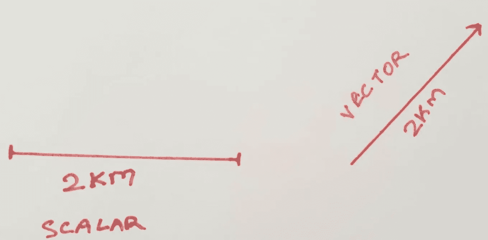
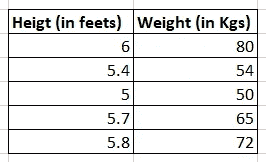
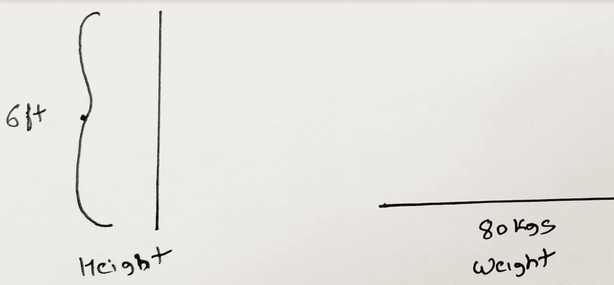
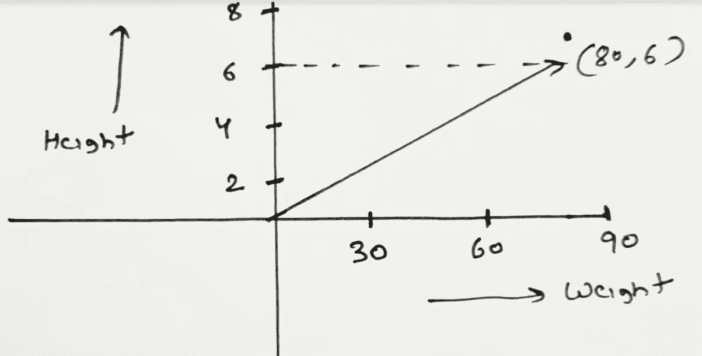
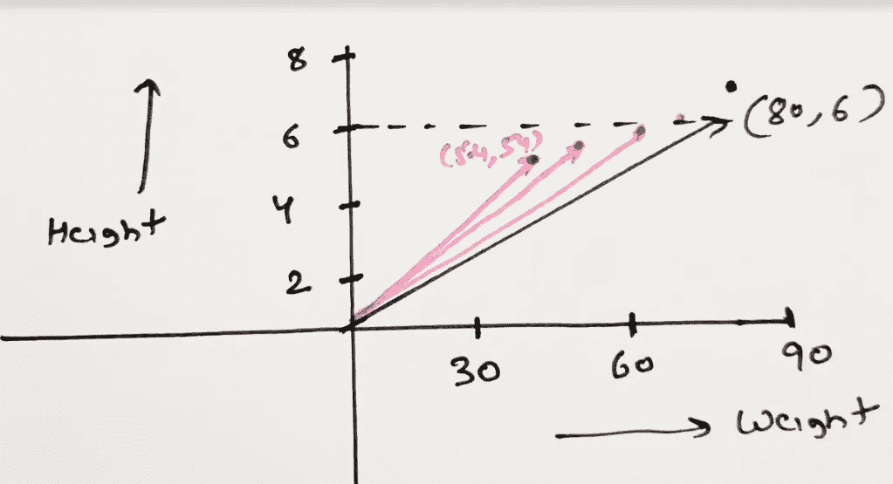
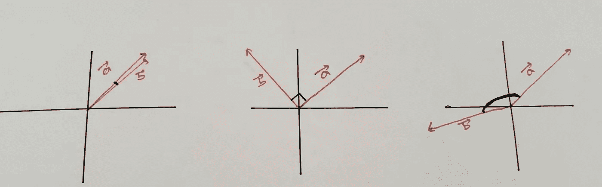
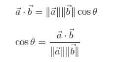
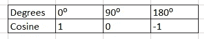
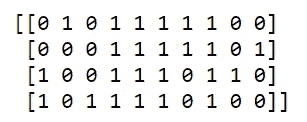
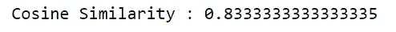

# 为什么数据在数据科学问题中被表示为‘向量’？

> 原文：<https://towardsdatascience.com/why-data-is-represented-as-a-vector-in-data-science-problems-a195e0b17e99?source=collection_archive---------11----------------------->

## ***向量代数在数据科学中的应用***


照片由[安托万·道特里](https://unsplash.com/@antoine1003?utm_source=medium&utm_medium=referral)在 [Unsplash](https://unsplash.com?utm_source=medium&utm_medium=referral) 上拍摄

科学和数学被用来描述我们周围的世界。有许多量只需要一次测量就能描述出来。例如线的长度、任何形状的面积或任何表面的温度。这样的量称为 ***标量*** 。任何可以用数字(正数或负数)表示的量都叫做标量。该值被称为**大小**。

另一方面，有些量需要至少两次测量来描述。除了大小，它们还有一个相关的“方向”,例如速度或力。这些量被称为“**矢量**”。

当我们说一个人跑了 2 公里，这是一个标量，但是当我们说一个人从他的初始位置向东北跑了 2 公里，这是一个矢量。



假设您正在收集某个班级中一组学生的一些数据。您正在测量每个学生的身高和体重，为 5 名学生收集的数据如下:



这里的每一个测量都是一个标量。所以单独看身高或体重是标量。



然而，当你把每个学生作为一个整体来观察时，即每个学生的身高和体重加在一起，你可以把它看作一个向量。



在这个表示中，每个学生都是一个向量。它由两个特征描述:身高和体重。现在，**根据标准定义，在这个向量中没有真正的“方向”。**但是，当我们在多个维度上表示数量时(在这种情况下，是 2——身高和体重),就会有一种相对于彼此的方位感。因此，当我们观察 5 个学生(5 个向量)时，他们对彼此有一个大小和“方向”的概念。



因为大多数有用的数据集总是有不止一个属性，所以它们都可以用“向量”来表示。给定数据集中的每个观察值都可以被认为是一个向量。一个数据集的所有可能的观测值构成了一个**向量空间。这是一种很奇特的说法，说外面有一个空间，每个向量在那个空间中都有自己的位置。**

> **将数据表示为向量的好处是，我们可以利用向量代数来寻找数据中的模式或关系。**

# **向量有什么帮助？**

****

**莎伦·麦卡琴在 [Unsplash](https://unsplash.com?utm_source=medium&utm_medium=referral) 上的照片**

**看向量空间中的向量，可以快速比较，检查是否有关系。例如，你推断出 ***相似的*** 向量之间的角度较小，即它们的方向彼此接近。在我们的样本数据中，学生(5.4，54)和(5，50)非常相似。**

**向量之间的角度表示它们之间的“相似性”。相同方向(接近 0 度角)的向量是相似的，而相反方向(接近 180 度角)的向量是不相似的。理论上。如果向量彼此成 90 度(正交)，则它们之间没有关系。有没有一个数学函数可以捕捉到这种关系？**

****

> **想想三角函数——余弦。**

**上面的描述听起来可能有点晦涩难懂。所以，不要忘记，我们在这里谈论的是数据的 ***【表示】*** ，以这种方式帮助我们找到一种关系或模式。向量形式就是这样一种表示。**

# **余弦相似性**

**余弦相似性是一种度量，它给出了向量之间角度的余弦。它可以用两个向量的“点积”来计算。数学上，**

********

**所以现在每当你在数据科学中听到向量，想想它们之间的点积和夹角余弦。你会看到这些向量有多相似或不相似。**

# **文本矢量化**

****

**照片由[凯尔·格伦](https://unsplash.com/@kylejglenn?utm_source=medium&utm_medium=referral)在 [Unsplash](https://unsplash.com?utm_source=medium&utm_medium=referral) 上拍摄**

**将数据集转换或变换为一组向量的过程称为矢量化。在属性已经是数字的情况下，将数据集表示为向量更容易。文本数据呢？**

> **“单词嵌入”是将单词或文本表示为向量的过程**

**有许多将文本转换/表示为向量的技术。最简单的方法之一是计数矢量器。下面是查尔斯·狄更斯的《双城记》中前几行文字的片段:**

***那是最好的时代，*
*那是最坏的时代，*
*那是智慧的时代，*
*那是愚昧的时代***

**如何将上述 4 个句子转换成向量:**

****第一步:**从你的文本集合中获取独特的单词。你所拥有的全部文本被称为“语料库”**

**这里唯一的单词(忽略大小写和标点)是:**

```
****['age',
 'best',
 'foolishness',
 'it',
 'of',
 'the',
 'times',
 'was',
 'wisdom',
 'worst']****
```

**这是来自包含 24 个单词的语料库的 **10 个单词**的词汇表。**

****第二步:**为每个句子创建一个由 10 个零组成的列表**

****第三步:**对于每个句子，开始一个一个的读单词。计算每个单词在句子中的总出现次数。现在确定这个单词在上面的词汇表中的位置，在那个位置用这个计数代替零。**

**对于我们的语料库，我们得到的向量是:**

**“这是最好的时代”= [0 1 0 1 1 1 1 1 0 0]**

**“这是最坏的时代”= [0 0 0 1 1 1 1 1 0 1]**

**“这是智慧的时代”= [1 0 0 1 1 1 0 1 1 0]**

**“那是愚蠢的时代”= [1 0 1 1 1 1 0 1 0 0]**

****Python 中的代码:****

```
****from sklearn.feature_extraction.text import CountVectorizer****documents = [‘it was the best of times’, ‘it was the worst of times’,’it was the age of wisdom’,’it was the age of foolishness’]****vectorizer = CountVectorizer()
sentence_vectors = vectorizer.fit_transform(documents)****print(sentence_vectors.toarray())****
```

**输出:**

****

**一个纯 Python 代码(不使用任何内置库)来计算两个句子之间的余弦相似度:**

```
**import math
import re
from collections import CounterWORD = re.compile(r”\w+”)def cosine(vector1, vector2):
 intersect = set(vector1.keys()) & set(vector2.keys())
 numerator = sum([vector1[x] * vector2[x] for x in intersect])sum1 = sum([vector1[x] ** 2 for x in list(vector1.keys())])
 sum2 = sum([vector2[x] ** 2 for x in list(vector2.keys())])
 denominator = math.sqrt(sum1) * math.sqrt(sum2)if not denominator:
 return 0.0
 else:
 return float(numerator) / denominatordef text_to_vector(text):
 words = WORD.findall(text)
 return Counter(words)sentence1 = “it was the age of foolishness”
sentence2 = “it was the age of wisdom”vector1 = text_to_vector(sentence1)
vector2 = text_to_vector(sentence2)cosine = cosine(vector1, vector2)print(“Cosine Similarity:”, cosine)**
```

****“那是智慧的时代”和“那是愚蠢的时代”之间的余弦相似性是****

****

**余弦相似度将是 0 到 1 之间的一个数。结果越接近 1，相似度越大。**

**0.83 的值表明这个例子中的两个句子非常相似。这是因为单词- 'it '，' was '，' the '，' age '，' of '在两个句子中重复出现。然而，最后一个词“智慧”和“愚蠢”完全改变了句子的意思，它们在这方面非常不同。有什么问题？问题在于使用的“矢量化”方法。为了捕捉句子的语义，我们需要使用更高级的单词到向量的转换技术。我将在下一篇文章中介绍处理这种情况的另一种矢量化技术。**

# ****结论****

**本文的目的是提供使用向量表示数据背后的直觉。数据科学或机器学习的动机是找出观察值之间的模式和关系。将数据可视化为向量并使用向量代数来操作它们，解决了很多数据问题，尤其是在自然语言处理、文本分类和文本分析领域。**

**以哲学的角度来结束这篇文章-**

> **“我们都是带菌者。我们许多人仍在寻找方向”**

**您可能也会喜欢下面的文章:**

1.  **[微积分——变化的数学](/calculus-the-mathematics-of-change-f04f38770843)**
2.  **[发现数学思维](/discovering-mathematical-mindset-d856ec63c21a?source=friends_link&sk=c197479c733488cf0316fbf4ba77d52c)**
3.  **[人类学习 vs 机器学习](/human-learning-vs-machine-learning-dfa8fe421560?source=friends_link&sk=addcec5aa18479472a704597090831b3)**