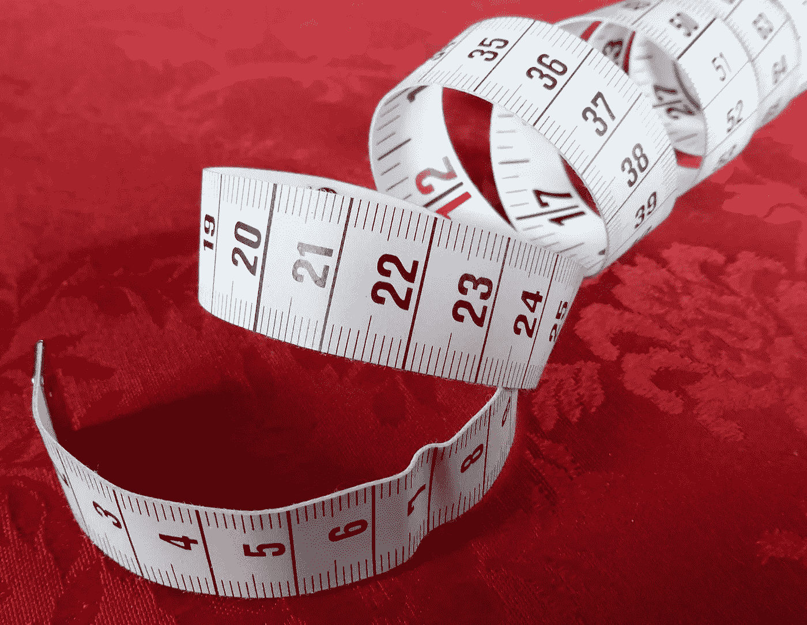
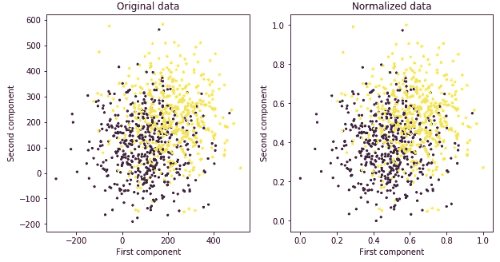
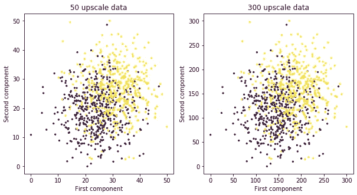
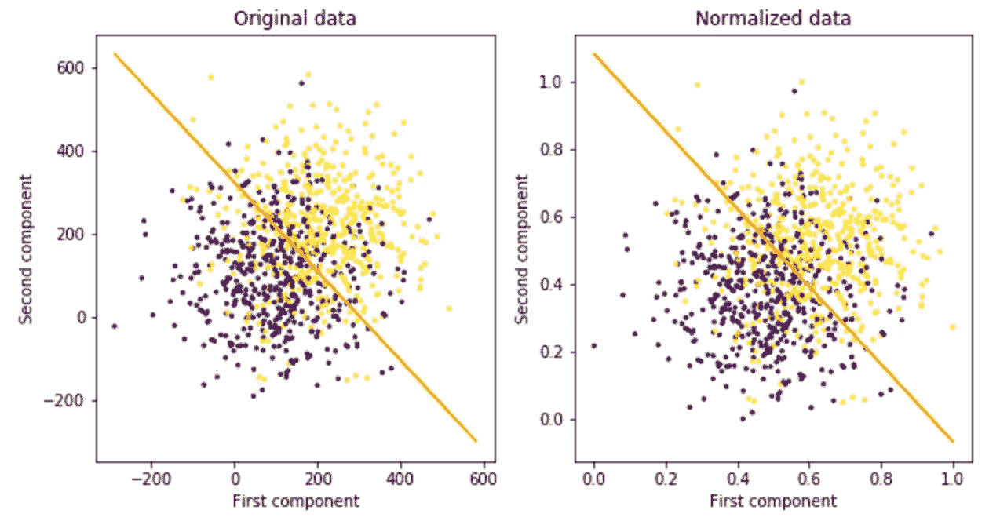
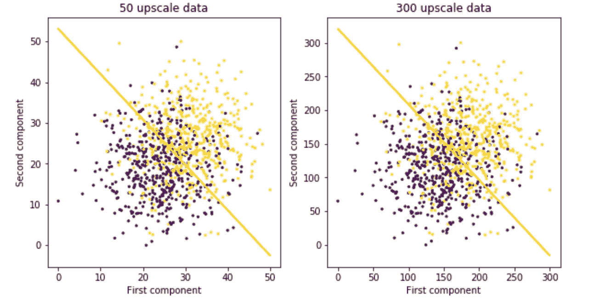
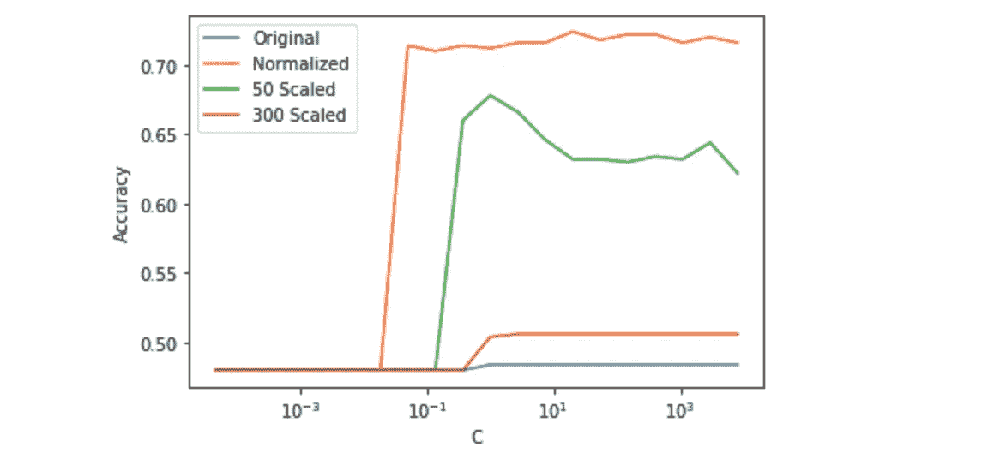
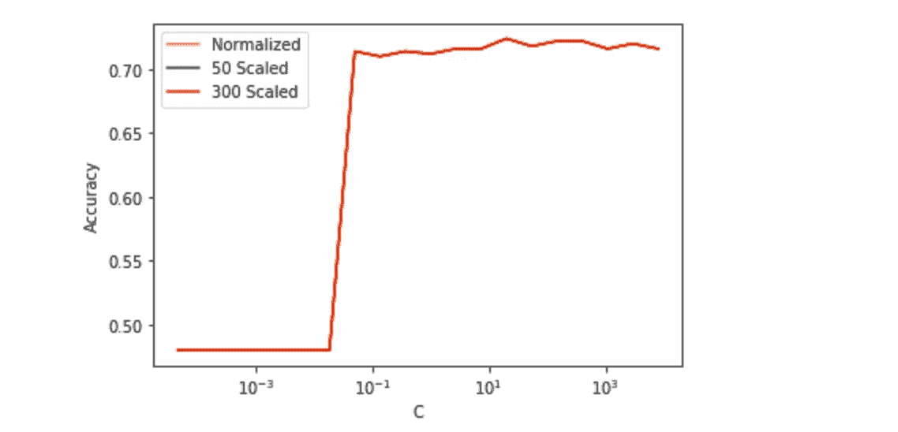

# 为什么数据标准化对非线性分类器很重要

> 原文：<https://towardsdatascience.com/why-data-normalization-is-important-for-svm-classifiers-49ca0d8e4930?source=collection_archive---------10----------------------->

## 数据归一化对线性和非线性 SVM 分类器精度性能的影响

照片由[像素](https://www.pexels.com/photo/centimeters-length-measure-measurement-47040/)上的 [Pixabay](https://www.pexels.com/@pixabay) 拍摄

术语“[标准化](/scale-standardize-or-normalize-with-scikit-learn-6ccc7d176a02)”通常指术语标准化和规模化。虽然[标准化](https://en.wikipedia.org/wiki/Standard_score)通常旨在重新调整数据，使其均值为 0，标准差为 1，但[调整](https://en.wikipedia.org/wiki/Scaling_(geometry))侧重于改变数据集值的**范围**。

正如在[1]和许多其他文章中提到的，当特征具有不同的范围时，需要数据标准化。例如，当我们有体重和身高特征时，归一化是很重要的，因为它们的取值范围有不同的尺度:例如，体重为[~ 45–130Kg]而身高为[~ 120–230cm]。

然而，**许多文章没有提到数据标准化也很重要的其他应用**。通常，在这些应用中，由于所有特征的相似尺度或每个特征的相对信息，数据标准化可能不那么明显或容易实现。频域中的时间序列就是一个例子，因为，首先，原则上频率幅度的尺度是相同的，其次，因为每个频率(特征)的归一化可能导致相对信息的丢失。

那么，在什么情况下数据规范化是必要的呢？为了回答这个问题，**本文展示了一个说明性的例子，该例子比较了线性分类器(具有线性核的 SVM 分类器)和非线性分类器(具有 RBF 核的 SVM 分类器)在实施数据归一化之前和之后的性能**。

正如将要观察到的，结果表明实现数据归一化不会影响线性分类器的精度，但是它会显著影响非线性分类器的精度。

**文章结构:**

本文首先介绍 Python 代码，并简要描述它的用途。然后，给出了解释为什么数据的规模影响非线性分类器的数学方程。最后，它会根据数据集的规模显示超参数调整后非线性分类器的新结果。

如果你对 SVM 量词感兴趣，强烈推荐阅读:

> Drew Wilimitis，[支持向量机中的内核绝招](/the-kernel-trick-c98cdbcaeb3f) (2018)，中

关于 SVM 分类器的进一步信息在本文的结尾有所说明(参考文献。[3]、[4]和[5])。

**导入 Python 库**:

导入 Python 库

**建立数据集**:

数据集是使用 [make_blobs()](http://scikit-learn.org/stable/modules/generated/sklearn.datasets.make_blobs.html) 函数创建的，该函数生成具有高斯分布的点的 blob。生成了具有 1000 个数据的两个 blobs 数据集。数据集的中心在(100，100)和(200，200)上，它们的标准差是 120。

生成两个各向同性高斯斑点数据集

**实现数据标准化和缩放**:

正如[2]中所解释的，有不同的方法来标准化数据。对于本文，数据集使用*最小-最大归一化技术*进行归一化。该方法将每个特征的**最小值**调整为 0，将**最大值**调整为 1。根据以下公式，其余的**值**被转换成 0 到 1 之间的十进制数。

最大-最小归一化:I =行(数据)，j =列(要素)

为了研究尺度效应对分类器结果的影响，对原始数据进行了数据归一化，并对归一化数据进行了放大(50 和 300 倍)。

> 向上缩放数据集值=数据集值*缩放值

标准化数据

放大数据

所有生成数据的曲线图如下:

图 1:生成的数据图。

**声明并运行线性核 SVM 分类器**:

使用 Python 上的 [sklearn 库](https://scikit-learn.org/stable/)创建了具有线性内核的 SVM 分类器。一半的数据用于训练，另一半用于测试。

对 x_orig 数据运行 SVM 线性核分类器的代码示例

线性分类器的结果如图 2 所示。可以看出，规模并不影响其性能。

图 2:精度≈ 0.71

**声明并运行具有 RBF 内核的 SVM 分类器**:

具有 RBF 核的 SVM 分类器的方法类似于上面提到的方法。首先，使用 Python 上的 [sklearn 库](https://scikit-learn.org/stable/)创建分类器。然后，一半的数据用于训练它，另一半用于测试它。

与线性分类器相比，这个非线性分类器有两个超参数需要调整: *gamma* 和 *c* 。当超参数 *gamma* 被设置为常量值 1 时，分类器使用多个 *c* 值迭代 20 次。

绘制径向基核 SVM 分类器的精度图

非线性分类器的结果如图 3 所示。该图的坐标轴是:

*   x 轴:超参数 c 的值
*   y 轴:分类器的精确度

如图 3 所示，**标度确实影响精度性能**，通过归一化数据获得更高的精度。

图 3:不同数据集的 RBF 核分类器的精度性能

总之，线性核不受数据的放大和归一化的影响，而 RBF 核 SVM 分类器的精度高度依赖于数据集的规模。

对于这个特定的分类器，这种依赖性来自于在实现内核技巧时使用的欧几里德距离:

对于这个特定的核，指数的值与欧几里德距离的平方成比例地增加。因此，为了提高具有较大比例的数据集的精度，当比例放大 50 倍和 300 倍时，伽马值应分别反向减小 5 倍和 30 倍。

绘制不同伽马值的 RBF 核 SVM 分类器的精度

图 4:使用不同 gamma 值的 RBF 核分类器的精度性能

如图 4 所示，一旦超参数根据数据集的比例进行了调整，放大数据的精度与归一化数据的精度相同。

***如果你喜欢这篇文章，请考虑*** [***订阅***](https://javiferfer.medium.com/membership) ***。你将获得我所有的内容+所有其他来自牛逼创作者的文章！***

**参考文献**:

[1] Urvashi Jaitle，[为什么数据规范化对于机器学习模型是必要的](https://medium.com/@urvashilluniya/why-data-normalization-is-necessary-for-machine-learning-models-681b65a05029) (2018)，Medium

[2]张，[理解机器学习中的数据归一化](/understand-data-normalization-in-machine-learning-8ff3062101f0) (2019)，中

[3] [内核 SVM](https://stats.stackexchange.com/questions/168051/kernel-svm-i-want-an-intuitive-understanding-of-mapping-to-a-higher-dimensional) (2015)，堆栈交换

[4] Brandon Rohrer，[支持向量机如何工作](https://www.youtube.com/watch?v=-Z4aojJ-pdg) (2017)，YouTube

[5] CodeEmporium，[支持向量机](https://www.youtube.com/watch?v=05VABNfa1ds) (2018)，YouTube