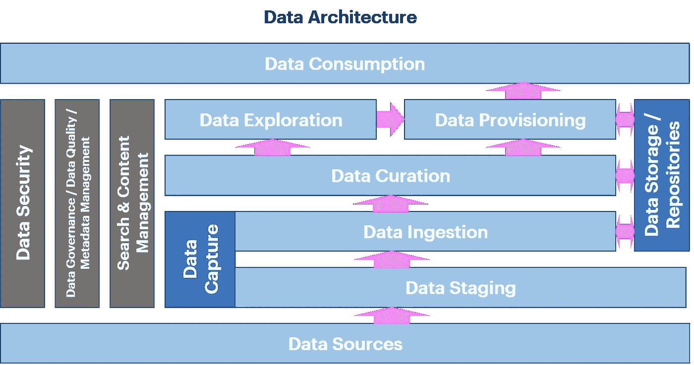

# “为什么是数据科学？”—非数据科学家简介

> 原文：<https://towardsdatascience.com/why-data-science-an-introduction-for-non-data-scientists-8d9bf378f459?source=collection_archive---------50----------------------->

## 让我们给流行词世界带来一些结构。

照片由[乔丹·克里斯蒂安](https://unsplash.com/@jchristian406)在 [Unsplash](https://unsplash.com/photos/uZfwTsrXZjw) 拍摄

当我开始“数据科学”之旅时，世界很简单:

我学习数学。我完成了数学硕士学位。我攻读了数学博士学位。

数据探索世界分为数学、运筹学和计算机科学。

没人谈论数据科学。

***为什么这样介绍？***

今天，世界更加复杂。

在我关于数据分析的讲座中，学生来自许多不同的部门和学科。有些人有数学或物理背景，有些人来自计算机科学。一半的与会者来自工程、自然科学、管理和人文学科。

一些学生已经参加了这个领域的讲座，其他人是专业人士，对一些人来说，这是第一次接触这个主题。

这种多样性完美地反映了当今数据科学的多元化。

我的讲座是学术世界和朴实的实践之间的桥梁。

学生们有很多很多问题，尤其是关于这个领域本身。

我应该从哪里进入职业世界？外面有什么职位？找工作时要考虑的关键是什么？什么是工作的现实，什么是广告？

所以，我决定总结并向更广泛的读者发布它们。

我在这个领域已经工作了 20 多年了。我的工作一直与数据和数据管理有关，理解它们，提取见解，预测，优化，学习，自动化，最后，为决策提供基础。

在写博士的时候，我在统计研究所，有机会见到很多统计学、模式识别和机器学习领域的大腕。统计学和机器学习在当时几乎是同义词，数据科学还不存在。

所有关于这些领域之间差异的解释都是后来才出现的。

例如，在统计研究所工作时，研究有不同的角度。当博士候选人完成博士学位时，他/她可以选择他/她想获得博士头衔的学科。一些人选择了计算机科学，一些工程，其他环境科学，或者——像我一样——数学。

所以，我是在告诉你，在过去的 20 年里什么都没有改变吗？

当然不是。

很多事情已经发生了变化，并且仍在发展。让我们开始看看统计学、机器学习、人工智能和计算机科学最初的相互作用，以及它是如何演变成数据科学的。

***统计学，计算机科学，还是机器学习？***

先说统计。您可能会将统计数据大多与推断(基于数据寻找人口的属性)和预测联系在一起。这对于大约一半的统计世界来说是正确的。另一半稍微复杂一点，可以写满一本书。我只关注非常有限的摘录。

在统计学中，有两个学派，频率学派和贝叶斯学派。

非常笼统地说，频率主义者认为长期的发生频率是定义概率的唯一真理。通过重复测量，任何测量值的频率给出了该值的可能性。一切都只能根据这些数据来估计。真实值是未知的，但最终是任何测量值。人们在没有任何预先假设的情况下计算频率。

贝叶斯主义者认为概率是一种信任度和可信度的度量。数据是现实，并调整信念，即先验假设。我们对一个事件的了解与概率有关。这就是贝叶斯公式中的条件的来源。对于贝叶斯人来说，未知的“真实”价值可以用概率来描述。

一个比另一个好吗？不，不是的。它们只是我们世界的两个视角。

当然，还有一个交叉点:经验贝叶斯。

在经验贝叶斯中，我们从数据所代表的真实证据中学习。或者简而言之:算法正在从数据中学习——统计学习。

我们现在转向机器学习。从五十年代到八十年代，机器学习是一个与人工智能密切相关的领域。像最初的人工智能一样，机器学习基于逻辑、符号和基于知识的方法。但是为了解决实际问题，需要基于概率的方法。因此，在 90 年代，机器学习远离了最初的人工智能，专注于使用概率论和统计方法的实际的、基于数据的学习，并在研究和合作中靠近这些领域——不仅是在方法论上，也在个人合作中。它成为了自己公认的学科，并发展成为今天基于数据的学习算法。

我的博士学位研究的是非参数经验贝叶斯世界，具有潜在的，即隐藏层，我开发了一种从数据中学习的新算法。是统计学，也是机器学习。

你可以看到“统计学”和“机器学习”的区别是非常重叠的，而且往往没有分离的可能。

一个比另一个好吗？

号码

从一个领域到另一个领域的过渡是流畅的。每门学科都有它的优点和缺点，交叉施肥是常见的。

差异化重要吗？

嗯，是也不是。

不。最后，“标签”并不重要。重要的是方法、应用，以及最重要的价值创造。

是的，有关系。像每个新兴领域一样，机器学习、深度学习和数据科学是新的发展、新的方法，并包含新的哲学。

拒绝新的、边界移动的想法和发展是人类的天性。

要获得某个专业领域的认可和欣赏，你需要展示你工作的价值。你必须给它贴上不同的标签，因为人们想要一个身份。它代表了新的哲学，给了人们一个家。

这是一个自然而有效的发展。变化和发明是我们的日常生活，应该被接受。

***科技的进步***

现在，让我将数据科学带入游戏。

过去 30 年发生了很多技术变革:

*   计算能力的指数增长
*   数据存储可能性的指数增长
*   这些技术成本的指数下降

技术变得大众负担得起，随之而来的是大量数据的产生。

我们不再需要对信息的产生、共享和优化小心翼翼。我们可以生产、传输和储存它。

所有这些都为新的可能性提供了机会。

在九十年代，由于技术的进步，机器学习可以找到它的目的地。

海量的数据使我们有可能从中学习，并使我们能够开发新的算法来解决高维问题。

> *“[……]许多事情都变了。一个只是数据量[……]。数据量增加了，复杂性也增加了，方法也增加了[…]。方法变化如此之快；你还必须学会新方法[…]”—诺贝尔奖得主爱德华·莫索尔在被问及科学的本质是否已经改变时*

***数据科学的新范式***

由此，处理数据的范式发生了转变。它在科学界发生了变化，在商界也发生了变化。这个世界可以把结果完全建立在数据和数据中的许多模式的基础上。统计学和机器学习都是这个故事的一部分。

在商业中，理解向数据和基于事实的决策发展。

这种变化需要一种新的思维方式:一种基于数据的深思熟虑的科学的新范式，以在研究、科学、**和商业**中做出决策:数据科学。

了解了所有的背景和历史发展，人们是否将其命名为机器学习、统计学或数据科学并不重要。相关的是作品的内容，而不是标签。

***现代资料工作***

我们已经看到了数据科学包含的各种各样的主题(通常令人困惑)。

现实中的数据科学是什么？

我通常使用处理数据的典型步骤进行解释。

现代、简化的数据架构(数据架构基于规则、策略和治理定义数据和信息流)包含以下步骤:数据源、数据捕获、数据存储、数据监管、数据探索、数据供应和数据消费。

Isabelle Flueckiger 制图

这些话背后的含义是什么？

*数据源*:处理关系数据、流数据、结构化数据和非结构化数据的不同数据源。

*数据捕获*:在*数据暂存*中工作，一个临时存储位置，即具有云、文件共享、拖放区，以及在*数据摄取*中工作，具有批处理、临时和实时数据。

*数据存储/储存库:*数据存储层的各种选项，用于存储原始数据、过程数据和管理数据，例如云、NoSQL、数据集市等。

*数据监管*:包含数据和元数据的标准化、验证和保护，以管理和维护它们。

*数据探索*:利用统计学、高级分析和机器学习探索数据，确保数据民主化。

*数据供应*:提供访问和工具，创建、准备和启用流程，以便将数据提供给用户。

*数据消费*:报告、商业智能、数字营销、客户关系管理(CRM)、数据分析、机器学习、应用程序、机器人和商业分析。

这个列表显示，我们有相当多的不同数据任务，直到最后，我们可以从数据中产生和呈现洞察力。

对于每一步，我们都需要专业的数据专家。

根据你的谈话对象或公司如何宣传数据科学家的角色，每个阶段都可以作为数据科学的工作来推销。

关于数据科学包含什么的不同观点有:

***No 1:*** 数据科学包括从数据源到消费的所有这些数据步骤。

***No 2:*** 数据科学包含从数据捕获、数据监管、数据探索、数据供应到数据消费的任务。

***No 3:*** 数据科学仅包含数据监管、数据探索和数据消费的部分，即它包括数据准备、数据清洗、机器学习、高级分析和构建数据产品。

取决于你和谁说话，有一个或另一个定义被使用。

技术咨询大多意味着第一。

加州大学伯克利分校排名第二。

3 号零件在市场上卖得很好。这是花式方法的广告，趣味因素的辐射。所有的“数据科学”MOOC 课程和招聘广告都位居第三。

注意:这是目前数据科学领域最多 20%的工作！

可以观察到数据科学家在就业市场上的高度波动，这是事实。其中一个主要原因是这份工作不符合人们的期望。期望的不匹配通常是无意造成的，而是由于缺乏对数据科学领域的了解。

你可以找到许多想要雇佣“数据科学家”的直线经理，因为他们认为，有了一个小型的数据科学家团队，他们的公司就可以拥有谷歌和亚马逊。但他们中的许多人不知道数据科学包含什么，不少受雇的数据科学家最终成为拥有 Excel 文件的业务分析师。

基于我的实践经验和模糊不同数据主题之间界限的技术进步，我倾向于将数据科学定义为第一。

这对你来说意味着:不要只相信工作简历中的漂亮描述或直线经理告诉你的话，这一点永远是至关重要的。

听起来很糟糕？

问，问，问！

问，直到你发现提供的“数据科学”工作包含什么。我并不是说所有非机器学习的工作都不令人兴奋。相反，有许多令人兴奋的高薪数据工作。

好消息是:这使得许多人可以进入数据科学领域。

你不需要成为机器学习的博士和伟大的程序员。你不需要和所有这些编码书呆子竞争。找到自己的利基进入。然后，发展自己。

# ***连接圆点***

把这些都结合起来，听从我的建议:

***建议 1:不要被所有的流行语和解释所有细微差别的人所迷惑。获得主题的大图，探索你感兴趣的地方，从你的能力开始。***

忠告 2:当心广告！如果你正在寻找进入数据科学领域，不要在意它是如何被标记的。透过表面，问，问，问。像四岁小孩一样问问题，总比期望不一致好。

***建议之三:找到自己的利基。不是所有数据科学领域的人都需要是机器学习极客，优秀的程序员，也不需要有学术背景。探索不同的入门选择，以此为起点，在这个伟大学科的不同方向上发展自己。***

***建议四:玩得开心！作为一名数据科学家，并不是所有的日子都令人兴奋。思想开放，把一切都当成学习新东西的机会。在这个领域你可以得到很多乐趣。***