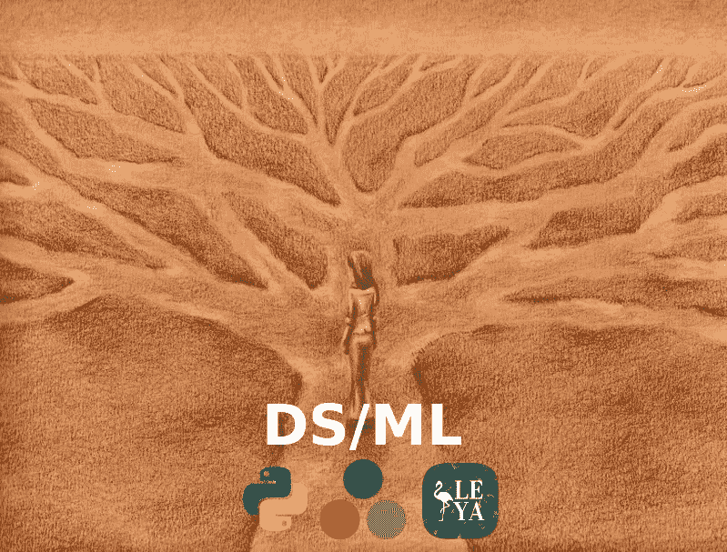

# 为什么数据科学是我获得的最大技能

> 原文：<https://towardsdatascience.com/why-data-science-is-the-greatest-skill-i-ever-obtained-a8f9bdf8517e?source=collection_archive---------12----------------------->

## 为什么机器学习和统计学给了我生活中真正的优势。

在我的一生中，我对许多我喜欢做的不同事情感兴趣。我从小就对计算机感兴趣，编程也是如此。我也培养了一些爱好，比如演奏音乐和烹饪。我特别喜欢曼陀林、扬琴、吉他、小提琴、钢琴，但最重要的是，

> 低音。

一张我的旧乐器的照片，包括我的旧克门切！

此外，我还获得了更多的实用技能，如平面设计、开发和运营，我可以把一辆车拆开，然后再组装起来。这种扩展介绍是必要的，因为我的数据科学技能胜过了所有这些技能。我的数据科学知识和技能让我在生活中走得比我所学的任何东西都更远，同时处于技术的前沿，并且在我需要时非常适用于任何场景。

# 受欢迎的

众所周知，机器学习是一个巨大的新兴领域。最近媒体对该领域的报道更是火上浇油。数据科学职位的教育、背景和批判性思维能力(第三个是最重要的)可能很难获得。去年，福布斯估计，2020 年将有超过 20 万个数据科学职位空缺。随着越来越多的公司开始需要人工智能，并使用机器学习来跟踪具有准确统计数据和简洁计算机的分析，预计数据科学的新领域将在未来十年内爆发。

也就是说…鉴于这个日期，我们应该对此持怀疑态度，

2020 年 3 月 24 日(股票市场刚刚死亡，我们正在进入一场全球衰退，因为未来的疫情。)

幸运的是，许多数据科学工作可以远程工作！此外，雇佣大多数数据科学家的大公司可能在一两年后疫情结束时仍然存在。

# 尖端的

机器学习是最前沿的技术，有一个完整的技术时代以它命名，被称为

> 《人工智能时代》

随之而来的是一系列的好处，其中最大的好处就是事物总是在不断变化。这可能既是一个可怕的现实，也是一个令人兴奋的冒险。总是有新的东西需要学习，这意味着对于像我这样的人来说，当你学习了所有的东西后，你的兴趣不会消失。这对很多人来说也很可怕，因为这会让技术面试变得非常伤脑筋。

处于前沿也意味着你可以很容易地和其他人一起热衷于这个爱好，不管他们是否真的参与其中。

# 多才多艺的

我真正喜欢我的数据科学超能力的是，我可以进入任何我想要的行业或工作类型。例如，如果我想从事医学，我可以很容易地找到一份医学分析师的工作或一系列类似的工作。总的来说，统计学是一种非常有价值的资产，可以从你的大脑中提取出来。我们在日常生活中看到的和在工作场所看到的一样多，并且能够通过统计推断出客观想法的可能性，而不是做出有根据的猜测。

对于许多我想做的事情，我可以在我的大脑中使用机器学习来想到一个很好的方法来完成它们。这很令人兴奋，解决了我生活中很多用定性思维解决不了的问题。几乎可以在你愿意收集、抓取或查找数据的每一个场景中使用的东西显然是非常强大的。

# 不仅仅是预测建模

当然，尽管机器学习是数据科学的一个巨大组成部分，但这个难题还有很多你可能没有想到的部分。有趣的是，根据您的职位，您可能实际上做了大量的管道铺设、基础工作和部署模型，而不是实际创建模型。

我想添加的一些值得注意的内容包括通信/业务、使用开发运营工具部署端点以及 Unix 管理。当然，这将根据您所处的位置而有所不同，但很可能 Unix 和 Bourne SHell 在进行数据科学研究时会派上用场！此外，数据可视化是数据科学家的一项常见技能。

# 更好的程序员

在很多方面，作为一名数据科学家，我已经成为一名非常优秀的程序员。如果不是在我的算法中利用了很多计算概念，我永远也不会坚持这些概念。由于它们的统计能力，我还学会了大约四种新语言。

(src = http://julialang.org/)

如果没有数据科学，我可能不会成为函数式编程的支持者，也可能永远不会尝试 Julia，不会了解与 JRE 相对的 SBT。我从数据科学信息中学到的东西现在是我深深关心的东西，我把这一切都归功于数据科学！

# 结论

如果你不是在研究数据科学，我当然会推荐它！这不仅很有趣，而且是一门非常值得参与的科学。此外，我认为数据科学经常被误认为是一种非常特殊的技术，但现实是你可以将机器学习应用于几乎任何有数据收集的场景。

这是我发现与数据科学家会面令人兴奋的地方，因为他们通常来自各行各业。虽然通常情况下，这些符合数据科学、商业、编程和统计/数学的三大支柱，但各行各业都有一些独特的人进入 DS/ML 世界，并且对它爱不释手！拥有数据科学技能并能够使用预测模型来预测未来，感觉就像拥有不可思议的超能力一样！