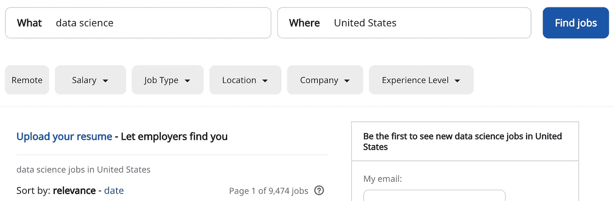
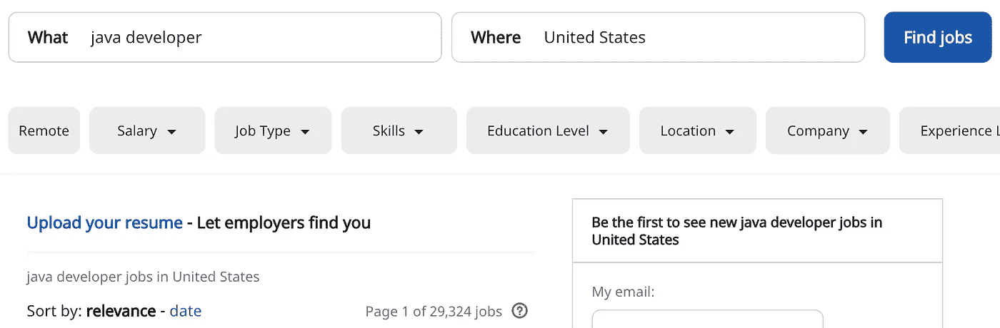

# 为什么数据科学可能不值得

> 原文：<https://towardsdatascience.com/why-data-science-might-just-not-be-worth-it-c7f3daee7d8d?source=collection_archive---------0----------------------->

## 意见

## 软件开发可能更适合你的 3 个原因。

被认为是 21 世纪最热门的工作可能并不那么热门。数据科学已经伴随我们有一段时间了，它不再只是一个时髦词。个人和公司都利用它来创造价值和金钱，但它真的是未来的职业吗？

由 [Robynne Hu](https://unsplash.com/@robynnexy?utm_source=medium&utm_medium=referral) 在 [Unsplash](https://unsplash.com?utm_source=medium&utm_medium=referral) 上拍摄

***作者注:*** *这是一篇观点片，所以大概有一定程度的偏颇。你所在国家的工作和你的技能可能会有所不同。我们用不同的眼睛看世界。请在评论区留下你的想法和经历。*

如果你在做任何与软件相关的事情，你可能会考虑转到数据科学领域。为什么不呢，工作应该无处不在，薪水一般比软件开发高，你的头衔中有“科学家”这个词会让你的母亲感到骄傲。

好吧，也许不是最后一个，但你明白了。

在这个领域呆了一段时间后，我探索了一些库和其他很酷的东西，写了大约 80 篇与数据科学相关的文章，同时还探索了其他选择(如 web 和移动开发)，我发现自己有足够的资格来分析这个领域的好与坏。

今天的重点将主要放在**坏事**上，因为互联网上充斥着*“为什么你应该成为一名数据科学家”*和*“在一个月内学会数据科学”*类型的文章。

也就是说，理想的读者是那些知道加入这个领域会有什么好处，但也想知道可能有什么缺点的人。此外，已经在该领域工作了一段时间的人可能也会发现这些要点很有用。

好了，事不宜迟，我们从第一个开始吧！

# **1。数据科学很无聊**

是的，你没看错。大多数数据科学归结为从源表中提取数据，执行一些聚合和计算，然后将结果存储在适合分析的新表中。嗯，这完美地描述了一个 ETL 过程，而不是数据科学。

此外，您会花一些时间清理和准备数据，这也不完全与数据科学相关。最后，我们有处理预测建模的部分—这也不是新的，但在过去几年中变得很受欢迎。

Joshua Rawson-Harris 在 [Unsplash](https://unsplash.com?utm_source=medium&utm_medium=referral) 上拍摄的照片

这三个要素结合起来，再加上得体的表达和沟通技巧，就能让你成为一名普通的数据科学家。

***但是等等，数据科学不会给世界带来革命吗？***

是，也不是。是，专业人员将能够更好地完成他们的工作(像医生一样)，不是，你的 ETL 管道绝对没有人感兴趣，与你的“数据科学家”职位无关。

# **2。数据科学正在实现自动化**

或者至少是有趣的部分。你知道，最初让你加入这个领域的时髦词汇。像预测模型，机器学习等等。不要误解我的意思，很多东西在这里还不能自动化，但是很大一部分已经自动化了。

[亚历山大·奈特](https://unsplash.com/@agkdesign?utm_source=medium&utm_medium=referral)在 [Unsplash](https://unsplash.com?utm_source=medium&utm_medium=referral) 上的照片

这很可悲，因为当大众担心日常工作变得自动化时，我们实际上已经自动化了我们工作中所有有趣的东西。**好看。**

我的意思是，你见过专业的云环境吗？如果没有，也没关系，因为它们看起来很悲伤。基本上你能适应的算法数量是有限的，只要数据以正确的方式准备好，任何知道精度越高越好的人都可以测试出所有的组合，并得到一个相当不错的解决方案！

我的意思是，它不会比一个拥有 10 多年经验的高级数据科学家开发的更好，但是问问你自己— **准确性增加 2%真的有多重要？**

试着从雇员和雇主的角度来思考这个问题。由数据科学家团队开发的稍微好一点的模型真的值得花费时间和金钱吗？对一些公司来说是这样，但大多数公司对“企业云环境”的内容完全满意。

# **3。工作列表太糟糕了**

访问你最喜欢的工作列表网站，搜索数据科学工作。你可能会想到像 SQL、Python、R、Statistics 这样的技能会出现——而且你做出这样的假设是完全正确的。问题是，这些仅仅是需求的 30%!

其他一些可能包括一般的编程、API、版本控制，甚至一些前端技能。这对你来说很糟糕。

即使你是软件开发出身，并且具备上述所有技能，数据科学领域仍然没有这样的工作。

让我们来看看 2020 年 5 月 16 日拍摄的来自 Indeed.com 的[的列表，仅限美国:](https://www.indeed.com/)

数据科学— 9，474 个工作岗位

软件开发人员——66，647 份工作

这是一个很大的区别。

你现在可能会想，软件开发比数据科学更广泛，因此有更多的工作机会。这是绝对正确的，这也是为什么我也在软件开发中寻找一个更窄的领域——**Java 开发者。**让我们看看有多少份工作列表:

Java 开发人员——29324 人

是啊，大约三倍多。

但即使这还不足以说服你，以下几个词肯定会让你信服— **大多数数据科学职位都是高级职位。**

没错。大多数中小型公司对数据科学家的需求不同于对软件开发人员的需求。也许他们甚至在寻找他们的第一个数据科学家！你真的认为他们会雇用实习生或大三学生来处理数据科学相关的工作吗？三思而后行。

# 判决

也许我对数据科学有点太苛刻了。也许在你的国家情况不同。但也许不是——在做出如此重大的决定时，你应该意识到利弊。

在这个世界上，机器学习的自动化程度已经让普通软件开发人员有足够的信心使用它，如果我今天选择未来的职业，我会三思而行。

不要误解我的意思，数据科学仍然很棒，但是要准备好花大约 90–95%的时间在 ETL、数据处理和准备上，另外 5–10%做你真正感兴趣的事情(预测建模)。

***你有什么想法？在你的国家情况怎么样？*** 在下面的评论里让我知道。

感谢阅读。

*喜欢这篇文章吗？成为* [*中等会员*](https://medium.com/@radecicdario/membership) *继续无限制学习。如果你使用下面的链接，我会收到你的一部分会员费，不需要你额外付费。*

 [## 通过我的推荐链接加入 Medium-Dario rade ci

### 作为一个媒体会员，你的会员费的一部分会给你阅读的作家，你可以完全接触到每一个故事…

medium.com](https://medium.com/@radecicdario/membership)