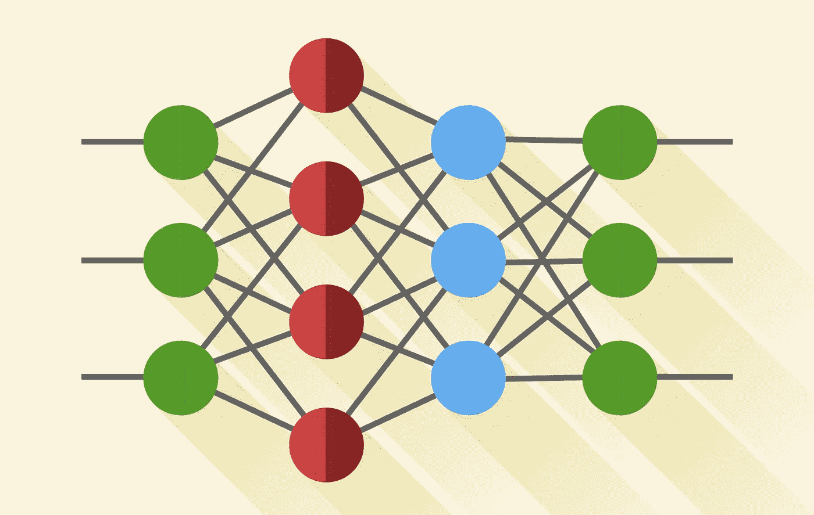
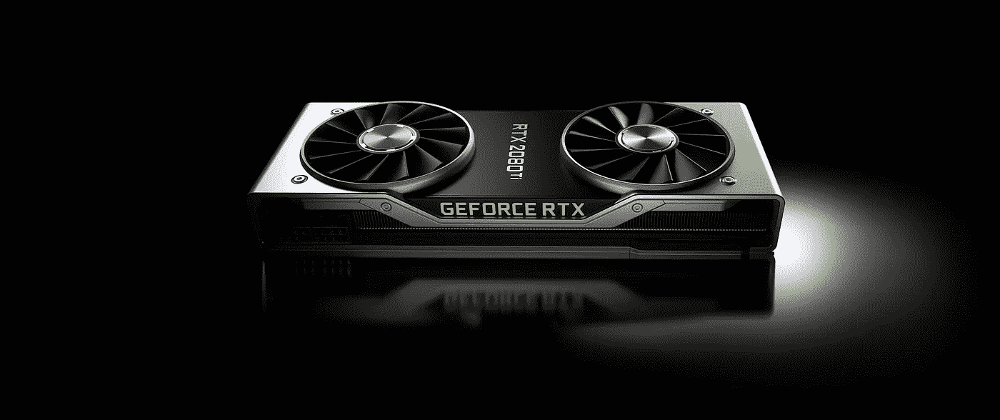

# 深度学习为什么要用 GPU？

> 原文：<https://towardsdatascience.com/why-deep-learning-uses-gpus-c61b399e93a0?source=collection_archive---------21----------------------->

## 为什么你也应该…

约瑟夫·格雷夫在 [Unsplash](https://unsplash.com?utm_source=medium&utm_medium=referral) 上的照片

T 这里有很多关于深度学习 GPU 的信息。你可能听说过这个领域需要一些巨大的计算机和难以置信的能力。也许你见过人们花几天甚至几周的时间训练他们的模型，然后发现他们的代码中有一个 bug。此外，我们在谈论游戏和图形设计时最常听到 GPU。这篇文章将帮助你了解这里实际发生了什么，以及为什么 Nvidia 是深度学习领域的巨大创新者。

# 图形处理单元

GPU 是一种非常擅长处理专门计算的处理器。我们可以将其与中央处理器(CPU)进行对比，后者在处理一般的计算方面表现出色。CPU 为我们日常使用的设备上执行的大部分计算提供动力。

GPU 可以比 CPU 更快地完成任务。然而，并不是每种情况都是如此。性能在很大程度上取决于所执行的计算类型。GPU 非常擅长可以并行运行的任务。

# 并行计算

> **并行计算**是一种计算架构，其中几个处理器同时执行多个较小的计算，这些计算是从一个整体较大的复杂问题中分解出来的。

如果我们的处理单元中有多个内核，我们可以将任务分成多个更小的任务，并同时运行它们。这将利用我们现有的处理能力，更快地完成我们的任务。

CPU 通常有四个、八个或十六个，而 GPU 可能有**千个**！从这里我们可以得出结论，GPU 最适合可以同时完成的任务。由于并行计算处理这样的任务，我们可以看到为什么在这种情况下会使用 GPU。

# 神经网络是并行的

(图片由 Brighterion 提供)

我们已经得出结论，当一个巨大的任务可以被分解成许多更小的任务时，GPU 是最好的选择，这就是 GPU 被用于并行计算的原因。如果我们看一看神经网络，我们可以注意到它们是令人尴尬的并行*。这意味着我们甚至不需要划分任务，也不需要决定哪个部分属于哪个核心。神经网络是专门为并行运行而设计的。由于它们是深度学习的基础，我们可以得出结论，GPU 非常适合这项任务。*

此外，神经网络是并行的，因此它们不必依赖彼此的结果。一切都可以同时运行，而不必等待其他内核。这种高度独立的计算的一个例子是卷积。

# 盘旋

(动画由以色列维卡制作)

这是一个没有数字的卷积的例子。左边是输入通道，右边是输出通道。在动画中，计算的过程是按顺序进行的，而现实生活中并非如此。实际上，所有的操作都可能同时发生，它们都不依赖于任何其他计算的结果。

因此，计算可以在 GPU 上并行进行，并且可以产生结果。从例子中我们可以看到，并行计算和 GPU 可以大大加速卷积运算。相比之下，在 CPU 上运行相同的卷积将导致顺序执行，类似于动画中的情况。这个过程需要更多的时间。

# Nvidia 硬件和软件

(图片来自 Nvidia.com)

这是我们可以了解 CUDA 的地方。Nvidia 是一家生产 GPU 的公司，他们创造了 CUDA，这是一种可以很好地连接到他们生产的硬件的软件。该软件允许开发人员轻松利用 Nvidia GPUs 的并行计算能力。

简单来说， **GPU 是硬件，CUDA 是软件**。正如你可能已经猜到的，使用 CUDA 需要 Nvidia GPU，CUDA 可以从 Nvidia 的网站上完全免费下载。

# GPU vs CPU

(图片来自 Nvidia.com)

CUDA 允许我们有选择地在 GPU 或 CPU 上运行计算。如果 GPU 好得多，为什么不把它用在所有事情上呢？

答案是 GPU 只对特定类型的任务更好。例如，如果我们的数据在 CPU 上，将其移动到 GPU 可能会很昂贵。所以在任务相当简单的情况下，使用 GPU 的成本会更高。我们可以得出结论，只有当任务足够大并且可以被分解为更小的任务时，GPU 才会表现得更好。对于小流程，只会让事情变得更慢。

出于这个原因，在刚开始时使用 CPU 通常是可以接受的，因为最初的任务会很短很简单。

# GPGPU

(英伟达中国 GTC)

当 GPU 最初被创建时，它主要是为了处理计算机图形，这就是这个名字的由来。现在，越来越多的任务转移到 GPU，Nvidia 是这一领域的先驱。CUDA 是近 10 年前创建的，直到现在开发人员才开始使用它。

深度学习和其他类型的并行计算导致了一个新领域的发展，称为 *GPGPU* 或*通用 GPU 计算*。

Nvidia 的 GTC 演讲是深度学习领域每个人的必看之作。当我们听到 GPU 计算栈的时候，我们应该把 GPU 想成是底层的硬件，中间是 CUDA 软件架构，顶层是 cuDNN 这样的库。

# 结论

GPU 在当前深度学习和并行计算的发展中发挥着巨大的作用。凭借所有这些发展，Nvidia 公司无疑是该领域的先锋和领导者。它为创作者提供硬件和软件。

只用一个 CPU 就开始创建神经网络当然没问题。然而，现代 GPU 可以加快任务的速度，并使学习过程变得更加愉快。

# 资源:

[1]以色列牧师。(2018 年 5 月 23 日)。*奥塔维奥·古德的卷积神经网络可视化*[视频]。YouTube。【https://youtu.be/f0t-OCG79-U 号

[2]英伟达。(2016 年 9 月 26 日)。*中国 GTC:AI，深度学习与黄仁勋&百度的吴恩达*【视频】。YouTube。[https://youtu.be/zeSIXD6y3WQ](https://youtu.be/FPM3nmlaN00)

[3]并行计算定义。(未注明)。检索自[https://www . omni sci . com/technical-glossary/parallel-computing](https://www.omnisci.com/technical-glossary/parallel-computing)