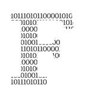

# 为什么开发人员会爱上函数式编程

> 原文：<https://towardsdatascience.com/why-developers-are-falling-in-love-with-functional-programming-13514df4048e?source=collection_archive---------0----------------------->

## 从 Python 到 Haskell，这种趋势不会很快消失


功能代码目前正在兴起。布鲁克·卡吉尔在 [Unsplash](https://unsplash.com/collections/10472559/dc%2Frwa?utm_source=unsplash&utm_medium=referral&utm_content=creditCopyText) 上的照片

  F 函数式编程已经存在了[过去 60 年](https://www.cs.kent.ac.uk/people/staff/dat/tfp12/tfp12.pdf)，但迄今为止它一直是一个小众现象。尽管像谷歌这样的游戏规则改变者依赖于它的关键概念，但今天的普通程序员对此知之甚少甚至一无所知。

这种情况即将改变。不仅仅是像 Java 或 Python 这样的语言采用了越来越多来自函数式编程的概念。像 Haskell 这样的新语言正在走向完全函数化。

简单来说，函数式编程就是为不可变变量构建函数。相比之下，面向对象编程是关于拥有一组相对固定的函数，你主要是修改或添加新的变量。

由于其本质，函数式编程非常适合按需任务，如[数据分析](https://www.haskell.org/communities/05-2018/html/report.html)和[机器学习](/functional-programming-for-deep-learning-bc7b80e347e9)。这并不意味着你应该告别面向对象编程，转而采用完全函数式编程。然而，了解基本原则是很有用的，这样你就可以在适当的时候利用它们。

[](https://medium.com/@elizarov/functional-programing-is-on-the-rise-ebd5c705eaef) [## 函数式编程正在兴起

### 编程语言有一种更加函数化的趋势。这意味着什么，我们在这条路上处于什么位置？

medium.com](https://medium.com/@elizarov/functional-programing-is-on-the-rise-ebd5c705eaef) 

# 这都是为了消除副作用

要理解函数式编程，首先需要理解函数。这听起来可能很无聊，但归根结底，这很有见地。所以继续读下去。

天真地说，函数是一种将一些输入转换成一些输出的东西。只不过事情并不总是那么简单。考虑 Python 中的这个函数:

```
def square(x):
    return x*x
```

这个函数很简单；它接受一个变量`x`，大概是一个`int`，或者一个`float`或者`double`，并计算出它的平方。

现在考虑这个函数:

```
global_list = []def append_to_list(x):
    global_list.append(x)
```

乍一看，这个函数似乎接受了一个变量`x`，无论是哪种类型，都不返回任何值，因为没有`return`语句。但是等等！

如果事先没有定义`global_list`,这个函数就不会工作，它的输出是同一个列表，尽管有所修改。尽管`global_list`从未被声明为输入，但当我们使用该函数时，它会发生变化:

```
append_to_list(1)
append_to_list(2)
global_list
```

这将返回`[1,2]`，而不是一个空列表。这表明列表确实是函数的一个输入，尽管我们没有明确说明。这可能是个问题。

## 对功能不诚实

这些隐性输入——或者在其他情况下称为输出——有一个官方名称:*副作用*。虽然我们只是使用了一个简单的例子，但是在更复杂的程序中，这些会导致真正的困难。

想想你将如何测试`append_to_list`:你需要阅读整个定义，理解它在做什么，定义`global_list`，并以这种方式测试它，而不是仅仅阅读第一行并用任何`x`测试函数。当您处理具有数千行代码的程序时，本例中的简单内容会很快变得乏味。

好消息是有一个简单的解决方法:诚实地对待函数的输入。这要好得多:

```
newlist = []def append_to_list2(x, some_list):
    some_list.append(x)append_to_list2(1,newlist)
append_to_list2(2,newlist)
newlist
```

我们其实没怎么变。输出仍然是`[1,2]`，其他都保持不变。

然而，我们改变了一件事:代码现在没有副作用了。这是个好消息。

当你现在看函数声明的时候，你就知道到底发生了什么。因此，如果程序没有按预期运行，您可以很容易地单独测试每个函数，并指出哪个函数有问题。


保持你的功能的纯净就是保持它们的可维护性。照片由[克里斯蒂娜@ wocintechchat.com](https://unsplash.com/@wocintechchat?utm_source=unsplash&utm_medium=referral&utm_content=creditCopyText)在 [Unsplash](https://unsplash.com/collections/10472559/dc%2Frwa?utm_source=unsplash&utm_medium=referral&utm_content=creditCopyText) 上拍摄

## 函数式编程就是编写纯函数

一个明确声明了输入和输出的函数是没有副作用的。而一个没有副作用的函数就是纯函数。

函数式编程的一个非常简单的定义是:只用纯函数编写程序。纯函数从不修改变量，只创建新的变量作为输出。(在上面的例子中我作弊了一点:它遵循了函数式编程的思路，但仍然使用了全局列表。你可以找到[更好的例子](https://stackoverflow.com/questions/44036657/side-effects-in-python)，但这里讲的是基本原理。)

此外，你可以从一个给定输入的纯函数中得到一定的输出。相反，不纯函数可能依赖于某个全局变量；因此，如果全局变量不同，相同的输入变量可能导致不同的输出。后者会使调试和维护代码变得更加困难。

发现副作用有一个简单的规则:因为每个函数都必须有某种输入和输出，所以没有任何输入或输出的函数声明一定是不纯的。如果您采用函数式编程，这些是您可能想要更改的第一个声明。

# 什么函数式编程不是(唯一的)

## `Map`和`reduce`

循环不是函数式编程中的东西。考虑这些 Python 循环:

```
integers = [1,2,3,4,5,6]
odd_ints = []
squared_odds = []
total = 0for i in integers:
    if i%2 ==1
        odd_ints.append(i)for i in odd_ints:
    squared_odds.append(i*i)for i in squared_odds:
    total += i
```

对于您尝试进行的简单操作，这段代码相当长。它也不是函数式的，因为你在修改全局变量。

相反，请考虑以下情况:

```
from functools import reduceintegers = [1,2,3,4,5,6]
odd_ints = filter(lambda n: n % 2 == 1, integers)
squared_odds = map(lambda n: n * n, odd_ints)
total = reduce(lambda acc, n: acc + n, squared_odds)
```

这是全功能的。它更短。这样更快，因为你不需要遍历数组中的很多元素。一旦你理解了`filter`、`map`和`reduce`是如何工作的，代码也就不难理解了。

那个[不代表](http://blog.jenkster.com/2015/12/which-programming-languages-are-functional.html#fnref:1)所有功能代码都用`map`、`reduce`之类的。这也不意味着你需要函数式编程来理解`map`和`reduce`。只是当你抽象循环时，这些函数会频繁出现。

## λ函数

当谈到函数式编程的历史时，许多人会从 lambda 函数的发明说起。尽管 lambdas 毫无疑问是函数式编程的基石，但它们不是根本原因。

Lambda 函数是可以用来使程序功能化的工具。但是你也可以在面向对象编程中使用 lambdas。

## 静态打字

上面的例子不是静态类型的。然而，它是实用的。

尽管静态类型给你的代码增加了一层额外的安全性，但它并不一定是实用的。不过，这也是一个不错的补充。


函数式编程在某些语言中比在其他语言中更容易。照片由[克里斯蒂娜@ wocintechchat.com](https://unsplash.com/@wocintechchat?utm_source=unsplash&utm_medium=referral&utm_content=creditCopyText)在 [Unsplash](https://unsplash.com/collections/10472559/dc%2Frwa?utm_source=unsplash&utm_medium=referral&utm_content=creditCopyText) 上拍摄

# 一些语言变得比其他语言更加实用

## Perl 语言

Perl 对副作用采取了与大多数编程语言非常不同的方法。它包括一个神奇的论点，`$_`，这使得副作用成为其核心特征之一。Perl 确实有它的优点，但是我不会用它来尝试函数式编程。

## Java 语言(一种计算机语言，尤用于创建网站)

祝你用 Java 写函数代码好运。不仅你的程序有一半是由关键字组成的；大多数其他 Java 开发人员也会认为你的程序是一种耻辱。

这并不是说 Java 不好。但是它不是为那些最好用函数式编程解决的问题而设计的，比如数据库管理或机器学习应用程序。

## 斯卡拉

这是一个有趣的问题:Scala 的目标是统一面向对象和函数式编程。如果你发现这种奇怪，你并不孤单:虽然函数式编程的目标是完全消除副作用，面向对象编程试图将它们保留在对象内部。

也就是说，许多开发人员将 Scala 视为一种帮助他们从面向对象过渡到函数式编程的语言。这可能会使它们在未来几年更容易充分发挥作用。

[](https://medium.com/madhash/what-exactly-is-functional-programming-ea02c86753fd) [## 到底什么是函数式编程？

### 解密一个看似复杂的概念

medium.com](https://medium.com/madhash/what-exactly-is-functional-programming-ea02c86753fd) 

## 计算机编程语言

Python 积极鼓励函数式编程。您可以从以下事实中看出这一点:默认情况下，每个函数至少有一个输入`self`。这很像 Python 的[禅:显式比隐式好！](https://www.python.org/dev/peps/pep-0020/)

## Clojure

据其创建者称，Clojure 大约有 80%的功能。默认情况下，所有值都是不可变的，就像在函数式编程中需要它们一样。但是，您可以通过在这些不可变值周围使用可变值包装器来解决这个问题。当你打开这样的包装，你得到的东西又是不可改变的。

## 哈斯克尔

这是为数不多的纯函数式静态类型语言之一。虽然这看起来像是开发过程中的时间消耗器，但是当你调试程序的时候，这是非常值得的。不像其他语言那么容易学，但是绝对值得投入！


这还只是大数据时代的开始。由[奥斯汀·迪斯特尔](https://unsplash.com/@austindistel?utm_source=unsplash&utm_medium=referral&utm_content=creditCopyText)在 [Unsplash](https://unsplash.com/collections/9967779/ielts?utm_source=unsplash&utm_medium=referral&utm_content=creditCopyText) 上拍摄的照片

# 大数据来了。它带来了一个朋友:函数式编程。

与面向对象编程相比，函数式编程仍然是一种小众现象。然而，如果在 [Python](https://docs.python.org/3/howto/functional.html) 和其他语言中包含函数式编程原则有任何意义的话，那么函数式编程似乎正在获得牵引力。

这很有道理:函数式编程非常适合大型数据库、并行编程和机器学习。所有这些都在过去十年里蓬勃发展。

虽然面向对象代码有无数的优点，但是函数式代码的优点也不应该被忽视。作为一名开发者，学习一些基本原则通常足以提升你的水平，并为未来做好准备。

*感谢阅读！如果您想知道如何在 Python 代码中实现更多的函数式编程元素，请继续关注。我将在下一篇文章中介绍这一点。*