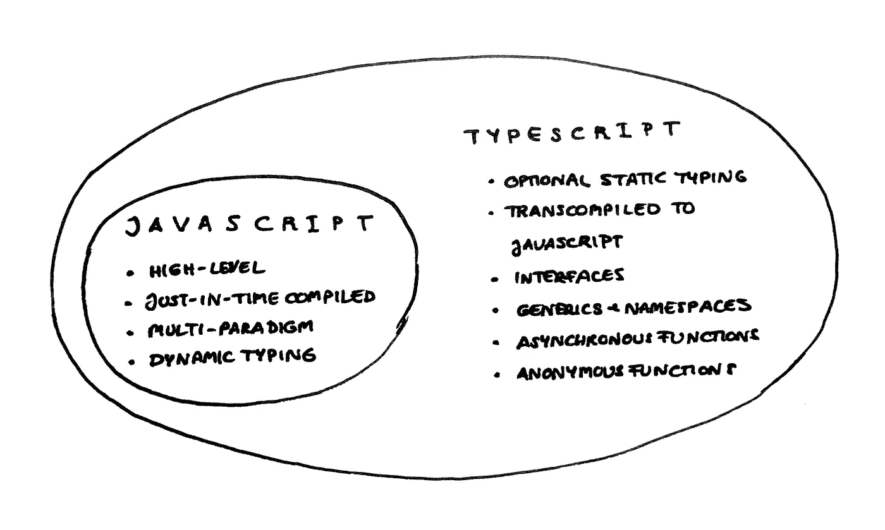
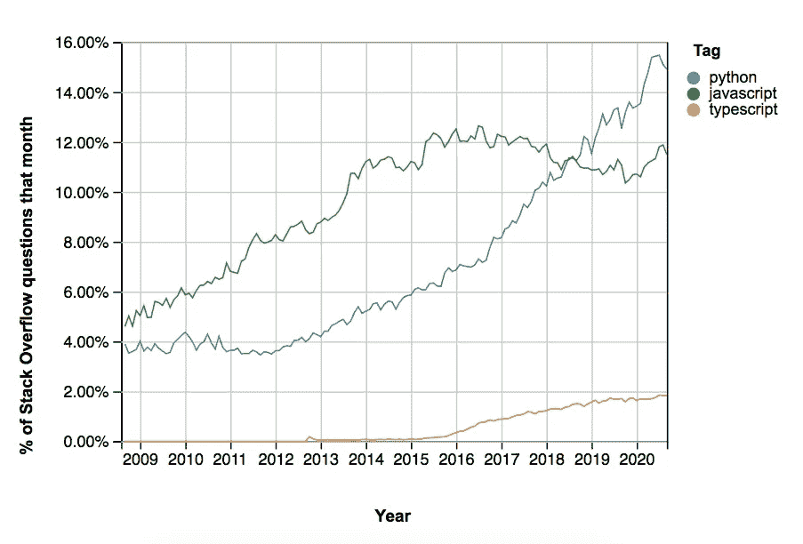

# 为什么开发人员像喜欢 Python 一样喜欢 TypeScript

> 原文：<https://towardsdatascience.com/why-developers-love-typescript-every-bit-as-much-as-python-687d075cfb5e?source=collection_archive---------1----------------------->

## 以及如果您正在处理前端 web 或后端节点开发，为什么您可能会考虑转换

Python 和 TypeScript 是最受欢迎的编程语言之一。由 [Unsplash](https://unsplash.com/t/work-from-home?utm_source=unsplash&utm_medium=referral&utm_content=creditCopyText) 上的[奥比·奥尼耶德](https://unsplash.com/@thenewmalcolm?utm_source=unsplash&utm_medium=referral&utm_content=creditCopyText)拍摄的照片

Python 是我的谋生工具，我喜欢它。尽管我对这种语言有一些[的批评](/why-python-is-not-the-programming-language-of-the-future-30ddc5339b66),我还是强烈推荐给任何开始从事数据科学的人。无论如何，该领域更有经验的人倾向于成为 Python 的传播者。

然而，这并不意味着你不能不时地挑战你所在领域的极限，例如通过探索一种不同的编程范式或一种新的语言。

Python 的竞争对手名单很长: [Rust](/thought-you-loved-python-wait-until-you-meet-rust-64a06d976ce) 、 [Go](/one-in-two-pythonistas-should-learn-golang-now-ba8dacaf06e8) 、 [Scala](/want-to-get-started-in-functional-programming-enter-scala-ea71e5cfe5f8) 、Haskell、 [Julia](/bye-bye-python-hello-julia-9230bff0df62) 、Swift、C++、Java、R 都在上面找到了入口。在这样一个拥挤的领域，JavaScript 和 TypeScript 没有得到那么多的认可是可以理解的。

这并不意味着 TypeScript 不是一般编程世界的主要内容。然而，在数据科学家中，它从来没有特别流行过。

您可以得出结论，TypeScript 可能不太适合数据科学。但是不要急。尽管它可能并不适合数据科学的每一个部分，但在某些领域它比 Python 有明显的优势。

如果您恰好在这些领域中的一个领域工作，那么值得尝试一下 TypeScript。如果你不这样做，谁知道你下一站会在哪里？这个领域发展迅速。如果你能超越你的鼻子，你就有竞争优势。

 [## 现在要学习的 7 种现代编程语言

### Rust、Go、Kotlin、TypeScript、Swift、Dart、Julia 如何促进您的职业发展并提高您的软件开发技能

towardsdatascience.com](/top-7-modern-programming-language-to-learn-now-156863bd1eec) 

# TypeScript: JavaScript，但类型安全

大约十年前，微软的软件工程师注意到 JavaScript 不再能满足他们所有的需求。一方面，这种语言发展迅速，增加了非常有趣的新功能。另一方面，管道中的特性没有一个能够解决一个基本问题:JavaScript 对于小程序来说很棒，但是用它编写整个应用程序却是一团糟。

解决这个问题有几种可能性:例如，可以使用不同的语言，或者用更好的语法重新设计 JavaScript。微软的开发团队采取了不同的方法:他们通过扩展 JavaScript 来创建 TypeScript。通过这种方式，他们能够使用 JavaScript 的所有新特性，同时去掉对大型项目不利的东西。

与 Python 类似，JavaScript 在运行时编译，这意味着您需要运行代码来调试它。另一方面，TypeScript 是编译的。这提供了一个额外的安全层，因为程序员在执行之前就获得了关于可能的错误的信息。对于像 Python 或 JavaScript 这样的非编译语言，一旦意识到代码的行为不符合预期，定位 bug 可能会非常耗时。

然而，JavaScript 和 TypeScript 之间的关键区别是类型检查器。在编译时，会检查每个 TypeScript 程序的数据类型是否彼此一致。

手动做这件事听起来可能微不足道。但是当你在做有数千行代码的项目时，你会感谢上帝拥有它。

还有一些其他的区别，比如 TypeScript 有匿名函数和异步函数。匿名函数是[函数式编程](/why-developers-are-falling-in-love-with-functional-programming-13514df4048e)的一个关键特性，它可以使程序在大数据负载下更加高效。

当您需要并行执行多个操作时，或者当您处理不应该中断后台进程的 I/O 操作时，异步编程非常有用。在 Python [和 Javascript](https://developer.mozilla.org/en-US/docs/Web/JavaScript/Reference/Statements/async_function) 中，异步编程是[可能的，但是在 TypeScript 中，它是从核心内置的。](https://realpython.com/python-async-features/)

TypeScript 是 JavaScript 的超集。图片由作者提供，参考了 [Guru99](https://www.guru99.com/typescript-vs-javascript.html) 和[维基百科](https://en.wikipedia.org/wiki/TypeScript)。

# 打字稿是如何流行起来的

如果你讨厌 JavaScript 中不断出现的不合逻辑却又令人捧腹的 [WTF-moments](https://github.com/denysdovhan/wtfjs) ，那么我有个坏消息要告诉你:你也会在 TypeScript 中看到所有这些东西。

但是这些语法上的小问题并不是程序员如此喜欢 TypeScript 的原因。更确切地说，它可以归结为这样一个想法:你使用一个伟大的产品——JavaScript——并添加一些更伟大的东西——静态类型。

当然，我并不是说 JavaScript 总是很棒，或者静态类型总是最好的做事方式。但是对于构建大型微软风格的应用程序来说，这似乎非常有效。

也就是说，TypeScript 的受欢迎程度仍然只有 JavaScript 的一小部分。这可能是由于年龄:打字稿是八岁。JavaScript 的历史是它的三倍！Python 也是这个领域的老古董，已经有三十年的历史了。

尽管还很年轻，但有些领域打字是不可避免的。这增加了它的受欢迎程度。例如，当谷歌宣布 Angular.js 将在 2016 年与 TypeScript 一起运行时，StackOverflow 上的标签数量出现了爆炸式增长。

TypeScript 只有 Python 和 JavaScript 的一小部分吸引力。尽管如此，在某些地区这是不可避免的。图片来自 [StackOverflow Trends](https://insights.stackoverflow.com/trends?tags=python%2Ctypescript%2Cjavascript)

# TypeScript 可能比 Python 有优势

JavaScript 之所以流行是因为它可以在任何地方运行。你可以在服务器、浏览器或任何你喜欢的地方运行它。你编译一次，它在任何地方都有效。当它第一次出现的时候，它几乎就像魔术一样。

因为它是建立在 JavaScript 之上的，所以 TypeScript 也有这种魔力。Python 也是！当然，它的实现略有不同，因为它使用解释器而不是虚拟机。但这并不能改变这样一个事实:就“随处运行”而言，TypeScript 和 Python 是不相上下的。

泛型和静态类型等特性使得在 TypeScript 中进行函数式编程比在 Python 中更容易。这可能是一个优势，因为由于数据科学、并行编程、异步编程等的发展，对函数代码的需求正在增长。

另一方面，Python 一直在[添加更多的](https://docs.python.org/3/howto/functional.html)和更多的函数式编程特性。当涉及到数据科学、机器学习等等时，Python 处于前沿的最前沿。

这使得并行编程和异步编程成为可能。尽管在两种语言中你都可以完成[和](https://stackoverflow.com/questions/20548628/how-to-do-parallel-programming-in-python) [的事情](https://medium.com/velotio-perspectives/an-introduction-to-asynchronous-programming-in-python-af0189a88bbb)，但还是有很大的区别:在 Python 中，你需要使用特定的库来完成任务。在 TypeScript 中，所有库从核心来说都是异步的。由于后者在默认情况下功能更强大一些，所以进行并行编程通常会更容易一些。

换句话说，如果您是一名参与异步流程和并行计算的 Python 开发人员，您可能想尝试一下 TypeScript。

TypeScript 比 Python 好吗？有时候。照片由[第九合作](https://unsplash.com/@the9th?utm_source=unsplash&utm_medium=referral&utm_content=creditCopyText)在 [Unsplash](https://unsplash.com/t/business-work?utm_source=unsplash&utm_medium=referral&utm_content=creditCopyText) 上拍摄

# 是什么让 TypeScript 对数据科学如此重要——或者不是

许多数据科学家处理异步和并行编程。您可能已经在考虑用 TypeScript 而不是 Python 编写您的下一个项目了。然而，这是否是一个好主意取决于许多其他因素。

首先，TypeScript 没有一种简单的方式来处理列表理解。例如，在处理大型数组时，这可能会令人沮丧。

其次，TypeScript 中没有本机矩阵操作。Python 有 NumPy 以及许多其他工具，这使得它们变得很容易。因此，如果您的项目大量使用线性代数，您可能希望远离 TypeScript。

第三，如果你不太熟悉 JavaScript，你肯定会有困惑的时候。因为 TypeScript 是建立在 JavaScript 之上的，所以它继承了它的所有特性——好的、坏的和 WTF。虽然，老实说，遇到这些现象也很有趣…

最后，你要考虑到编程不是一个孤独的职业。在数据科学领域有一个庞大的 Python 社区，它提供支持和建议。但是在这个时候，TypeScript 在数据科学家中并不流行。所以你可能无法在 StackOverflow 和其他地方找到对你的问题有帮助的答案。

也就是说，如果您正在开始一个没有太多大数组和矩阵运算的小项目，您可能无论如何都想尝试一下 TypeScript。尤其是当它涉及一些并行或异步编程时。

 [## Python vs. Node。JS:哪个最适合你的项目？

### 使用一组预定义的因素对 Python 和 Node.js 进行详细比较

towardsdatascience.com](/python-vs-node-js-which-one-is-best-for-your-project-e98f2c63f020) 

# 底线:知道在哪里使用你的工具

没有一种语言适用于所有的任务。当然，有些语言比其他语言更有趣或更直观。当然，热爱你的工具很重要，因为这会让你在困难的时候坚持下去。因此，从 TypeScript 或 Python 这样广受欢迎的语言开始并不是一个坏主意。

但是最终你不应该像坚持一种宗教一样坚持一种语言。编程语言是工具。哪种工具最适合你取决于你想用它做什么。

目前，Python 对于数据科学来说意义重大。但是在一个快速发展的领域，你需要能够超越你的鼻子。随着你的任务的变化，你的工具也在变化。

另一方面，TypeScript 有一个围绕前端 web、后端节点和移动开发的活跃社区。有趣的是，这些领域与数据科学的交叉比人们想象的更频繁。尤其是 Node，在数据科学家中越来越受欢迎。

当然，这并不意味着你应该一次涉猎十几种语言。真正精通一门语言有巨大的价值。但是从长远来看，对其他语言和技术保持好奇将有助于你保持领先地位。

所以，当你想尝试新事物时，不要犹豫。为什么不用 TypeScript？