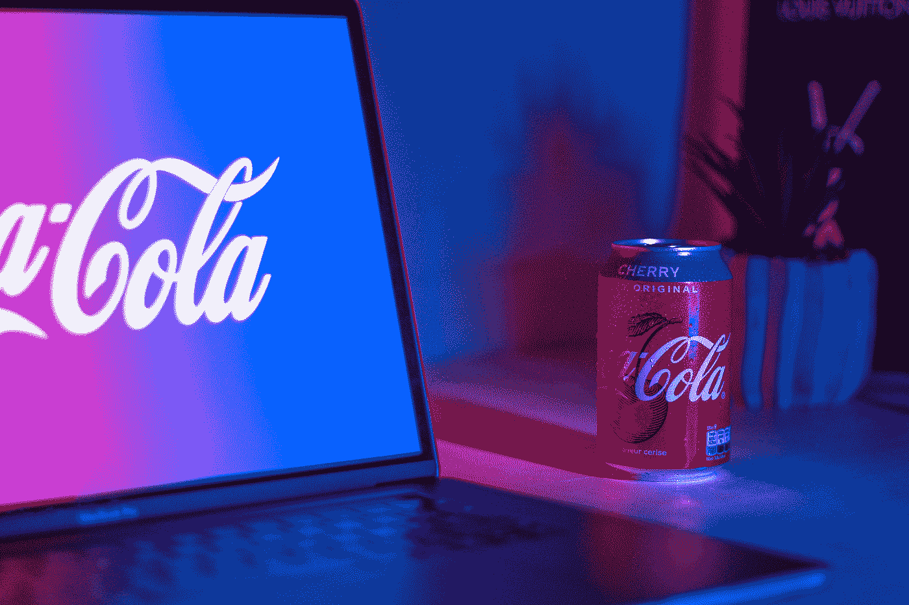

# 谷歌为什么收购 DoubleClick？

> 原文：<https://towardsdatascience.com/why-did-google-buy-doubleclick-22e706e1fb07?source=collection_archive---------14----------------------->


照片由[米切尔罗](https://unsplash.com/@mitchel3uo?utm_source=medium&utm_medium=referral)在 [Unsplash](https://unsplash.com?utm_source=medium&utm_medium=referral)

## 这项 31 亿美元的收购如何帮助谷歌成为今天的数字广告巨头

> **是什么给了一家伟大的公司额外的活力和火花？我一直对探索这个很感兴趣。在这一系列博客文章中，**我希望从战略角度分析和剖析有趣的技术话题。希望在这个过程中，我们都能学到一两件关于如何成为一家伟大企业的事情。****

谷歌宣布，它已同意在 2007 年以 31 亿美元收购一家名为 DoubleClick 的公司。双方同意的收购价格几乎是一年前收购 YouTube 价格的两倍？什么？YouTube 是当前数字领域的标志性支柱，是世界上访问量最大的网站之一，也是其母公司谷歌的巨大收入来源。即使在那个时候，YouTube 也有巨大的潜力，这是显而易见的——那么为什么谷歌愿意为一家至少我以前从未听说过的公司支付这么多钱呢？

# 数字广告的过去和现在

为了理解为什么这次收购如此重要，我们需要先回过头来理解数字广告的前景。广告业是一个庞大的行业。2019 年，仅在美国，所有渠道(数字、电视、印刷等)的广告总支出。)估计为 2400 亿美元。其中，超过一半(1300 亿美元)是数字广告——数字广告是通过互联网提供给在谷歌上搜索、观看 YouTube、浏览脸书或 Instagram 等的人的广告。包括移动设备和桌面设备。数字广告(尤其是移动广告)也是广告市场中增长最快的部分，几年前，它将电视挤到了第二位，此后再也没有回头。

但回到 2007 年，当谷歌收购 DoubleClick 时，数字广告支出仍处于相对初级阶段——数字广告支出仅占总广告支出的 12%，相比之下，电视广告支出占 39%(尽管数字广告支出的增长速度比所有其他类型的广告支出快很多倍)。

数字广告支出的构成在 2007 年也非常不同——40%是付费搜索。付费搜索是指公司竞标在搜索引擎的搜索结果页面上显示广告的权利(通过挑选感兴趣的关键词和每个关键词的相关出价金额)。和现在一样，当时的头号搜索引擎谷歌以 75%的市场份额统治着付费搜索市场。为什么当时付费搜索的份额如此之大？

付费搜索早期成功和流行的原因是它易于使用和衡量。一点背景知识将有助于理解这一点。

传统广告的特点是库存有限——在篮球比赛期间，公路旁的广告牌和广告时段都是有限的。广告商必须向所有观众展示相同的广告(每个观看超级碗的观众看到的广告都是一样的),但也有例外(国家电视/广播网络的本地节目部分允许他们用本地广告轰炸我们；但是即使这样，整个本地观众也会看到相同的广告)。这意味着，为了获得最好的投资回报率，广告和它的产品必须吸引普通观众。在其萌芽阶段，数字广告面临着相反的问题。**有了互联网广告，个性化广告位的供应几乎是无限的。**某人在互联网上浏览网站或玩游戏的每一秒钟都是为他或她提供与此人特定兴趣相关的产品广告的机会——突然之间，广告商拥有的潜在广告位多得不知如何是好。问题是**瞄准了**。在对用户了解不够的情况下，他们很难识别这些兴趣并提供相关广告，这意味着数字广告活动的投资回报率往往低于预期。


照片由 [Edho Pratama](https://unsplash.com/@edhoradic?utm_source=medium&utm_medium=referral) 在 [Unsplash](https://unsplash.com?utm_source=medium&utm_medium=referral) 上拍摄

不过付费搜索是个例外。锁定付费搜索广告要容易得多，因为用户在每次搜索中都清楚地陈述了他感兴趣的主题或意图。当有人搜索“购买二手车的最佳地点”时，这个人的意图变得非常清楚(即使很少或没有关于这个用户的事先数据)。放置在这个人的搜索结果中的二手车广告将有非常高的**点击通过**(点击通过是指用户点击一个广告)，允许谷歌及其搜索引擎竞争对手为这些广告中的每一个收取高昂的价格，也就是每次点击的**成本**。

但是付费搜索并不适用于所有类型的广告。从高层次上来说，广告(以及一般的营销)试图做两件事情中的一件——让人们执行一个特定的行为(比如购买产品 A)或者建立品牌意识(比如 T2)。付费搜索广告对前者非常有效(因为即使它是一个广告，它也是相关的信息)，但对后者就不那么有效了。如果我在进行谷歌搜索时，对我要找的东西有一个相当清晰的想法，那么我可能不会花时间去看一个旨在强化现有品牌或向我介绍一个新品牌的煽情视频。相反，我可能会认为这些尝试令人分心和烦恼。大多数人不会去谷歌的网站浏览；相反，这是他们寻找信息旅程中快速的第一步。



照片由[依兰·迈耶](https://unsplash.com/@ylannmeyer?utm_source=medium&utm_medium=referral)在 [Unsplash](https://unsplash.com?utm_source=medium&utm_medium=referral) 上拍摄

这就是**显示**和**视频**广告进入 ***(当我说显示向前发展时，我也指视频)*** 。展示广告是当我们访问和浏览网站时出现的交互式图像或视频(它们可以作为横幅出现，或者悬停在旁边，甚至暂时占据我们的整个屏幕)。展示广告是数字方面最接近传统电视广告的东西。如今，许多在电视广告上花费数百万美元的公司也在展示广告活动上花费了同样多甚至更多的钱(通过脸书、Instagram、YouTube 或 IMDb 等热门网站投放)。在过去十年中，正是视频广告的增长(以及在较小程度上其他展示广告形式的增长)使得数字广告从电视广告中夺取了如此多的市场份额。

今天，谷歌是为用户提供展示和视频广告的主要参与者。当你访问互联网上的一个随机网站(这似乎与谷歌无关)并看到一个广告时，它可能是由谷歌拥有的技术间接带给你的。但回到 2007 年，情况就大不一样了。

# 谷歌的困境

2007 年，虽然谷歌是付费搜索巨头，但它在展示广告领域的地位相对较低。事实上，谷歌可能将其在展示广告方面的弱点视为一种生存威胁。当然，AdSense 上有一些，这是一个广告网络，将广告客户与谷歌网络(一个同意让谷歌决定为他们显示哪些广告的网站集合)上可用的广告位进行匹配。但是谷歌网络主要由像个人博客这样的小网站组成，这些网站上的广告更可能是横幅广告而不是视频。


斯文·布兰德斯马在 [Unsplash](https://unsplash.com?utm_source=medium&utm_medium=referral) 上的照片

所以谷歌需要解决一个“鸡和蛋”的问题。谷歌网络中没有庞大的第三方网站(内容出版商)，它很难吸引像耐克或香奈儿这样的大品牌广告商。如果没有愿意为视频广告展示(和点击率)支付高价的超级优质广告商，谷歌很难吸引最好、最大的网站加入谷歌网络。在广告界的行话中，谷歌缺乏吸引需求(广告商希望发起一场大型数字广告活动)所必需的库存(有吸引力的网站上的广告位)。

今天听起来很奇怪，谷歌将很难打入任何广告相关市场，但在当时有几个原因:

*   请记住，虽然谷歌拥有世界上访问量最大的网站，但普通用户实际上不会在谷歌的搜索和结果页面上花太多时间(一旦你得到了方向，你通常会匆忙前往目的地)。
*   谷歌有理由认为，在主页(和搜索结果页面)上塞满广告会降低其可信度。
*   最后，广告行业的现有结构对现有企业来说非常轻松且有利可图。没有人渴望给谷歌这样的新贵(尤其是已经在相关市场拥有类似垄断地位的公司)一个权力地位。

与此同时，谷歌拥有一些独特而巨大的优势:

*   它完全规划了互联网，甚至比创建网站的人更了解网站。这就是为什么即使在 2007 年，AdSense 已经是一个主要的收入来源。
*   它可以访问用户的全部搜索历史(和电子邮件)。那时，谷歌可能比历史上任何一家公司都更了解普通人。
*   它还知道你查看搜索结果后去了哪个网站。

换句话说，谷歌拥有宝贵的数据，可以帮助网站，甚至是已经拥有大量专有数据的大型网站，最大限度地发挥展示广告空间的价值。它还拥有关于用户兴趣和背景的无与伦比的数据，广告商可以利用这些数据显著提高他们的展示和视频广告活动的关注度和回报。它只是需要解决“鸡和蛋”的问题。


由[拍摄的亚历山大·米尔斯](https://unsplash.com/@alexandermils?utm_source=medium&utm_medium=referral)在 [Unsplash](https://unsplash.com?utm_source=medium&utm_medium=referral)

# 解决方案:购买 DoubleClick

来自《圣何塞水星报》的消息称:

> “在与分析师和记者的电话会议上，埃里克·施密特说，在一次战略评估显示销售展示广告的机会比谷歌高管此前想象的要大，而且双击公司在进入市场方面做得非常出色之后，谷歌决定出价收购双击公司。”

对谷歌来说，收购 DoubleClick 是一次巨大的成功。2007 年，DoubleClick 是一家擅长提供展示广告的公司，与主要网站和广告商(他们都是其软件的用户)都有大量的关系。也许对谷歌来说更有吸引力的是，他们即将建立 DoubleClick Ad Exchange，这是一个广告商可以实时竞标广告清单(网站上可以展示广告的位置)的市场。

谷歌一夜之间从一个预告片变成了展示广告的领导者(同时阻止了主要搜索竞争对手微软的同样行为)。此外，谷歌现在有了一个明确的途径来利用其独特而宝贵的网站和用户知识。它可以作为一个平台这样做——通常是整个价值链中最有利可图的位置。

在 DoubleClick 之前，我想象谷歌和主要广告商之间的对话是这样的:

```
Google: Hey Chanel, it's Google again. I know everything about my users and can help you target your brand message better than ever before! Will you consider doing some brand advertising through me?Chanel: Oh sounds great! Can I show a 40 second video starring Charlize Theron on your main page whenever someone searches "purse"?Google: No. That would be super lame. Our users expect our main page to be clean and reasonably minimalist.Chanel: ... Then where can I play my video to ensure that it gets tons of views? It was really expensive to produce.Google: How about on the sidebar of this one nifty travel blog?Chanel: ... <hangs up>
```

双击之后，就不再需要给主要的广告商打电话了。他们可能已经在客户名单上，以及所有主要网站的注意。相反，谷歌可以只是坐在中间代理交易，从它投放的每一个广告中收取少量费用(和数据)(这种权力地位不是瞬间的；而是仍然花了几年时间来完全建立收购后的关系)。

这种权力经纪人的地位也与其现有业务产生了巨大的协同效应。一个明显的受益者是 AdSense(以及谷歌拥有的其他广告服务业务部门)——谷歌现在对广告市场的双方都有更大的吸引力，可以利用 DoubleClick 的关系来显著扩大广告库存和自己的知识，以提高每个广告的平均投资回报率。这为谷歌创造了一个良性的反馈循环，其广告的优异表现吸引了更多的广告商(需求)，这反过来又吸引了更多的网站(供应)，等等，以指数级的速度扩大了其覆盖范围和市场力量。与此同时，它可以使用其整个套件或产品，如搜索、地图、Chrome，最终还有 Android，来不断完善其广告定位算法。

在另外两个领域，此次收购对谷歌来说是一个巨大的胜利(但对用户隐私和市场竞争来说是一个损失):

1.  虽然谷歌花了几年时间在这方面全力以赴，但通过使用 cookies，谷歌可以在用户访问通过 DoubleClick 提供广告的网站时跟踪他们。由于 DoubleClick(或谷歌本身)提供的广告在随后几年变得如此流行，这相当于谷歌知道你在网上的几乎所有地方(除非你改变你的隐私设置)。
2.  具有讽刺意味的是，谷歌对搜索广告将停止增长的担忧是没有根据的。由于谷歌作为互联网门户的地位，以及最终移动互联网使用的爆炸式增长，谷歌继续从搜索相关广告中获得数十亿美元的收入。希望(或需要)进入这一巨大市场的广告行业参与者受到极大的激励，在谷歌的广告交易平台(通过收购 DoubleClick 收购的平台)上进行交易。这最终让他们建立了这个星球上最大、最强大的广告交易所。成为一个双边市场中最大的经纪人(就像广告交易所，谷歌在那里代理内容网站和广告商之间的交易)已经带来了巨大的优势，因为双方的参与者自然都想在最大的市场中交易(所以你的相对大不断吸引更多的参与者，这使你变得更大)。但最重要的是，谷歌的专有数据和搜索优势使他们能够在其交易所交易中获得额外的独特价值。

值得注意的是，2014 年，谷歌推出了一个私人(仅限受邀者)广告交易所，优质内容出版商(最好的网站)和优质广告商可以在这里进行交易。这让交易双方的大品牌对广告内容和广告出现的地方有了更多的控制权。在短短的几年里，谷歌已经从局外人变成了最负盛名的数字广告交易的经纪人……这一切都得益于它收购 DoubleClick 时获得的技术。